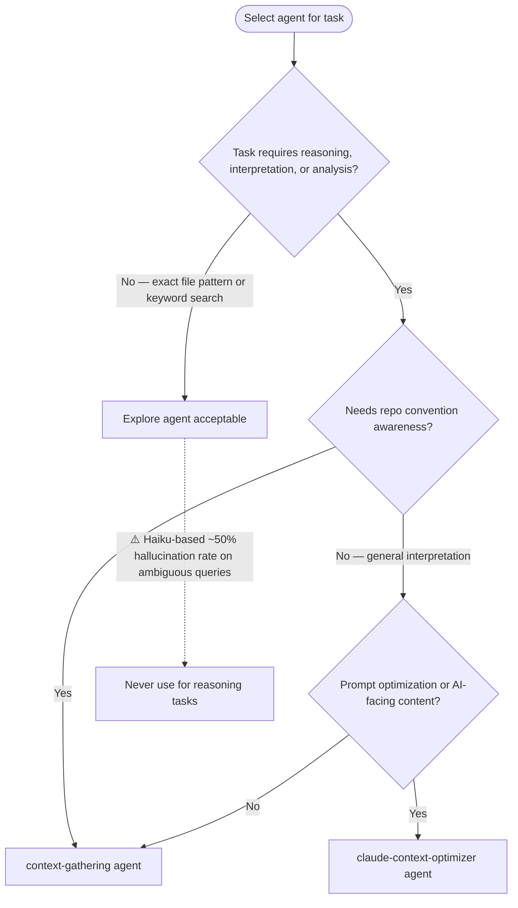
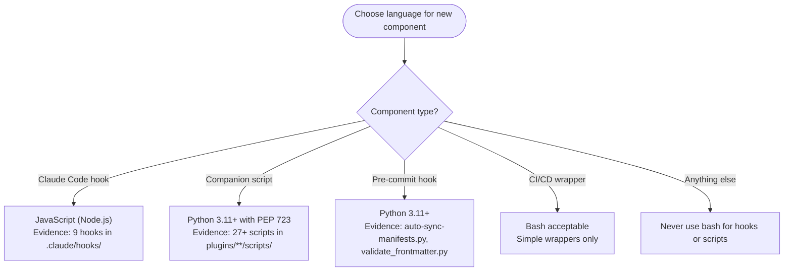

# Claude Skills Repository - AI-Facing Project Instructions

Repository containing Claude Code Marketplace Plugin with modular skills (specialized knowledge, workflows, tools).

CRITICAL FIRST ACTIONS on session start:
1. Run `uv run prek install` to enable git hooks (linting, formatting, manifest sync)
2. Check if task involves skill creation/modification → activate `/plugin-creator:skill-creator`
3. Follow [CONTRIBUTING.md](./CONTRIBUTING.md) procedures when modifying plugins
4. Update `.claude-plugin/marketplace.json` when adding/removing plugins

---

## Skill Creator Activation Triggers

<skill_activation_triggers>

Activate `/plugin-creator:skill-creator` when ANY condition matches:

**Activation Required:**
- User requests creating, modifying, or reviewing a skill
- About to modify `*/SKILL.md` or `*/references/*.md` within skill directory
- User asks about skill structure, frontmatter format, or validation requirements
- Converting documentation into AI-optimized instruction format

**Activation Prohibited:**
- Read-only skill usage
- Referencing skill in conversation without modification intent
- General coding unrelated to skill creation

**Pre-Activation Checklist:**
1. Task involves skill creation/modification (not just usage)
2. No specialized skill better matches task domain
3. Existing skill files have been read if being modified

Syntax: `Skill(command: "plugin-creator:skill-creator")`

</skill_activation_triggers>

---

## Task Delegation Standards

Follow Delegation Template in `/agent-orchestration` skill when invoking Task tool.

### Path Conventions

<delegation_path_rules>

Use paths relative to current working directory when delegating to sub-agents.


Skills symlink from `~/.claude/skills/` to repo — always use the repo-relative path, not the symlink.

</delegation_path_rules>

### Agent Selection

<sub_agent_selection>



**Explore Failure Modes** (validated 2026-02-02, 2/4 accuracy):
- Semantic ambiguity: matched pre-commit hooks instead of Claude Code hooks
- Premature termination: declared "not found" instead of deeper search
- Fabricated implementations: suggested bash when repo uses Python/JavaScript

SOURCE: Experimental validation (2026-02-02). Context-gathering: 4/4 correct. Explore: 2/4 correct.

</sub_agent_selection>

### Language Conventions

<skill_component_languages>



**Pattern Templates:**

JavaScript hook:
```javascript
#!/usr/bin/env node
const fs = require('node:fs');
console.log(JSON.stringify({ hookSpecificOutput: { ... } }));
```

Python script (PEP 723):
```python
#!/usr/bin/env -S uv run --quiet --script
# /// script
# requires-python = ">=3.11"
# dependencies = ["typer>=0.21.0"]
# ///
```

Bash scripts prohibited for new hooks/companion scripts. Legacy bash scripts may remain but avoid creating new ones.

SOURCE: Experimental validation (2026-02-02). Evidence from `.claude/hooks/session-start-backlog.js`, `plugins/plugin-creator/scripts/create_plugin.py`.

</skill_component_languages>

### Script Invocation

<script_invocation>

All scripts have shebangs and executable permissions (enforced by `check-executables-have-shebangs`, `check-shebang-scripts-are-executable` pre-commit hooks).

**Invocation Priority:**
1. Direct execution: `./plugins/plugin-creator/scripts/auto-sync-manifests.py --reconcile --dry-run`
2. Via uv run (PEP 723 scripts): `uv run plugins/python3-development/skills/uv/scripts/sync-uv-releases.py --force`

**Prohibited Patterns:**
```bash
# ❌ Bypasses shebang, ignores PEP 723 dependency resolution
python3 plugins/plugin-creator/scripts/auto-sync-manifests.py --reconcile
node .claude/hooks/session-start-backlog.js
```

**Why**: `uv run` resolves PEP 723 inline dependencies. Shebangs may specify `uv run --script` (handles venv and deps). Bare `python3` skips dependency resolution and may use wrong interpreter. Scripts are self-contained executables, not library modules.

</script_invocation>

---

## Path Fidelity

Use user-provided paths exactly as given:
- Preserve directory paths (do not append filenames)
- Do not narrow scope by adding specific files
- Skill/plugin is DIRECTORY containing SKILL.md, references/, assets/ (examine ecosystem, not single file)

---

## Deletion Safety Protocol

Before deleting any file:
1. Verify replacement contains equivalent content
2. If agent says "NEEDS MERGE" but user says proceed, ASK for clarification (do not assume)
3. Reject deletion based on flawed/incomplete comparison

After irreversible mistakes:
- State concretely what was lost and what can/cannot be recovered
- Do not speculate optimistically ("probably small loss" is prohibited)
- Ask user what they want to do next

---

## Pre-Existing Issue Accountability

<pre_existing_issue_rule>

Phrase "pre-existing issues not related to my changes" is a TRIGGER TO ACT, not dismissal justification.

**Required Response:**
> I found [N] pre-existing [issue type] in the codebase. Want to plan how to address them in this session? If not, I'll add them to the backlog.

**"Plan"**: Concrete steps (files, fixes, scope estimate). User decides priority.
**"Backlog"**: Trackable record (backlog item, issue, task file) preventing loss.

**Why**: Dismissing pre-existing issues normalizes technical debt. Each session encountering issues is opportunity for remediation. Treat discovered issues as actionable findings, not background noise.

</pre_existing_issue_rule>

---

## Plugin Development Workflows

### Local Testing Methods

**Option 1 - Session-based loading:**
```bash
claude --plugin-dir ./plugins/plugin-name
```

**Option 2 - Local marketplace:**
```bash
# One-time setup
/plugin marketplace add ./.claude-plugin/marketplace.json

# Install (--scope local keeps gitignored)
/plugin install plugin-name@jamie-bitflight-skills --scope local

# Toggle as needed
/plugin disable plugin-name@jamie-bitflight-skills
/plugin enable plugin-name@jamie-bitflight-skills
```

### Marketplace Maintenance Procedures

**Adding Plugin:**
1. Create structure under `plugins/`
2. Validate: `claude plugin validate plugins/plugin-name/`
3. Add entry to `.claude-plugin/marketplace.json` plugins array (MANDATORY)
4. Bump `metadata.version` minor version (MANDATORY)
5. Validate JSON: `python3 -m json.tool .claude-plugin/marketplace.json`

**Removing Plugin:**
1. Remove `plugins/plugin-name/` directory
2. Remove entry from `.claude-plugin/marketplace.json` (MANDATORY)
3. Bump `metadata.version` (major if breaking, minor if experimental) (MANDATORY)
4. Validate JSON

**Version Bumping:**
- Major (X.0.0): Breaking changes, removed widely-used plugins
- Minor (1.X.0): New plugins, significant additions
- Patch (1.0.X): Bug fixes, documentation only

Complete procedures: [CONTRIBUTING.md](./CONTRIBUTING.md)

---

## Content Optimization for Skills

<content_optimization_purpose>
Transform input into concise, technical instructions for AI consumption. Audience is AI model with expert-level comprehension. Assume complete familiarity with domain internals.
</content_optimization_purpose>

### Core Principles

When transforming text into RULES, CONDITIONS, CONSTRAINTS:
- Write focused, imperative, actionable, scoped rules
- Target under 500 lines per file
- Split large concepts into composable rules or tagged data sets
- Preemptively provide URLs and file links
- Write as clear internal documentation (avoid vague guidance)
- Use declarative phrasing ("The model MUST")
- Produce deterministic flat ASCII (structural markdown only: headings, lists, links, code fences with language specifiers)
- Include sections: identity, intent, task rules, issue handling, triggers, external references
- Preserve/expand structured examples from source

### XML Tag Strategy

Tags improve clarity, accuracy, flexibility, parseability when prompts have multiple components (context, instructions, examples).

Use tags to separate prompt parts: `<instructions>`, `<example>`, `<formatting>`, `<constraints>`
- Prevents mixing instructions with examples/context
- Consistent tag names throughout
- Nest hierarchically: `<outer><inner></inner></outer>`
- Combine with multishot (`<examples>`) or chain of thought (`<thinking>`, `<answer>`)

No canonical "best" tags—use semantic names matching information type.

SOURCE: [Anthropic prompt engineering - XML tags](https://docs.anthropic.com/prompt-engineering/use-xml-tags)

### Transformation Checklist

1. Open with directive on how to read/apply rules
2. Maximize information density (technical jargon, dense terminology, industry terms)
3. Rephrase for accuracy and specificity
4. Address expert/scientific/academic audience
5. Use visible ASCII only
6. Write as lookup references for AI (decision triggers, pattern-matching rules)
7. Omit greetings and unnecessary prose
8. Preserve output structure specifications
9. Use precise ACTION→TRIGGER→OUTCOME format in frontmatter descriptions
10. Set clear priority levels between rules
11. Provide concise positive/negative examples
12. Optimize for context window efficiency
13. Use standard glob patterns without quotes (`*.js`, `src/**/*.{ts,js}`)
14. Rich frontmatter descriptions with TRIGGERS
15. Limit examples to essential patterns only

---

## File Reference Standards

### Code Fence Language Specifiers

Add language specifier to ALL code fences:

````markdown
# Section Title

```text
Plain text content
```

```python
def example():
    return True
```
````

4 backticks on outer fence, language specifiers on all inner fences, proper nesting.

### Markdown Links

Use markdown links with relative paths starting with `./`:

**Syntax**: `[descriptive text](./path/to/file.md)`

**Directory Context:**
- From SKILL.md → references: `[text](./references/filename.md)`
- From references/file.md → same dir: `[text](./filename.md)`
- From references/file.md → subdir: `[text](./subdir/filename.md)`

**Why**:
1. Navigability: Claude Code click-through
2. Portability: Works regardless of installation location
3. Progressive disclosure: Load referenced files on demand
4. User experience: Natural reference following

**File Reference Decision:**


### Skill Activation References

Reference other skills using activation syntax:

✅ `For comprehensive Astral uv documentation, activate the uv skill: Skill(command: "uv")`
❌ `See /uv/SKILL.md for uv documentation`

---

## Skill Documentation Verification

<critical_understanding>

Skill documentation (SKILL.md, reference files) is AI-facing, NOT user-facing.

**Primary Audience:**
1. Orchestrator (Claude) - guides orchestration decisions, agent selection, workflow patterns
2. Sub-agents - load and follow guidance when delegated tasks
3. Future sessions - persist across conversations, inform all future AI instances

**Not Primary Audience:**
- Human users (do not read SKILL.md line-by-line)
- Skills are AI→AI instruction sets, not product docs

</critical_understanding>

### Why Verification Matters

False/unverified/assumed information in skill documentation causes:
1. Model misleads itself (references and believes fabricated content later)
2. Sub-agents misled (follow incorrect guidance in implementations)
3. Future sessions misled (false information persists and compounds)
4. Human receives wrong results (all AI instances follow bad guidance)
5. False feedback loops (wrong information becomes "truth" in context)

Treat skill documentation with same rigor as code: verified, cited, accurate.

### Verification Protocol

<verification_protocol>

Before documenting behavior/capability/characteristic of commands (`~/.claude/commands/`), agents (`~/.claude/agents/`), tools, libraries, or system configuration:

**Execute ALL steps:**

1. **Read Actual Source**
   - Commands: Read entire file, note line numbers
   - Agents: Read YAML frontmatter and complete prompt
   - Official docs: Use WebSearch, WebFetch, mcp__Ref tools
   - Library code: Read source directly

2. **Verify Behavior**
   - Execute commands/scripts to observe actual behavior
   - Cite evidence from source files with line number references
   - Test against documented claims before writing

3. **Cite Observations**
   - Format: "According to lines X-Y of [file path]..."
   - Format: "Testing command X produces output: [exact output]"
   - Format: "Per official documentation at [URL]..."

4. **Never Fabricate**
   - If unknown, state "unverified" explicitly
   - Research using tools (Read, Grep, WebSearch, mcp__Ref)
   - If unable to verify: "Unable to verify [claim] due to [reason]"

5. **Distinguish Assumption from Fact**
   - Mark assumptions: "Assuming [X] based on [pattern/inference]"
   - Separate verified facts from reasonable inferences
   - Present assumptions as assumptions, not facts

**Minimum Requirements:**
- Cite minimum 3 independent authoritative sources for major claims
- Include line numbers when referencing code files
- Execute test if behavior observable directly
- Note publication dates for documentation sources

</verification_protocol>

### Verification Examples

<example type="violation">
**Scenario**: Documenting command behavior without reading source

**Wrong**: "→ Validates shebang matches script type → Checks PEP 723 metadata if external dependencies detected"

**Problem**: Written without reading actual command file to verify what it does
</example>

<example type="correct">
**Scenario**: Verified documentation with source citation

**Right**: "→ Corrects shebang to match script type → Adds PEP 723 metadata if external dependencies detected → Removes PEP 723 if stdlib-only → Sets execute bit if needed"

Source: Lines 137, 154 of `plugins/python3-development/skills/shebangpython/SKILL.md`
</example>

<example type="correct">
**Scenario**: Explicit uncertainty when unable to verify

**Right**: "The python-portable-script agent purpose is not yet verified. Before documenting its behavior, I will read the agent file to confirm its actual capabilities."
</example>

---

## Citation Requirements

<citation_requirements>

Reference documentation reliability depends on sources. Without citations, guidance cannot be verified, updated, or trusted.

Provide source attribution using one of these methods:

### Citation Method 1: Inline

Cite within contextual section:

```markdown
### Tool Naming Standards

RULE: Use snake_case for tool names with pattern `{service}_{action}_{resource}`

SOURCE: [MCP Best Practices - Tool Naming](https://modelcontextprotocol.io/docs/best-practices#tool-naming) (accessed 2025-01-15)

EXAMPLES: `slack_send_message` (not `send_message`)
```

### Citation Method 2: References Footer

```markdown
## References

1. **MCP Protocol Specification** - https://modelcontextprotocol.io/llms-full.txt (accessed 2025-01-15)
2. **FastMCP Documentation** - https://github.com/jlowin/fastmcp (accessed 2025-01-15)
```

Reference in text: `[1]`, `[2]`

### Citation Method 3: Separate File

For extensive citations: `./references/references.md`

Reference in SKILL.md: `See [References](./references/references.md) for complete source list`

### Citation Details by Source Type

**Derived from Skill:**
```markdown
SOURCE: Based on [mcp-builder skill](https://github.com/anthropics/claude-code-examples/tree/main/mcp-builder)
ADAPTATIONS: Modified tool naming conventions for Python-specific patterns
```

**Collated from Websites/Forums (cite EVERY source):**
```markdown
SOURCES:
- [MCP Best Practices](https://modelcontextprotocol.io/docs/best-practices) (accessed 2025-01-15)
- [FastMCP GitHub Issues #42](https://github.com/jlowin/fastmcp/issues/42) (accessed 2025-01-15)
- [Reddit: r/ClaudeAI - MCP Tool Design](https://reddit.com/r/ClaudeAI/comments/xyz) (accessed 2025-01-15)

RATIONALE: Allows verification and updates when information changes
```

**User Preferences/Discussions:**
```markdown
SOURCE: User preference established in conversation (2025-01-15)
CONTEXT: User prefers 5-part tool description structure based on improved AI tool selection
VALIDATION: Tested on 20 tools, improved selection accuracy from 65% to 89%
```

**Experiments/Testing:**
```markdown
SOURCE: Experimental validation (2025-01-15)
METHOD: Tested 15 tools with varying description formats across 50 prompts
RESULTS: 5-part structure yielded 89% correct tool selection vs 65% for unstructured
DATASET: ./references/experiments/tool-description-testing.md
```

### Citation Verification Checklist

- [ ] Every factual claim has cited source
- [ ] URLs include access dates (YYYY-MM-DD)
- [ ] Skill derivations link to source skill repository
- [ ] User preferences note conversation date
- [ ] Experimental claims reference datasets or methodology
- [ ] Citations distinguish official docs, community practices, opinions

**Why Citations Matter:**
1. Verifiability - Claims checkable against original sources
2. Updateability - Know what to update when upstream changes
3. Authority - Distinguish official specs from opinions
4. Trust - Future AI sessions validate guidance before following
5. Debugging - When guidance fails, reveal if source changed or was misinterpreted

Without citations: Cannot distinguish fact from assumption, cannot update when sources change, cannot verify correctness, creates false feedback loops in AI knowledge.

</citation_requirements>

---

## File Reference Verification Checklist

When creating/updating reference files, verify:

- [ ] All file references use markdown link syntax: `[text](./path)`
- [ ] Relative paths start with `./`
- [ ] Paths relative to file containing reference
- [ ] Referenced files exist at those paths (verify with Read tool)
- [ ] No backticks for file references (unless showing code/commands)
- [ ] Language specifiers on all code fences
- [ ] Nested code blocks use proper backtick counts (4 outer, 3 inner)

---

## Skill Validation vs Packaging

**Validation: YES** - Validate skills to ensure quality:
- YAML frontmatter properly formatted
- Required fields present (name, description, tools, model)
- File references correct and target files exist
- Directory structure valid

**Packaging: NO** - Do not package skills into .zip files:
- Skills in this repository are for local use
- Already in final location
- Packaging creates unnecessary files
- Serves no purpose for local development

---

## Markdown Formatting Standards

**MD031/blanks-around-fences**: Fenced code blocks surrounded by blank lines

Example:

````markdown
This is a paragraph.

```python
def example():
    return True
```

This is another paragraph.
````

---

## Local Formatting and Linting

Use these tools for formatting/linting:

```bash
uv run prek run --files <file>
```

Repository uses `prek` (Rust-based pre-commit replacement), not `pre-commit`. Both use same `.pre-commit-config.yaml` with identical syntax.

**When to use:**
- Before committing skill documentation
- After modifying SKILL.md or reference files
- To validate markdown formatting compliance

---

## Linting Exception Conditions

<linting_exceptions>

Do not ignore/bypass linting errors UNLESS code falls into these categories:

**Acceptable Exceptions:**
1. **Vendored code** - Third-party code copied without modification (not authored by model)
2. **What-not-to-do examples** - Intentionally incorrect code for educational/negative test cases
3. **Historic Python version pinning** - Code for Python <3.11 where modern syntax unavailable (currently no code in this category—verify before assuming)
4. **Python derivatives** - CircuitPython, MicroPython, or implementations with different syntax/missing stdlib modules

Update linting config files (`pyproject.toml`, `.vscode/settings.json`) to exclude these files. Do not use inline comments (`# noqa`, `# type: ignore`).

**Unacceptable Exceptions (MUST fix or escalate):**

If NONE of above apply:
1. Fix linting smell using `/hollistic-linting:hollistic-linting` Skill (exact methodology for addressing linting issues)
2. If unable to fix, document specific blocker
3. Never add `# type: ignore`, `# noqa` without explicit user approval

**Rule Codes That MUST Always Be Fixed (never suppress):**
- BLE001 (blind-except): Replace `except Exception` with specific exception types
- D103 (missing-docstring-in-public-function): Add docstrings to public functions
- TRY300 (try-consider-else): Restructure try/except/else blocks properly

**Per-File Exceptions in pyproject.toml (acceptable):**
- `**/scripts/**`: T201 (print), S (security), DOC, ANN401, PLR0911, PLR0917, PLC0415
- `**/tests/**`: S, D, E501, ANN, DOC, PLC, SLF, PLR, EXE, N, T
- `**/assets/**`: PLC0415, DOC
- `typings/**`: N, ANN, A

Relaxed checking in appropriate contexts without inline suppressions.

**Touched Files Must Be Clean**: When files modified/moved/renamed, all linting issues MUST be resolved before committing. Touching file means taking responsibility for quality.

SOURCE: User policy established in conversation (2025-01-15)

</linting_exceptions>

---

## GitHub Actions CI Workflow Modification Protocol

<ci_modification_protocol>

Follow this phase-gate checklist when creating/modifying/debugging GitHub Actions workflows. Each phase gates the next.

### Phase 1: Research

Before writing/modifying workflow YAML:
1. Read existing workflow file(s) in `.github/workflows/` to understand current state
2. Identify specific problem/requirement (broken, missing, needs change)
3. Research best practices for pattern needed (quality gates, caching, matrix builds)
4. Search established patterns in mature projects (CPython, Rust, TypeScript)
5. Document findings: patterns, trade-offs, scenario fit

**Gate**: State what pattern to use and why, citing at least one external reference.

### Phase 2: Plan

Write concrete plan before changes:
1. List every file to be modified/created
2. For each change, describe what will change and why
3. Identify interactions with branch protection, required status checks, quality gate job
4. Identify pre-existing failures to account for (do not silently mask)
5. State acceptance criteria: what does "done" look like? How to verify?

**Gate**: Plan written and covers all affected files and interactions.

### Phase 3: Review Plan

Before executing, review plan:
1. Does each change align with researched best practice?
2. Side effects not accounted for? (e.g., renaming job breaks branch protection required checks)
3. Does plan honestly represent failures? No masking exit codes, no `|| true` on checks that should report real status
4. Is plan minimal? Avoids unnecessary changes beyond stated requirement?

**Gate**: Plan verified against research findings, no gaps found.

### Phase 4: Execute

Implement plan:
1. Make changes to workflow YAML files
2. Validate YAML syntax: `python3 -m yaml <file>` or equivalent
3. Run `uv run prek run --files <file>` if applicable
4. Commit with descriptive message explaining what changed and why

**Gate**: Changes committed and pass local validation.

### Phase 5: Verify

After execution, verify:
1. Re-read modified workflow file(s) and confirm match plan
2. Trace quality gate logic: which jobs required? Which advisory? Does gate correctly aggregate?
3. Confirm no exit codes swallowed (`|| true`, `|| echo`, bare `continue-on-error` without explanation)
4. If pre-existing failures exist, confirm handled via `alls-green` allowed-failures pattern (not masked)
5. Push and check workflow run if possible

**Gate**: State exactly what will pass, what will fail, what PR status will show—with no ambiguity.

### Quality Gate Pattern (Required)

<quality_gate_pattern>

Repository uses `alls-green` quality gate pattern (following CPython established practice).

**How it works:**
- Individual jobs run without `continue-on-error`, report real pass/fail status
- Quality gate job is ONLY required status check in branch protection
- Jobs with known pre-existing failures listed in `allowed-failures`
- Gate passes if all non-allowed jobs succeed and allowed jobs either succeed or fail

**Implementation:** Uses `re-actors/alls-green` action.

```yaml
quality-gate:
  name: Quality Gate
  if: always()
  needs: [lint, test, type-check, validate-plugins]
  runs-on: ubuntu-latest
  steps:
    - uses: re-actors/alls-green@v1.2.2
      with:
        allowed-failures: validate-plugins
        jobs: ${{ toJSON(needs) }}
```

**Promoting advisory check to blocking**: Remove from `allowed-failures`. One-line change.

**CI step review decision:**

```mermaid
flowchart TD
    Start([Review CI step]) --> Q1{Does step use || true or || echo?}
    Q1 -->|Yes| Reject1[Remove — swallows exit code, masks real failure]
    Q1 -->|No| Q2{Does job have continue-on-error: true?}
    Q2 -->|Yes| Q3{Is this a quality check job?}
    Q3 -->|Yes| Reject2[Remove — needs.result reports success, gate blind to failure]
    Q3 -->|No — post-processing only: metrics, cache, coverage| Accept[Acceptable]
    Q2 -->|No| Q4{Is advisory job listed in gate needs?}
    Q4 -->|Yes| OK[Correct — gate has visibility]
    Q4 -->|No| Reject3[Add to needs — gate cannot wait for invisible jobs]
```

SOURCE: CPython `build.yml` quality gate pattern, GitHub Actions docs on `continue-on-error` behavior and branch protection interaction (2026-02-14)

</quality_gate_pattern>

</ci_modification_protocol>

---

## GitHub CLI (gh) Usage

<gh_cli_usage>

### Installation

`gh` not pre-installed. Install before first use:

```bash
(type -p gh > /dev/null) || {
  curl -fsSL https://cli.github.com/packages/githubcli-archive-keyring.gpg \
    | sudo dd of=/usr/share/keyrings/githubcli-archive-keyring.gpg
  echo "deb [arch=$(dpkg --print-architecture) signed-by=/usr/share/keyrings/githubcli-archive-keyring.gpg] https://cli.github.com/packages stable main" \
    | sudo tee /etc/apt/sources.list.d/github-cli.list > /dev/null
  sudo apt-get update -qq && sudo apt-get install -qq -y gh
}
```

### Authentication and Repo Detection

`GITHUB_TOKEN` set in environment—`gh` authenticates automatically.

Git remote points to local proxy (`127.0.0.1`), not `github.com`. `gh` cannot auto-detect repository from remote URL. Every `gh` command fails with:

```text
failed to determine base repo: none of the git remotes configured for this repository point to a known GitHub host.
```

**Fix**: Pass `-R` (or `--repo`) on every command:

```bash
gh <command> -R Jamie-BitFlight/claude_skills
```

### Usage Examples

All examples include required `-R` flag:

```bash
# List recent workflow runs
gh run list -R Jamie-BitFlight/claude_skills --limit=5

# View specific run
gh run view <run-id> -R Jamie-BitFlight/claude_skills

# View failed job logs
gh run view <run-id> -R Jamie-BitFlight/claude_skills --log-failed

# Check PR status
gh pr checks <pr-number> -R Jamie-BitFlight/claude_skills

# Create PR
gh pr create -R Jamie-BitFlight/claude_skills --title "title" --body "body"
```

### When to Use

Use `gh` to verify workflow changes rather than assuming push succeeded. Observing actual CI output is part of Phase 5 (Verify) in CI Workflow Modification Protocol.

</gh_cli_usage>

---

## Final Rules

- When referencing skill: use `/` (not `@`). When referencing agent: use `@` (not `/`).
- No speculation as diagnosis. State what occurred and what was observed when it occurred. Do not project causality into situation when relationship cannot be shown.
