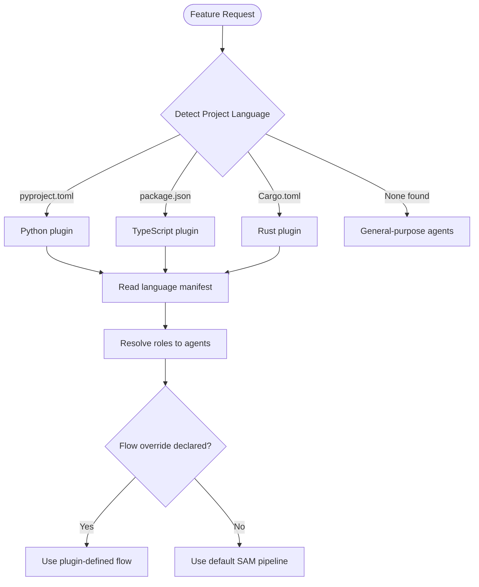
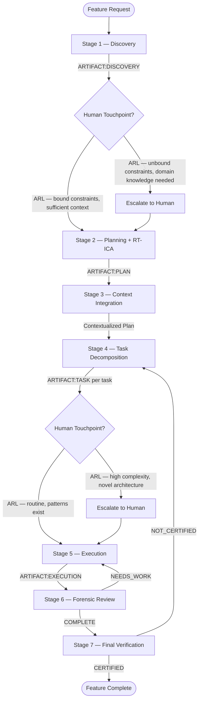
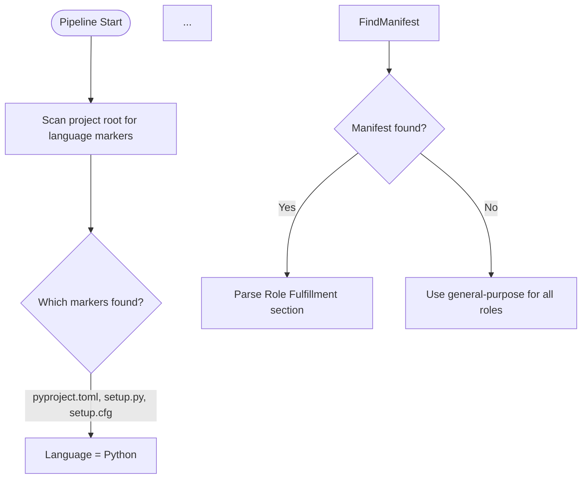
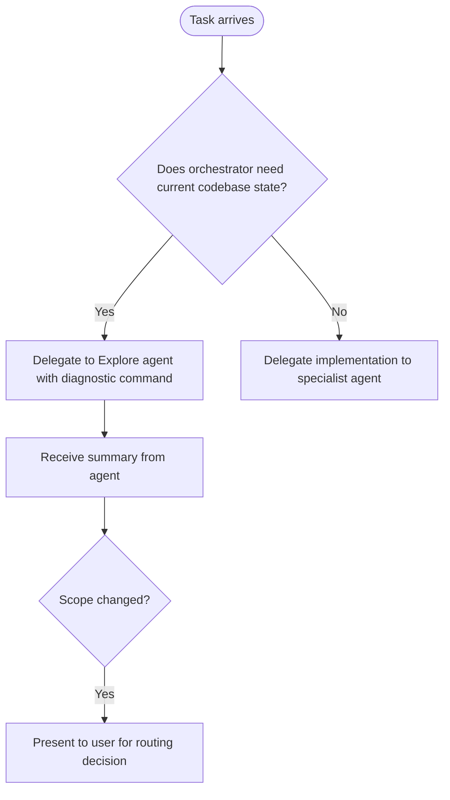

# SDLC Layer 0 Integration Suggestions

**Generated**: 2026-02-23
**Plan Context**: SDLC Layer Separation Architecture — Layer 0 (SDLC-Agnostic)
**Source**: Full read of all Layer 0 items from `sdlc-layer-candidates-master.md`

---

## Plan Summary (Layer 0 Scope)

Layer 0 = SAM pipeline, human touchpoints, artifact conventions, RT-ICA, verification protocol, task format, subagent contract, evidence discipline.

---

## From Plugins

### 1. development-harness

**Path**: `plugins/development-harness/CLAUDE.md`

**Suggested integration**: Add as the **canonical Layer 0 hub** for the SAM 7-stage pipeline. The plan should reference this plugin as the primary implementation of the SAM pipeline with ARL-derived human touchpoints and Voltron-style composition.

**Deliverable**: Layer 0 hub section — "The development-harness plugin is the reference implementation of the SAM 7-stage pipeline. It owns: process orchestration, ARL human touchpoint decisions, artifact management, and fallback behavior. Language plugins provide manifests; the harness resolves roles at runtime."

**Extracted content** (Role Resolution mermaid — include in plan):

---

### 2. default-development-flow

**Path**: `plugins/development-harness/skills/development-harness/references/default-development-flow.md`

**Suggested integration**: Add to **Human Touchpoints** section. The default flow defines Gate 1 (S1→S2) and Gate 2 (S4→S5), plus loop limits: 3 NEEDS_WORK, 2 NOT_CERTIFIED before human escalation.

**Amendment**: Plan should explicitly state loop limits as Layer 0 constants:
- NEEDS_WORK loop limit: 3 iterations per task
- NOT_CERTIFIED loop limit: 2 iterations before escalation

**Extracted content** (Pipeline Overview mermaid):

---

### 3. human-touchpoint-model

**Path**: `plugins/development-harness/skills/development-harness/references/human-touchpoint-model.md`

**Suggested integration**: Add to **Human Touchpoints** section. The constraint classification (Bound/Unbound/Mixed) and risk assessment (reversible, local scope, existing patterns) are Layer 0 decision logic.

**Amendment**: Plan should include the escalation format — when escalating, present: (1) what stage, (2) what triggered it, (3) what the agent knows, (4) what the agent does not know, (5) decision options. Never present vague "please review" requests.

**Nugget**: Dynamic escalation points beyond pre-scheduled gates: NEEDS_WORK loop limit, NOT_CERTIFIED loop limit, agent failure, quality gate cascade failure, contradiction detected in S3.

---

### 4. artifact-conventions

**Path**: `plugins/development-harness/skills/development-harness/references/artifact-conventions.md`

**Suggested integration**: Add to **Artifact Conventions** section. Token pattern `ARTIFACT:{TYPE}({SCOPE_OR_ID})`, file layout `.planning/harness/`, required sections per artifact type.

**Amendment**: Plan should list the seven artifact types and their required sections (DISCOVERY, PLAN, CONTEXT, TASK, EXECUTION, REVIEW, VERIFICATION). Coexistence with `.planning/gsd/` and `.planning/backlog/` is explicit.

**Nugget**: Each artifact includes predecessor/successor references. Traceability chain: S7 builds matrix linking requirements (S1) through plan (S2), tasks (S4), execution (S5), review (S6).

---

### 5. role-resolution-protocol

**Path**: `plugins/development-harness/skills/development-harness/references/role-resolution-protocol.md`

**Suggested integration**: Add to **Layer 0 process** — role resolution happens at pipeline start before S1. Abstract roles: architect, test-designer, code-reviewer, design-spec, linting.

**Extracted content** (Resolution Process mermaid):

---

### 6. language-manifest-schema

**Path**: `plugins/development-harness/skills/development-harness/references/language-manifest-schema.md`

**Suggested integration**: Add to **Layer 0 schema** — language manifests have four required sections (Role Fulfillment, Quality Gates, Project Detection) and one optional (Process Flow Override). Flow override must include at least one human touchpoint gate and end with CERTIFIED/NOT_CERTIFIED.

**Nugget**: Validation failures produce warnings but do not block the pipeline. Harness falls back to general-purpose for any section that fails validation.

---

### 7. Workflow stages (7)

**Paths**: `plugins/development-harness/skills/workflows/{discovery,planning,context-integration,task-decomposition,execution,forensic-review,final-verification}/SKILL.md`

**Suggested integration**: Add to **SAM Pipeline** section — each stage has a dedicated skill with input/output contracts. Key cross-stage rules:
- S2 Planning: RT-ICA pre-pass, BLOCK on MISSING critical items
- S4 Task Decomposition: CLEAR ordering, CoVe only when accuracy-risk medium/high
- S5 Execution: Task file IS the complete prompt; fresh session per task
- S6 Forensic Review: Producer and reviewer must be different agents
- S7 Final Verification: Goal-backward verification, not implementation-forward

**Nugget**: S6 principle — "AI cannot reliably self-evaluate." Forensic review uses a separate agent with fresh context.

---

### 8. planner-rt-ica

**Path**: `plugins/development-harness/skills/planner-rt-ica/SKILL.md`

**Suggested integration**: Add to **RT-ICA** section. Planner RT-ICA is distinct from execution RT-ICA:
- **planner-rt-ica**: Enables safe planning under uncertainty; localizes gaps; produces unblock paths; outputs APPROVED-FOR-PLANNING / APPROVED-WITH-GAPS / BLOCKED-FOR-PLANNING
- **rt-ica**: Blocks execution if required inputs remain missing

**Amendment**: Any task produced under APPROVED-WITH-GAPS MUST still pass `rt-ica` before execution by a specialist agent.

---

### 9. validation-protocol

**Path**: `plugins/development-harness/skills/validation-protocol/SKILL.md`

**Suggested integration**: Add to **Verification Protocol** section. Four-step protocol: (1) Reproduce failing state, (2) Define success criteria, (3) Apply fix and observe, (4) Verify result. Success = observing intended behavior, not absence of errors.

**Nugget**: Anti-patterns to avoid: claiming success without reproducing failure; confusing "no errors" with success; skipping verification; partial verification.

---

### 10. clear-cove-task-design, generate-task

**Paths**: `plugins/development-harness/skills/clear-cove-task-design/SKILL.md`, `plugins/development-harness/skills/generate-task/SKILL.md`

**Suggested integration**: Add to **Task Format** section. CLEAR ordering: Context, Objective, Inputs, Requirements, Constraints, Outputs, Verification, Handoff. CoVe checks only when accuracy-risk is medium or high.

**Amendment**: Task prompt template must include: Required Inputs (with assumptions and how to confirm), Verification Steps, CoVe Checks (conditional), Handoff.

---

### 11. verification-gate

**Path**: `plugins/verification-gate/skills/verification-gate/SKILL.md`

**Suggested integration**: Add to **Verification Protocol** section. Four mandatory pre-action checkpoints: (1) Hypothesis stated, (2) Hypothesis verified, (3) Hypothesis-action alignment, (4) Pattern-matching detection.

**Nugget**: Verification-gate's 4 checkpoints should run **before** S5 Execution self-verification. They prevent pattern-matching from overriding explicit reasoning. Activate before any Bash/Write/Edit/NotebookEdit.

**Amendment**: Remove or rephrase "5% cost for 95% reliability improvement" — grooming report 2026-02-23 marked this as REFUTED (unsubstantiated). Use qualitative phrasing instead.

---

### 12. orchestrator-discipline

**Path**: `plugins/orchestrator-discipline/skills/orchestrator-discipline/SKILL.md`, `references/investigation-escalation.md`

**Suggested integration**: Add to **Layer 0 process** — orchestrator context window discipline. Two anti-patterns: (1) Investigation Escalation (3+ Read/Grep/Bash on source files without Edit/Write/Task), (2) Agent Output Polling (TaskOutput block=false on running agent).

**Amendment**: Plan should state: "Orchestrators delegate; agents implement. No exemption categories for 'config changes', 'small edits', or 'just TOML/YAML'."

**Extracted content** (Correct workflow):

---

### 13. agent-orchestration, how-to-delegate

**Paths**: `plugins/agent-orchestration/skills/agent-orchestration/SKILL.md`, `plugins/agent-orchestration/skills/how-to-delegate/SKILL.md`

**Suggested integration**: Add to **Delegation** section. WHERE-WHAT-WHY framework. Delegation template: OBSERVATIONS, DEFINITION OF SUCCESS, CONTEXT, YOUR TASK. Pre-gathering anti-pattern: never run commands to collect data for agents.

**Amendment**: Plan should require: "Start every Task prompt with `Your ROLE_TYPE is sub-agent.`" Include the 10-step delegation worksheet from how-to-delegate for orchestrators.

**Nugget**: Scientific delegation = Observations + Success Criteria + Available Resources - Assumptions - Prescriptions.

---

### 14. hallucination-detector

**Path**: `plugins/hallucination-detector/commands/hallucination-audit.md`

**Suggested integration**: Add to **Evidence Discipline** section. Five triggers: (1) Speculation language, (2) Causality without evidence, (3) Pseudo-quantification, (4) Completeness claims, (5) Delegation micromanagement.

**Nugget**: Run hallucination audit after producing answers or reviewing sub-agent output. CLAUDE.md already references `/hallucination-detector:hallucination-audit` when reviewing agent output.

---

### 15. the-rewrite-room/output-contracts, fidelity-rules

**Paths**: `plugins/the-rewrite-room/skills/the-rewrite-room/references/output-contracts.md`, `fidelity-rules.md`

**Suggested integration**: Add to **Artifact Conventions** section. STATUS block: DONE, BLOCKED, FAILED. BLOCKED = workflow did not complete; FAILED = output exists but failed validation.

**Amendment**: Fidelity rules apply to summarization: Read before summarizing; Extract before abstracting; Preserve counts; Distinguish absence from nonexistence; No lossy re-summarization; State confidence explicitly.

**Nugget**: Rule 4 — "Not mentioned in this document" vs "Doesn't exist" — precise language when information is not found.

---

### 16. plugin-creator/arl

**Path**: `plugins/plugin-creator/skills/arl/SKILL.md`

**Suggested integration**: Add to **ARL Meta-Layer** (cross-reference). ARL theory informs Layer 0: HOOTL concept, 10 gates (R1-R10), scope-feasibility matrix, decision tree for gate replacement.

**Nugget**: ARL is not a process to run — it is research that informs how to design processes. Relationship triangle: ARL produces theory, SAM applies it, agentskill-kaizen validates.

**Amendment**: Plan should note that the 4 build-from-scratch requirements (R6, R7, R8, R10) emerge from iterative refinement — invisible to single-pass pipelines.

---

## From Skills

### 17. work-backlog-item

**Path**: `.claude/skills/work-backlog-item/SKILL.md`

**Suggested integration**: Add to **Layer 0 process** — bridge from BACKLOG.md to SAM planning. Arguments: `#N`, `--auto`, `close`, `resolve`, `setup-github`. Stops if item has existing Plan or RT-ICA returns BLOCKED.

> **NOTE (2026-02-27)**: BACKLOG.md was removed. Backlog items now live in `.claude/backlog/` per-item files; GitHub Issues are the source of truth.

**Amendment**: Plan should document the workflow: find item → fact-check → RT-ICA → groom → SAM planning → BACKLOG.md update. GitHub Issue is canonical status when `**Issue**: #N` exists.

---

### 18. sam-definition

**Path**: `.claude/skills/work-backlog-item/references/sam-definition.md`

**Suggested integration**: Add as **canonical SAM definition** for Layer 0. Core principles: stateless agents, externalized memory, single responsibility, message passing, verification at boundaries, deterministic backpressure, RT-ICA gate, semantic artifact tokens, structure over instruction, AI cannot self-evaluate.

**Amendment**: Plan should cite the 7-stage pipeline table and artifact flow from this file.

---

### 19. github-integration, validation-plan

**Paths**: `.claude/skills/work-backlog-item/references/github-integration.md`, `validation-plan.md`

**Suggested integration**: Add to **Layer 0 process** — GitHub integration is optional but when used: labels (priority:*, type:*, status:*), milestones, setup-github command. Validation plan V1–V6 provides verification commands.

**Nugget**: BACKLOG.md ↔ Issue mapping. When `**Issue**: #N` exists, GitHub status is canonical.

---

### 20. groom-backlog-item

**Path**: `.claude/skills/groom-backlog-item/SKILL.md`

**Suggested integration**: Add to **Layer 0 process** — grooming flow: fact-check → RT-ICA → spawn groomer agents (max 5 concurrent). REFUTED claims become MISSING conditions in RT-ICA.

**Amendment**: Plan should state: "Fact-check runs before RT-ICA. Training data recall is NOT evidence."

---

### 21. rt-ica

**Path**: `.claude/skills/rt-ica/SKILL.md`

**Suggested integration**: Add to **RT-ICA** section. Mandatory pre-planning checkpoint. BLOCK if any condition is MISSING. Integration points: before top-level plan, before delegating to agents, before finalizing acceptance criteria.

**Amendment**: Plan should include the RT-ICA output format: Goal, Success Output, Conditions (reverse prerequisites), Verification (AVAILABLE/DERIVABLE/MISSING), Decision (APPROVED/BLOCKED).

---

### 22. subagent-contract

**Path**: `.claude/skills/subagent-contract/SKILL.md`

**Suggested integration**: Add to **Subagent Contract** section. DONE/BLOCKED signaling. Scope discipline: no invention, no assumption, no scope creep. Quality checklist before DONE; blocked checklist before BLOCKED.

**Amendment**: Plan should require all specialist agents to load this contract. BLOCKED is preferred over guessing.

---

### 23. fact-check

**Path**: `.claude/skills/fact-check/SKILL.md`

**Suggested integration**: Add to **Evidence Discipline** section. Primary-source verification only. VERIFIED/REFUTED/INCONCLUSIVE verdicts. Wave spawning (max 5 concurrent). Valid evidence: WebFetch, WebSearch, CLI output, repo source, MCP tools.

**Nugget**: REFUTED claims from fact-check must become MISSING conditions in RT-ICA.

---

### 24. find-cause

**Path**: `.claude/skills/find-cause/SKILL.md`

**Suggested integration**: Add to **Evidence Discipline** section. Evidence-chain protocol: every claim must have command output, file content, or direct observation. NOT evidence: docs intent, training recall, inference from absence.

**Nugget**: Use for investigation requests; transforms vague requests into reproducible-proof investigations.

---

### 25. verify

**Path**: `.claude/skills/verify/SKILL.md`

**Suggested integration**: Add to **Verification Protocol** section. Completion checklist: Task type, WORKS check (executable vs static), FIXED check (for bug fixes), Quality gates, Honesty check.

**Nugget**: "If you cannot demonstrate it working in practice with evidence, it is NOT done." CLAUDE.md requires `/verify` before claiming task completion.

---

### 26. delegate, cove-prompt-design, scientific-thinking, commit-staged

**Paths**: `.claude/skills/delegate/SKILL.md`, `cove-prompt-design/SKILL.md`, `scientific-thinking/SKILL.md`, `commit-staged/SKILL.md`

**Suggested integration**:
- **delegate**: Quick WHERE-WHAT-WHY template; for full delegation use agent-orchestration how-to-delegate
- **cove-prompt-design**: When to use CoVe (factual accuracy, multi-fact reasoning); three phases: generate → verify → revise
- **scientific-thinking**: Hypothesis → Prediction → Experiment → Conclusion; for debugging, architecture, complex refactoring
- **commit-staged**: Conventional commits (feat/fix/docs/scope); Layer 0 artifact for commit phase

---

## From Agents

### 27. backlog-item-groomer

**Path**: `.claude/agents/backlog-item-groomer.md`

**Suggested integration**: Add to **Layer 0 process** — produces context manifest: RT-ICA Assessment, supporting skills, related agents, prior work, dependencies, blockers. Uses Glob, Grep, Read.

**Nugget**: If orchestrator provides pre-computed RT-ICA, groomer uses it and focuses discovery on filling MISSING conditions.

---

### 28. fact-checker

**Path**: `.claude/agents/fact-checker.md`

**Suggested integration**: Add to **Evidence Discipline** section. Verifies single factual claim. MUST use WebFetch/WebSearch/gh — training recall rejected. Returns structured VERIFIED/REFUTED/INCONCLUSIVE with citations.

**Nugget**: Applies CoVe before finalizing verdict — generate falsification questions, check against second source.

---

### 29. topic-specialist

**Path**: `.claude/agents/topic-specialist.md`

**Suggested integration**: Add to **Evidence Discipline** section. Domain specialist; researches primary sources only; can update or create skills with verified findings. Loads fact-check, find-cause, research-curator.

**Nugget**: Source priority: GitHub source code > README > issues > official docs > WebSearch.

---

### 30. context-gathering, context-refinement

**Paths**: `.claude/agents/context-gathering.md`, `context-refinement.md`

**Suggested integration**: Add to **Layer 0 process** — context-gathering produces "How It Currently Works" narrative; context-refinement adds "Discovered During Implementation" when drift detected.

**Nugget**: Context-gathering writes ONLY to the task file; forbidden from editing other files. Context-refinement only updates if significant discoveries or drift found.

---

### 31. logging

**Path**: `.claude/agents/logging.md`

**Suggested integration**: Add to **Layer 0 process** — consolidates work logs into task's Work Log section. Chronological order. Use during context compaction or task completion.

**Nugget**: Assessment phase before changes: read entire task file, read transcript, plan REMOVE/UPDATE/ADD.

---

### 32. code-review

**Path**: `.claude/agents/code-review.md`

**Suggested integration**: Add to **Verification Protocol** section. LLM-slop detection: reimplementing existing scaffolding, failing to follow norms, junk patterns, placeholders, hallucinated defaults. Critical/Warning/Suggestion categories.

**Nugget**: Use ONLY when explicitly requested or invoked by protocol. Do not use proactively.

---

## Cross-Cutting Integration Summary

| Concept | Layer 0 Items | Plan Section |
|---------|---------------|--------------|
| **RT-ICA** | planner-rt-ica, rt-ica, groom-backlog-item, work-backlog-item, backlog-item-groomer | RT-ICA gate |
| **CoVe** | fact-check, cove-prompt-design, clear-cove-task-design, fact-checker, topic-specialist | Evidence discipline |
| **Evidence discipline** | fact-check, find-cause, verify, fact-checker, topic-specialist | Verification protocol |
| **DONE/BLOCKED** | subagent-contract, agent-orchestration, work-backlog-item | Subagent contract |
| **Human touchpoints** | human-touchpoint-model, default-development-flow, ARL | Human touchpoints |
| **Artifact conventions** | artifact-conventions, output-contracts, sam-definition | Artifact conventions |
| **Wave spawning** | groom-backlog-item, fact-check, refresh-research (max 5) | Process constraints |

---

## Recommended Plan Amendments

1. **Explicit loop limits**: 3 NEEDS_WORK, 2 NOT_CERTIFIED before human escalation
2. **Verification-gate order**: 4 checkpoints run before S5 Execution self-verification
3. **Remove unsubstantiated claim**: verification-gate "5% cost for 95% reliability" — REFUTED
4. **Orchestrator discipline**: No exemption categories; 3+ source reads without Edit/Write/Task = trigger
5. **Fact-check before RT-ICA**: REFUTED claims become MISSING conditions in RT-ICA
