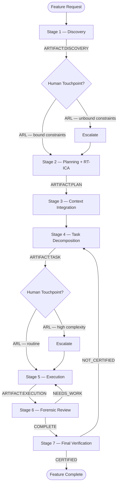

# SAM 7-Stage Pipeline

Canonical pipeline for feature development. Each stage produces a file-based artifact; no stage relies on conversation memory.

---

## Pipeline Overview



---

## Stages

| Stage | Name | Input | Output |
|-------|------|-------|--------|
| S1 | Discovery | User request, problem statement | ARTIFACT:DISCOVERY(SCOPE:...) |
| S2 | Planning + RT-ICA | Discovery artifacts | ARTIFACT:PLAN(SCOPE:...) |
| S3 | Context Integration | Plan + codebase | ARTIFACT:PLAN contextualized |
| S4 | Task Decomposition | Contextualized plan | ARTIFACT:TASK(TASK:...) per task |
| S5 | Execution | Single task file | ARTIFACT:EXECUTION(TASK:...) |
| S6 | Forensic Review | Execution + task + plan | ARTIFACT:REVIEW — COMPLETE / NEEDS_WORK |
| S7 | Final Verification | All completed tasks + goals | ARTIFACT:VERIFICATION — CERTIFIED / NOT_CERTIFIED |

---

## Loop Limits

- **NEEDS_WORK**: 3 iterations per task before human escalation
- **NOT_CERTIFIED**: 2 iterations before human escalation

---

## Artifact Flow

```text
User Request → DISCOVERY → PLAN → PLAN (contextualized) → TASK(s) → EXECUTION(s) → REVIEW(s) → VERIFICATION
```

---

## Source

- [sam-definition.md](../../.claude/skills/work-backlog-item/references/sam-definition.md)
- [default-development-flow.md](../../plugins/development-harness/skills/development-harness/references/default-development-flow.md)
