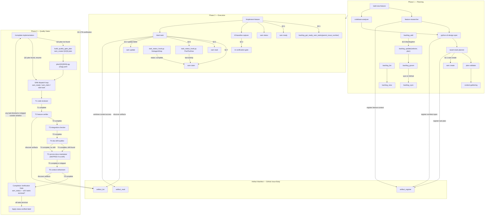
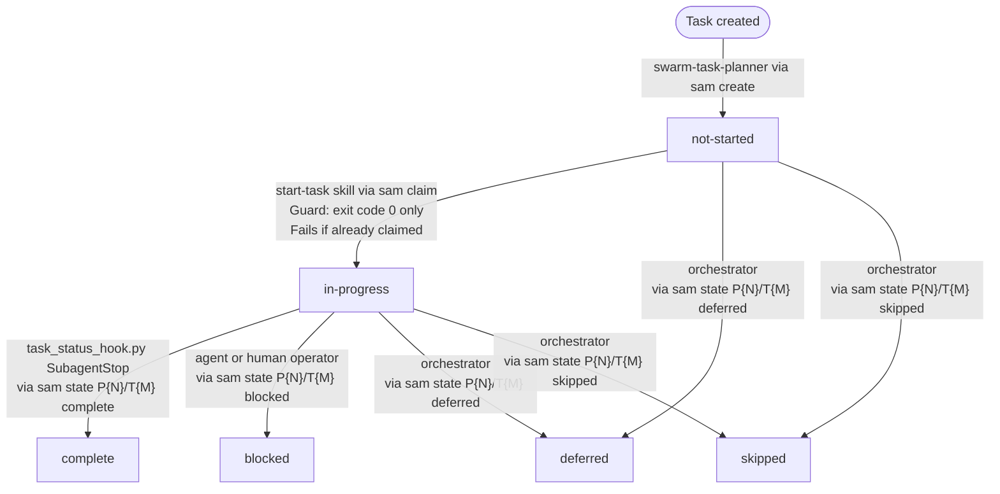
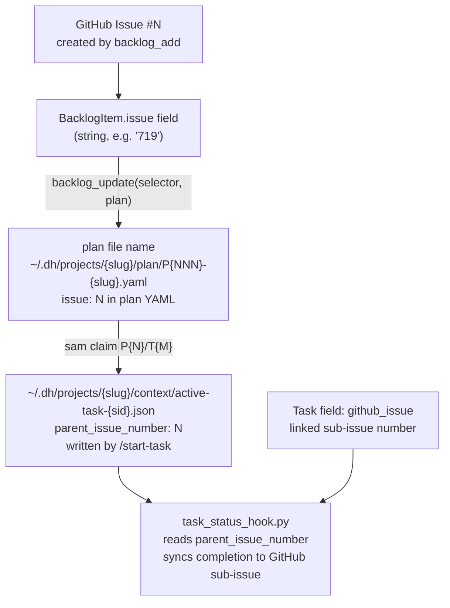
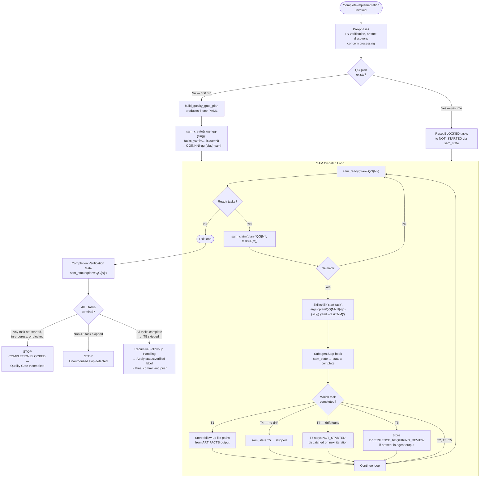

> **Note**: This is the project-level copy for Claude Code context. The plugin-bundled copy lives at
> `./plugins/development-harness/docs/workflow-architecture-diagram.md`.

# Workflow Architecture Diagram

> **Snapshot**: 2026-03-22T15:00:00Z (SAM-enforced quality gates)
>
> Sources: `plugins/development-harness/docs/TASK_FILE_FORMAT.md`, `backlog_core/server.py`, `backlog_core/models.py`,
> `plugins/development-harness/skills/implementation-manager/scripts/task_status_hook.py`,
> `plugins/development-harness/skills/complete-implementation/SKILL.md`
> Last verified: 2026-03-22

**Table of Contents**

- [1. Pipeline Overview](#1-pipeline-overview)
- [2. Data Structure Shapes](#2-data-structure-shapes)
- [3. Publisher-Consumer Map](#3-publisher-consumer-map)
- [4. SAM Task State Lifecycle](#4-sam-task-state-lifecycle)
- [5. Cross-System Dependency Chain](#5-cross-system-dependency-chain)
- [6. Hook Trigger Conditions](#6-hook-trigger-conditions)
- [7. Quality Gate SAM Dispatch Flow](#7-quality-gate-sam-dispatch-flow)

---

## 1. Pipeline Overview



---

## 2. Data Structure Shapes

### 2.1 sam_ready output (ReadyTasksResult)

Output of `mcp__plugin_dh_sam__sam_ready(plan="P{N}")` and `backlog_get_ready_sam_tasks(parent_issue_number)`. CLI fallback: `uv run sam ready P{N} --format json`.

```json
{
  "feature": "string (plan slug)",
  "ready_tasks": [
    {
      "task": "T01",
      "title": "string",
      "agent": "string",
      "skills": ["skill-name"],
      "priority": 1,
      "complexity": "low|medium|high",
      "dependencies": []
    }
  ],
  "count": 3
}
```

### 2.2 TaskAssignment (sam_read P{N}/T{M})

Output of `mcp__plugin_dh_sam__sam_read(plan="P{N}", task="T{M}")`. CLI fallback: `uv run sam read P{N}/T{M} --format json`.

```json
{
  "plan_number": 719,
  "plan_slug": "string",
  "plan_goal": "string",
  "plan_context": "string",
  "plan_acceptance_criteria": ["string"],
  "task": {
    "task": "T04",
    "title": "string",
    "status": "not-started|in-progress|complete|blocked|deferred|skipped",
    "agent": "string",
    "dependencies": ["T01"],
    "priority": 1,
    "complexity": "low|medium|high",
    "skills": ["string"],
    "started": "ISO 8601 | null",
    "completed": "ISO 8601 | null",
    "last-activity": "ISO 8601 | null",
    "github_issue": "int | null",
    "is-bookend": "bool | null",
    "bookend-type": "t0-baseline|tn-verification | null",
    "body": "markdown string"
  }
}
```

### 2.3 T0 Baseline YAML (~/.dh/projects/{slug}/plan/T0-baseline-{slug}.yaml)

Written by `t0-baseline-capture` agent. Array of per-criterion capture records.

```yaml
- criterion_id: "AC1"
  check_command: "uv run pytest tests/"
  exit_code: 1
  stdout: "string"
  stderr: "string"
```

### 2.4 TN Verification YAML (~/.dh/projects/{slug}/plan/TN-verification-{slug}.yaml)

Written by `tn-verification-gate` agent. Array of `BookendVerification` records. No top-level verdict field.

```yaml
- criterion_id: "AC1"
  check_command: "uv run pytest tests/"
  t0_exit_code: 1
  tn_exit_code: 0
  status: "passed|regressed|pre-existing-fail|newly-passing"
  stdout_diff_summary: "string"
```

`/complete-implementation` aggregates the verdict by scanning all records for `status: regressed`.

### 2.5 BacklogItem fields (backlog_core/models.py `BacklogItem`)

Relevant fields for the pipeline:

```json
{
  "title": "string",
  "priority": "P0|P1|P2|Ideas",
  "description": "string",
  "source": "string",
  "item_type": "Feature|Bug|Refactor|Docs|Chore",
  "issue": "string (GitHub issue number as string, or empty)",
  "plan": "string (file path) | empty string"
}
```

### 2.6 Active-task context file (~/.dh/projects/{slug}/context/active-task-{CLAUDE_SESSION_ID}.json)

Written by `/start-task` skill. Read by `task_status_hook.py` PostToolUse handler.

```json
{
  "task_file_path": "~/.dh/projects/{slug}/plan/P719-my-feature.yaml",
  "task_id": "T04",
  "parent_issue_number": 719
}
```

`parent_issue_number` is omitted when the story issue number is unknown. The hook treats absence as `None` and skips GitHub sync.

### 2.7 sam_claim output

Output of `mcp__plugin_dh_sam__sam_claim(plan="P{N}", task="T{M}")`. CLI fallback: `uv run sam claim P{N}/T{M} --format json`.

```json
{
  "claimed": true,
  "task_id": "T04",
  "started": "2026-03-15T13:00:00Z"
}
```

Exit code 1 when: already claimed, task not found, or `status != not-started`.

---

## 3. Publisher-Consumer Map

| Artifact | Publisher | Consumer(s) |
|----------|-----------|-------------|
| `.claude/backlog/{priority}-{slug}.md` | `backlog_add`, `backlog_update`, `backlog_sync` (local cache write) | `backlog_view`, `backlog_list`, `/dh:work-backlog-item` orchestrator |
| `~/.dh/projects/{slug}/backlog/{priority}-{slug}.md` | `backlog_add`, `backlog_sync`, `backlog_normalize` (DH state cache) | `backlog_view`, `backlog_list`, `backlog_groom` |
| `~/.dh/projects/{slug}/plan/feature-context-{slug}.md` | `feature-researcher` | `python-cli-design-spec`, `swarm-task-planner` |
| `~/.dh/projects/{slug}/plan/codebase/{FOCUS}.md` | `codebase-analyzer` | `swarm-task-planner` |
| `~/.dh/projects/{slug}/plan/architect-{slug}.md` | `python-cli-design-spec` | `swarm-task-planner`, executing agents via `/start-task` |
| `~/.dh/projects/{slug}/plan/P{NNN}-{slug}.yaml` | `swarm-task-planner` via `sam create` | `/implement-feature`, `sam ready`, `sam status`, all execution agents |
| `~/.dh/projects/{slug}/plan/T0-baseline-{slug}.yaml` | `t0-baseline-capture` | `tn-verification-gate` |
| `~/.dh/projects/{slug}/plan/TN-verification-{slug}.yaml` | `tn-verification-gate` | `/complete-implementation` Pre-Phase 1 check |
| `~/.dh/projects/{slug}/plan/QG{NNN}-qg-{slug}.yaml` | `/complete-implementation` via `build_quality_gate_plan` + `sam_create` | SAM dispatch loop (T1–T6 quality gate tasks) |
| `~/.dh/projects/{slug}/context/active-task-{sid}.json` | `/start-task` skill | `task_status_hook.py` PostToolUse handler |
| `last-activity` field in task | `task_status_hook.py` PostToolUse handler | progress reporting |
| `status: complete`, `completed` field | `task_status_hook.py` SubagentStop handler | `sam ready` readiness evaluation |
| `status: in-progress`, `started` field | `sam claim` via `/start-task` | `sam status`, `sam ready` exclusion |
| Follow-up task files | `code-reviewer` | `/complete-implementation` recursion gate |
| Context Manifest in task file | `context-gathering`, `context-refinement` | executing agents, future sessions |
| Artifact manifest (GitHub Issue body) | Producer agents via `artifact_register` | Consumer agents via `artifact_list`, worktree agents via `artifact_read` |

---

## 4. SAM Task State Lifecycle



Readiness rule: a task is ready when `status == not-started` AND all dependency task IDs have terminal status. Terminal statuses: `complete`, `blocked`, `skipped`. SKIPPED counts as terminal for dependency evaluation — when T5 is skipped, T6 becomes ready.

---

## 5. Cross-System Dependency Chain

The `parent_issue_number` (GitHub issue) propagates through these fields:



Key invariant: `parent_issue_number` in the context file is the GitHub story issue number for the plan. `task.github_issue` is the sub-issue to close on completion. The hook uses both fields independently.

---

## 6. Hook Trigger Conditions

Script: `plugins/development-harness/skills/implementation-manager/scripts/task_status_hook.py`

Hook input arrives via stdin as JSON. The hook reads `hook_event_name` to route.

### 6.1 SubagentStop

```text
Trigger:    hook_event_name == "SubagentStop"
Matcher:    (none — fires on every sub-agent completion)
Context:    Declared on /implement-feature skill and /complete-implementation skill
```

Processing sequence:

1. Read `prompt` field from hook input (falls back to `tool_input.prompt`).
2. Parse prompt for `/start-task <path> --task <id>` or `Skill(skill="start-task", args="<path> --task <id>")` pattern.
3. If no match, fall back to `~/.dh/projects/{slug}/context/active-task-{session_id}.json`.
4. If still no match, exit 0 silently (not a `/start-task` sub-agent).
5. Call `sam_update_status(full_path, task_id, COMPLETE, timestamp_field="completed")`.
6. Delete `~/.dh/projects/{slug}/context/active-task-{session_id}.json`.
7. Call `sync_completion_to_github()` — best-effort, never changes exit code.

Fields written: `status: complete`, `completed: <ISO timestamp>`

### 6.2 PostToolUse (Write|Edit|Bash)

```text
Trigger:    hook_event_name == "PostToolUse"
            AND tool_name in {"Write", "Edit", "Bash"}
Matcher:    Write|Edit|Bash
Context:    Declared on /start-task skill
```

Processing sequence:

1. Read `session_id` from hook input. If absent, exit 0.
2. Read `~/.dh/projects/{slug}/context/active-task-{session_id}.json`. If absent, exit 0.
3. Resolve `task_file_path` and `task_id` from context file.
4. Read current task via `sam_get_task`. If `status == complete`, return without writing.
5. Call `sam_update_plan_fields(full_path, task_id, set_fields={"last-activity": <ISO timestamp>})`.

Fields written: `last-activity: <ISO timestamp>`

Guard: skipped silently when task status is already `complete`.

---

## 7. Quality Gate SAM Dispatch Flow

The `/complete-implementation` skill enforces quality gates via a SAM-based dispatch loop. Each of the 6 phases is a task in a dedicated QG plan (prefix `QG{N}`). The dependency chain `T1 → T2 → T3 → T4 → T5 → T6` enforces ordered execution. No phase can start until the previous phase's task reaches terminal status.



### Skip Whitelist

Only T5 (Documentation Update) may have `status: skipped`. Skipping is triggered by the orchestrator via `sam_state` immediately after T4 completes with no drift findings. All other tasks must reach `status: complete`.

### QG Plan File Location

The QG plan file is written by `sam_create` to `plan/QG{NNN}-qg-{slug}.yaml` (in the project plan directory). The `QG{N}` address is used in all subsequent `sam_ready`, `sam_claim`, `sam_state`, and `sam_status` calls for this quality gate run. The `QG{NNN}` number is auto-assigned by SAM (sequential, separate from implementation plan numbering `P{NNN}`).
