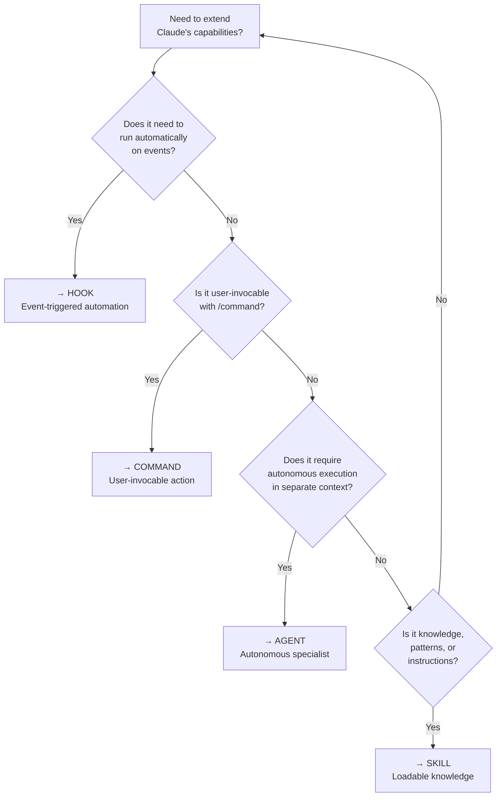
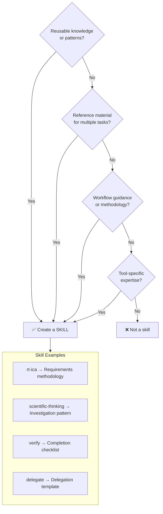
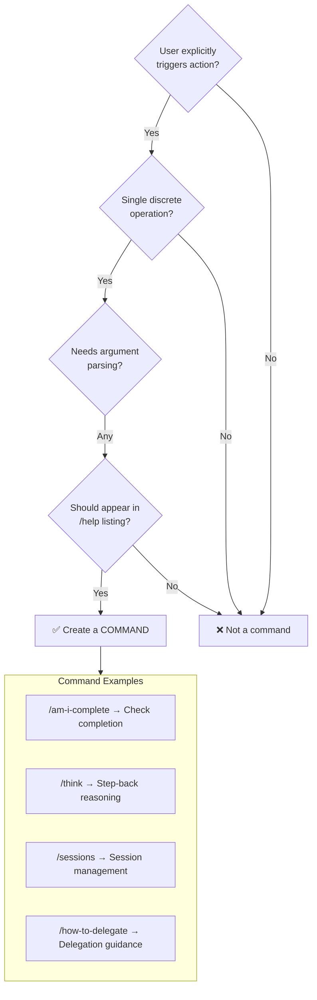
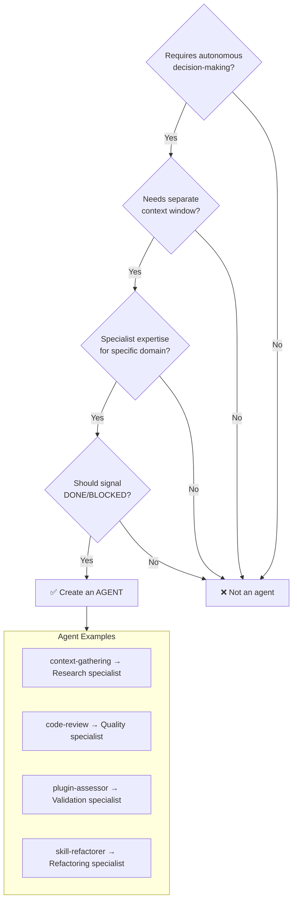
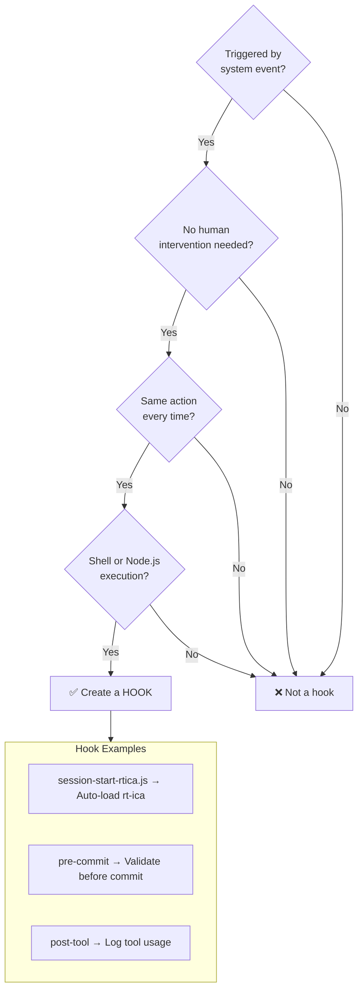
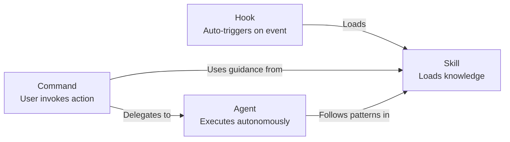

# Asset Category Decision Tree

Guide for selecting the right extension type: Skill vs Command vs Agent vs Hook.

---

## Quick Decision Flow



---

## Detailed Decision Matrix

```mermaid
flowchart TB
    subgraph CRITERIA["Selection Criteria"]
        direction LR
        C1["Invocation Method"]
        C2["Execution Context"]
        C3["Autonomy Level"]
        C4["Persistence"]
    end

    subgraph SKILL_BOX["SKILL"]
        S1["Loaded on demand<br/>or by other assets"]
        S2["Runs in current<br/>context window"]
        S3["Provides guidance,<br/>not autonomous action"]
        S4["Persists as knowledge<br/>for session duration"]
    end

    subgraph COMMAND_BOX["COMMAND"]
        CMD1["User types /name<br/>or model invokes"]
        CMD2["Runs in current<br/>context window"]
        CMD3["Executes defined<br/>action sequence"]
        CMD4["One-time execution,<br/>may modify state"]
    end

    subgraph AGENT_BOX["AGENT"]
        A1["Delegated via<br/>Task tool"]
        A2["Runs in separate<br/>context window"]
        A3["Fully autonomous<br/>within scope"]
        A4["Returns results,<br/>signals DONE/BLOCKED"]
    end

    subgraph HOOK_BOX["HOOK"]
        H1["Triggered by<br/>system events"]
        H2["Runs in shell<br/>or Node.js"]
        H3["Automated,<br/>no human trigger"]
        H4["Executes on<br/>every event match"]
    end

    C1 --> S1 & CMD1 & A1 & H1
    C2 --> S2 & CMD2 & A2 & H2
    C3 --> S3 & CMD3 & A3 & H3
    C4 --> S4 & CMD4 & A4 & H4
```



---

## Use Case Decision Trees

### When to Use a SKILL



**Skill Characteristics:**

- Loadable via `Skill(command: "name")` or `@skillname`
- Contains SKILL.md with frontmatter and instructions
- Can include reference files for additional context
- No autonomous execution - provides guidance only

---

### When to Use a COMMAND



**Command Characteristics:**

- Invoked with `/commandname` or `/commandname args`
- Lives in `.claude/commands/` directory
- Markdown file with frontmatter
- Executes in orchestrator's context
- Can fork context if `context_fork: true`

---

### When to Use an AGENT



**Agent Characteristics:**

- Delegated via `Task(agent="name", prompt="...")`
- Lives in `.claude/agents/` directory
- YAML frontmatter with model, tools, allowed_tools
- Runs in isolated context window
- Returns results to orchestrator

---

### When to Use a HOOK



**Hook Characteristics:**

- Defined in `settings.json` hooks array
- Triggered by events: session-start, pre-tool, post-tool, etc.
- Runs shell command or Node.js script
- Cannot prompt user - automated only
- Exit codes control flow (0=continue, non-0=block)

---

## Comparison Table

| Aspect            | Skill              | Command          | Agent             | Hook             |
| ----------------- | ------------------ | ---------------- | ----------------- | ---------------- |
| **Invocation**    | Load via Skill()   | User types /name | Task() delegation | System event     |
| **Context**       | Orchestrator's     | Orchestrator's   | Separate window   | Shell/Node       |
| **Autonomy**      | Guidance only      | Execute action   | Fully autonomous  | Automated        |
| **File Location** | skills/\*/SKILL.md | commands/\*.md   | agents/\*.md      | settings.json    |
| **User Visible**  | @mention           | /help listing    | Task output       | Silent           |
| **Arguments**     | N/A                | $ARGUMENTS       | prompt parameter  | Environment vars |
| **Return Value**  | Knowledge loaded   | Action complete  | DONE/BLOCKED      | Exit code        |

---

## Decision Flowchart Summary

```text
START: What capability do I need?
│
├─► Runs on system events automatically?
│   └─► YES → HOOK
│
├─► User explicitly invokes with slash?
│   └─► YES → COMMAND
│
├─► Needs separate context, autonomous work?
│   └─► YES → AGENT
│
└─► Knowledge, patterns, or guidance?
    └─► YES → SKILL
```

---

## Common Mistakes

| Mistake                          | Problem                     | Correct Approach               |
| -------------------------------- | --------------------------- | ------------------------------ |
| Creating agent for simple lookup | Wastes context window       | Use skill with reference files |
| Creating skill for user action   | Skills can't take action    | Use command for actions        |
| Creating command for automation  | Commands need user trigger  | Use hook for automation        |
| Creating hook for guidance       | Hooks can't provide context | Use skill for guidance         |

---

## Combination Patterns

Assets often work together:



**Example: session-start-rtica.js**

1. Hook triggers on session start
2. Loads rt-ica skill
3. Skill provides requirements assessment methodology
4. User can also invoke via /rt-ica command

---

## Navigation

- **Previous:** [Master Workflow](./master-workflow.md)
- **Next:** [Multi-Agent Orchestration](./multi-agent-orchestration.md)
- **Back to:** [Index](./README.md)
