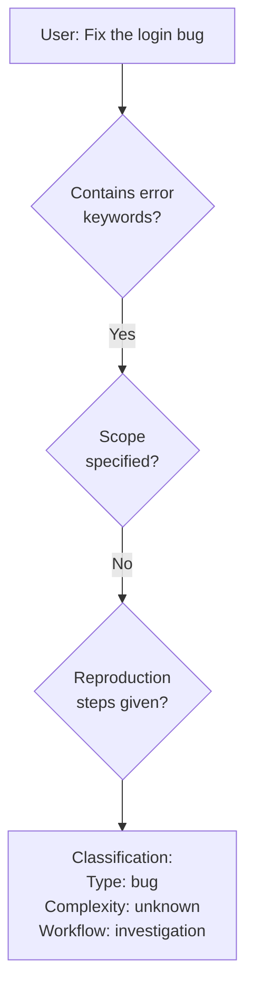
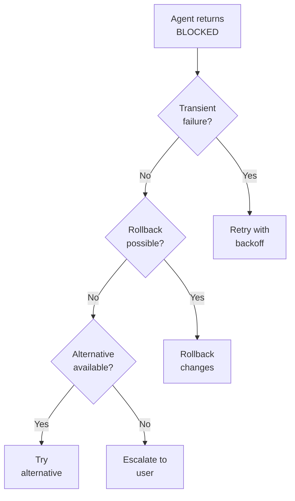
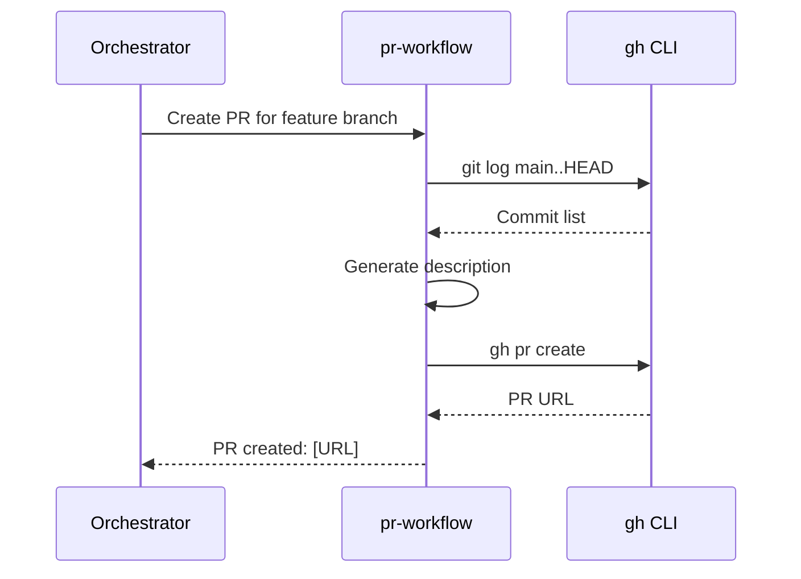
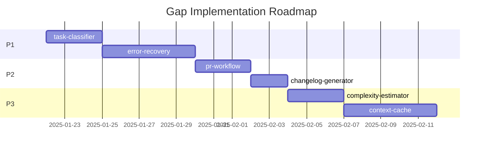

# Gap Recommendations

Detailed specifications for missing capabilities identified in workflow coverage analysis.

---

## Gap Summary by Stage

```text
Stage 1: INPUT RECEPTION (⚠️ Partial)
├── Gap: Task classification/routing
├── Gap: Priority assignment
└── Gap: Request type detection

Stage 2: CONTEXT GATHERING (✅ Covered)
└── Gap: Context caching

Stage 3: PLANNING (✅ Covered)
├── Gap: Complexity estimation
└── Gap: Effort prediction

Stage 4: EXECUTION (✅ Covered)
├── Gap: Error recovery
├── Gap: Rollback mechanism
└── Gap: Retry logic

Stage 5: VERIFICATION (✅ Strongest)
└── Gap: Performance verification

Stage 6: OUTPUT DELIVERY (⚠️ Partial)
├── Gap: PR workflow
├── Gap: Changelog generation
└── Gap: Release notes
```

---

## Priority Matrix

| Gap                      | Impact | Effort | Priority |
| ------------------------ | ------ | ------ | -------- |
| Task classification      | High   | Medium | P1       |
| Error recovery           | High   | High   | P1       |
| PR workflow              | Medium | Medium | P2       |
| Changelog generation     | Medium | Low    | P2       |
| Complexity estimation    | Medium | Medium | P3       |
| Context caching          | Low    | High   | P3       |
| Performance verification | Low    | High   | P4       |

---

## P1: High Priority Gaps

### Gap: Task Classification & Routing

**Stage:** Input Reception

**Current State:** Tasks are manually classified by the orchestrator based on pattern matching.

**Problem:** No systematic way to:

- Categorize incoming requests
- Route to appropriate workflow
- Assign default priority
- Detect task type (bug, feature, refactor, research)

**Proposed Solution:** `task-classifier` skill

```yaml
name: task-classifier
description: Classify incoming tasks by type, complexity, and route to appropriate workflow
triggers:
  - New task received
  - User request ambiguous
  - Workflow selection needed
```

**Specification:**

```text
INPUT: Raw user request

CLASSIFICATION DIMENSIONS:
1. Type: bug | feature | refactor | research | documentation | configuration
2. Complexity: simple | moderate | complex
3. Scope: single-file | multi-file | cross-module | system-wide
4. Domain: code | infrastructure | documentation | testing

OUTPUT:
- Recommended workflow (simple, full, investigation)
- Suggested assets to load
- Estimated delegation needs
- Risk assessment
```

**Example Behavior:**



---

### Gap: Error Recovery & Rollback

**Stage:** Execution

**Current State:** When sub-agents fail, the orchestrator must manually handle recovery.

**Problem:** No systematic way to:

- Detect failed operations
- Rollback partial changes
- Retry with different approach
- Escalate appropriately

**Proposed Solution:** `error-recovery` skill + enhancements to `subagent-contract`

```yaml
name: error-recovery
description: Handle execution failures with structured recovery strategies
triggers:
  - Agent returns BLOCKED
  - Tool execution fails
  - Verification reveals errors
```

**Specification:**

```text
RECOVERY STRATEGIES:
1. Retry (transient failures)
   - Max retries: 3
   - Backoff: exponential
   - Conditions: network, timeout, rate-limit

2. Rollback (partial completion)
   - Track changes made
   - Reverse in LIFO order
   - Verify rollback success

3. Alternative (different approach)
   - Identify alternative agents
   - Try different decomposition
   - Escalate if no alternatives

4. Escalate (unrecoverable)
   - Document what was tried
   - Explain blocker clearly
   - Request user guidance
```

**Example Behavior:**



---

## P2: Medium Priority Gaps

### Gap: PR Workflow

**Stage:** Output Delivery

**Current State:** git-commit-helper assists with commits, but PR creation is manual.

**Problem:** No systematic way to:

- Create pull requests from commits
- Generate PR descriptions
- Link to related issues
- Request reviewers

**Proposed Solution:** `pr-workflow` skill

```yaml
name: pr-workflow
description: Create and manage pull requests with proper descriptions and linking
triggers:
  - Task completion with commits
  - User requests PR creation
  - Branch ready for review
```

**Specification:**

```text
PR CREATION FLOW:
1. Analyze commits on branch
2. Generate description from commit messages
3. Link related issues (if mentioned)
4. Suggest reviewers (if configured)
5. Create PR via gh CLI
6. Report PR URL

DESCRIPTION TEMPLATE:
## Summary
[Auto-generated from commits]

## Changes
[List of modified files with brief descriptions]

## Testing
[Inferred from test file changes]

## Related Issues
[Extracted from commit messages]
```

**Example Behavior:**



---

### Gap: Changelog Generation

**Stage:** Output Delivery

**Current State:** No automated changelog from commits.

**Problem:** No systematic way to:

- Generate changelog entries
- Categorize by type (feat, fix, etc.)
- Link to commits/PRs
- Format for various audiences

**Proposed Solution:** `changelog-generator` command

```yaml
name: changelog-generator
description: Generate changelog entries from conventional commits
triggers:
  - User invokes /changelog
  - Release preparation
```

**Specification:**

```text
INPUT: Git commit range (default: since last tag)

PROCESS:
1. Parse conventional commit messages
2. Categorize by type (feat, fix, docs, etc.)
3. Extract scope and description
4. Link to commit SHAs
5. Format as markdown

OUTPUT:
## [Version] - YYYY-MM-DD

### Added
- feat(scope): description (#commit)

### Fixed
- fix(scope): description (#commit)

### Changed
- refactor(scope): description (#commit)
```

---

## P3: Lower Priority Gaps

### Gap: Complexity Estimation

**Stage:** Planning

**Current State:** Complexity is assessed manually during planning.

**Problem:** No systematic way to:

- Estimate task complexity
- Predict effort required
- Identify risk factors
- Compare approaches

**Proposed Solution:** `complexity-estimator` skill

```yaml
name: complexity-estimator
description: Estimate task complexity based on codebase analysis
triggers:
  - Planning phase
  - Multiple approaches possible
  - Effort assessment needed
```

**Specification:**

```text
COMPLEXITY FACTORS:
1. Files affected (count, coupling)
2. Lines of code (estimated changes)
3. Dependencies (internal, external)
4. Test coverage requirements
5. Documentation needs
6. Risk of regression

OUTPUT:
- Complexity score: 1-10
- Confidence: high/medium/low
- Key risk factors
- Recommended approach
```

---

### Gap: Context Caching

**Stage:** Context Gathering

**Current State:** Context is re-gathered each session.

**Problem:** No systematic way to:

- Cache frequently-used context
- Persist across sessions
- Invalidate on changes
- Share between agents

**Proposed Solution:** `context-cache` hook + storage

```yaml
name: context-cache
description: Cache and restore frequently-accessed context
triggers:
  - Session start (restore)
  - Context gathered (store)
  - Files changed (invalidate)
```

**Specification:**

```text
CACHE STRUCTURE:
.claude/cache/
├── context/
│   ├── [hash].json  # Cached context
│   └── index.json   # Cache metadata

OPERATIONS:
- store(key, context, ttl)
- retrieve(key) → context | null
- invalidate(pattern)
- cleanup(max_age)

INVALIDATION TRIGGERS:
- File modified that context references
- TTL expired
- Manual invalidation
```

---

## P4: Future Considerations

### Gap: Performance Verification

**Stage:** Verification

**Current State:** No automated performance testing.

**Problem:** Changes may degrade performance without detection.

**Proposed Solution:** Performance benchmarking integration (future)

```text
CONCEPT:
- Define performance baselines
- Run benchmarks after changes
- Compare to baselines
- Flag regressions

SCOPE: Out of scope for current plugin
```

---

## Implementation Roadmap



---

## Verification Checklist

When implementing gaps:

- [ ] Asset follows repository conventions
- [ ] Integrates with existing workflow stages
- [ ] Has clear triggers and outputs
- [ ] Includes tests/validation
- [ ] Documentation updated
- [ ] Workflow diagrams updated

---

## Navigation

- **Previous:** [RAG Retrieval Pattern](./rag-retrieval-pattern.md)
- **Back to:** [Index](./README.md)
