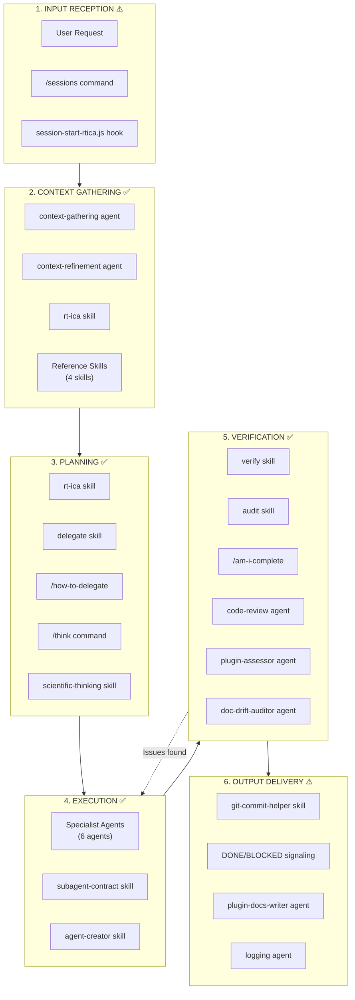
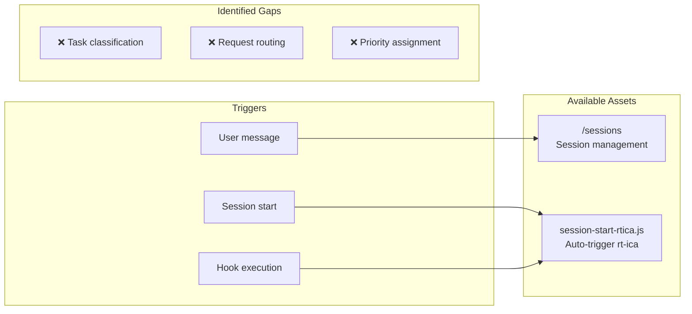
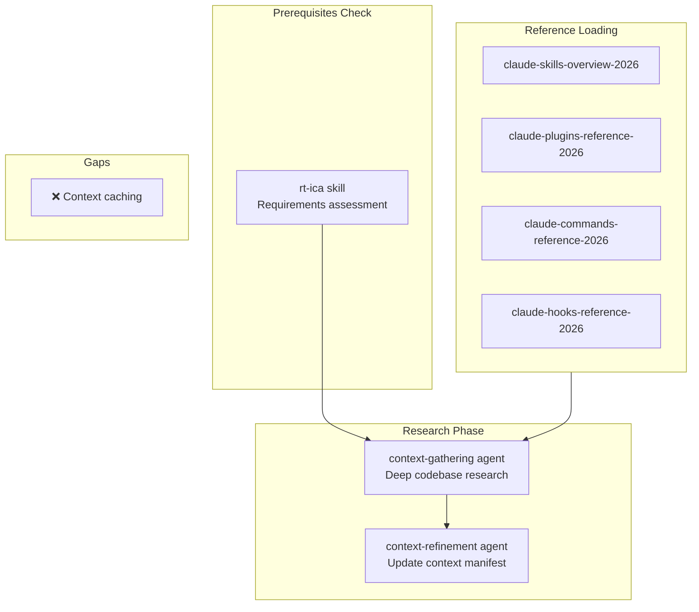
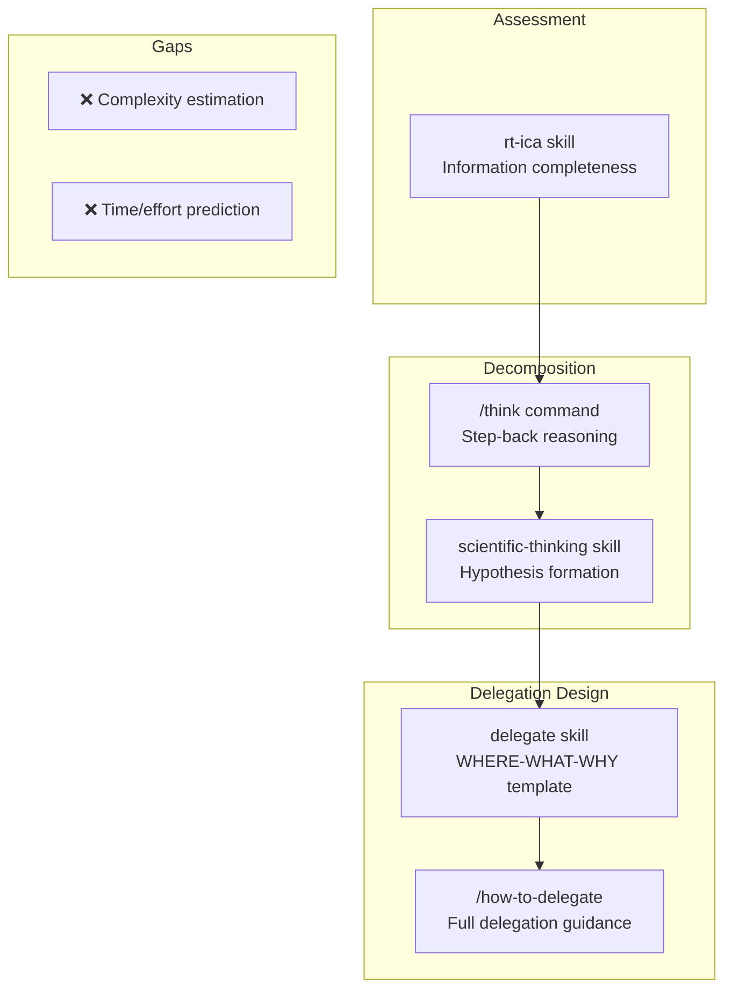
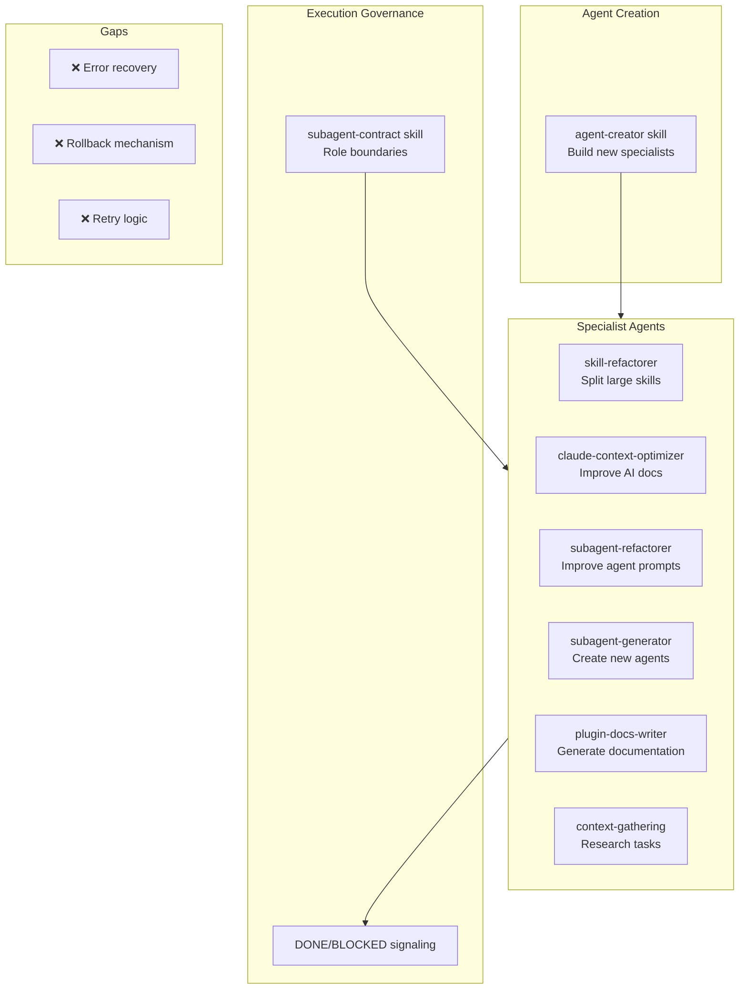
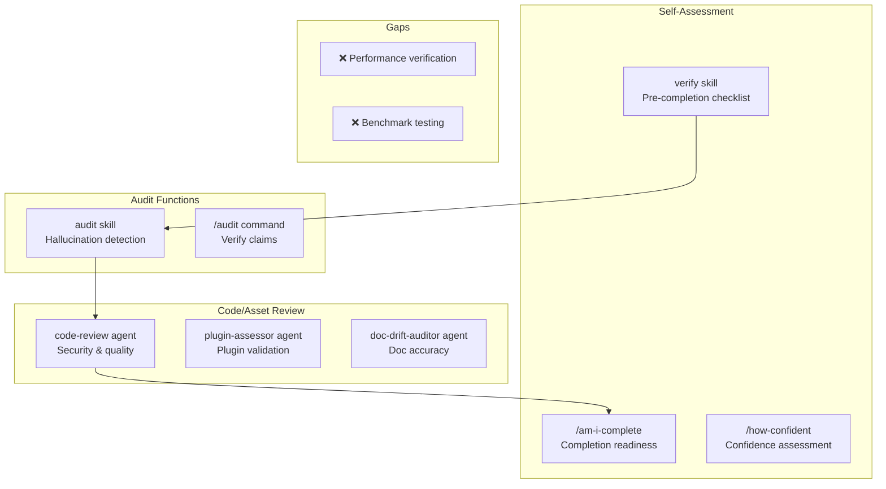
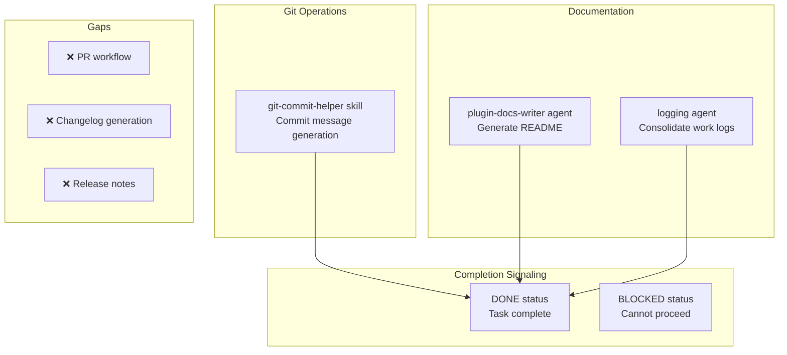

# Master Workflow Overview

Complete visualization of the 6-stage agentic workflow with all repository assets mapped.

---

## High-Level Flow



---

## Detailed Stage Breakdown

### Stage 1: Input Reception ⚠️ PARTIAL



**Coverage Details:**

| Asset                  | Type    | Function                            |
| ---------------------- | ------- | ----------------------------------- |
| /sessions              | Command | Manage session state, trigger modes |
| session-start-rtica.js | Hook    | Auto-load rt-ica on session start   |

**Gap Analysis:** No automated classification of incoming requests. Manual determination required for task type, complexity, and routing.

---

### Stage 2: Context Gathering ✅ COVERED



**Coverage Details:**

| Asset                          | Type  | Function                                        |
| ------------------------------ | ----- | ----------------------------------------------- |
| context-gathering              | Agent | Research without polluting orchestrator context |
| context-refinement             | Agent | Update task context manifest with discoveries   |
| rt-ica                         | Skill | Verify prerequisites before planning            |
| claude-skills-overview-2026    | Skill | Reference for skills system                     |
| claude-plugins-reference-2026  | Skill | Reference for plugins system                    |
| claude-commands-reference-2026 | Skill | Reference for commands system                   |
| claude-hooks-reference-2026    | Skill | Reference for hooks system                      |

**Gap Analysis:** No persistent caching of gathered context across sessions.

---

### Stage 3: Planning ✅ COVERED



**Coverage Details:**

| Asset                | Type    | Function                                    |
| -------------------- | ------- | ------------------------------------------- |
| rt-ica               | Skill   | Block planning until prerequisites verified |
| delegate             | Skill   | Quick WHERE-WHAT-WHY template               |
| /how-to-delegate     | Command | Comprehensive delegation framework          |
| /think               | Command | Step-back broader perspective               |
| scientific-thinking  | Skill   | Hypothesis-driven approach                  |
| /step-back           | Command | Wider view of task implications             |
| /scientific-thinking | Command | Activate scientific method                  |

**Gap Analysis:** No automated complexity scoring or effort estimation.

---

### Stage 4: Execution ✅ COVERED



**Coverage Details:**

| Asset                    | Type  | Function                                 |
| ------------------------ | ----- | ---------------------------------------- |
| skill-refactorer         | Agent | Refactor large skills into focused units |
| claude-context-optimizer | Agent | Optimize AI-facing documentation         |
| subagent-refactorer      | Agent | Improve agent prompt quality             |
| subagent-generator       | Agent | Create new agent definitions             |
| plugin-docs-writer       | Agent | Generate plugin documentation            |
| context-gathering        | Agent | Execute research tasks                   |
| subagent-contract        | Skill | Enforce role boundaries and signaling    |
| agent-creator            | Skill | Create agents with proper format         |

**Gap Analysis:** No automated error recovery, rollback, or retry mechanisms.

---

### Stage 5: Verification ✅ STRONGEST



**Coverage Details:**

| Asset             | Type    | Function                              |
| ----------------- | ------- | ------------------------------------- |
| verify            | Skill   | Rigorous self-assessment checklist    |
| audit             | Skill   | Detect hallucinations and assumptions |
| /am-i-complete    | Command | Check completion readiness            |
| /verify           | Command | Execute verification checklist        |
| /audit            | Command | Trigger hallucination audit           |
| /how-confident    | Command | Self-assess confidence level          |
| code-review       | Agent   | Security, bugs, code quality          |
| plugin-assessor   | Agent   | Plugin structure validation           |
| doc-drift-auditor | Agent   | Documentation accuracy                |

**Gap Analysis:** No performance benchmarking or automated performance verification.

---

### Stage 6: Output Delivery ⚠️ PARTIAL



**Coverage Details:**

| Asset                            | Type  | Function                             |
| -------------------------------- | ----- | ------------------------------------ |
| git-commit-helper                | Skill | Generate descriptive commit messages |
| subagent-contract (DONE/BLOCKED) | Skill | Signal completion status             |
| plugin-docs-writer               | Agent | Generate plugin documentation        |
| logging                          | Agent | Consolidate work logs                |

**Gap Analysis:** No PR creation workflow, no automated changelog, no release note generation.

---

## Complete Asset-to-Stage Mapping

```text
┌─────────────────────┬───────┬─────────┬──────────┬───────────┬──────────────┬────────┐
│ Asset               │ Input │ Context │ Planning │ Execution │ Verification │ Output │
├─────────────────────┼───────┼─────────┼──────────┼───────────┼──────────────┼────────┤
│ SKILLS              │       │         │          │           │              │        │
│ rt-ica              │       │    ●    │    ●     │           │              │        │
│ delegate            │       │         │    ●     │           │              │        │
│ verify              │       │         │          │           │      ●       │        │
│ audit               │       │         │          │           │      ●       │        │
│ scientific-thinking │       │         │    ●     │     ●     │              │        │
│ agent-creator       │       │         │          │     ●     │              │        │
│ subagent-contract   │       │         │          │     ●     │              │   ●    │
│ git-commit-helper   │       │         │          │           │              │   ●    │
│ *-reference-2026 x4 │       │    ●    │          │           │              │        │
├─────────────────────┼───────┼─────────┼──────────┼───────────┼──────────────┼────────┤
│ AGENTS              │       │         │          │           │              │        │
│ context-gathering   │       │    ●    │          │     ●     │              │        │
│ context-refinement  │       │    ●    │          │           │              │        │
│ code-review         │       │         │          │           │      ●       │        │
│ plugin-assessor     │       │         │          │           │      ●       │        │
│ plugin-docs-writer  │       │         │          │     ●     │              │   ●    │
│ skill-refactorer    │       │         │          │     ●     │              │        │
│ doc-drift-auditor   │       │         │          │           │      ●       │        │
│ context-optimizer   │       │         │          │     ●     │              │        │
│ subagent-refactorer │       │         │          │     ●     │              │        │
│ subagent-generator  │       │         │          │     ●     │              │        │
│ logging             │       │         │          │           │              │   ●    │
├─────────────────────┼───────┼─────────┼──────────┼───────────┼──────────────┼────────┤
│ COMMANDS            │       │         │          │           │              │        │
│ /sessions           │   ●   │         │          │           │              │        │
│ /am-i-complete      │       │         │          │           │      ●       │        │
│ /verify             │       │         │          │           │      ●       │        │
│ /audit              │       │         │          │           │      ●       │        │
│ /how-to-delegate    │       │         │    ●     │           │              │        │
│ /think              │       │         │    ●     │           │              │        │
│ /step-back          │       │         │    ●     │           │              │        │
│ /how-confident      │       │         │          │           │      ●       │        │
│ /rt-ica             │       │    ●    │    ●     │           │              │        │
│ /delegate           │       │         │    ●     │           │              │        │
│ /scientific-thinking│       │         │    ●     │           │              │        │
├─────────────────────┼───────┼─────────┼──────────┼───────────┼──────────────┼────────┤
│ HOOKS               │       │         │          │           │              │        │
│ session-start-rtica │   ●   │         │          │           │              │        │
├─────────────────────┼───────┼─────────┼──────────┼───────────┼──────────────┼────────┤
│ COVERAGE SCORE      │  2/3  │   7/3   │   8/3    │    8/3    │     9/3      │  4/3   │
│ STATUS              │  ⚠️   │   ✅    │    ✅    │    ✅     │     ✅       │  ⚠️   │
└─────────────────────┴───────┴─────────┴──────────┴───────────┴──────────────┴────────┘

Legend: ● = Asset covers this stage
Coverage threshold: ≥3 assets = ✅ COVERED, 1-2 assets = ⚠️ PARTIAL, 0 = ❌ GAP
```

---

## Navigation

- **Next:** [Asset Decision Tree](./asset-decision-tree.md) - How to choose the right asset type
- **Back to:** [Index](./README.md)
