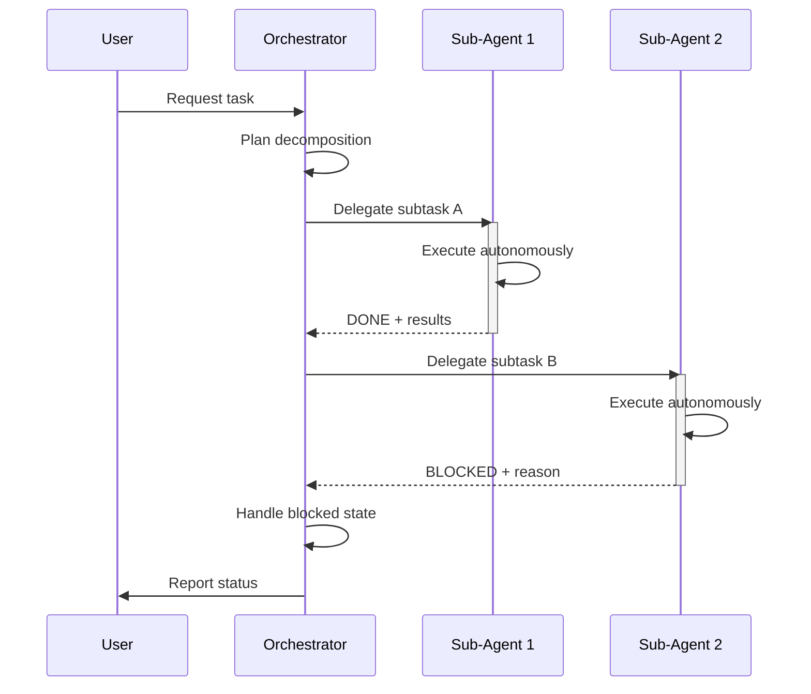
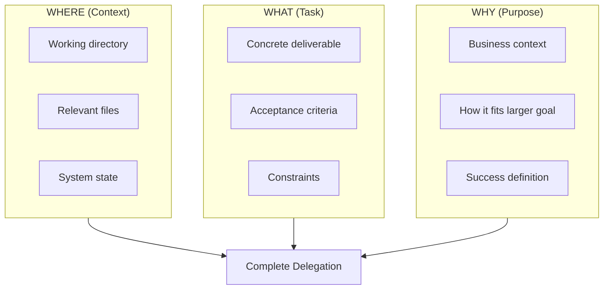
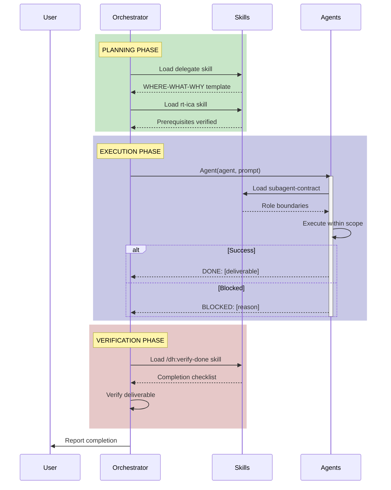
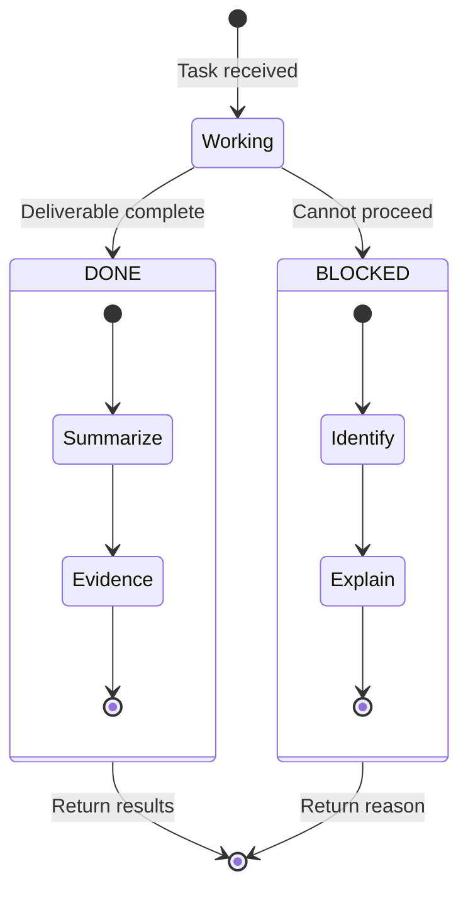
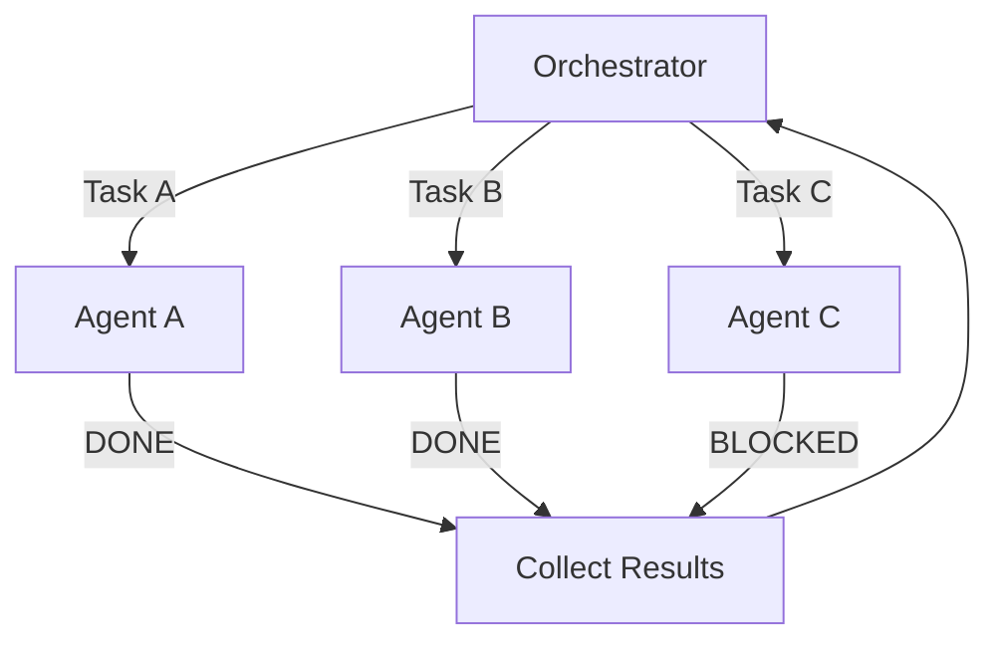
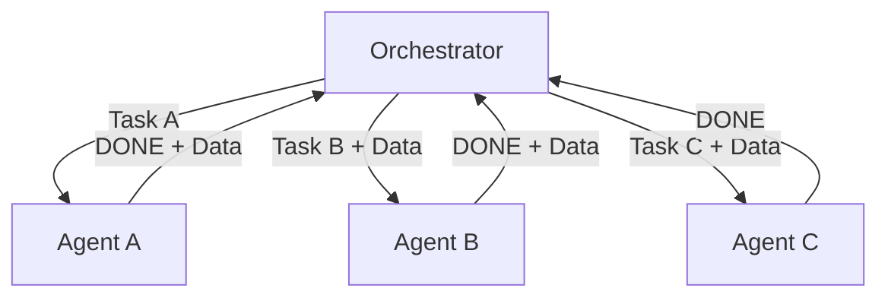
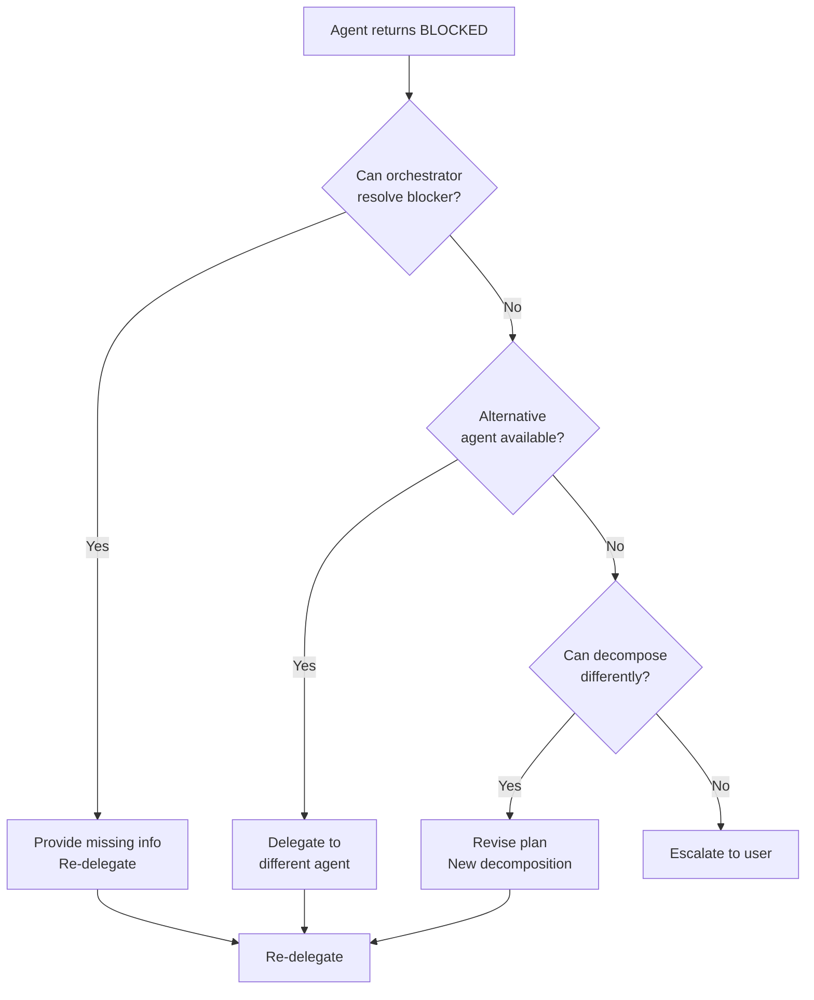
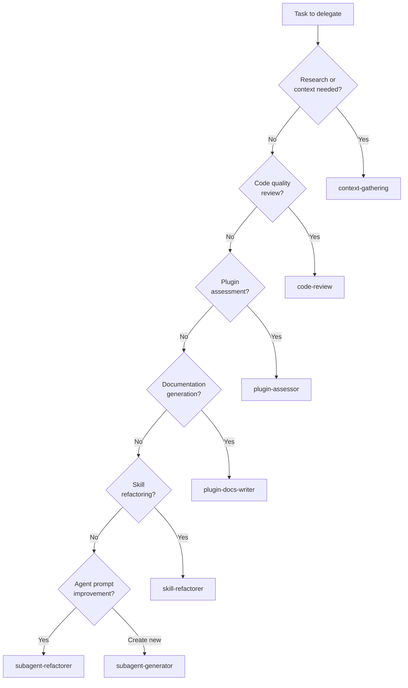
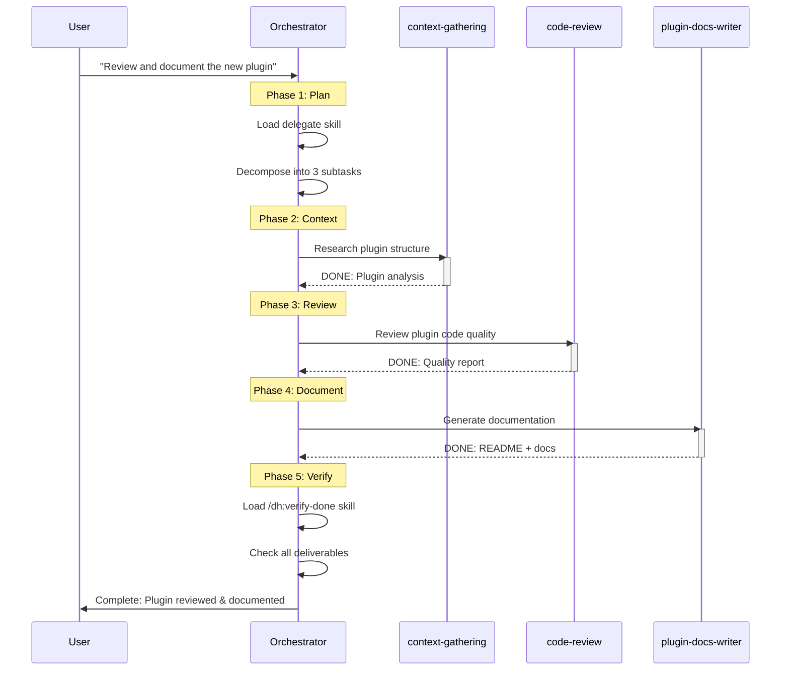
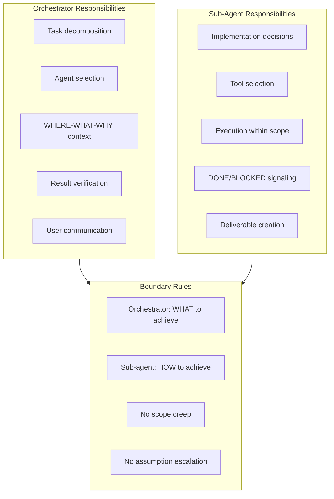

# Multi-Agent Orchestration Sequence

Delegation flow with DONE/BLOCKED signaling between orchestrator and specialist agents.

---

## Overview



---

## Delegation Framework (WHERE-WHAT-WHY)

The `delegate` skill provides the core delegation template:



**Key Principle:** Provide WHERE, WHAT, and WHY - never dictate HOW. The sub-agent determines implementation.

---

## Full Orchestration Sequence



---

## DONE/BLOCKED Signaling Protocol

From `subagent-contract` skill:



### DONE Signal Format

```text
DONE:
- Summary: [What was accomplished]
- Deliverable: [Concrete output reference]
- Evidence: [Verification of completion]
```

### BLOCKED Signal Format

```text
BLOCKED:
- Blocker: [What prevents completion]
- Attempted: [What was tried]
- Needed: [What would unblock]
```

---

## Parallel vs Sequential Delegation

### Parallel Delegation



**Use When:**

- Tasks are independent
- No data dependencies between tasks
- Context windows won't interfere

### Sequential Delegation



**Use When:**

- Later tasks depend on earlier results
- Need to pass data between agents
- Must verify intermediate results

---

## Handling BLOCKED Agents



---

## Agent Selection Guide



---

## Complete Orchestration Example



---

## Role Boundaries (subagent-contract)



**Key Boundaries:**

| Orchestrator Does        | Sub-Agent Does                    |
| ------------------------ | --------------------------------- |
| Defines task scope       | Implements within scope           |
| Provides context         | Uses context appropriately        |
| Sets acceptance criteria | Meets criteria or signals BLOCKED |
| Handles blocked states   | Explains blockers clearly         |
| Verifies completion      | Provides evidence                 |

---

## Anti-Patterns

| Pattern            | Problem                       | Correct Approach                   |
| ------------------ | ----------------------------- | ---------------------------------- |
| Micro-managing HOW | Removes agent autonomy        | Specify WHAT, let agent decide HOW |
| Ignoring BLOCKED   | Leaves task incomplete        | Handle or escalate blocked states  |
| No verification    | May accept bad results        | Always verify deliverables         |
| Vague delegation   | Agent can't determine success | Include clear acceptance criteria  |
| Context overload   | Wastes context window         | Provide minimal sufficient context |

---

## Navigation

- **Previous:** [Asset Decision Tree](./asset-decision-tree.md)
- **Next:** [Simple Task Workflow](./simple-task-workflow.md)
- **Back to:** [Index](./README.md)
