# RAG Retrieval Pattern

Context augmentation flow using skills, agents, and reference materials for knowledge retrieval.

---

## Overview

RAG (Retrieval-Augmented Generation) enhances responses by retrieving relevant context before generating. This pattern maps to repository assets.

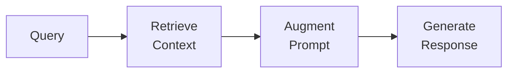

---

## RAG Components in Repository

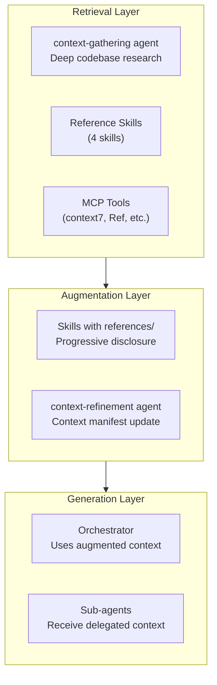

---

## Reference Skills as Knowledge Base

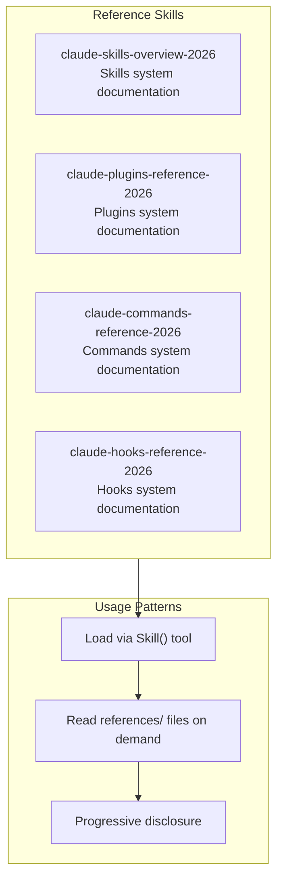

**Progressive Disclosure:**

```text
1. Load SKILL.md (core knowledge)
2. Follow links to references/ files (detailed knowledge)
3. Load only what's needed (context efficiency)
```

---

## Context-Gathering Agent Pattern

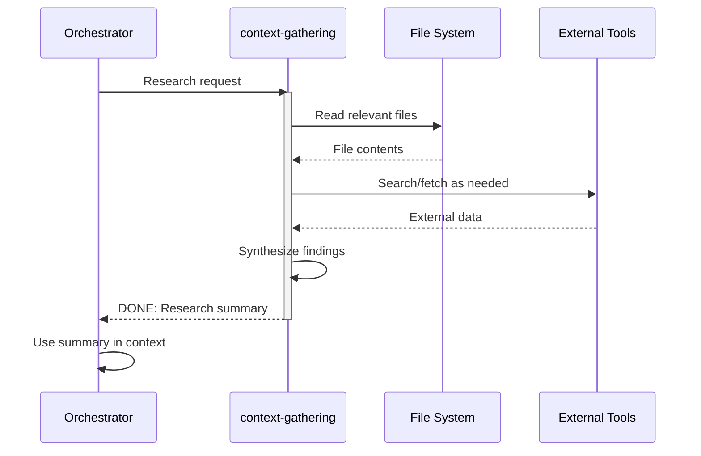

**Why Use context-gathering:**

- Runs in separate context window
- Won't pollute orchestrator's context
- Can read extensively without token pressure
- Returns synthesized summary

---

## Retrieval Flow Detail

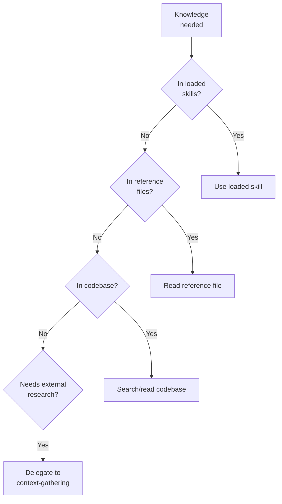

---

## MCP Tools for External Retrieval

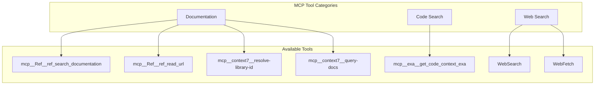

**Tool Selection:**

| Need                  | Tool                               |
| --------------------- | ---------------------------------- |
| Library documentation | context7 (resolve → query)         |
| Framework docs        | mcp**Ref**ref_search_documentation |
| Read specific URL     | mcp**Ref**ref_read_url             |
| Code examples         | mcp**exa**get_code_context_exa     |
| Current events/news   | WebSearch                          |
| Read web page         | WebFetch                           |

---

## Complete RAG Sequence

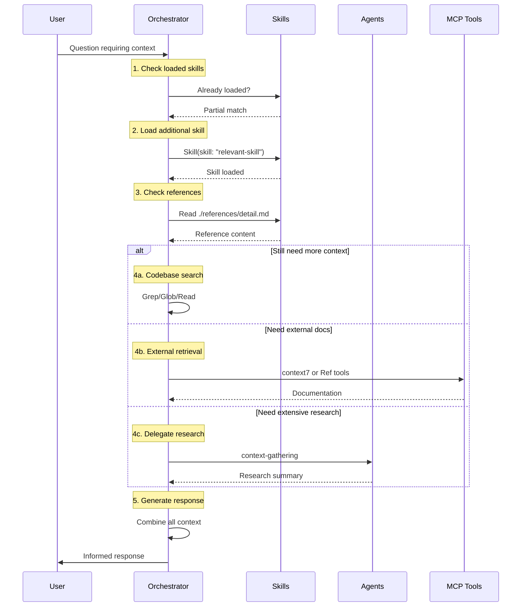

---

## Context Manifest Pattern

The `context-refinement` agent maintains a context manifest in task files:

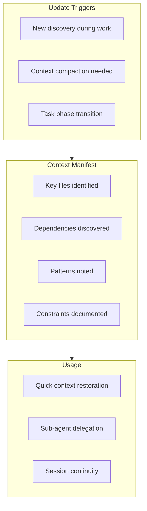

---

## Retrieval Efficiency Strategies

### 1. Progressive Loading

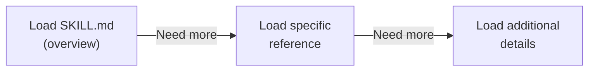

**Don't:** Load all references upfront
**Do:** Load only what's needed for current question

### 2. Context Window Management

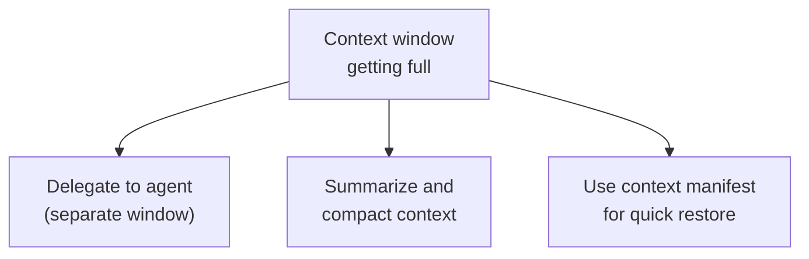

### 3. Caching Pattern (Gap)

```text
Currently: No context caching
Future: Could cache frequently-accessed context
```

---

## Asset-to-RAG Mapping

| RAG Stage               | Assets                                         |
| ----------------------- | ---------------------------------------------- |
| **Query Understanding** | rt-ica (clarify requirements)                  |
| **Retrieval**           | context-gathering, reference skills, MCP tools |
| **Augmentation**        | context-refinement, skill loading              |
| **Generation**          | Orchestrator with augmented context            |

---

## Example: Library Documentation Lookup

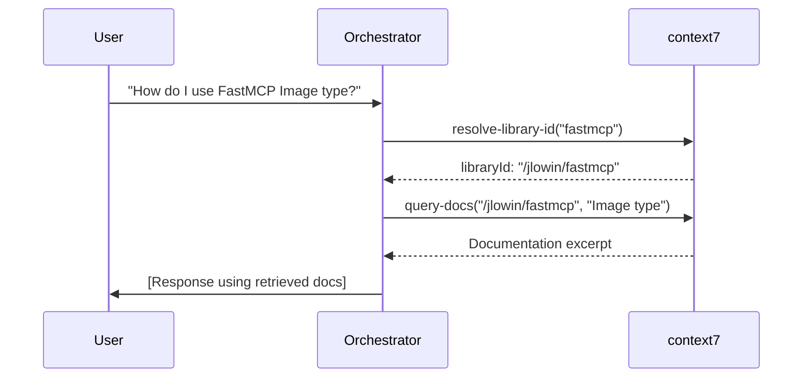

---

## Example: Codebase Pattern Research

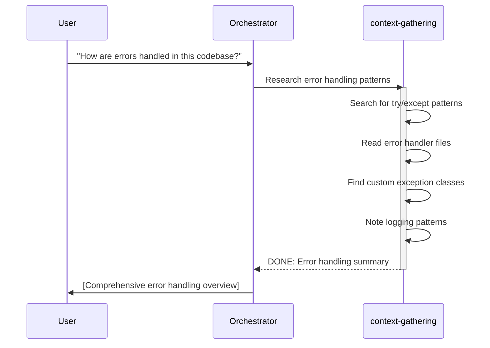

---

## Gaps in Current RAG Implementation

| Gap                  | Impact                        | Recommendation                                      |
| -------------------- | ----------------------------- | --------------------------------------------------- |
| No context caching   | Repeated lookups              | See [gap-recommendations](./gap-recommendations.md) |
| No semantic search   | Keyword-only matching         | Consider embedding-based search                     |
| No retrieval ranking | May get less relevant results | Add relevance scoring                               |

---

## Navigation

- **Previous:** [Investigation Workflow](../../../plugins/scientific-method/shared/investigation-workflow.md)
- **Next:** [Gap Recommendations](./gap-recommendations.md)
- **Back to:** [Index](./README.md)
