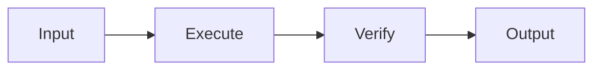
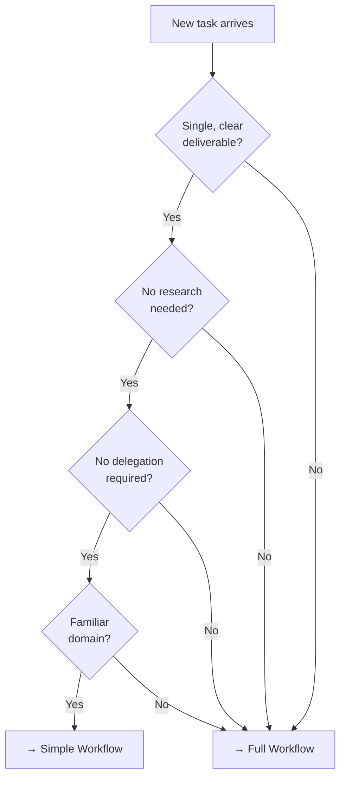
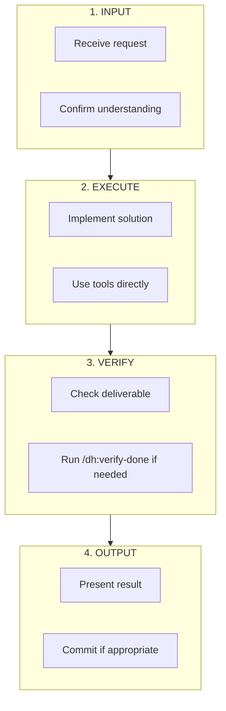
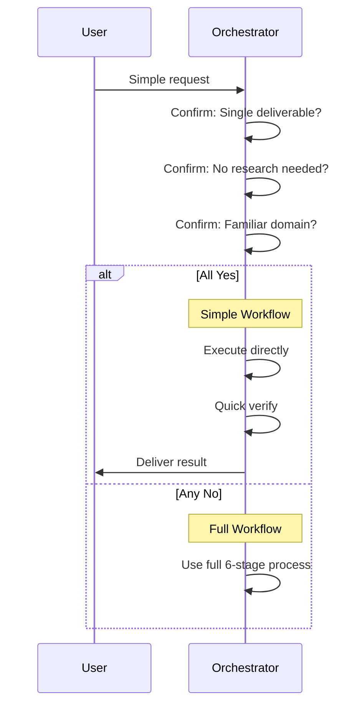
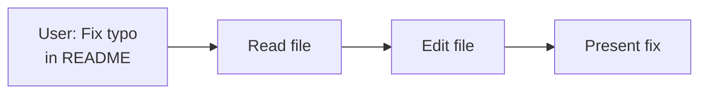
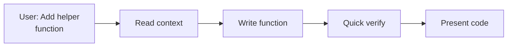
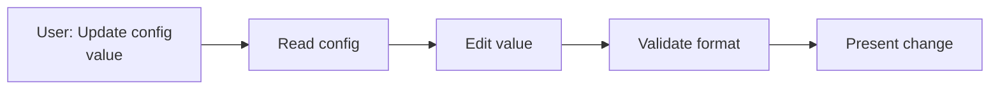
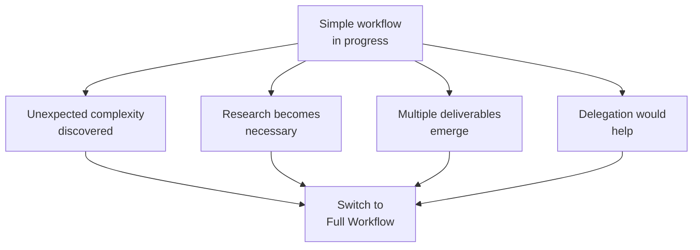
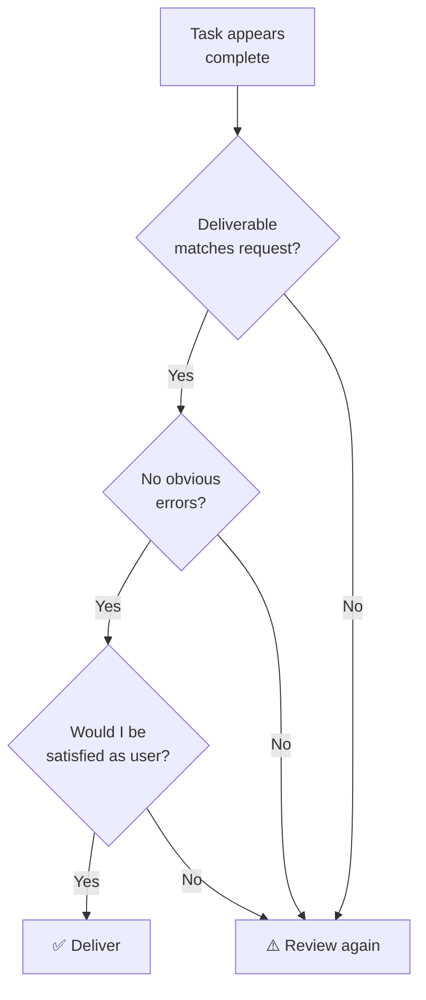

# Simple Task Workflow

Minimal path for straightforward tasks that don't require full orchestration complexity.

---

## Overview

Not every task requires the full 6-stage workflow. Simple tasks can follow a streamlined path while still maintaining quality.



---

## When to Use Simple Workflow



**Simple Task Criteria:**

- Single, well-defined deliverable
- No context gathering needed
- No sub-agent delegation
- Familiar technology/patterns
- Clear acceptance criteria

---

## Simple Task Flow



---

## Detailed Sequence



---

## Assets Used in Simple Workflow

| Stage   | Required         | Optional                                 |
| ------- | ---------------- | ---------------------------------------- |
| Input   | -                | /sessions (if session management needed) |
| Execute | Direct tool use  | -                                        |
| Verify  | Quick self-check | /dh:verify-done, /am-i-complete                  |
| Output  | Present result   | git-commit-helper                        |

**Minimal Asset Path:**

```text
Input → [Direct Execution] → Quick Check → Output
```

**Enhanced Asset Path:**

```text
Input → [Direct Execution] → /dh:verify-done → git-commit-helper → Output
```

---

## Example Simple Tasks

### Example 1: Fix Typo



**No extra assets needed.** Direct execution is sufficient.

### Example 2: Add Function



**Optional:** Use `/dh:verify-done` before presenting if function is non-trivial.

### Example 3: Update Config



**No extra assets needed.** Format validation is direct.

---

## Escalation Triggers

Switch to full workflow if:



**Escalation Indicators:**

- "I need to research this first"
- "This requires multiple steps"
- "An agent would handle this better"
- "I'm uncertain about the approach"

---

## Quality Gates for Simple Tasks

Even simple tasks need minimal verification:



---

## Simple vs Full Workflow Comparison

| Aspect            | Simple Workflow                    | Full Workflow        |
| ----------------- | ---------------------------------- | -------------------- |
| Stages            | 4 (Input, Execute, Verify, Output) | 6 (all stages)       |
| Context Gathering | None                               | Dedicated phase      |
| Planning          | Implicit                           | Explicit with skills |
| Delegation        | None                               | Available            |
| Verification      | Quick check                        | Full verify skill    |
| Assets Used       | 0-2                                | Multiple             |
| Typical Duration  | Short                              | Varies               |

---

## Decision Matrix

| Task Type           | Workflow | Reason                          |
| ------------------- | -------- | ------------------------------- |
| Fix typo            | Simple   | Single edit, no research        |
| Add simple function | Simple   | Clear scope, familiar pattern   |
| Refactor module     | Full     | Multiple files, needs planning  |
| Debug issue         | Full     | Investigation required          |
| New feature         | Full     | Decomposition needed            |
| Update config value | Simple   | Single change, clear target     |
| Create test suite   | Full     | Multiple files, planning needed |

---

## Common Patterns

### Pattern: Quick Edit

```text
1. Read target file
2. Make edit
3. Present change
```

### Pattern: Add Small Component

```text
1. Read existing code for context
2. Write new component
3. Quick verify syntax/patterns
4. Present result
```

### Pattern: Configuration Change

```text
1. Read current config
2. Make change
3. Validate format
4. Present updated config
```

---

## Navigation

- **Previous:** [Multi-Agent Orchestration](./multi-agent-orchestration.md)
- **Next:** [Investigation Workflow](../../../plugins/scientific-method/shared/investigation-workflow.md)
- **Back to:** [Index](./README.md)
