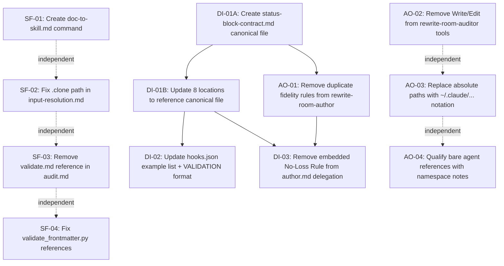

# Refactoring Design Map: The Rewrite Room

## Overview

This document specifies every change required to bring `plugins/the-rewrite-room` to a
marketplace-ready, structurally coherent state. It covers all findings from the plugin
assessment report (score 76/100), the skill lifecycle audit, and the agent lifecycle audit.

Items are grouped by type and severity. Each item names the exact source file and line,
the exact change to make, the agent to execute it, and the verification step. A dependency
map and parallelization analysis follow.

**Source artifacts:**

- `.claude/plan/the-rewrite-room/assessment-REPORT.md` — plugin assessment (76/100)
- `.claude/audits/audit-report-the-rewrite-room.md` — skill lifecycle audit (BC, IC, DD, SQ)
- `.claude/audits/agent-audit-report-the-rewrite-room.md` — agent lifecycle audit (Dim 1-8)
- `.claude/audits/recommendations.md` — prioritized skill fixes R1-R9
- `.claude/audits/agent-recommendations.md` — prioritized agent fixes AR1-AR5

**Plugin root:** `plugins/the-rewrite-room/`

---

## Source Assessment

**Issues addressed: 11 items**

| ID | Severity | Type | Source Finding | File |
|----|----------|------|----------------|------|
| SF-01 | CRITICAL | STRUCTURE_FIX | BC-03, AR3: Missing command file for `/rwr:doc-to-skill` | commands/rwr/ |
| SF-02 | CRITICAL | STRUCTURE_FIX | IC-01, AR4: Clone path contradiction `.clone` vs `.claude` | references/input-resolution.md |
| SF-03 | CRITICAL | STRUCTURE_FIX | BC-01: Missing `validate.md` referenced in audit.md:78 | workflows/audit.md |
| SF-04 | CRITICAL | STRUCTURE_FIX | BC-02: Wrong script name `validate_frontmatter.py` | workflows/optimize.md + SKILL.md |
| DI-01 | HIGH | DOC_IMPROVE | DD-01: STATUS block contract in 8 locations, VALIDATION divergence | 5 agents + 3 workflows |
| DI-02 | HIGH | DOC_IMPROVE | IC-02: Stale hook example agent list (3 of 5 named) | hooks/hooks.json |
| DI-03 | HIGH | DOC_IMPROVE | AR4, DD-03: No-Loss Rewrite Rule embedded in delegation prompt | workflows/author.md:115-127 |
| AO-01 | MEDIUM | AGENT_OPTIMIZE | DD-02, DD-03: Duplicated fidelity rules in rewrite-room-author body | agents/rewrite-room-author.md |
| AO-02 | MEDIUM | AGENT_OPTIMIZE | Dim 5: Write/Edit in rewrite-room-auditor tool list exceeds role | agents/rewrite-room-auditor.md |
| AO-03 | MEDIUM | AGENT_OPTIMIZE | assessment:44+98: Hardcoded absolute paths `/home/ubuntulinuxqa2/` | auditor.md + SKILL.md |
| AO-04 | MEDIUM | AGENT_OPTIMIZE | assessment:334: Bare agent references need namespace qualification | author.md + auditor.md |

---

## STRUCTURE_FIX Items

### SF-01: Create `commands/rwr/doc-to-skill.md`

**Source:** `skills/the-rewrite-room/SKILL.md` Command Reference table (line 26); no file at `commands/rwr/doc-to-skill.md`

**Root cause:** BC-03 / AR3. The `rewrite-room-doc-converter` agent is registered and functional but has no slash command entry point. `/rwr:doc-to-skill` is listed in the routing table but cannot be invoked.

**Exact change:**

Create `plugins/the-rewrite-room/commands/rwr/doc-to-skill.md` with content modelled on `commands/rwr/author.md` (the closest structural analog):

```markdown
---
description: "Convert user-facing documentation into an AI-readable Claude skill. Pass a GitHub URL or local path to the docs directory."
argument-hint: "<github-url or /path/to/docs> [output_skill_name]"
agent: rewrite-room-doc-converter
allowed-tools: Read, Grep, Glob, Bash, Task, Write, Edit, mcp__file-reader__read_file
---

Route this doc-to-skill conversion task to the rewrite-room-doc-converter agent.

Task: $ARGUMENTS

The agent follows the user-docs-to-ai-skill SOP — it will resolve the source path,
inventory documentation, extract content, and produce a skill directory.
```

**Agent to execute:** `plugin-creator:skill-creator`

**Verification:** `ls plugins/the-rewrite-room/commands/rwr/doc-to-skill.md` exits 0. File frontmatter passes `uv run prek run --files plugins/the-rewrite-room/commands/rwr/doc-to-skill.md`.

---

### SF-02: Fix clone path contradiction in `input-resolution.md`

**Source:** `skills/user-docs-to-ai-skill/references/input-resolution.md` lines 36, 41, 155, 158 — all use `.clone/worktrees/` in code blocks and anti-patterns section. The Mermaid diagram (line 21, 24) already uses the correct `.claude/worktrees/`. `SKILL.md` (lines 35, 37, 79-80) uses `.claude/worktrees/`.

**Root cause:** IC-01. Code block examples and anti-patterns section diverge from the Mermaid diagram and SKILL.md prose. An agent reading the code blocks will clone to `.clone/` instead of `.claude/`.

**Exact change — 4 occurrences in `input-resolution.md`:**

| Line | Current text | Replacement |
|------|-------------|-------------|
| 36 | `git clone <source> .clone/worktrees/<project-name>/` | `git clone <source> .claude/worktrees/<project-name>/` |
| 41 | `If`.clone/worktrees/<project-name>/`already exists` | `If`.claude/worktrees/<project-name>/`already exists` |
| 155 | `git clone https://github.com/astral-sh/ty /home/user/repos/.clone/worktrees/ty/` | `git clone https://github.com/astral-sh/ty /home/user/repos/.claude/worktrees/ty/` |
| 158 | `git clone https://github.com/astral-sh/ty .clone/worktrees/ty/` | `git clone https://github.com/astral-sh/ty .claude/worktrees/ty/` |

**Agent to execute:** `plugin-creator:contextual-ai-documentation-optimizer`

**Verification:** `grep -r ".clone/worktrees" plugins/the-rewrite-room/` returns zero results.

---

### SF-03: Resolve missing `validate.md` workflow reference

**Source:** `the-rewrite-room/workflows/audit.md` line 78 — Mermaid node `Validate[Chain to validate workflow\nLoad: plugins/the-rewrite-room/the-rewrite-room/workflows/validate.md]`

**Root cause:** BC-01. The file `validate.md` does not exist. The audit workflow's "chain to validate" branch silently fails at runtime.

**Decision:** Remove the chain step and inline the validation instruction. The validate.md workflow would only add a layer that forwards to the same frontmatter check already documented in optimize.md. Inlining eliminates the broken reference without losing capability.

**Exact change in `the-rewrite-room/workflows/audit.md`:**

Replace the Mermaid node at line 78:

```text
Chain -->|Yes| Validate[Chain to validate workflow\nLoad: plugins/the-rewrite-room/the-rewrite-room/workflows/validate.md]
```

With:

```text
Chain -->|Yes| Validate["Run frontmatter validation on modified files:\nuv run plugins/plugin-creator/scripts/normalize_frontmatter.py <file>"]
```

Update the prose description that follows the Mermaid (if any) to match. Do not create `validate.md`.

**Agent to execute:** `plugin-creator:contextual-ai-documentation-optimizer`

**Verification:** `grep -r "validate.md" plugins/the-rewrite-room/` returns zero results. `grep -r "workflows/validate" plugins/the-rewrite-room/` returns zero results.

---

### SF-04: Fix `validate_frontmatter.py` script name references

**Source:**

- `the-rewrite-room/workflows/optimize.md` line 95: `uv run plugins/plugin-creator/scripts/validate_frontmatter.py <modified-file>`
- `skills/the-rewrite-room/SKILL.md` line 123: `plugins/plugin-creator/scripts/validate_frontmatter.py`

**Root cause:** BC-02. The file `validate_frontmatter.py` does not exist in `plugins/plugin-creator/scripts/`. `normalize_frontmatter.py` exists in the same directory. All references must point to the file that exists.

**Exact changes:**

In `the-rewrite-room/workflows/optimize.md` line 95:

```bash
# FROM:
uv run plugins/plugin-creator/scripts/validate_frontmatter.py <modified-file>
# TO:
uv run plugins/plugin-creator/scripts/normalize_frontmatter.py <modified-file>
```

In `skills/the-rewrite-room/SKILL.md` line 123:

```text
# FROM:
- `plugins/plugin-creator/scripts/validate_frontmatter.py` — YAML frontmatter schema validation
# TO:
- `plugins/plugin-creator/scripts/normalize_frontmatter.py` — YAML frontmatter normalization
```

Also update the inline Mermaid label in `the-rewrite-room/workflows/audit.md` after SF-03 applies (if `validate_frontmatter.py` appears there post-edit, change to `normalize_frontmatter.py`).

**Agent to execute:** `plugin-creator:contextual-ai-documentation-optimizer`

**Verification:** `grep -r "validate_frontmatter" plugins/the-rewrite-room/` returns zero results.

---

## DOC_IMPROVE Items

### DI-01: Canonicalize STATUS block contract

**Source:** DD-01. STATUS block contract defined in 8 locations:
- `agents/rewrite-room-auditor.md` lines 48-55
- `agents/rewrite-room-author.md` lines 96-107
- `agents/rewrite-room-optimizer.md` (output contract section)
- `agents/rewrite-room-cite.md` lines 119-129 — divergent `VALIDATION` field
- `agents/rewrite-room-doc-converter.md` (output contract section)
- `the-rewrite-room/workflows/audit.md` lines 90-99
- `the-rewrite-room/workflows/optimize.md` lines 104-114
- `the-rewrite-room/workflows/author.md` lines 149-159

**Root cause:** Contract duplicated at authorship time, then `rewrite-room-cite` diverged its `VALIDATION` field independently.

**Two-step change:**

**Step A — Create canonical reference file:**

Create `plugins/the-rewrite-room/the-rewrite-room/references/status-block-contract.md`:

```markdown
# STATUS Block Output Contract

All rewrite-room agents and workflows produce a STATUS block as the final section of their
response. The hook at `hooks/hooks.json` validates this contract on every SubagentStop.

## Canonical Format

\`\`\`text
STATUS: DONE|BLOCKED|FAILED
SUMMARY: [1-2 sentences, factual, no speculation]
ARTIFACTS: [list of files created/modified with relative paths, or "none"]
VALIDATION: [validators run and PASS/FAIL results]
NOTES: [only if needed — omit section if nothing to add]
\`\`\`

For BLOCKED: include a `NEEDED:` list of what is missing.

## Field Rules

- `STATUS`: exactly one of DONE, BLOCKED, or FAILED — no other values
- `SUMMARY`: factual description, past tense, no hedging words
- `ARTIFACTS`: relative paths from repo root; "none" if nothing written
- `VALIDATION`: list each check run and its result — e.g. `frontmatter-valid: PASS`, `link-check: PASS`
- `NOTES`: omit entirely when empty — do not include an empty section

## Workflow-Specific VALIDATION Subfields

Workflows that run specific validators must report them explicitly:

| Workflow | Required VALIDATION subfields |
|----------|-------------------------------|
| audit.md | citation-check: PASS/FAIL, link-check: PASS/FAIL (if markdown modified) |
| optimize.md | frontmatter-valid: PASS/FAIL, token-impact: before → after |
| author.md | glfm-valid: PASS/FAIL/SKIPPED, fidelity-check: PASS/FAIL/SKIPPED |
```

**Step B — Update all 8 locations to reference the canonical file:**

Replace the embedded STATUS block definition in each agent with a single line:

```markdown
## Output Contract

See [status-block-contract.md](../the-rewrite-room/references/status-block-contract.md) for
the full STATUS block specification. Every response must include a STATUS block as defined there.
```

For workflow files, replace embedded output contract with:

```markdown
## Output Contract

Follow the canonical STATUS block format defined in
[references/status-block-contract.md](../references/status-block-contract.md).

[workflow-specific VALIDATION subfields remain inline here — they are workflow additions,
not redefinitions of the base contract]
```

Fix `rewrite-room-cite.md` `VALIDATION` field from `[source count, citation count, direct quotes count]` to `[validators run and PASS/FAIL results]` — matching the canonical definition.

**Note:** `hooks.json` cannot reference an external file (it is a self-contained JSON prompt). After Step A creates the canonical file, update the hooks.json prompt text to match the canonical definition exactly. The hooks.json update is part of DI-02 (which must run after DI-01 Step A).

**Agent to execute:** `plugin-creator:contextual-ai-documentation-optimizer` for Step A (create reference file). `plugin-creator:subagent-refactorer` for Step B (update all agent bodies to point to canonical file and fix cite divergence).

**Verification:**

- `grep -l "VALIDATION:" plugins/the-rewrite-room/agents/` — inspect that only `rewrite-room-cite.md` is changed
- `grep "source count" plugins/the-rewrite-room/agents/rewrite-room-cite.md` — returns zero results
- `ls plugins/the-rewrite-room/the-rewrite-room/references/status-block-contract.md` — exits 0

---

### DI-02: Update hooks.json example agent list

**Source:** `hooks/hooks.json` prompt text line 9 — lists only `(rewrite-room-auditor, rewrite-room-optimizer, rewrite-room-author)`. Missing: `rewrite-room-cite`, `rewrite-room-doc-converter`.

**Root cause:** IC-02. Hook was written before two agents were added. The prefix filter `rewrite-room-` correctly catches all 5 at runtime, but the example list misleads readers.

**Exact change in `hooks/hooks.json`:**

Replace in the prompt string:

```text
# FROM:
Look for agent names containing 'rewrite-room-' (rewrite-room-auditor, rewrite-room-optimizer, rewrite-room-author).
# TO:
Look for agent names containing 'rewrite-room-' (rewrite-room-auditor, rewrite-room-optimizer, rewrite-room-author, rewrite-room-cite, rewrite-room-doc-converter).
```

**Dependency:** Must run after DI-01 completes so the canonical VALIDATION format is settled before the hook prompt is edited. Also update the VALIDATION field format in the hook prompt to match the canonical definition from DI-01.

**Agent to execute:** `plugin-creator:contextual-ai-documentation-optimizer`

**Verification:** `grep "rewrite-room-cite" plugins/the-rewrite-room/hooks/hooks.json` returns a match. `grep "rewrite-room-doc-converter" plugins/the-rewrite-room/hooks/hooks.json` returns a match.

---

### DI-03: Remove embedded No-Loss Rewrite Rule from delegation prompt

**Source:** `the-rewrite-room/workflows/author.md` lines 115-127 — the `documentation-expert` delegation prompt template embeds the full No-Loss Rewrite Rule verbatim.

**Root cause:** AR4, DD-03. The rule is defined in `rewrite-room-author` agent body (to be moved to canonical reference per AO-01). Embedding it in the delegation prompt creates a second definition that will drift when the canonical source is updated.

**Dependency:** Must run after DI-01 creates `status-block-contract.md` and after AO-01 moves the No-Loss Rewrite Rule to the canonical reference. The delegation prompt should reference the canonical file, not re-embed the rule.

**Exact change in `the-rewrite-room/workflows/author.md`:**

Replace lines 115-127 (the No-Loss block inside the documentation-expert prompt template):

```text
# FROM (embedded rule block):
Content preservation rules — no-loss rewrite:
- PRESERVE: usage examples and command invocations with flags
- PRESERVE: before/after behavioral examples
- PRESERVE: prerequisites and requirements sections
- PRESERVE: component/feature tables (restructure or move to docs/ with link if too dense)
- PRESERVE: badges
- PRESERVE: workflow descriptions
- ACCEPTABLE: rewrite prose for clarity, restructure sections, move dense reference content to docs/ files with links from README
- NOT ACCEPTABLE: removing any of the above content categories. Length reduction is not a quality signal when content is lost."

# TO (reference only):
Apply the No-Loss Rewrite Rule defined in
plugins/the-rewrite-room/the-rewrite-room/references/status-block-contract.md
(No-Loss Rewrite section)."
```

**Agent to execute:** `plugin-creator:subagent-refactorer`

**Verification:** `grep "PRESERVE:" plugins/the-rewrite-room/the-rewrite-room/workflows/author.md` returns zero results. Rule definition exists only in the canonical reference file.

---

## AGENT_OPTIMIZE Items

### AO-01: Remove duplicated fidelity rules from `rewrite-room-author` body

**Source:** `agents/rewrite-room-author.md`

- Lines 69-83: "No-Loss Rewrite Rule" section
- Lines 84-94: "Summarization Fidelity Rules" section

**Root cause:** DD-02, DD-03. The `the-rewrite-room/workflows/author.md` already instructs loading the source reference files (`fidelity-rules.md`) before spawning. The agent body pre-duplicates those rules. Both sections will diverge from their sources over time.

**Exact change in `agents/rewrite-room-author.md`:**

Remove lines 69-94 entirely (both the No-Loss Rewrite Rule and Summarization Fidelity Rules sections).

Replace with a single pointer:

```markdown
## Content Rules — Read Before Delegating

Load the workflow before any task — it instructs reading the authoritative rule files:

- No-Loss Rewrite Rule: canonical definition in `the-rewrite-room/references/status-block-contract.md`
- Summarization Fidelity Rules: `plugins/summarizer/skills/summarizer/references/fidelity-rules.md`

Do not apply rules from memory — read the reference files each time.
```

**Agent to execute:** `plugin-creator:subagent-refactorer`

**Verification:** `grep "No-Loss Rewrite Rule" plugins/the-rewrite-room/agents/rewrite-room-author.md` returns zero results for the definition block (the pointer line is acceptable). `grep "Summarization Fidelity Rules" plugins/the-rewrite-room/agents/rewrite-room-author.md` returns zero results for the definition block.

---

### AO-02: Tighten `rewrite-room-auditor` tool list

**Source:** `agents/rewrite-room-auditor.md` frontmatter line 4: `tools: Read, Grep, Glob, Bash, Task, Write, Edit`

**Root cause:** Dim 5. The agent's documented role is to delegate to specialist agents and synthesize findings — it does not write files directly. `Write` and `Edit` expand the permission surface without functional justification.

**Exact change in `agents/rewrite-room-auditor.md`:**

```yaml
# FROM:
tools: Read, Grep, Glob, Bash, Task, Write, Edit
# TO:
tools: Read, Grep, Glob, Bash, Task
```

**Agent to execute:** `plugin-creator:subagent-refactorer`

**Verification:** `grep "^tools:" plugins/the-rewrite-room/agents/rewrite-room-auditor.md` shows `Read, Grep, Glob, Bash, Task` — no Write or Edit.

---

### AO-03: Replace hardcoded absolute paths

**Source:**

- `agents/rewrite-room-auditor.md` line 44: `/home/ubuntulinuxqa2/.claude/agents/doc-freshness-guardian.md`
- `skills/the-rewrite-room/SKILL.md` line 98: `/home/ubuntulinuxqa2/.claude/agents/doc-freshness-guardian.md`
- `the-rewrite-room/workflows/audit.md` line 29: `/home/ubuntulinuxqa2/.claude/agents/doc-freshness-guardian.md`

**Root cause:** Personal agent `doc-freshness-guardian` is not bundled in the plugin. It lives in the user's global agents directory, which is not portable across installations.

**Exact change — replace in all 3 locations:**

```text
# FROM:
/home/ubuntulinuxqa2/.claude/agents/doc-freshness-guardian.md
# TO:
~/.claude/agents/doc-freshness-guardian.md
```

Add a note adjacent to each occurrence:

```text
Note: doc-freshness-guardian is a personal agent, not bundled with this plugin.
It must be present in the user's global agents directory (~/.claude/agents/).
```

**Agent to execute:** `plugin-creator:contextual-ai-documentation-optimizer`

**Verification:** `grep -r "/home/ubuntulinuxqa2" plugins/the-rewrite-room/` returns zero results.

---

### AO-04: Qualify bare agent references with namespace

**Source:**

- `agents/rewrite-room-author.md` line 44: `gitlab-docs-expert` (bare, no namespace)
- `agents/rewrite-room-author.md` line 45: `documentation-expert` (bare, no namespace)
- `agents/rewrite-room-auditor.md` line 35: `doc-freshness-guardian` (bare, personal agent)
- `the-rewrite-room/workflows/audit.md` line 64: `subagent_type="doc-freshness-guardian"` (bare)

**Root cause:** assessment cross-reference analysis identifies `gitlab-docs-expert` and `documentation-expert` as external agents with unclear source namespaces. Bare references require the user to know the plugin they belong to.

**Exact changes:**

In `agents/rewrite-room-author.md` table (lines 44-45), add a note column indicating source:

```markdown
| gitlab-docs-expert | gitlab-docs-expert | GitLab Wiki... | Source: gitlab-skill plugin or user's personal agents |
| documentation-expert | documentation-expert | General user-facing docs... | Source: user's personal agents (~/.claude/agents/) |
```

In `agents/rewrite-room-auditor.md` table (line 36) and `audit.md` (line 64), add same clarification for `doc-freshness-guardian`.

**Agent to execute:** `plugin-creator:contextual-ai-documentation-optimizer`

**Verification:** All agent reference tables include source annotation for external/personal agents.

---

## Dependency Map



**Hard dependencies (must sequence):**

1. DI-01A must complete before DI-01B, DI-02, DI-03, and AO-01 — all depend on the canonical reference file existing
2. AO-01 must complete before DI-03 — DI-03 replaces the embedded rule with a reference to a location AO-01 establishes
3. DI-01B must complete before DI-02 — DI-02 updates the hooks.json VALIDATION format to match the canonical definition

**No dependencies (can run in any order relative to others):**

- SF-01, SF-02, SF-03, SF-04 are fully independent of each other and of all DOC_IMPROVE and AGENT_OPTIMIZE items
- AO-02, AO-03, AO-04 are independent of each other and of the SF/DI groups

---

## Parallelization Opportunities

Given the dependency map, work can proceed in three parallel waves:

### Wave 1 — No dependencies, run in parallel

All four structure fixes and two independent agent optimizations can be dispatched simultaneously:

| Item | File | Agent |
|------|------|-------|
| SF-01 | commands/rwr/doc-to-skill.md (create) | plugin-creator:skill-creator |
| SF-02 | references/input-resolution.md (4 edits) | contextual-ai-documentation-optimizer |
| SF-03 | workflows/audit.md (mermaid node + prose) | contextual-ai-documentation-optimizer |
| SF-04 | workflows/optimize.md + SKILL.md (2 edits each) | contextual-ai-documentation-optimizer |
| AO-02 | agents/rewrite-room-auditor.md (frontmatter) | plugin-creator:subagent-refactorer |
| AO-03 | auditor.md + SKILL.md + audit.md (3 edits) | contextual-ai-documentation-optimizer |
| AO-04 | author.md + auditor.md + audit.md (table notes) | contextual-ai-documentation-optimizer |

**Wave 1 bottleneck:** SF-03 and AO-03 both touch `workflows/audit.md`. These must be sequenced or merged into one agent task for that file.

### Wave 2 — After DI-01A: Create canonical file (single task, blocks Wave 3)

| Item | File | Agent |
|------|------|-------|
| DI-01A | the-rewrite-room/references/status-block-contract.md (create) | contextual-ai-documentation-optimizer |

### Wave 3 — After DI-01A completes, run in parallel

| Item | Files | Agent |
|------|-------|-------|
| DI-01B | 5 agents + 3 workflows (update contract references + fix cite VALIDATION) | plugin-creator:subagent-refactorer |
| AO-01 | agents/rewrite-room-author.md (remove lines 69-94, add pointer) | plugin-creator:subagent-refactorer |

### Wave 4 — After DI-01B and AO-01 complete

| Item | Files | Agent |
|------|-------|-------|
| DI-02 | hooks/hooks.json (update agent list + VALIDATION format) | contextual-ai-documentation-optimizer |
| DI-03 | workflows/author.md (remove embedded rule, add file reference) | plugin-creator:subagent-refactorer |

**Total agent invocations: 16 (7 in Wave 1, 1 in Wave 2, 2 in Wave 3, 2 in Wave 4)**

**Estimated sequence depth: 4 waves** — minimum possible given the DI-01A → DI-01B dependency chain.

---

## File Conflict Register

Files touched by more than one item — coordinate to avoid overwrites:

| File | Items | Resolution |
|------|-------|------------|
| `the-rewrite-room/workflows/audit.md` | SF-03, AO-03, AO-04 | Merge into single agent pass — all three changes to this file |
| `skills/the-rewrite-room/SKILL.md` | SF-04, AO-03 | Merge into single agent pass — line 123 (script name) + line 98 (absolute path) |
| `agents/rewrite-room-auditor.md` | AO-02, AO-03, AO-04 | Merge into single agent pass for all three changes |
| `agents/rewrite-room-author.md` | DI-01B, AO-01 | Sequence: AO-01 first (removes sections), DI-01B second (adds contract reference pointer) |
| `the-rewrite-room/workflows/author.md` | DI-01B, DI-03 | Sequence: DI-01B first (updates contract reference), DI-03 second (removes No-Loss Rule block) |
