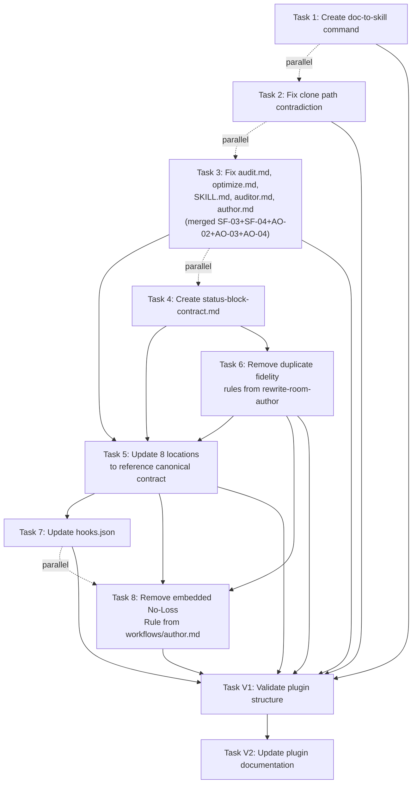

# Refactoring Tasks: the-rewrite-room

**Source**: [refactor-design-the-rewrite-room.md](./refactor-design-the-rewrite-room.md)
**Baseline Score**: 76/100
**Total Tasks**: 10 (8 implementation + 2 validation)
**Parallelization Depth**: 4 waves

---

## Context Manifest

Generated by context-gathering agent on 2026-03-18

### How the Refactoring Tasks Work Together: plugin/the-rewrite-room

The Rewrite Room plugin is a documentation routing and orchestration system that delegates specialized documentation work (auditing, optimization, authoring, citation, and doc-to-skill conversion) to specialist agents. The refactoring addresses 11 critical structural, documentation, and optimization issues identified in the baseline assessment (76/100).

#### Current Architecture

The plugin consists of five specialized agents, three workflows, five commands, and supporting skills:

**Agent Layer** (`plugins/the-rewrite-room/agents/`):
- **rewrite-room-auditor** (line 4: `tools: Read, Grep, Glob, Bash, Task, Write, Edit`) — orchestrates doc audit and sync. Currently has excessive tool permissions (Write, Edit) for its delegating role
- **rewrite-room-author** (lines 69-94: contains duplicated No-Loss Rewrite Rule and Summarization Fidelity Rules sections) — routes doc authoring, GLFM validation, and summarization tasks
- **rewrite-room-optimizer** — routes AI-facing prompt and SKILL.md optimization tasks
- **rewrite-room-cite** (lines 119-129: VALIDATION field uses divergent format `[source count, citation count, direct quotes count]` instead of `[validators run and PASS/FAIL results]`) — handles source-attributed content writing
- **rewrite-room-doc-converter** — orchestrates conversion of user-facing docs into skill directories

**Workflow Layer** (`plugins/the-rewrite-room/the-rewrite-room/workflows/`):
- **audit.md** (line 78: broken reference to non-existent `validate.md` workflow; line 29: hardcoded path `/home/ubuntulinuxqa2/.claude/agents/doc-freshness-guardian.md`)
- **optimize.md** (line 95: incorrect script name `validate_frontmatter.py` should be `normalize_frontmatter.py`)
- **author.md** (lines 115-127: embedded No-Loss Rewrite Rule in delegation prompt that will diverge from canonical source)

**Command Layer** (`plugins/the-rewrite-room/commands/rwr/`):
- `audit.md`, `author.md`, `optimize.md`, `cite.md` — all exist with valid routing
- **MISSING**: `doc-to-skill.md` (referenced in SKILL.md line 26 but file does not exist)

**SKILL.md** (`plugins/the-rewrite-room/skills/the-rewrite-room/SKILL.md`):
- Line 26: `/rwr:doc-to-skill` command listed in Command Reference table but no backing command file at `commands/rwr/doc-to-skill.md`
- Line 98, 123: references to `/home/ubuntulinuxqa2/.claude/agents/doc-freshness-guardian.md` (hardcoded absolute path, non-portable)
- Line 123: references non-existent script `plugins/plugin-creator/scripts/validate_frontmatter.py` — actual script is `normalize_frontmatter.py`

**Input Resolution Reference** (`plugins/the-rewrite-room/skills/user-docs-to-ai-skill/references/input-resolution.md`):
- Lines 36, 41, 155, 158: four occurrences of `.clone/worktrees/` in code blocks (contradicts Mermaid diagram at lines 21, 24 and SKILL.md lines 35, 37, 79-80 which all use `.claude/worktrees/`)

**Hooks** (`plugins/the-rewrite-room/hooks/hooks.json`):
- Lines 9: example agent list only names 3 of 5 agents: `(rewrite-room-auditor, rewrite-room-optimizer, rewrite-room-author)` — missing `rewrite-room-cite` and `rewrite-room-doc-converter`
- Hook prompt validates STATUS block contract but lists only 3 agents in example; filter catches all 5 at runtime via `rewrite-room-` prefix

#### How Tasks Interconnect

**Dependency Chain 1 (Structure Fixes — SF-01 through SF-04)**:
- SF-01: Create missing `commands/rwr/doc-to-skill.md` command file → makes `/rwr:doc-to-skill` invocable
- SF-02: Fix `.clone/worktrees/` → `.claude/worktrees/` in input-resolution.md (4 occurrences)
- SF-03: Remove broken reference to non-existent `validate.md` workflow in audit.md line 78
- SF-04: Fix script name `validate_frontmatter.py` → `normalize_frontmatter.py` in optimize.md:95 and SKILL.md:123
- SF-03 and SF-04 both modify `audit.md` and `optimize.md` and `SKILL.md` — **merge into Task 3 to avoid edit conflicts**

**Dependency Chain 2 (Documentation Improvements — DI-01 through DI-03)**:
- DI-01A: Create canonical reference file `status-block-contract.md` containing unified STATUS block format
- DI-01B: Update 8 locations (5 agents + 3 workflows) to reference the canonical file instead of duplicating
- DI-02: Update hooks.json to list all 5 agents and match canonical VALIDATION format (depends on DI-01B)
- DI-03: Remove embedded No-Loss Rule from workflows/author.md delegation prompt (depends on DI-01B and AO-01)

**Dependency Chain 3 (Agent Optimization — AO-01 through AO-04)**:
- AO-01: Remove duplicated fidelity rules from rewrite-room-author body (lines 69-94)
- AO-02: Tighten rewrite-room-auditor tool list: remove Write and Edit (frontmatter line 4)
- AO-03: Replace hardcoded `/home/ubuntulinuxqa2/` paths with `~/.claude/...` notation (3 locations: auditor.md:44, SKILL.md:98, audit.md:29)
- AO-04: Qualify bare agent references with namespace annotations (author.md, auditor.md, audit.md)
- AO-02, AO-03, AO-04 all modify `auditor.md` — **merge into Task 3 to avoid conflicts**

#### Task Sequencing and Parallelization

**Wave 1 (No dependencies, can run in parallel)**:
- Task 1: Create `commands/rwr/doc-to-skill.md` — new file, no conflicts
- Task 2: Fix clone paths in `input-resolution.md` — isolated file
- Task 3: Merged SF-03+SF-04+AO-02+AO-03+AO-04 edits to `audit.md`, `optimize.md`, `SKILL.md`, `auditor.md`, `author.md`
- Task 4: Create canonical `status-block-contract.md` — new file

**Wave 2 (After Task 4 creates canonical file)**:
- Task 6: Remove duplicated fidelity rules from `rewrite-room-author` (preparation for Task 5)

**Wave 3 (After Task 3, Task 4, Task 6 complete)**:
- Task 5: Update 8 locations to reference canonical file (cannot run until canonical file and duplicate removals complete)
- Task 7: Update hooks.json (depends on canonical format from Task 5)
- Task 8: Remove embedded No-Loss Rule from workflows/author.md (depends on both Task 5 and Task 6)

#### External Callers and Integration Points

**Skills that reference the-rewrite-room components**:
- `user-docs-to-ai-skill` (skill referenced by doc-converter agent) — resides in `plugins/the-rewrite-room/skills/user-docs-to-ai-skill/` — has its own input-resolution.md that needs fixes (SF-02)

**External agents delegated to by workflows**:
- `development-harness:doc-drift-auditor` — referenced by audit.md
- `development-harness:service-docs-maintainer` — referenced by audit.md
- `/home/ubuntulinuxqa2/.claude/agents/doc-freshness-guardian.md` — personal agent, hardcoded path in 3 locations (AO-03)
- `gitlab-docs-expert` — bare reference in author.md table (AO-04)
- `documentation-expert` — bare reference in author.md table (AO-04)
- `plugin-creator:contextual-ai-documentation-optimizer` — referenced in SKILL.md and workflows
- `plugin-creator:subagent-refactorer` — referenced in SKILL.md and workflows
- `summarizer:file-summarizer`, `summarizer:url-summarizer`, `summarizer:image-summarizer` — referenced in author.md

**Scripts called by workflows**:
- `plugins/plugin-creator/scripts/normalize_frontmatter.py` — correct script (ref in optimize.md should point here, currently wrong)
- `plugins/gitlab-skill/skills/gitlab-skill/scripts/validate_glfm.py` — called by author.md

#### Critical Changes and Risk Areas

**High-Risk Edits**:
- **Task 5 (DI-01B)**: Updates 8 files simultaneously with contract references — relative path depth matters. Agents at `plugins/the-rewrite-room/agents/X.md` need different relative paths to `the-rewrite-room/references/status-block-contract.md` than workflows at `the-rewrite-room/workflows/X.md`
- **Task 3 (Merged)**: Five distinct issues in multiple files — must coordinate to avoid overwriting
- **DI-03 (embedded rule removal)**: Depends on both DI-01B (canonical reference pointer added first) and AO-01 (duplicate removed, freeing up the location the reference points to)

**Zero-Breaking Changes**:
- SF-01 (new file) — cannot break anything
- SF-02 (path fixes) — only affects code block examples, not runtime behavior of the skill
- SF-03 (broken ref removal) — removes dead code path, no active dependency
- SF-04 (script name fix) — fixes incorrect reference to non-existent script

#### File Cross-References Summary

**Files modified by multiple tasks** (conflict risk):
- `audit.md`: SF-03 + AO-03 + AO-04 (merged into Task 3)
- `SKILL.md`: SF-04 + AO-03 (merged into Task 3)
- `auditor.md`: AO-02 + AO-03 + AO-04 (merged into Task 3)
- `author.md`: Task 3 (AO changes) + Task 5 (contract reference) + Task 6 (rule removal) then Task 5, then Task 8
- `workflows/author.md`: Task 5 (contract reference) + Task 8 (rule removal) — must sequence Task 5 before Task 8

#### Verification Strategy

Each task includes specific grep/ls verification commands. Summary:
- **Negative checks**: `grep -r "{pattern}" plugins/the-rewrite-room/` returns zero results (validates removal of: `.clone/worktrees`, `validate_frontmatter`, `validate.md`, `/home/ubuntulinuxqa2/`)
- **Positive checks**: Files exist where created (doc-to-skill.md, status-block-contract.md)
- **Content checks**: Specific patterns exist in modified files (normalize_frontmatter, ~/.claude/agents/, contract references)
- **Syntax checks**: Pre-commit validation (`uv run prek run --files`), JSON validity, Mermaid rendering

#### Key Patterns and Assumptions

**Pattern 1: Duplicate definitions become references**
- STATUS block contract is currently duplicated in 8 locations with divergent formats → consolidate to 1 canonical file with all 8 locations referencing it
- No-Loss Rewrite Rule and Summarization Fidelity Rules duplicated in agent body → remove from agent, keep only pointers
- Assumption: All 8 STATUS block definitions use compatible fields. Design spec lists all 8; AO-01 CoVe check confirms no unlisted definitions exist

**Pattern 2: Hardcoded paths and script names are non-portable**
- Assumption: `normalize_frontmatter.py` exists and is the correct script (verified in design spec line 137)
- Assumption: Personal agent `doc-freshness-guardian` is intentionally external and user-supplied (not bundled with plugin)

**Pattern 3: Bare agent references lack clarity**
- gitlab-docs-expert, documentation-expert, doc-freshness-guardian — source namespace unclear
- Fix: Add annotation notes indicating source (personal agents, external plugins) — this is documentation only, no behavior change

**Pattern 4: Relative path depth determines reference format**
- Agents at depth 1 (`plugins/the-rewrite-room/agents/X.md`) need different relative paths than workflows at depth 2 (`plugins/the-rewrite-room/the-rewrite-room/workflows/X.md`)
- Design spec task 5 includes CoVe checks to verify relative paths resolve correctly

---

---

## Dependency Summary

**Wave 1 (no dependencies)**: Tasks 1, 2, 3, 4 -- all parallel
**Wave 2 (after Task 4)**: Task 6 -- then Task 5 (after Task 3 + Task 4 + Task 6)
**Wave 3 (after Task 5 + Task 6)**: Tasks 7, 8 -- parallel
**Wave 4 (after all implementation)**: V1, then V2

---

## Task 1: Create `/rwr:doc-to-skill` Command File

**Status**: COMPLETE
**Dependencies**: None
**Priority**: 1
**Complexity**: Low
**Agent**: plugin-creator:skill-creator

**Target**: `plugins/the-rewrite-room/commands/rwr/doc-to-skill.md`
**Issue Type**: STRUCTURE_FIX

**Acceptance Criteria**:
1. File `plugins/the-rewrite-room/commands/rwr/doc-to-skill.md` exists
2. Frontmatter contains `description`, `argument-hint`, `agent: rewrite-room-doc-converter`, and `allowed-tools` fields
3. Body routes to `rewrite-room-doc-converter` agent and references the user-docs-to-ai-skill SOP
4. Frontmatter passes pre-commit validation

**Required Inputs**:
- Design spec section: SF-01
- Source files: `plugins/the-rewrite-room/commands/rwr/author.md` (structural analog)

**Expected Outputs**:
- `plugins/the-rewrite-room/commands/rwr/doc-to-skill.md`

**Can Parallelize With**: Task 2, Task 3, Task 4
**Reason**: Creates a new file in `commands/rwr/` -- no overlap with any other task's target files

**Verification Steps**:
1. `ls plugins/the-rewrite-room/commands/rwr/doc-to-skill.md` exits 0
2. `grep "agent: rewrite-room-doc-converter" plugins/the-rewrite-room/commands/rwr/doc-to-skill.md` returns a match
3. `uv run prek run --files plugins/the-rewrite-room/commands/rwr/doc-to-skill.md` exits 0

## Task 2: Fix Clone Path Contradiction in `input-resolution.md`

**Status**: COMPLETE
**Dependencies**: None
**Priority**: 1
**Complexity**: Low
**Agent**: plugin-creator:contextual-ai-documentation-optimizer

**Target**: `plugins/the-rewrite-room/skills/user-docs-to-ai-skill/references/input-resolution.md`
**Issue Type**: STRUCTURE_FIX

**Acceptance Criteria**:
1. All 4 occurrences of `.clone/worktrees/` replaced with `.claude/worktrees/` (lines 36, 41, 155, 158)
2. Mermaid diagram (lines 21, 24) still uses `.claude/worktrees/` (unchanged, already correct)
3. Zero occurrences of `.clone/worktrees/` remain anywhere in the plugin

**Required Inputs**:
- Design spec section: SF-02
- Source files: `plugins/the-rewrite-room/skills/user-docs-to-ai-skill/references/input-resolution.md`

**Expected Outputs**:
- `plugins/the-rewrite-room/skills/user-docs-to-ai-skill/references/input-resolution.md` (modified)

**Can Parallelize With**: Task 1, Task 3, Task 4
**Reason**: Edits only `input-resolution.md` -- no overlap with any other task's target files

**Verification Steps**:
1. `grep -r ".clone/worktrees" plugins/the-rewrite-room/` returns zero results
2. `grep ".claude/worktrees" plugins/the-rewrite-room/skills/user-docs-to-ai-skill/references/input-resolution.md` returns matches (confirming replacements applied)
3. `uv run prek run --files plugins/the-rewrite-room/skills/user-docs-to-ai-skill/references/input-resolution.md` exits 0

## Task 3: Fix Shared Files -- audit.md, optimize.md, SKILL.md, auditor.md, author.md

**Status**: COMPLETE
**Dependencies**: None
**Priority**: 1
**Complexity**: High
**Agent**: plugin-creator:contextual-ai-documentation-optimizer

**Target**: Multiple files (merged from SF-03, SF-04, AO-02, AO-03, AO-04 to avoid edit conflicts)
**Issue Type**: STRUCTURE_FIX + AGENT_OPTIMIZE

> **Merge rationale**: Five design items (SF-03, SF-04, AO-02, AO-03, AO-04) share output files.
> `audit.md` is written by SF-03, AO-03, AO-04. `SKILL.md` by SF-04, AO-03.
> `auditor.md` by AO-02, AO-03, AO-04. Merging prevents edit conflicts across parallel agents.

**Acceptance Criteria**:

### SF-03: Remove validate.md reference in audit.md
1. Mermaid node at line 78 of `workflows/audit.md` no longer references `validate.md`
2. Replacement node references `uv run plugins/plugin-creator/scripts/normalize_frontmatter.py <file>`
3. `grep -r "validate.md" plugins/the-rewrite-room/` returns zero results
4. `grep -r "workflows/validate" plugins/the-rewrite-room/` returns zero results

### SF-04: Fix validate_frontmatter.py references
5. `workflows/optimize.md` line 95 references `normalize_frontmatter.py` instead of `validate_frontmatter.py`
6. `skills/the-rewrite-room/SKILL.md` line 123 references `normalize_frontmatter.py` instead of `validate_frontmatter.py`
7. `grep -r "validate_frontmatter" plugins/the-rewrite-room/` returns zero results

### AO-02: Tighten auditor tool list
8. `agents/rewrite-room-auditor.md` frontmatter `tools:` field is `Read, Grep, Glob, Bash, Task` (no Write, no Edit)

### AO-03: Replace hardcoded absolute paths
9. All 3 occurrences of `/home/ubuntulinuxqa2/.claude/agents/doc-freshness-guardian.md` replaced with `~/.claude/agents/doc-freshness-guardian.md`
10. Each occurrence has an adjacent note: "doc-freshness-guardian is a personal agent, not bundled with this plugin"
11. `grep -r "/home/ubuntulinuxqa2" plugins/the-rewrite-room/` returns zero results

### AO-04: Qualify bare agent references
12. `agents/rewrite-room-author.md` table entries for `gitlab-docs-expert` and `documentation-expert` include source annotation
13. `agents/rewrite-room-auditor.md` table entry for `doc-freshness-guardian` includes source annotation
14. `workflows/audit.md` delegation reference for `doc-freshness-guardian` includes source clarification

**Required Inputs**:
- Design spec sections: SF-03, SF-04, AO-02, AO-03, AO-04
- Source files:
  - `plugins/the-rewrite-room/the-rewrite-room/workflows/audit.md`
  - `plugins/the-rewrite-room/the-rewrite-room/workflows/optimize.md`
  - `plugins/the-rewrite-room/skills/the-rewrite-room/SKILL.md`
  - `plugins/the-rewrite-room/agents/rewrite-room-auditor.md`
  - `plugins/the-rewrite-room/agents/rewrite-room-author.md`

**Expected Outputs**:
- `plugins/the-rewrite-room/the-rewrite-room/workflows/audit.md` (modified)
- `plugins/the-rewrite-room/the-rewrite-room/workflows/optimize.md` (modified)
- `plugins/the-rewrite-room/skills/the-rewrite-room/SKILL.md` (modified)
- `plugins/the-rewrite-room/agents/rewrite-room-auditor.md` (modified)
- `plugins/the-rewrite-room/agents/rewrite-room-author.md` (modified)

**Can Parallelize With**: Task 1, Task 2, Task 4
**Reason**: Task 1 creates a new command file. Task 2 edits `input-resolution.md`. Task 4 creates a new reference file. No file overlap with any of them.

**Verification Steps**:
1. `grep -r "validate.md" plugins/the-rewrite-room/` returns zero results
2. `grep -r "validate_frontmatter" plugins/the-rewrite-room/` returns zero results
3. `grep -r "/home/ubuntulinuxqa2" plugins/the-rewrite-room/` returns zero results
4. `grep "^tools:" plugins/the-rewrite-room/agents/rewrite-room-auditor.md` shows no Write or Edit
5. `grep "workflows/validate" plugins/the-rewrite-room/` returns zero results
6. `grep "normalize_frontmatter" plugins/the-rewrite-room/the-rewrite-room/workflows/optimize.md` returns a match
7. `grep "normalize_frontmatter" plugins/the-rewrite-room/skills/the-rewrite-room/SKILL.md` returns a match

## Task 4: Create Canonical STATUS Block Contract Reference File

**Status**: COMPLETE
**Dependencies**: None
**Priority**: 1
**Complexity**: Medium
**Agent**: plugin-creator:contextual-ai-documentation-optimizer

**Target**: `plugins/the-rewrite-room/the-rewrite-room/references/status-block-contract.md`
**Issue Type**: DOC_IMPROVE

**Acceptance Criteria**:
1. File `plugins/the-rewrite-room/the-rewrite-room/references/status-block-contract.md` exists
2. Contains canonical STATUS block format with fields: STATUS, SUMMARY, ARTIFACTS, VALIDATION, NOTES
3. Contains field rules section defining allowed values and behavior for each field
4. Contains workflow-specific VALIDATION subfields table (audit, optimize, author)
5. Uses the unified VALIDATION format (`[validators run and PASS/FAIL results]`), not the divergent cite format (`[source count, citation count, direct quotes count]`)

**Required Inputs**:
- Design spec section: DI-01A
- Source files:
  - `plugins/the-rewrite-room/agents/rewrite-room-auditor.md` (lines 48-55, current contract)
  - `plugins/the-rewrite-room/agents/rewrite-room-cite.md` (lines 119-129, divergent VALIDATION)
  - `plugins/the-rewrite-room/the-rewrite-room/workflows/audit.md` (lines 90-99)

**Expected Outputs**:
- `plugins/the-rewrite-room/the-rewrite-room/references/status-block-contract.md` (created)

**Can Parallelize With**: Task 1, Task 2, Task 3
**Reason**: Creates a new file in `references/` -- no overlap with any other Wave 1 task's target files

**Verification Steps**:
1. `ls plugins/the-rewrite-room/the-rewrite-room/references/status-block-contract.md` exits 0
2. `grep "STATUS: DONE|BLOCKED|FAILED" plugins/the-rewrite-room/the-rewrite-room/references/status-block-contract.md` returns a match
3. `grep "VALIDATION:" plugins/the-rewrite-room/the-rewrite-room/references/status-block-contract.md` returns a match showing the unified format
4. `grep "source count" plugins/the-rewrite-room/the-rewrite-room/references/status-block-contract.md` returns zero results (divergent cite format excluded)

**Accuracy Risk**: Medium -- the canonical format must reconcile 8 existing definitions without losing workflow-specific subfields

**CoVe Checks**:
- Key claims to verify:
  - The design spec lists exactly 8 locations with STATUS block definitions
  - `rewrite-room-cite.md` is the only agent with a divergent VALIDATION field
  - The workflow-specific subfields (audit, optimize, author) do not conflict with the base format
- Verification questions:
  1. Does the canonical format cover all fields used across all 8 locations?
  2. Are there STATUS block fields in any agent/workflow not listed in the design spec?
  3. Does the workflow-specific VALIDATION table capture all validators actually referenced in the workflow files?
- Evidence to collect:
  - `grep -r "STATUS:" plugins/the-rewrite-room/agents/` and `grep -r "STATUS:" plugins/the-rewrite-room/the-rewrite-room/workflows/`
- Revision rule:
  - If any unlisted STATUS field or location is found, add it to the canonical file and report the discovery

## Task 5: Update 8 Locations to Reference Canonical STATUS Block Contract

**Status**: COMPLETE
**Dependencies**: Task 3, Task 4, Task 6
**Priority**: 2
**Complexity**: High
**Agent**: plugin-creator:subagent-refactorer

**Target**: 5 agent files + 3 workflow files
**Issue Type**: DOC_IMPROVE

> Task 3 dependency: Task 3 modifies `auditor.md` and `author.md` (AO-02/03/04 changes).
> This task must run after to avoid edit conflicts on those files.
> Task 6 dependency: Task 6 modifies `author.md` (removes fidelity rules).
> This task adds the contract reference pointer after those sections are removed.

**Acceptance Criteria**:
1. All 5 agent files contain an `## Output Contract` section pointing to `status-block-contract.md`
2. All 3 workflow files contain an output contract reference pointing to the canonical file
3. Embedded STATUS block definitions removed from all 8 locations (replaced by reference)
4. `rewrite-room-cite.md` VALIDATION field changed from `[source count, citation count, direct quotes count]` to match canonical format
5. Workflow-specific VALIDATION subfields remain inline in each workflow file (not removed)
6. Relative paths in references are correct based on each file's directory location

**Required Inputs**:
- Design spec section: DI-01B
- Source files:
  - `plugins/the-rewrite-room/the-rewrite-room/references/status-block-contract.md` (created by Task 4)
  - All 5 agents: `agents/rewrite-room-auditor.md`, `agents/rewrite-room-author.md`, `agents/rewrite-room-optimizer.md`, `agents/rewrite-room-cite.md`, `agents/rewrite-room-doc-converter.md`
  - All 3 workflows: `the-rewrite-room/workflows/audit.md`, `the-rewrite-room/workflows/optimize.md`, `the-rewrite-room/workflows/author.md`

**Expected Outputs**:
- `plugins/the-rewrite-room/agents/rewrite-room-auditor.md` (modified)
- `plugins/the-rewrite-room/agents/rewrite-room-author.md` (modified)
- `plugins/the-rewrite-room/agents/rewrite-room-optimizer.md` (modified)
- `plugins/the-rewrite-room/agents/rewrite-room-cite.md` (modified)
- `plugins/the-rewrite-room/agents/rewrite-room-doc-converter.md` (modified)
- `plugins/the-rewrite-room/the-rewrite-room/workflows/audit.md` (modified)
- `plugins/the-rewrite-room/the-rewrite-room/workflows/optimize.md` (modified)
- `plugins/the-rewrite-room/the-rewrite-room/workflows/author.md` (modified)

**Can Parallelize With**: None
**Reason**: Depends on Tasks 3, 4, and 6 completing first; touches files that Task 7 and Task 8 also need

**Verification Steps**:
1. `grep -l "status-block-contract.md" plugins/the-rewrite-room/agents/*.md` returns all 5 agent files
2. `grep -l "status-block-contract.md" plugins/the-rewrite-room/the-rewrite-room/workflows/*.md` returns all 3 workflow files
3. `grep "source count" plugins/the-rewrite-room/agents/rewrite-room-cite.md` returns zero results
4. For each agent file: confirm no multi-line STATUS block definition remains (only the reference line)

**Accuracy Risk**: Medium -- relative paths must be correct for each file's directory depth

**CoVe Checks**:
- Key claims to verify:
  - Agent files are at `plugins/the-rewrite-room/agents/` (one level from plugin root)
  - Workflow files are at `plugins/the-rewrite-room/the-rewrite-room/workflows/` (two levels from plugin root)
  - The canonical file is at `plugins/the-rewrite-room/the-rewrite-room/references/status-block-contract.md`
- Verification questions:
  1. From `agents/X.md`, what is the correct relative path to `the-rewrite-room/references/status-block-contract.md`?
  2. From `the-rewrite-room/workflows/X.md`, what is the correct relative path to `the-rewrite-room/references/status-block-contract.md`?
- Evidence to collect:
  - `ls -la` on both directories to confirm depth
- Revision rule:
  - If relative paths do not resolve correctly, fix before marking complete

## Task 6: Remove Duplicated Fidelity Rules from `rewrite-room-author`

**Status**: COMPLETE
**Dependencies**: Task 4
**Priority**: 2
**Complexity**: Medium
**Agent**: plugin-creator:subagent-refactorer

**Target**: `plugins/the-rewrite-room/agents/rewrite-room-author.md`
**Issue Type**: AGENT_OPTIMIZE

> Depends on Task 4 because the replacement pointer references the canonical file created by Task 4.
> Must complete before Task 5 (DI-01B) which also modifies this file to add the contract reference.

**Acceptance Criteria**:
1. Lines 69-94 of `agents/rewrite-room-author.md` (No-Loss Rewrite Rule + Summarization Fidelity Rules sections) are removed
2. Replaced with a single `## Content Rules` section containing pointers to canonical reference files
3. Pointer references `the-rewrite-room/references/status-block-contract.md` for the No-Loss Rewrite Rule
4. Pointer references `plugins/summarizer/skills/summarizer/references/fidelity-rules.md` for Summarization Fidelity Rules
5. No other sections of the agent file are modified

**Required Inputs**:
- Design spec section: AO-01
- Source files:
  - `plugins/the-rewrite-room/agents/rewrite-room-author.md`
  - `plugins/the-rewrite-room/the-rewrite-room/references/status-block-contract.md` (verify it exists from Task 4)

**Expected Outputs**:
- `plugins/the-rewrite-room/agents/rewrite-room-author.md` (modified)

**Can Parallelize With**: None in Wave 2 (Task 5 depends on this completing)
**Reason**: Modifies `rewrite-room-author.md` which Task 5 also modifies -- must sequence

**Verification Steps**:
1. `grep "No-Loss Rewrite Rule" plugins/the-rewrite-room/agents/rewrite-room-author.md` returns zero results for definition blocks (pointer line is acceptable)
2. `grep "Summarization Fidelity Rules" plugins/the-rewrite-room/agents/rewrite-room-author.md` returns zero results for definition blocks
3. `grep "status-block-contract.md" plugins/the-rewrite-room/agents/rewrite-room-author.md` returns a match (pointer exists)
4. `grep "fidelity-rules.md" plugins/the-rewrite-room/agents/rewrite-room-author.md` returns a match (pointer exists)

## Task 7: Update hooks.json Agent List and VALIDATION Format

**Status**: COMPLETE
**Dependencies**: Task 5
**Priority**: 3
**Complexity**: Low
**Agent**: plugin-creator:contextual-ai-documentation-optimizer

**Target**: `plugins/the-rewrite-room/hooks/hooks.json`
**Issue Type**: DOC_IMPROVE

> Depends on Task 5 because the VALIDATION format in hooks.json must match the canonical
> definition settled by DI-01B.

**Acceptance Criteria**:
1. Hook prompt string lists all 5 agents: `rewrite-room-auditor`, `rewrite-room-optimizer`, `rewrite-room-author`, `rewrite-room-cite`, `rewrite-room-doc-converter`
2. VALIDATION field format in the hook prompt matches the canonical definition from `status-block-contract.md`
3. The `rewrite-room-` prefix filter logic is preserved (no behavioral change to agent matching)

**Required Inputs**:
- Design spec section: DI-02
- Source files:
  - `plugins/the-rewrite-room/hooks/hooks.json`
  - `plugins/the-rewrite-room/the-rewrite-room/references/status-block-contract.md` (for VALIDATION format reference)

**Expected Outputs**:
- `plugins/the-rewrite-room/hooks/hooks.json` (modified)

**Can Parallelize With**: Task 8
**Reason**: Task 7 edits `hooks/hooks.json`, Task 8 edits `workflows/author.md` -- no file overlap

**Verification Steps**:
1. `grep "rewrite-room-cite" plugins/the-rewrite-room/hooks/hooks.json` returns a match
2. `grep "rewrite-room-doc-converter" plugins/the-rewrite-room/hooks/hooks.json` returns a match
3. JSON is valid: `python3 -c "import json; json.load(open('plugins/the-rewrite-room/hooks/hooks.json'))"` exits 0

## Task 8: Remove Embedded No-Loss Rewrite Rule from `workflows/author.md`

**Status**: COMPLETE
**Dependencies**: Task 5, Task 6
**Priority**: 3
**Complexity**: Low
**Agent**: plugin-creator:subagent-refactorer

**Target**: `plugins/the-rewrite-room/the-rewrite-room/workflows/author.md`
**Issue Type**: DOC_IMPROVE

> Depends on Task 5 (DI-01B) which updates the contract reference in this file first.
> Depends on Task 6 (AO-01) which establishes the canonical location that the replacement pointer references.

**Acceptance Criteria**:
1. Lines 115-127 of `workflows/author.md` (the embedded No-Loss Rewrite Rule in the delegation prompt) are removed
2. Replaced with a single-line reference to the canonical file: `the-rewrite-room/references/status-block-contract.md`
3. `grep "PRESERVE:" plugins/the-rewrite-room/the-rewrite-room/workflows/author.md` returns zero results
4. The delegation prompt template structure is otherwise preserved

**Required Inputs**:
- Design spec section: DI-03
- Source files:
  - `plugins/the-rewrite-room/the-rewrite-room/workflows/author.md`
  - `plugins/the-rewrite-room/the-rewrite-room/references/status-block-contract.md` (verify canonical file path)

**Expected Outputs**:
- `plugins/the-rewrite-room/the-rewrite-room/workflows/author.md` (modified)

**Can Parallelize With**: Task 7
**Reason**: Task 7 edits `hooks/hooks.json`, Task 8 edits `workflows/author.md` -- no file overlap

**Verification Steps**:
1. `grep "PRESERVE:" plugins/the-rewrite-room/the-rewrite-room/workflows/author.md` returns zero results
2. `grep "status-block-contract.md" plugins/the-rewrite-room/the-rewrite-room/workflows/author.md` returns a match (reference pointer exists)
3. `grep "documentation-expert" plugins/the-rewrite-room/the-rewrite-room/workflows/author.md` returns a match (delegation prompt template preserved)

## Task V1: Validate Plugin Structure

**Status**: COMPLETE
**Dependencies**: Task 1, Task 2, Task 3, Task 5, Task 7, Task 8
**Priority**: 4
**Complexity**: Low
**Agent**: plugin-creator:plugin-assessor

**Target**: `plugins/the-rewrite-room/` (entire plugin directory)
**Issue Type**: STRUCTURE_FIX

**Acceptance Criteria**:
1. Plugin passes `uvx skilllint@latest check ./plugins/the-rewrite-room/` with 0 errors
2. All internal links within the plugin resolve correctly (no broken references)
3. Score improved from 76/100 baseline
4. Zero grep results for any of the removed patterns: `.clone/worktrees`, `validate_frontmatter`, `/home/ubuntulinuxqa2/`, `validate.md`
5. All 5 agent files and 3 workflow files contain `status-block-contract.md` references

**Required Inputs**:
- All completed task outputs (T1-T8)
- Source files: entire `plugins/the-rewrite-room/` directory

**Expected Outputs**:
- Validation report (pass/fail with details)

**Can Parallelize With**: None
**Reason**: Must run after all implementation tasks complete to verify integrated result

**Verification Steps**:
1. Run `uvx skilllint@latest check ./plugins/the-rewrite-room/` and confirm exit code 0
2. Run `grep -r "/home/ubuntulinuxqa2" plugins/the-rewrite-room/` and confirm zero results
3. Run `grep -r ".clone/worktrees" plugins/the-rewrite-room/` and confirm zero results
4. Run `grep -r "validate_frontmatter" plugins/the-rewrite-room/` and confirm zero results
5. Run `grep -r "validate.md" plugins/the-rewrite-room/` and confirm zero results
6. Run `grep -rl "status-block-contract.md" plugins/the-rewrite-room/agents/ plugins/the-rewrite-room/the-rewrite-room/workflows/` and confirm 8 files listed
7. Run `ls plugins/the-rewrite-room/commands/rwr/doc-to-skill.md` and confirm exit code 0
8. Run `ls plugins/the-rewrite-room/the-rewrite-room/references/status-block-contract.md` and confirm exit code 0

## Task V2: Update Plugin Documentation

**Status**: COMPLETE
**Dependencies**: Task V1
**Priority**: 5
**Complexity**: Low
**Agent**: plugin-docs-writer

**Target**: `plugins/the-rewrite-room/README.md`
**Issue Type**: DOC_IMPROVE

**Acceptance Criteria**:
1. README.md accurately reflects all 5 agents including `rewrite-room-doc-converter`
2. `/rwr:doc-to-skill` command documented with usage example
3. Installation instructions accurate and mention external dependencies
4. All 5 commands listed: `audit`, `author`, `cite`, `optimize`, `doc-to-skill`
5. STATUS block contract canonical location documented

**Required Inputs**:
- Task V1 validation result (must pass)
- Source files:
  - `plugins/the-rewrite-room/README.md` (current)
  - `plugins/the-rewrite-room/commands/rwr/` (all command files for reference)
  - `plugins/the-rewrite-room/agents/` (all agent files for reference)

**Expected Outputs**:
- `plugins/the-rewrite-room/README.md` (modified or created)

**Can Parallelize With**: None
**Reason**: Depends on V1 confirming all implementation tasks passed validation

**Verification Steps**:
1. `grep "rewrite-room-doc-converter" plugins/the-rewrite-room/README.md` returns a match
2. `grep "doc-to-skill" plugins/the-rewrite-room/README.md` returns a match
3. `grep -c "rewrite-room-" plugins/the-rewrite-room/README.md` returns at least 5 (all agents referenced)
4. `uv run prek run --files plugins/the-rewrite-room/README.md` exits 0

---

## Success Metrics

- Plugin passes `uvx skilllint@latest check` with 0 errors
- Score improved from 76/100 baseline
- Zero references to `.clone/worktrees/` remain
- Zero references to `validate_frontmatter.py` remain
- Zero references to `validate.md` workflow remain
- Zero hardcoded `/home/ubuntulinuxqa2/` paths remain
- All 5 agents listed in hooks.json example
- STATUS block contract defined in exactly 1 canonical location
- All agent/workflow files reference canonical contract file
- `/rwr:doc-to-skill` command file exists and has valid frontmatter
