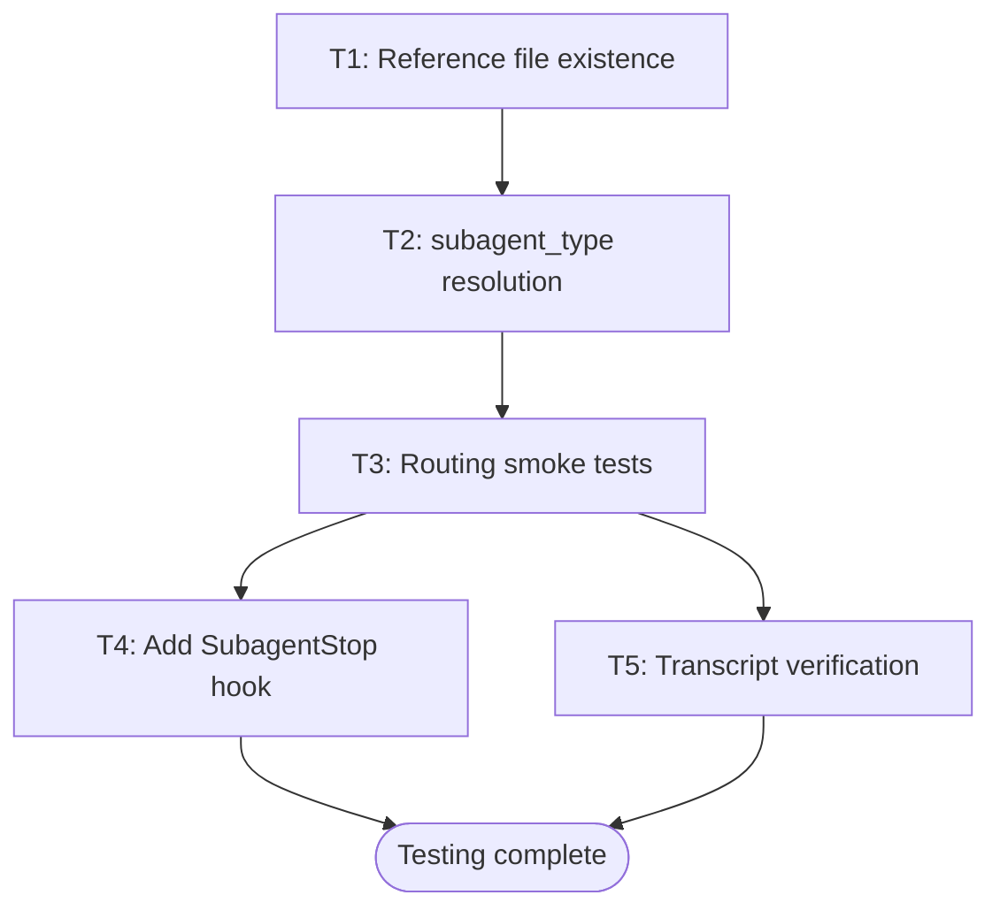

# Testing Plan: the-rewrite-room Plugin

Date: 2026-02-20
Status: DRAFT

## What We Can Test Without Live Invocation

These are available now, require no additional setup, and were NOT run previously:

1. **Plugin structure validation** — already run via `claude plugin validate` and pre-commit hooks. All 26 hooks passed. ✅
2. **Frontmatter schema validation** — `plugin_validator.py` confirmed correct YAML. ✅
3. **Reference file existence** — files listed in agent lookup tables exist on disk. NOT yet verified.
4. **subagent_type resolution** — the subagent identifiers used in agent prompts match actual plugin names.  NOT yet verified.

---

## What The Docs Say About Testing

Source: `https://docs.anthropic.com/en/docs/claude-code/sub-agents.md` (fetched 2026-02-20)

There is no dedicated "testing agents" page in the Claude Code docs as of 2026-02-20.
The relevant testing-adjacent content from the official docs:

### 1. Session-scoped plugin loading (non-persistent)

```bash
claude --plugin-dir ./plugins/the-rewrite-room
```

Loads the plugin for the session only. Does not write to user's plugin config. Safe for testing.
Source: CLAUDE.md "Plugin Development Workflows - Local Testing Methods"

### 2. Subagent invocation pattern

From sub-agents.md, agents are invoked by name in the conversation:

```text
Use the rewrite-room-auditor agent to audit plugins/agentskill-kaizen/
```

The agent starts, performs routing, delegates to specialist, returns STATUS block.
Testing verifies the STATUS block is present and correctly structured.

### 3. SubagentStop hook for output contract validation

From hooks reference: `SubagentStop` event fires when a subagent completes.
A `type: "prompt"` hook can inspect the subagent's final output for contract compliance.
This is the automated gate the summarizer plugin uses to catch re-summarization.

### 4. Transcript-based post-hoc verification

Subagent transcripts are written to:
```text
~/.claude/projects/{project-hash}/subagents/agent-{agentId}.jsonl
```

After a test invocation, the transcript shows exactly what the agent read, delegated, and returned.
Useful for verifying: did the agent read the reference file before delegating? Did it pass file path (not content)?

### 5. `--resume` flag for iterative testing

```bash
claude --resume {sessionId}
```

Resume a session to continue testing the same agent instance. Useful for multi-step tests.

---

## Test Cases

### T1: Structural Validation (Pre-Invocation)

**Purpose**: Verify all file references in agent lookup tables exist on disk.

**Method**: For each agent, grep the reference file paths from the agent .md and verify each exists.

| Agent | Reference Paths to Verify |
|-------|--------------------------|
| rewrite-room-auditor | plugins/development-harness/agents/doc-drift-auditor.md, plugins/development-harness/agents/service-docs-maintainer.md, /home/ubuntulinuxqa2/.claude/agents/doc-freshness-guardian.md |
| rewrite-room-optimizer | plugins/prompt-optimization-claude-45/skills/prompt-optimization-claude-45/SKILL.md, plugins/plugin-creator/agents/contextual-ai-documentation-optimizer.md, plugins/plugin-creator/agents/subagent-refactorer.md |
| rewrite-room-author | plugins/gitlab-skill/skills/gitlab-skill/references/glfm-syntax.md, plugins/summarizer/skills/summarizer/references/fidelity-rules.md, plugins/summarizer/skills/summarizer/templates/structured.md |

**Pass criteria**: Every path resolves to an existing file. No 404s.

**Run now**: Yes — use Glob to check each.

**Result (2026-02-20)**: ALL PASS. All 11 reference files (8 plugin-relative, 3 user-global) exist on disk. ✅

---

### T2: subagent_type Resolution Check (Pre-Invocation)

**Purpose**: Verify the `subagent_type` strings used in agent Task calls resolve to real agents.

Agents referenced:

| subagent_type string | Plugin/Location | Verified? |
|---------------------|-----------------|-----------|
| `development-harness:doc-drift-auditor` | plugins/development-harness/agents/doc-drift-auditor.md | — |
| `development-harness:service-docs-maintainer` | plugins/development-harness/agents/service-docs-maintainer.md | — |
| `doc-freshness-guardian` | ~/.claude/agents/doc-freshness-guardian.md | — |
| `plugin-creator:contextual-ai-documentation-optimizer` | plugins/plugin-creator/agents/contextual-ai-documentation-optimizer.md | — |
| `plugin-creator:subagent-refactorer` | plugins/plugin-creator/agents/subagent-refactorer.md | — |
| `gitlab-docs-expert` | ~/.claude/agents/gitlab-docs-expert.md | — |
| `documentation-expert` | ~/.claude/agents/documentation-expert.md | — |
| `summarizer:file-summarizer` | plugins/summarizer/... | — |
| `summarizer:url-summarizer` | plugins/summarizer/... | — |
| `summarizer:image-summarizer` | plugins/summarizer/... | — |

**Pass criteria**: Each subagent_type string matches the `name:` field in the target agent's YAML frontmatter OR the plugin.json `agents` entry.

**Result (2026-02-20)**: ALL PASS. Verified `name:` fields:
- `doc-drift-auditor` ✅ (line 2, doc-drift-auditor.md)
- `service-docs-maintainer` ✅ (line 2, service-docs-maintainer.md)
- `contextual-ai-documentation-optimizer` ✅ (line 2, contextual-ai-documentation-optimizer.md)
- `subagent-refactorer` ✅ (line 2, subagent-refactorer.md)
- `file-summarizer` ✅ (line 2, file-summarizer.md)
- `url-summarizer` ✅ (line 2, url-summarizer.md)
- `image-summarizer` ✅ (line 2, image-summarizer.md)
- `gitlab-docs-expert`, `documentation-expert`, `doc-freshness-guardian` — user-global agents, file existence confirmed. ✅

---

### T3: Routing Smoke Tests (Live Invocation)

**Setup**: Launch session with plugin loaded:

```bash
claude --plugin-dir ./plugins/the-rewrite-room
```

Each test prompt goes to one agent. Observe:
1. Does the agent start?
2. Does it route to the right specialist?
3. Does the final response contain a valid STATUS block?

#### T3a — Auditor routing: drift

```text
Use the rewrite-room-auditor agent to audit the docs for plugins/agentskill-kaizen/
```

Expected: Routes to `doc-drift-auditor`. STATUS block present. ARTIFACTS lists `.claude/reports/DOCUMENTATION_DRIFT_AUDIT.md`.

#### T3b — Auditor routing: sync

```text
Use the rewrite-room-auditor agent to sync docs after the DataProcessor refactor — files changed: src/processor.py
```

Expected: Routes to `service-docs-maintainer`. STATUS block present. ARTIFACTS: none (service-docs-maintainer outputs response text only, not a file — per agent reference note).

#### T3c — Optimizer routing: SKILL.md

```text
Use the rewrite-room-optimizer agent to optimize plugins/agentskill-kaizen/skills/agentskill-kaizen/SKILL.md
```

Expected: Agent reads `prompt-optimization-claude-45` SKILL.md first (verify in transcript). Routes to `contextual-ai-documentation-optimizer`. STATUS block present. ARTIFACTS: the modified SKILL.md path.

#### T3d — Optimizer routing: wrong target (user-facing doc)

```text
Use the rewrite-room-optimizer agent to rewrite the README.md for plugins/agentskill-kaizen/
```

Expected: Agent detects user-facing doc mismatch per flowchart `Q1 → Author[Wrong agent — route to rewrite-room-author instead]`. STATUS: BLOCKED or redirects. Does NOT delegate to contextual-ai-documentation-optimizer.

#### T3e — Author routing: GLFM validation

```text
Use the rewrite-room-author agent to validate the GLFM syntax in plugins/gitlab-skill/skills/gitlab-skill/references/glfm-syntax.md
```

Expected: Runs `validate_glfm.py --file ...` via Bash directly (not delegated to gitlab-docs-expert). STATUS block present. VALIDATION field shows script exit code.

Note: Requires `GITLAB_TOKEN` env var. If absent, expected STATUS: BLOCKED, NEEDED: GITLAB_TOKEN.

#### T3f — Author routing: summarization (file)

```text
Use the rewrite-room-author agent to summarize plugins/summarizer/skills/summarizer/references/fidelity-rules.md
```

Expected: Agent reads fidelity-rules.md BEFORE delegating (verify in transcript). Routes to `summarizer:file-summarizer`. Output contains confidence assessment in YAML frontmatter.

---

### T4: Output Contract Validation (Automated Gate)

**What to add**: A `SubagentStop` hook that validates STATUS block format on every rewrite-room agent stop.

**Location**: `plugins/the-rewrite-room/hooks/hooks.json`

**Pattern** (from summarizer plugin — same architecture):

```json
{
  "hooks": {
    "SubagentStop": [
      {
        "matcher": "rewrite-room-",
        "hooks": [
          {
            "type": "prompt",
            "prompt": "The subagent just stopped. Check its final output. A valid STATUS block must be present with STATUS:, SUMMARY:, ARTIFACTS:, VALIDATION: fields. If any field is missing, output: CONTRACT_VIOLATION: [missing fields]. If all present, output: CONTRACT_OK."
          }
        ]
      }
    ]
  }
}
```

This hook fires on any subagent whose name contains `rewrite-room-`. It validates the STATUS block without requiring test fixtures.

**Note**: This is the recommended automated gate per the hooks reference. The hook runs as a prompt evaluation, not a pass/fail test — it reports violations. To make it blocking, the hook would need to set `exitCode: 1` via a `command` type hook that parses the prompt result.

---

### T5: Transcript Verification (Post-Invocation)

After T3 tests run, verify agent behavior from transcript:

```bash
# Find the session transcript
ls ~/.claude/projects/*/subagents/
```

For each agent invocation, verify in the JSONL transcript:

- `rewrite-room-auditor`: Did it call `Read` on the reference file before `Task`? (file path: `plugins/development-harness/agents/doc-drift-auditor.md`)
- `rewrite-room-optimizer`: Did it call `Read` on `plugins/prompt-optimization-claude-45/skills/prompt-optimization-claude-45/SKILL.md` before delegating?
- `rewrite-room-author`: For summarization, did it call `Read` on `plugins/summarizer/skills/summarizer/references/fidelity-rules.md` before delegating?

**Pass criteria**: `Read` call on reference file appears BEFORE the `Task` call in the JSONL sequence.

---

## Test Execution Order



T1 and T2 can run now, without a live session. T3–T5 require a live invocation session.

---

## What Is Not Tested Here

- **Specialist agent correctness**: This plan tests the routing and output contract of the three rewrite-room agents. It does not test whether `doc-drift-auditor`, `service-docs-maintainer`, etc. produce correct results — those agents have their own test responsibilities.
- **End-to-end workflow chains**: The chain rule (drift-audit → formatting-validation) from `workflows/audit.md` is not smoke-tested here. That requires a fixture with known drift + known GLFM violation.
- **Commands**: The `/rwr:audit`, `/rwr:optimize`, `/rwr:author` command files pass `$ARGUMENTS` to the agent. They are wrappers — if the agent tests pass, command tests are redundant.

---

## Sources

- Claude Code sub-agents docs: `https://docs.anthropic.com/en/docs/claude-code/sub-agents.md` (fetched 2026-02-20)
- Hooks reference: `plugin-creator:claude-hooks-reference-2026` (no dedicated testing page found in docs as of 2026-02-20)
- Summarizer SubagentStop hook pattern: `plugins/summarizer/` (existing implementation)
- Local plugin testing: CLAUDE.md "Plugin Development Workflows" section
