# Backlog Management Workflow

This diagram represents the complete user-facing workflow for the `/work-backlog-item` skill as described in `SKILL.md`, `references/github-integration.md`, and `references/validation-plan.md`. It covers all argument modes, every decision branch, all external system interactions (GitHub Issues, Projects, Milestones, SAM planning, grooming), terminal states, and the hook-triggered entry points.

```mermaid
flowchart TD
    %% Hook-triggered context injections
    SessionStart([Session start hook fires])
    SessionStart -->|"additionalContext: reminder to use /work-backlog-item"| UserSession[User in session]

    StopHook([Session stop hook fires])
    StopHook -->|"additionalContext: remind to add ideas or close completed items"| UserSession

    %% Entry points
    UserSession --> Invoke{"/work-backlog-item invoked\nWhat are the arguments?"}

    Invoke -->|"No arguments"| Browser["Step 0: Interactive Browser\nRead BACKLOG.md\nParse all H3 headings\nacross P0/P1/P2/Ideas"]
    Invoke -->|"setup-github"| SetupGitHub
    Invoke -->|"close {title}"| Close9["Step 9: Verify and Close\n(close path)"]
    Invoke -->|"resolve {title}"| Resolve9["Step 9: Resolve\n(resolve path)"]
    Invoke -->|"Title substring"| Step1

    %% ─── BROWSER MODE ───
    Browser --> BrowserStatus["Determine grooming status per item:\n✅ Has Plan field\n🔍 Has grooming report\n📋 Ungroomed"]
    BrowserStatus --> BrowserDisplay["Display numbered list with status indicators\nAsk: Which item to work on?"]
    BrowserDisplay --> BrowserInput{User input}

    BrowserInput -->|"[number]"| Step1
    BrowserInput -->|"G [number]"| GroomOne["Invoke groom-backlog-item {title}"]
    BrowserInput -->|"G all"| GroomAll["Invoke groom-backlog-item all"]
    BrowserInput -->|"D [number]"| ShowDetail["Display item description,\nresearch_first,\ngrooming manifest"]
    BrowserInput -->|"C [number]"| Close9
    BrowserInput -->|"R [number]"| Resolve9

    GroomOne --> BrowserDisplay
    GroomAll --> BrowserDisplay
    ShowDetail --> BrowserDisplay

    %% ─── SETUP-GITHUB PATH ───
    SetupGitHub["setup-github command"] --> SG1["Run github_project_setup.py labels\n--repo Jamie-BitFlight/claude_skills"]
    SG1 --> SG2{"Milestones exist?"}
    SG2 -->|"No"| SG3["Create milestone via gh api\n'v1.0 — Skills Foundation'"]
    SG2 -->|"Yes"| SG4{"Projects exist?"}
    SG3 --> SG4
    SG4 -->|"No"| SG5["Prompt: Create GitHub Project?"]
    SG4 -->|"Yes"| SGDone
    SG5 -->|"yes"| SG6["gh project create\ngh project link"]
    SG5 -->|"no"| SGDone
    SG6 --> SGDone["Report setup summary\n(labels created, milestone #N, project #N)"]
    SGDone --> STOP_SG([STOP — setup complete])

    %% ─── PLANNING PATH ───
    Step1["Step 1: Find Backlog Item\nSearch H3 headings in BACKLOG.md\n(case-insensitive match)"]

    Step1 --> MatchCount{"Match count?"}
    MatchCount -->|"Zero"| STOP_NOTFOUND(["STOP — 'No item found matching: {args}'"])
    MatchCount -->|"Multiple"| AskPick["List all matches\nAsk user to pick one"]
    AskPick --> Step2
    MatchCount -->|"One"| Step2

    Step2["Step 2: Extract Item Fields\ntitle, source, added,\ndescription, research_first,\nsuggested_location, plan"]

    Step2 --> HasPlan{"Item has **Plan**: field?"}
    HasPlan -->|"Yes"| STOP_HASPLAN(["STOP — 'Item already has plan at {path}.\nUse /python3-development:implement-feature {path}'"])
    HasPlan -->|"No"| Step25

    %% GitHub sync decision
    Step25["Step 2.5: GitHub Issue Sync\nCheck for **Issue**: #N field"]
    Step25 --> IssueExists{"**Issue**: #N present?"}

    IssueExists -->|"Yes"| VerifyIssue["gh issue view N\n--json number,title,state,labels"]
    VerifyIssue --> IssueState{"Issue state?"}
    IssueState -->|"Open"| Step27
    IssueState -->|"Closed"| WarnClosed["Warn user: issue already closed\nbefore re-opening planning"]
    WarnClosed --> Step27

    IssueExists -->|"No, P0 or P1"| OfferIssue["Prompt: 'Create GitHub Issue? (yes/no)'"]
    IssueExists -->|"No, P2 or Ideas"| Step3["Step 3: Auto-Groom Check"]

    OfferIssue -->|"yes"| CreateIssue["Step 2.5a: Create GitHub Issue\nBuild story-format body\ngh issue create with labels:\npriority:*, type:*, status:needs-grooming\nCapture issue number"]
    OfferIssue -->|"no"| Step3

    CreateIssue --> Writeback["Write **Issue**: #N back to BACKLOG.md"]
    Writeback --> AskMilestone{"Milestone exists?\nOffer to assign?"}
    AskMilestone -->|"Yes, assign"| AssignMilestone["Assign issue to milestone"]
    AskMilestone -->|"Skip"| Step27
    AssignMilestone --> Step27

    Step27["Step 2.7: Set In-Progress Label\n(if issue linked)\ngh issue edit N\n--add-label status:in-progress\n--remove-label status:needs-grooming"]
    Step27 --> Step3

    %% Grooming
    Step3["Step 3: Auto-Groom\nSearch .claude/grooming-reports/\nfor file referencing item title\nSearch conversation context"]
    Step3 --> GroomExists{"Grooming report found?"}
    GroomExists -->|"Yes"| Step4
    GroomExists -->|"No"| RunGroom["Invoke groom-backlog-item {title}\nCapture: Related Research,\nSkills, Agents, Prior Work,\nDependencies, Blockers,\nSuggested First Steps"]
    RunGroom --> GroomFailed{"Grooming succeeded?"}
    GroomFailed -->|"Yes"| Step4
    GroomFailed -->|"No"| Step4NoteGap["Proceed without grooming context\nNote gap in feature request"]
    Step4NoteGap --> Step4

    %% RT-ICA Gate
    Step4["Step 4: RT-ICA Checkpoint\nVerify grooming manifest\nhas RT-ICA summary"]
    Step4 --> RTICAPresent{"RT-ICA summary\nin grooming manifest?"}
    RTICAPresent -->|"No"| PerformRTICA["Perform RT-ICA:\n1. Goal statement\n2. Reverse prerequisites\n3. Availability check (AVAILABLE/DERIVABLE/MISSING)\n4. Decision"]
    RTICAPresent -->|"Yes"| RTICADecision

    PerformRTICA --> RTICADecision{"RT-ICA Decision?"}

    RTICADecision -->|"BLOCKED"| PresentBlocked["Present structured BLOCKED summary:\nMissing inputs listed\nWait for user response"]
    PresentBlocked --> UserResolvesBlock{"User provides\nmissing inputs?"}
    UserResolvesBlock -->|"Yes"| RTICADecision
    UserResolvesBlock -->|"No / session ends"| STOP_BLOCKED(["STOP — Cannot invoke SAM planning\nwith known gaps"])

    RTICADecision -->|"APPROVED"| Step5

    %% SAM Planning
    Step5["Step 5: Compose Feature Request\nBuild $ARGUMENTS string for add-new-feature:\n- Backlog item header\n- Description\n- Research Questions\n- Suggested Location\n- RT-ICA Assessment\n- Grooming Context"]

    Step5 --> Step6["Step 6: Invoke SAM Planning\nSkill: python3-development:add-new-feature\n(discovery, codebase analysis, architecture,\ntask decomposition, validation)"]

    Step6 --> SAMResult{"add-new-feature\nresult?"}
    SAMResult -->|"Failure"| STOP_SAMFAIL(["STOP — Report failure\nDo not update BACKLOG.md"])
    SAMResult -->|"Success"| Step7

    Step7["Step 7: Update BACKLOG.md\nGlob plan/tasks-*-{slug}*\nAdd **Plan**: field to item\nUpdate last-updated in frontmatter"]

    Step7 --> Step8["Step 8: Report Next Steps\n- Plan file path\n- /implement-feature command\n- /implementation-manager status command\n- /work-backlog-item close command"]

    Step8 --> STOP_PLANNED(["STOP — Item is now planned"])

    %% ─── CLOSE / RESOLVE PATH ───
    Close9["Step 9a: Find Item (close)\nSearch H3 headings\nCase-insensitive match"]
    Close9 --> CloseMatch{"Match count?"}
    CloseMatch -->|"Zero"| STOP_CLOSENOTFOUND(["STOP — 'No item found matching: {title}'"])
    CloseMatch -->|"Multiple"| AskPickClose["List matches\nAsk user to pick"]
    AskPickClose --> AlreadyClosed
    CloseMatch -->|"One"| AlreadyClosed

    AlreadyClosed{"Item already in\nCompleted section?"}
    AlreadyClosed -->|"Yes"| STOP_ALREADYCLOSED(["STOP — 'Item already closed on {date}'"])
    AlreadyClosed -->|"No"| CheckPlanField

    CheckPlanField{"**Plan**: field present?"}
    CheckPlanField -->|"No"| STOP_NOPLAN(["STOP — 'No plan file recorded.\nRun /work-backlog-item {title} first,\nor use resolve if no plan was needed'"])
    CheckPlanField -->|"Yes"| ReadPlan["Read plan file\nCount total_tasks ([ ] and [x])\nCount checked_tasks ([x])"]

    ReadPlan --> ChecklistComplete{"checked_tasks\n== total_tasks?"}
    ChecklistComplete -->|"No"| STOP_INCOMPLETE(["STOP — 'Checklist incomplete: N/M tasks done'\nList unchecked tasks"])
    ChecklistComplete -->|"Yes"| VerifyAgent

    VerifyAgent["Step 9d: Spawn verification agent\n(general-purpose subagent)\nReads plan, checks git log,\nreads 2-3 key changed files\nAssesses: does implementation\nsatisfy stated goal?"]

    VerifyAgent --> AgentVerdict{"Agent verdict?"}
    AgentVerdict -->|"FAIL"| STOP_VERFAIL(["STOP — 'Verification FAILED'\nList gaps\nDo not close"])
    AgentVerdict -->|"PASS"| WriteClose

    WriteClose["Step 9e: Write closing record to BACKLOG.md\nAdd Completed date, Status: DONE,\nchecklist count, plan reference\nUpdate last-updated and last-completed\nin YAML frontmatter"]

    WriteClose --> CloseIssueCheck{"Item has\n**Issue**: #N?"}
    CloseIssueCheck -->|"Yes"| CloseGHIssue["gh issue close N\n--comment 'Completed. Checklist N/M — PASS. Plan: {path}'"]
    CloseIssueCheck -->|"No"| STOP_CLOSED
    CloseGHIssue --> STOP_CLOSED(["STOP — Item closed\nChecklist + acceptance criteria: PASS\nBACKLOG.md updated"])

    %% ─── RESOLVE PATH ───
    Resolve9["Step 9a: Find Item (resolve)\nSearch H3 headings\nCase-insensitive match"]
    Resolve9 --> ResolveMatch{"Match count?"}
    ResolveMatch -->|"Zero"| STOP_RESNOTFOUND(["STOP — 'No item found matching: {title}'"])
    ResolveMatch -->|"Multiple"| AskPickResolve["List matches\nAsk user to pick"]
    AskPickResolve --> AskReason
    ResolveMatch -->|"One"| AskReason

    AskReason["Ask: 'Why is this item no longer applicable?'\n(free text — required)"]
    AskReason --> ReasonProvided{"Reason\nprovided?"}
    ReasonProvided -->|"No"| AskReason
    ReasonProvided -->|"Yes"| WriteResolved

    WriteResolved["Update item in BACKLOG.md:\nAdd Resolved date\nStatus: RESOLVED — {reason}\nUpdate last-updated in frontmatter"]

    WriteResolved --> STOP_RESOLVED(["STOP — 'Backlog item resolved'\nReason recorded"])
```

## Legend

| Shape | Meaning |
|---|---|
| `([text])` — Stadium/pill | Terminal state: the workflow stops here (success, failure, or blocked) |
| `([Session start hook fires])` — Stadium | External trigger from Claude Code hook firing at session boundary |
| `{text}` — Diamond | Decision branch: evaluates a condition and routes to different paths |
| `[text]` — Rectangle | Action or process step executed by the skill |
| `["text"]` — Rectangle with quotes | Action step with multi-line detail |
| Arrow label text | Condition or event that triggers traversal of that edge |
| `STOP —` prefix on terminal nodes | Indicates the skill halts execution at that node |
| SAM planning | Refers to the `python3-development:add-new-feature` skill which runs the full Stateless Agent Methodology planning pipeline |
| RT-ICA | Reverse-prerequisite, Inputs, Conditions, Availability gate — a structured readiness check performed before invoking SAM planning |
| `groom-backlog-item` | A separate skill invoked inline; its output (context manifest) feeds into Step 4 and Step 5 |
| `gh` | GitHub CLI; all commands require `-R Jamie-BitFlight/claude_skills` because git remote points to a local proxy, not github.com |
