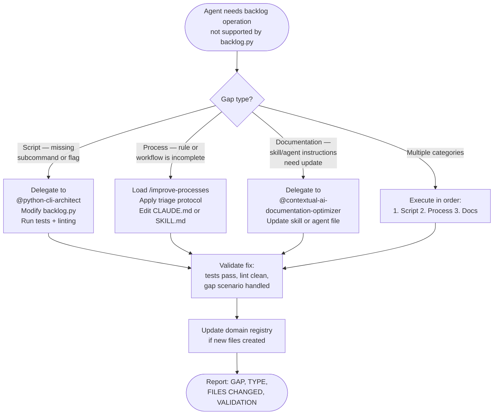
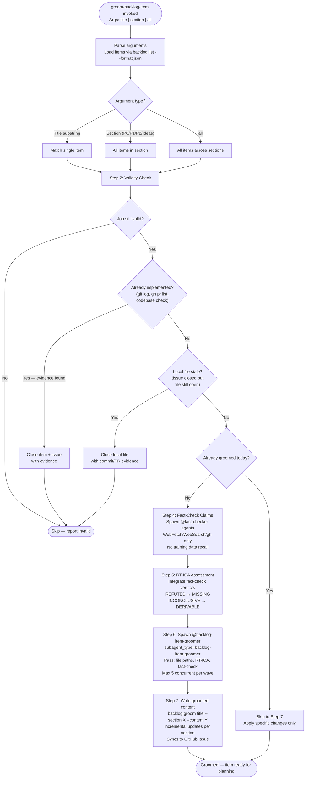

# Backlog Management Workflow

This diagram represents the complete user-facing workflow for the backlog and milestone management system in this repository. It covers all entry points (hook-triggered, direct invocation, interactive browser) and all argument modes for `/work-backlog-item`, the new path when no backlog item is found (offering to create one via `/create-backlog-item`), every decision branch across all six skills, the full milestone lifecycle (`/create-milestone` → `/group-items-to-milestone` → `/start-milestone` → `/complete-milestone`), all external system interactions (GitHub Issues, Projects V2, Milestones, SAM planning, grooming), and all terminal states (success, blocked, failure, stop conditions).

> **NOTE (2026-02-27)**: BACKLOG.md was removed. Backlog items now live in `.claude/backlog/` per-item files; GitHub Issues are the source of truth.
>
> **NOTE (2026-03-01)**: Added `/backlog-tools-administrator` skill and workflow, `/groom-backlog-item` workflow, and Data Architecture section. Updated legend. Some references to BACKLOG.md in the main diagram are stale and will be updated in a future pass.

```mermaid
flowchart TD
    %% ─── HOOK-TRIGGERED ENTRY POINTS ───
    SessionStartHook(["Hook: session-start-backlog.cjs fires\nat Claude Code session start"])
    SessionStartHook -->|"Injects additionalContext:\n'use /work-backlog-item to browse,\nplan, and track items'\n+ setup-github reminder"| UserSession[User in active session]

    StopHook(["Hook: stop-backlog-reminder.cjs fires\nat Claude Code session stop"])
    StopHook -->|"Injects additionalContext:\n'New ideas? → /work-backlog-item\nCompleted items? → /work-backlog-item close'"| UserSession

    %% ─── ENTRY POINT DISPATCH ───
    UserSession --> Invoke{"/work-backlog-item invoked\nWhat are the arguments?"}

    Invoke -->|"No arguments"| Browser
    Invoke -->|"setup-github"| SetupGitHub
    Invoke -->|"close {title}"| Close9Start
    Invoke -->|"resolve {title}"| Resolve9Start
    Invoke -->|"Title substring"| Step1
    Invoke -->|"--auto {title}"| AutoFlag["Set AUTO flag\nNo AskUserQuestion calls\nDerive from context\nLog all decisions"]
    AutoFlag --> Step1

    %% ─── INTERACTIVE BROWSER MODE ───
    Browser["Step 0: Interactive Browser\nRead BACKLOG.md\nParse H3 headings: P0, P1, P2, Ideas\nDetermine grooming status per item"]
    Browser --> BrowserStatus["Grooming status per item:\n✅ Has Plan field in BACKLOG.md\n🔍 Has file in .claude/grooming-reports/\n📋 Neither — ungroomed"]
    BrowserStatus --> BrowserDisplay["Display numbered list with status\nAsk: Which item to work on?"]
    BrowserDisplay --> BrowserInput{"User input"}

    BrowserInput -->|"[number] — select item"| Step1
    BrowserInput -->|"G [number] — groom one"| GroomOne["Invoke groom-backlog-item {title}"]
    BrowserInput -->|"G all — groom all"| GroomAll["Invoke groom-backlog-item all"]
    BrowserInput -->|"D [number] — view details"| ShowDetail["Display: description,\nresearch_first field,\ngrooming manifest if exists"]
    BrowserInput -->|"C [number] — close"| Close9Start
    BrowserInput -->|"R [number] — resolve"| Resolve9Start

    GroomOne --> BrowserDisplay
    GroomAll --> BrowserDisplay
    ShowDetail --> BrowserDisplay

    %% ─── SETUP-GITHUB COMMAND ───
    SetupGitHub["setup-github command\n(initializes GitHub infrastructure)"]
    SetupGitHub --> SG1["Run github_project_setup.py labels\n--repo Jamie-BitFlight/claude_skills\n(creates 13 taxonomy labels:\npriority:*, type:*, status:*)"]
    SG1 --> SG2{"Open milestones\nexist?"}
    SG2 -->|"No"| SG3["Create milestone via gh api REST:\n'v1.0 — Skills Foundation'\ndue_on: 2026-03-31"]
    SG2 -->|"Yes"| SG4
    SG3 --> SG4{"GitHub Projects\nexist for owner?"}
    SG4 -->|"No"| SG5["Prompt: 'Create GitHub Project\nclaude_skills Backlog? (yes/no)'"]
    SG4 -->|"Yes"| SGDone
    SG5 -->|"yes"| SG6["gh project create --owner Jamie-BitFlight\ngh project link to repo"]
    SG5 -->|"no"| SGDone
    SG6 --> SGDone["Report setup summary:\nN labels created, milestone #N, project #N\nReference: projects-v2.md for custom fields"]
    SGDone --> STOP_SG(["STOP — setup-github complete"])

    %% ─── STEP 1: FIND BACKLOG ITEM ───
    Step1["Step 1: Find Backlog Item\nRead BACKLOG.md\nSearch H3 headings case-insensitively\nagainst $ARGUMENTS"]
    Step1 --> MatchCount{"Match count?"}

    MatchCount -->|"Zero"| OfferCreate["No item found matching: {$ARGUMENTS}\nOffer to create via /create-backlog-item"]
    OfferCreate --> CreateDecision{"User wants\nto create item?"}
    CreateDecision -->|"No"| STOP_NOTFOUND(["STOP — no item found, user declined creation"])
    CreateDecision -->|"Yes"| InvokeCreate["Invoke /create-backlog-item\n(guided or quick mode)"]
    CreateDecision -->|"--auto: skip ask\nauto-invoke"| AutoCreate["Invoke /create-backlog-item --auto {title}\nLog: [AUTO] No item found — auto-creating\nDerive fields from research/ files"]
    AutoCreate --> CreateDone
    InvokeCreate --> CreateDone{"Item created\nsuccessfully?"}
    CreateDone -->|"No"| STOP_CREATEFAIL(["STOP — item creation failed\nor user cancelled"])
    CreateDone -->|"Yes"| Step1

    MatchCount -->|"Multiple"| AskPick["List all matches\nAsk user to pick one"]
    AskPick --> Step2
    MatchCount -->|"One"| Step2

    %% ─── STEP 2: EXTRACT FIELDS ───
    Step2["Step 2: Extract Item Fields\ntitle, source, added, description,\nresearch_first, suggested_location, plan\nRecord priority section: P0/P1/P2/Ideas"]
    Step2 --> HasPlan{"Item already has\n**Plan**: field?"}
    HasPlan -->|"Yes"| STOP_HASPLAN(["STOP — 'Item already has plan at {path}.\nUse /python3-development:implement-feature {path}'"])
    HasPlan -->|"No"| Step25

    %% ─── STEP 2.5: GITHUB ISSUE SYNC ───
    Step25["Step 2.5: GitHub Issue Sync\nSearch matched item for **Issue**: #N field"]
    Step25 --> IssueField{"**Issue**: #N\nfield present?"}

    IssueField -->|"Yes"| VerifyIssue["gh issue view N\n-R Jamie-BitFlight/claude_skills\n--json number,title,state,labels"]
    VerifyIssue --> IssueState{"Issue state?"}
    IssueState -->|"open"| Step27
    IssueState -->|"closed"| WarnClosed["Warn: issue already closed\nbefore re-opening planning\n(planning may be stale)"]
    WarnClosed --> Step27

    IssueField -->|"Not found + P0/P1"| OfferIssue["Prompt:\n'This P1/P0 item has no linked GitHub issue.\nCreate one? (yes/no)'"]
    IssueField -->|"Not found + P2/Ideas"| Step3
    IssueField -->|"Not found + P0/P1 + --auto"| AutoSkipIssue["Log: [AUTO] Skipping GitHub issue offer"]
    AutoSkipIssue --> Step3

    OfferIssue -->|"no"| Step3
    OfferIssue -->|"yes"| CreateIssue

    CreateIssue["Step 2.5a: Create GitHub Issue\nBuild story-format body:\n  Story / Description /\n  Acceptance Criteria / Context\nInfer type label from description text\ngh issue create with labels:\n  priority:*, type:*, status:needs-grooming"]
    CreateIssue --> IssueCreated{"Issue created\nsuccessfully?"}
    IssueCreated -->|"gh not installed"| GhNotInstalled["Report: run setup_gh.py first\nSkip GitHub step; continue BACKLOG.md only"]
    IssueCreated -->|"label not found"| CreateLabel["gh label create {label} on the fly\nRetry issue creation"]
    CreateLabel --> IssueCreated
    IssueCreated -->|"API error"| GhError["Report error\nContinue without GitHub issue\n(do not block SAM planning)"]
    GhError --> Step3
    GhNotInstalled --> Step3
    IssueCreated -->|"success"| Writeback["Capture issue number\nWrite **Issue**: #N back to BACKLOG.md"]
    Writeback --> AskMilestone{"Open milestone\nexists — offer assignment?"}
    AskMilestone -->|"Yes, assign"| AssignMilestone["Assign issue to milestone via:\ngh api issues/{N} -X PATCH -F milestone={M}"]
    AskMilestone -->|"Skip"| Step27
    AssignMilestone --> Step27

    %% ─── STEP 2.7: IN-PROGRESS LABEL ───
    Step27["Step 2.7: Set In-Progress Label\n(only when item has **Issue**: #N\nand invocation is title-substring mode)\ngh issue edit N\n  --add-label status:in-progress\n  --remove-label status:needs-grooming"]
    Step27 --> Step3

    %% ─── STEP 3: AUTO-GROOM ───
    Step3["Step 3: Auto-Groom Check\n1. Grep .claude/grooming-reports/ for item title\n2. Check conversation context for\n   recent groom-backlog-item output"]
    Step3 --> GroomExists{"Grooming report\nfound?"}
    GroomExists -->|"Yes"| Step4
    GroomExists -->|"No"| RunGroom["Invoke:\nSkill(command: 'groom-backlog-item', args: '{item title}')\nCaptures: Related Research, Skills, Agents,\nPrior Work, Dependencies, Blockers,\nSuggested First Steps"]
    RunGroom --> GroomResult{"Grooming\nsuccessful?"}
    GroomResult -->|"Yes"| Step4
    GroomResult -->|"No"| Step4NoteGap["Proceed without grooming context\nNote gap in feature request body"]
    Step4NoteGap --> Step4

    %% ─── STEP 4: RT-ICA GATE ───
    Step4["Step 4: RT-ICA Checkpoint\nVerify grooming manifest contains RT-ICA summary\nIf absent, perform RT-ICA now:\n  1. Goal statement\n  2. Reverse prerequisites (enumerate each)\n  3. Availability check per condition:\n     AVAILABLE / DERIVABLE / MISSING\n  4. Decision: APPROVED or BLOCKED"]
    Step4 --> RTICADecision{"RT-ICA\nDecision?"}

    RTICADecision -->|"BLOCKED"| PresentBlocked["Present structured BLOCKED summary:\n  Missing inputs listed\n  'Provide these inputs before proceeding'\n  Wait for user response\n  Do NOT invoke SAM planning"]
    PresentBlocked --> UserResolvesBlock{"User provides\nmissing inputs?"}
    UserResolvesBlock -->|"Yes — re-evaluate"| RTICADecision
    UserResolvesBlock -->|"No / session ends"| STOP_BLOCKED(["STOP — 'SAM planning will not be invoked\nwith known gaps'"])

    RTICADecision -->|"APPROVED\n(carry DERIVABLE as\nAssumptions to confirm)"| Step5

    %% ─── STEP 5: COMPOSE FEATURE REQUEST ───
    Step5["Step 5: Compose Feature Request\nBuild $ARGUMENTS string for add-new-feature:\n  ## Backlog Item: {title}\n  Priority, Source, Added\n  ### Description\n  ### Research Questions\n  ### Suggested Location\n  ### RT-ICA Assessment (Decision, Goal,\n    Verified conditions, Assumptions to confirm)\n  ### Grooming Context (full manifest)"]
    Step5 --> Step6

    %% ─── STEP 6: SAM PLANNING ───
    Step6["Step 6: Invoke SAM Planning\nSkill(command: 'python3-development:add-new-feature',\n      args: '{composed feature request}')\nRuns full SAM pipeline:\n  discovery → codebase analysis → architecture spec\n  → task decomposition → validation → context manifest"]
    Step6 --> SAMResult{"add-new-feature\nresult?"}
    SAMResult -->|"Failure"| STOP_SAMFAIL(["STOP — Report failure\nDo not update BACKLOG.md"])
    SAMResult -->|"Success — plan file created"| Step7

    %% ─── STEP 7: UPDATE BACKLOG ───
    Step7["Step 7: Update BACKLOG.md with Plan Reference\nGlob: plan/tasks-*-{slug}*\nAdd **Plan**: {path} field to matched item\nUpdate last-updated in YAML frontmatter"]
    Step7 --> Step8

    %% ─── STEP 8: REPORT ───
    Step8["Step 8: Report Next Steps\n  Plan file: plan/tasks-{N}-{slug}.md\n  To execute:      /python3-development:implement-feature {slug}\n  To check status: /implementation-manager status . {slug}\n  To close:        /work-backlog-item close {slug}"]
    Step8 --> STOP_PLANNED(["STOP — Item is now planned\n(success terminal state)"])

    %% ─── CLOSE PATH ───
    Close9Start["Step 9a (close): Find Item\nExtract title from 'close {title}'\nSearch H3 headings case-insensitively"]
    Close9Start --> CloseMatch{"Match count?"}
    CloseMatch -->|"Zero"| STOP_CLOSENOTFOUND(["STOP — 'No backlog item found matching: {title}'"])
    CloseMatch -->|"Multiple"| AskPickClose["List matches\nAsk user to pick one"]
    AskPickClose --> AlreadyClosed
    CloseMatch -->|"One"| AlreadyClosed

    AlreadyClosed{"Item already in\n## Completed section?"}
    AlreadyClosed -->|"Yes"| STOP_ALREADYCLOSED(["STOP — 'Item already closed on {date}'"])
    AlreadyClosed -->|"No"| CheckPlanField

    CheckPlanField{"**Plan**: field\npresent?"}
    CheckPlanField -->|"No"| STOP_NOPLAN(["STOP — 'No plan file recorded for {title}.\nRun /work-backlog-item {title} first,\nor use /work-backlog-item resolve {title}\nif no plan was needed'"])
    CheckPlanField -->|"Yes"| ReadPlan["Read plan file\nCount total_tasks: lines matching - [ ] or - [x]\nCount checked_tasks: lines matching - [x]"]

    ReadPlan --> ChecklistComplete{"checked_tasks\n== total_tasks?"}
    ChecklistComplete -->|"No"| STOP_INCOMPLETE(["STOP — 'Checklist incomplete: N/M tasks done'\nList unchecked task lines\n'Complete all tasks before closing'"])
    ChecklistComplete -->|"Yes (100%)"| VerifyAgent

    VerifyAgent["Step 9d: Spawn Verification Agent\n(general-purpose subagent)\nPrompt: read plan file, check git log --oneline -20,\nread 2-3 key changed files\nAssess: does implementation satisfy stated goal?\nReturn: PASS or FAIL + evidence sentence + gaps"]
    VerifyAgent --> AgentVerdict{"Agent\nverdict?"}
    AgentVerdict -->|"FAIL"| STOP_VERFAIL(["STOP — 'Verification FAILED for {title}'\nList gaps found\n'Address these gaps before closing'"])
    AgentVerdict -->|"PASS + evidence"| WriteClose

    WriteClose["Step 9e: Write Closing Record to BACKLOG.md\nUpdate matched item:\n  **Completed**: {YYYY-MM-DD}\n  **Status**: DONE — verified by checklist (N/M) + acceptance criteria\n  **Plan**: {plan file path}\nUpdate last-updated and last-completed in YAML frontmatter"]
    WriteClose --> CloseIssueCheck{"Item has\n**Issue**: #N field?"}
    CloseIssueCheck -->|"No"| STOP_CLOSED
    CloseIssueCheck -->|"Yes"| CloseGHIssue["gh issue close N\n-R Jamie-BitFlight/claude_skills\n--comment 'Completed. Checklist N/M — PASS.\nPlan: {plan file path}'"]
    CloseGHIssue --> STOP_CLOSED(["STOP — Item closed\nChecklist N/M + acceptance criteria: PASS\nBACKLOG.md updated\nGitHub issue #N closed (if linked)"])

    %% ─── RESOLVE PATH ───
    Resolve9Start["Step 9a (resolve): Find Item\nExtract title from 'resolve {title}'\nSearch H3 headings case-insensitively"]
    Resolve9Start --> ResolveMatch{"Match count?"}
    ResolveMatch -->|"Zero"| STOP_RESNOTFOUND(["STOP — 'No backlog item found matching: {title}'"])
    ResolveMatch -->|"Multiple"| AskPickResolve["List matches\nAsk user to pick one"]
    AskPickResolve --> AskReason
    ResolveMatch -->|"One"| AskReason

    AskReason["AskUserQuestion:\n'Why is this item no longer applicable?'\n(free text — required; blocks until provided)"]
    AskReason --> ReasonProvided{"Reason\nprovided?"}
    ReasonProvided -->|"Empty / skipped"| AskReason
    ReasonProvided -->|"Yes"| WriteResolved["Update matched item in BACKLOG.md:\n  **Resolved**: {YYYY-MM-DD}\n  **Status**: RESOLVED — {user reason}\nUpdate last-updated in YAML frontmatter"]
    WriteResolved --> STOP_RESOLVED(["STOP — 'Backlog item {title} resolved'\nReason recorded in BACKLOG.md"])

    %% ─── /create-backlog-item SKILL (standalone or inline) ───
    subgraph CreateBacklogItem ["/create-backlog-item skill"]
        CBI_Entry{{"$ARGUMENTS mode?"}}
        CBI_Entry -->|"Empty — guided"| CBI_Q1["AskUserQuestion x5:\n  1. Title (free text)\n  2. Priority: P0/P1/P2/Idea\n  3. Description\n  4. Source (with options)\n  5. Type: Feature/Bug/Refactor/Docs/Chore"]
        CBI_Entry -->|"quick {title}"| CBI_Quick["Extract title from args\nAsk only: Priority + Description\nSource defaults: Session observation\nType defaults: Feature"]
        CBI_Q1 --> CBI_Validate
        CBI_Quick --> CBI_Validate
        CBI_Validate{"Required fields present?\ntitle, priority, description"}
        CBI_Validate -->|"Missing field"| CBI_STOP_MISSING(["STOP — report which field is missing"])
        CBI_Validate -->|"All present"| CBI_Dedup["Duplicate detection:\nSearch BACKLOG.md H3 headings\nfor case-insensitive overlap\n(edit distance <= 2 tokens / same first 3 words)"]
        CBI_Dedup --> CBI_DupFound{"Possible\nduplicate found?"}
        CBI_DupFound -->|"No"| CBI_Compose
        CBI_DupFound -->|"Yes"| CBI_DupAsk["AskUserQuestion:\n'Possible duplicate: {title} exists in {section}.\nProceed anyway? Yes/No'"]
        CBI_DupAsk -->|"No"| CBI_STOP_DUP(["STOP — user declined; no write"])
        CBI_DupAsk -->|"Yes"| CBI_Compose
        CBI_Compose["Compose item block:\n  ### {title}\n  **Source**, **Added**, **Priority**, **Type**\n  **Description**\n  **Research first** (if ? lines in description)"]
        CBI_Compose --> CBI_Write["Write to BACKLOG.md\nInsert into correct section:\n  P0 → ## P0 - Must Have\n  P1 → ## P1 - Should Have\n  P2 → ## P2 - Nice to Have\n  Idea → ## Ideas\nReplace _(Empty)_ or append after last ###\nIncrement p*-count in YAML frontmatter\nSet last-updated to today"]
        CBI_Write --> CBI_Confirm["Report confirmation:\n  Title, Priority, Section, Added date\n  Next: /groom-backlog-item {title}\n        /work-backlog-item {title}"]
        CBI_Confirm --> CBI_GHPrompt{"Priority is P0 or P1?\nOffer GitHub Issue creation?"}
        CBI_GHPrompt -->|"P2/Idea — skip"| CBI_STOP_DONE(["STOP — item created\n(local only)"])
        CBI_GHPrompt -->|"P0/P1 — ask user"| CBI_GHDecision{"Create GitHub\nIssue? Yes/No"}
        CBI_GHDecision -->|"No"| CBI_STOP_DONE
        CBI_GHDecision -->|"Yes"| CBI_GHCreate["Build story-format body\ngh issue create with labels:\n  priority:*, type:*, status:needs-grooming\nCapture issue number\nWrite **Issue**: #N back to BACKLOG.md"]
        CBI_GHCreate --> CBI_GHResult{"Issue created?"}
        CBI_GHResult -->|"gh not installed"| CBI_GHSkip["Report setup command\nSkip; item written to BACKLOG.md already"]
        CBI_GHResult -->|"API error"| CBI_GHSkip
        CBI_GHResult -->|"label not found"| CBI_GHLabel["gh label create on the fly\nRetry issue creation"]
        CBI_GHLabel --> CBI_GHResult
        CBI_GHResult -->|"success"| CBI_STOP_DONE
        CBI_GHSkip --> CBI_STOP_DONE
    end

    %% ─── MILESTONE LIFECYCLE ───
    subgraph MilestoneLifecycle ["Milestone Lifecycle"]

        %% create-milestone
        CM_Entry{{"create-milestone\n$ARGUMENTS mode?"}}
        CM_Entry -->|"Empty — guided"| CM_Q["AskUserQuestion x3:\n  1. Title (required)\n  2. Due date YYYY-MM-DD (optional)\n  3. Description (optional)"]
        CM_Entry -->|"quick {title}"| CM_Quick["Extract title\nAsk only: due date, description"]
        CM_Q --> CM_DupCheck
        CM_Quick --> CM_DupCheck
        CM_DupCheck["Duplicate check:\ngh api milestones\n--jq select state==open\nDoes title already exist?"]
        CM_DupCheck --> CM_DupFound{"Open milestone\nwith same title?"}
        CM_DupFound -->|"Yes"| CM_UseExisting{"Use existing\nor create new?"}
        CM_UseExisting -->|"use existing"| CM_STOP_EXISTING(["STOP — print existing milestone number\n+ next-step commands"])
        CM_UseExisting -->|"create new"| CM_Create
        CM_DupFound -->|"No"| CM_Create
        CM_Create["gh api repos/.../milestones -X POST\n  title, description, due_on, state=open\nCapture returned .number field"]
        CM_Create --> CM_Result{"API result?"}
        CM_Result -->|"Error"| CM_STOP_ERR(["STOP — print full API response"])
        CM_Result -->|"Success"| CM_Confirm["Report:\n  Title, Number, Due date, URL\nNext: /group-items-to-milestone {number}"]
        CM_Confirm --> GM_Entry

        %% group-items-to-milestone
        GM_Entry["group-items-to-milestone\nArgs: {milestone-number} [filter]"]
        GM_Entry --> GM_Resolve["Resolve milestone:\ngh api milestones/{number}\n--jq number, title, state"]
        GM_Resolve --> GM_Valid{"Milestone\nfound and open?"}
        GM_Valid -->|"Not found / closed"| GM_STOP_NOTFOUND(["STOP — report, list open milestones"])
        GM_Valid -->|"Open"| GM_Load["Load BACKLOG.md items\nApply optional filter (P0/P1/P2/title substring)\nDetermine per-item status:\n  Has issue (verify state via gh issue view)\n  No issue (P0/P1 — flagged for creation)\n  Already in this milestone"]
        GM_Load --> GM_Select["Present selection list:\n  [✓] has issue  [ ] needs issue  [~] already assigned\nAskUserQuestion:\n  'Which items to add? (numbers, all, P0, P1)'"]
        GM_Select --> GM_CreateMissing["For each selected item with no issue:\n  Build story-format body\n  gh issue create with labels + --milestone {number}\n  Write **Issue**: #N back to BACKLOG.md\n  (Skip issue creation for P2/Ideas)"]
        GM_CreateMissing --> GM_AssignExisting["For each selected item with existing issue\nnot yet in this milestone:\n  gh api issues/{N} -X PATCH -F milestone={M}"]
        GM_AssignExisting --> GM_ProjectUpdate["Update Project V2 Status = Backlog\nfor each newly assigned item\n(via GraphQL if project exists)"]
        GM_ProjectUpdate --> GM_Report["Report:\n  Assigned N items\n  Created N new issues\n  Skipped N already-assigned\n  BACKLOG.md updated\nNext: /start-milestone {number}"]
        GM_Report --> SM_Entry

        %% start-milestone
        SM_Entry["start-milestone\nArgs: {milestone-number}"]
        SM_Entry --> SM_Resolve["gh api milestones/{number}\n--jq number, title, state,\nopen_issues, closed_issues"]
        SM_Resolve --> SM_Valid{"Milestone\nstate?"}
        SM_Valid -->|"closed"| SM_STOP_CLOSED(["STOP — milestone already closed"])
        SM_Valid -->|"open, 0 issues"| SM_WarnEmpty["Warn: 'No open issues.\nAdd items first with /group-items-to-milestone'"]
        SM_WarnEmpty --> SM_Confirm
        SM_Valid -->|"open, N issues"| SM_ListIssues["gh issue list --milestone {title}\n--state open --json number,title,labels\nShow current label state per issue"]
        SM_ListIssues --> SM_Confirm
        SM_Confirm["AskUserQuestion:\n'Transition N issues\nstatus:needs-grooming → status:in-progress?\nProceed? Yes/No'"]
        SM_Confirm -->|"No"| SM_STOP_DECLINED(["STOP — no changes made"])
        SM_Confirm -->|"Yes"| SM_EnsureLabel["gh label create status:in-progress\n(idempotent — 2>/dev/null or true)"]
        SM_EnsureLabel --> SM_BulkLabel["For each open issue in milestone:\n  gh issue edit {N}\n    --add-label status:in-progress\n    --remove-label status:needs-grooming\nLog success/failure per issue; continue on failure"]
        SM_BulkLabel --> SM_ProjectUpdate2["Update Project V2 Status = In Progress\nfor each issue (via GraphQL if project exists)"]
        SM_ProjectUpdate2 --> SM_Report["Report:\n  N issues → status:in-progress\n  M issues failed\nNext: /work-backlog-item {title} for each item\nTrack: gh issue list --milestone {title}"]
        SM_Report --> CompM_Entry

        %% complete-milestone
        CompM_Entry["complete-milestone\nArgs: {milestone-number}"]
        CompM_Entry --> CompM_Resolve["gh api milestones/{number}\n--jq number, title, state,\nopen_issues, closed_issues, due_on"]
        CompM_Resolve --> CompM_Valid{"Milestone\nstate?"}
        CompM_Valid -->|"already closed"| CompM_STOP_ALREADY(["STOP — report closed date"])
        CompM_Valid -->|"open"| CompM_FetchIssues["Fetch all issues:\n  gh issue list --milestone {title} --state open\n  gh issue list --milestone {title} --state closed\nDisplay state: closed count ✓ / open count ✗"]
        CompM_FetchIssues --> CompM_AnyOpen{"Any open\nissues?"}
        CompM_AnyOpen -->|"None — skip to close"| CompM_Close
        CompM_AnyOpen -->|"Yes"| CompM_HandleOpen["AskUserQuestion:\n'What to do with {N} open issues?'\nA) Carry forward to NEW milestone\nB) Carry forward to EXISTING milestone\nC) Remove from milestone (leave open, unassigned)\nD) Close as incomplete"]
        CompM_HandleOpen -->|"A — new milestone"| CompM_NewMS["Prompt: new title + due date\ngh api milestones -X POST\nReassign open issues to new milestone number"]
        CompM_HandleOpen -->|"B — existing milestone"| CompM_ExistMS["gh api milestones --jq select state==open\nUser picks milestone\nReassign open issues to selected milestone"]
        CompM_HandleOpen -->|"C — unassign"| CompM_Unassign["gh api issues/{N} -X PATCH -F milestone=null"]
        CompM_HandleOpen -->|"D — close incomplete"| CompM_CloseIncomplete["gh issue close {N}\n--comment 'Closed incomplete as part of\nmilestone #{M} completion'"]
        CompM_NewMS --> CompM_Close
        CompM_ExistMS --> CompM_Close
        CompM_Unassign --> CompM_Close
        CompM_CloseIncomplete --> CompM_Close
        CompM_Close["gh api milestones/{number} -X PATCH\n  -f state=closed"]
        CompM_Close --> CompM_ProjectDone["Update Project V2 Status = Done\nfor all closed issues (GraphQL)"]
        CompM_ProjectDone --> CompM_Report["Completion report:\n  Completed: N/total (pct%)\n  Carried forward: N → milestone #{new}\n  Removed: N  /  Closed incomplete: N"]
        CompM_Report --> CompM_NextSteps{"Carry-forward\nitems exist?"}
        CompM_NextSteps -->|"Yes"| CompM_STOP_DONE(["STOP — milestone closed\nNext: /group-items-to-milestone {new_N}\n      /start-milestone {new_N}"])
        CompM_NextSteps -->|"No"| CompM_STOP_CLEAN(["STOP — milestone closed clean"])
    end
```

## Backlog Tooling Administration

When the backlog process hits a capability gap (a needed operation that `backlog.py` or the skills don't support), the `/backlog-tools-administrator` skill closes the gap instead of bypassing the script.



**Domain**: 31 files across scripts, skills, agents, hooks, templates, references, tests, and rules. Full inventory in `.claude/skills/backlog-tools-administrator/references/domain-registry.md`.

## Grooming Workflow (groom-backlog-item)

The `/groom-backlog-item` skill refines backlog items before planning. It fact-checks claims, runs RT-ICA, and delegates to `@backlog-item-groomer` agents.



**Groomed sections**: Fact-Check, RT-ICA, Reproducibility, Priority, Impact, Scope, Output/Evidence, Dependencies, Research, Skills, Agents, Prior Work, Files, Decision.

## Data Architecture

```text
GitHub Issues (SOURCE OF TRUTH)
  |
  |-- synced via backlog.py (add, sync, update, groom, close, resolve)
  |
  v
.claude/backlog/*.md (LOCAL CACHE — per-item files)
  |-- frontmatter: name, description, metadata (priority, source, added, status, issue, groomed)
  |-- body: groomed sections (Fact-Check, RT-ICA, subsections)
  |
  |-- created by: /create-backlog-item -> backlog add
  |-- groomed by: /groom-backlog-item -> backlog groom
  |-- planned by: /work-backlog-item -> backlog update --plan
  |-- closed by: /work-backlog-item close -> backlog close
  |-- resolved by: /work-backlog-item resolve -> backlog resolve
  |
  '-- NEVER edited directly with Write/Edit tools
      (invoke /backlog-tools-administrator when script lacks capability)
```

## Legend

| Symbol | Meaning |
|---|---|
| Stadium `(["..."])` | Terminal state: the workflow stops here (success, failure, blocked, or cancelled) |
| Diamond `{"..."}` | Decision branch: evaluates a condition and routes to one of several paths |
| Rectangle `["..."]` | Action or process step executed by the skill |
| Rounded rectangle `{{"..."}}` | Entry point dispatch or subgraph entry |
| Subgraph border | A separate skill invoked as a distinct unit (`/create-backlog-item`, milestone lifecycle skills) |
| `STOP —` prefix on terminal nodes | Indicates skill halts execution at that node |
| Arrow label | Condition or event that selects that edge |
| SessionStart / Stop hooks | JavaScript `.cjs` files in `.claude/hooks/`; inject `additionalContext` into the session at boundaries |
| SAM planning | `add-new-feature` skill; runs the full Stateless Agent Methodology pipeline (discovery, analysis, architecture, task decomposition, validation) |
| RT-ICA | Reverse-prerequisite, Inputs, Conditions, Availability gate; structured readiness check performed before invoking SAM planning; outputs APPROVED (with DERIVABLE assumptions) or BLOCKED (with missing input list) |
| groom-backlog-item | Separate skill invoked inline in Step 3 of work-backlog-item; produces a context manifest (Related Research, Skills, Agents, Prior Work, Dependencies, Blockers, Suggested First Steps) that feeds Steps 4 and 5 |
| backlog-tools-administrator | Meta-skill invoked when backlog tooling has a capability gap; classifies gap and delegates to appropriate specialist agent |
| gh commands | All `gh` commands require `-R Jamie-BitFlight/claude_skills`; git remote points to a local proxy (`127.0.0.1`), not `github.com`, so auto-detection fails |
| Project V2 | GitHub Projects V2; status transitions managed via GraphQL (Backlog on group, In Progress on start, Done on complete); see `gh/references/projects-v2.md` |
| Per-item files | Markdown files in `.claude/backlog/` with YAML frontmatter; local cache of GitHub Issues; all CRUD via `backlog.py` |
