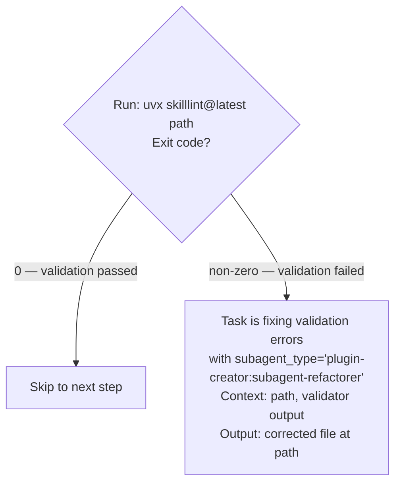

# Delegation Format Standard

This file defines the canonical format for delegation instructions in workflow documentation
(SKILL.md, agent files, reference files). AI agents reading workflow docs act deterministically
when instructions name the agent, the inputs, and the expected output — without inference.

---

## Scope: Who This File Is For

**The Agent tool is only available to the orchestrator** — the main Claude Code context running
the session. Subagents spawned via `subagent_type`, or skills loaded with `context: fork`, do
NOT have the Agent tool and cannot delegate further.

This means:

- Delegation instructions written in this format apply only to workflow documentation read by
  the orchestrator
- Skills and reference files loaded by subagents should contain task instructions — not
  orchestration instructions — because the subagent cannot act on them
- If a skill is designed to be read by the orchestrator (not a subagent), state that in its
  frontmatter or opening section so the reader knows delegation steps are actionable

---

## Purpose

Delegation instructions fail when they are:

- Ambiguous about which agent to use
- Silent about what context to pass
- Vague about what the agent should produce

This standard eliminates those failure modes.

---

## Correct Format: Workflow Step

A workflow step that delegates work to an agent:

```text
N. Task is [description] with subagent_type="plugin:agent-name"
   Context to include in the prompt: [specific file paths, artifacts, or data to pass]
   Output: [specific artifact the agent produces — file path, format, content]
```

### Example

```text
3. Task is agent prompt optimization with subagent_type="plugin-creator:subagent-refactorer"
   Context to include in the prompt: agents/improvement-generator.md (agent file to refactor),
     .planning/kaizen/findings/session-analysis.md (evidence of observed behavior)
   Output: .planning/kaizen/improvements/improvement-generator-patch.md — markdown file
     containing the revised agent prompt with rationale for each change
```

Key properties:

- `subagent_type` names the agent to invoke — either `"plugin:agent-name"` for marketplace agents or a bare built-in type string like `"general-purpose"` or `"context-gathering"`
- Context names specific file paths or artifacts — not vague descriptions like "analysis results"
- Output names a specific file path and describes its format and content

---

## Correct Format: Decision Branch

Use a Mermaid `flowchart TD` with a diamond node. The condition in the diamond must be
evaluable by an AI agent using an observable fact or a command result — not a subjective judgment.



Key properties:

- Diamond label describes how to evaluate the condition — command, file existence check, or
  observable output
- Branch labels are concrete outcomes — exit codes, file presence, specific output strings
- Each branch either skips to a named step or names a delegation with subagent_type

---

## Wrong Formats

### 1. Agent reference alone

```text
# WRONG
@subagent-refactorer
```

Claude reads `@subagent-refactorer` as a reference notation, not an instruction. There is no
context, no output, and no agent routing.

### 2. Tool API call templates

```text
# WRONG
Agent(subagent_type="plugin-creator:subagent-refactorer", prompt="Fix the agent")
```

This is Tool API syntax. Workflow documentation is not code. Claude already knows the Agent tool
signature. Embedding call templates in docs teaches nothing and adds noise.

### 3. Arrow routing notation

```text
# WRONG
Step 3 → subagent_type="plugin-creator:subagent-refactorer"
```

Arrow notation identifies a destination but omits workflow context (what to pass) and expected
output (what to verify). The agent receiving this has no basis for writing a delegation prompt.

### 4. Act-as roleplay in general-purpose Task

```text
# WRONG
Use a general-purpose agent and tell it to act as @subagent-refactorer
```

A general-purpose agent roleplaying a specialist does not load the specialist's skills,
does not apply the specialist's training, and produces lower-quality output. Use the actual
specialist agent.

### 5. Tables with subagent_type column

```text
# WRONG
| Step | Agent | Notes |
|------|-------|-------|
| 3    | plugin-creator:subagent-refactorer | fix prompt |
```

Tables flatten context and output into generic columns. The agent reading this cannot determine
what to pass or what to verify. Tables are acceptable for flat data — not for workflow steps.

### 6. `\n` in Mermaid node labels

```text
# WRONG
Q{Condition\nEvaluate}
```

Mermaid does not render `\n` as a line break inside node labels. Use `<br>` instead.

### 7. Bare colons in Mermaid node label strings

```text
# WRONG
Fix["subagent_type: plugin-creator:subagent-refactorer"]
```

Colons inside Mermaid quoted strings can break rendering. Use `=` for assignments inside labels:

```text
# CORRECT
Fix["subagent_type='plugin-creator:subagent-refactorer'"]
```

---

## Relationship to CLAUDE.md

The `## Task Delegation Standards` section in `.claude/CLAUDE.md` references the delegation
template from the `agent-orchestration:agent-orchestration` skill. This file defines the
*format* of individual workflow steps within that template — it is a formatting standard, not
a replacement for the orchestration skill.

This file stands alone as a reference for authors of SKILL.md, agent files, and reference
documents. When writing delegation steps in any of those file types, follow this standard.
