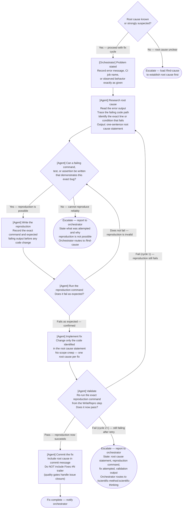

# Fix Delegation Discipline

When delegating a bug fix to any agent (subagent, kage-bunshin, teammate), the delegation prompt MUST follow the reproduction-first cycle. Applies to all fix work — ad-hoc prompts, SAM tasks, kage-bunshin session prompts.

## Fix Cycle



## Delegation Prompt Template

Every fix delegation prompt MUST include these 4 fields:

```text
Problem: [Observable symptom — error message text, CI job name, broken behavior description]

Reproduce: [Exact failing command or test invocation — agent runs this FIRST before changing anything]

Success criteria: [Expected output or exit code after the fix — what "passing" looks like]

Cycle instruction: Run the reproduction command first and confirm the failure. Fix only what is needed.
Re-run the exact same reproduction command. If it passes, commit and report DONE.
If it still fails, research the root cause and repeat. After 3 cycles without progress, report BLOCKED.
```

## Terminal States

| State | Condition | Agent action |
|---|---|---|
| Validated fix | Reproduction command passes | Commit, report STATUS: DONE with fix summary |
| Cannot reproduce | Reproduction command does not fail | Report exact command run and exact output observed; do not guess a fix |
| Partially fixed | Some reproduction commands pass, others fail | Report which pass and which still fail; do not commit partial fixes |
| Stuck after 3 cycles | Same failure persists after 3 research-fix iterations | Report last command, output, and working hypothesis; activate `/scientific-method:scientific-thinking` |

## Wrong / Right Examples

### Ad-hoc agent delegation

**Wrong** — no reproduction, no validation:

```text
Fix the ruff ANN401 errors in backlog_core. Run ruff check and fix what it finds.
```

**Right** — reproduction first, validated against same command:

```text
Problem: ruff ANN401 violations in backlog_core fail CI

Reproduce: uv run ruff check --select ANN401 plugins/development-harness/backlog_core/
Expected output before fix: 8 errors listed

Success criteria: same command exits 0 with no output

Cycle instruction: Run the reproduction command first and confirm the failure. Fix only what is needed.
Re-run the exact same reproduction command. If it passes, commit and report DONE.
If it still fails, research the root cause and repeat. After 3 cycles without progress, report BLOCKED.
```

### Kage-bunshin session prompts

**Wrong** — no reproduction steps:

```text
Fix the CI failures. Check gh run view and fix what you find.
```

**Right** — reproduction cycle for each failure:

```text
Problem: Three CI failures on main — ruff ANN401, ty unresolved-attribute, pytest ImportError

Reproduce:
1. uv run ruff check --select ANN401 plugins/development-harness/ → expect errors (confirm count before fixing)
2. uv run ty check plugins/development-harness/ → expect unresolved-attribute errors
3. uv run pytest tests/ -x → expect ImportError for fastmcp[tasks]

Success criteria: all three commands exit 0 with no errors

Cycle instruction: For each failure — confirm it, fix it, re-run the same command to validate.
Commit only after all reproduction commands pass. After 3 cycles on any single failure without progress, report BLOCKED.
```

## Cross-References

- For CoVe methodology applied to self-checking prompts, activate `/cove-prompt-design`.
- For unknown root cause requiring hypothesis testing before writing the reproduction, activate `/find-cause`.
- For post-fix validation protocol where the reproduction command IS the validation artifact, activate `/dh:validation-protocol`.
- For unknown failures requiring structured hypothesis testing across multiple cycles, activate `/scientific-method:scientific-thinking`.
