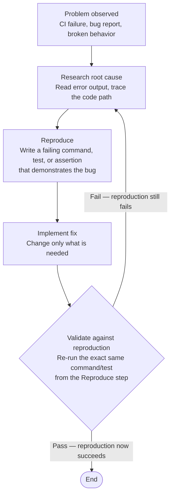

# Fix Delegation Discipline

When delegating a bug fix or CI failure to an agent (including kage-bunshin sessions), the delegation prompt MUST follow the reproduction-first cycle. This applies to all fix work — ad-hoc prompts, SAM tasks, kage-bunshin session prompts.

## Fix Flow (CoVe-aligned)



## Delegation Prompt Requirements

Every fix delegation prompt MUST include:

1. **Problem**: what is broken (error message, CI job name, observed behavior)
2. **Reproduction command**: a specific command or test that demonstrates the failure — the agent runs this FIRST before changing anything
3. **Success criteria**: what the reproduction command should output after the fix
4. **Validation step**: "after fixing, re-run the reproduction command and confirm it passes"

## Wrong / Right Examples

**Wrong** — no reproduction, no validation:

```text
Fix the ruff ANN401 errors in backlog_core. Run ruff check and fix what it finds.
```

**Right** — reproduction first, validation against reproduction:

```text
Fix ruff ANN401 errors in backlog_core.

Reproduce: uv run ruff check --select ANN401 plugins/development-harness/backlog_core/
Expected output before fix: 8 errors
Fix: replace typing.Any with specific types where possible, or add per-file-ignores with justification
Validate: re-run the same ruff check command. Expected: 0 errors
```

**Wrong** — kage-bunshin prompt with no reproduction:

```text
Fix the CI failures. Check gh run view and fix what you find.
```

**Right** — kage-bunshin prompt with reproduction cycle:

```text
Fix CI failures on main. Reproduction steps:
1. Run: uv run ruff check --select ANN401 → expect 8 errors (confirm before fixing)
2. Run: uv run ty check plugins/development-harness/ → expect unresolved-attribute errors
3. Run: uv run pytest tests/ -x → expect ImportError for fastmcp[tasks]

For each: confirm the failure, fix it, re-run the same command to validate.
Commit only after all reproduction commands pass.
```

## Relationship to Existing Skills

- `/cove-prompt-design` — CoVe methodology for self-checking prompts. Fix delegation is a specific application: the "verification" step is re-running the reproduction.
- `/find-cause` — wraps investigation with evidence-chain discipline. Use when the root cause is unknown.
- `/dh:validation-protocol` — post-fix validation protocol. The reproduction command IS the validation artifact.
- `/scientific-method:scientific-thinking` — for unknown failures requiring hypothesis testing.
