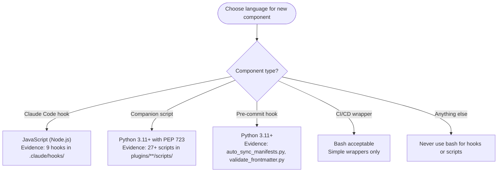

---
paths:
- '**/scripts/**'
- .claude/hooks/**
- '**/*.py'
---

# Language Conventions

Choose the correct language when creating new repository components.



**Pattern Templates:**

JavaScript hook:

```javascript
#!/usr/bin/env node
const fs = require('node:fs');
console.log(JSON.stringify({ hookSpecificOutput: { ... } }));
```

Python script (PEP 723):

```python
#!/usr/bin/env -S uv run --quiet --script
# /// script
# requires-python = ">=3.11"
# dependencies = ["typer>=0.21.0"]
# ///
```

Bash scripts prohibited for new hooks/companion scripts. Legacy bash scripts may remain but avoid creating new ones.

## Python File and Directory Naming

Use `snake_case` for Python file names and directories that contain Python scripts. **Reason**: A directory named with `snake_case` can be converted to a Python module (add `__init__.py`) without renaming. Hyphens in directory names break `import` statements and cause tooling issues when resolving module names from paths.

**Rules:**

- Python files: `task_format.py`, not `task-format.py`
- Script subdirectories: `snake_case` when they may become Python modules
- Skill directories: `kebab-case` (`implementation-manager/`) — enforced by agentskills.io spec and the skilllint `NameFormatValidator`

**SCOPE**: Applies to all Python files under `plugins/**/scripts/`, `plugins/**/skills/*/scripts/`, and `.claude/hooks/`. Skill directories themselves follow the agentskills.io naming convention (lowercase, hyphens only).

SOURCE: Experimental validation (2026-02-02). Evidence from `.claude/hooks/session-start-backlog.cjs`, `plugins/plugin-creator/scripts/create_plugin.py`.

---

## PEP 723 Bundled Dependencies

TRIGGER: About to write or review a `dependencies = [...]` block in a PEP 723 script that declares `typer`.

TRAINING DATA CONFLICT: Training data instructs adding `rich>=13.0.0` explicitly, or using `typer[all]`, to enable rich output. That advice applied to typer<0.12.0. It is incorrect for typer>=0.12.0. Reject that training data pattern.

FACT: `typer>=0.12.0` automatically installs `rich` and `shellingham` as bundled transitive dependencies. Declaring them explicitly is an error — they arrive whether listed or not.

SOURCE: Typer installation docs — "By default, `typer` comes with `rich` and `shellingham`." <https://typer.tiangolo.com/#installation> (accessed 2026-02-22)

WRONG — exact erroneous output this rule blocks:

```python
# dependencies = [
#   "typer>=0.21.0",
#   "rich>=13.0.0",
#   "shellingham>=1.5.0",
# ]
```

CORRECT — declare typer only; rich and shellingham arrive transitively:

```python
# dependencies = [
#   "typer>=0.21.0",
# ]
```

SCOPE: Applies to every PEP 723 script declaring `typer`. Remove `rich` and `shellingham` if already present. Do not add them when creating new scripts.
