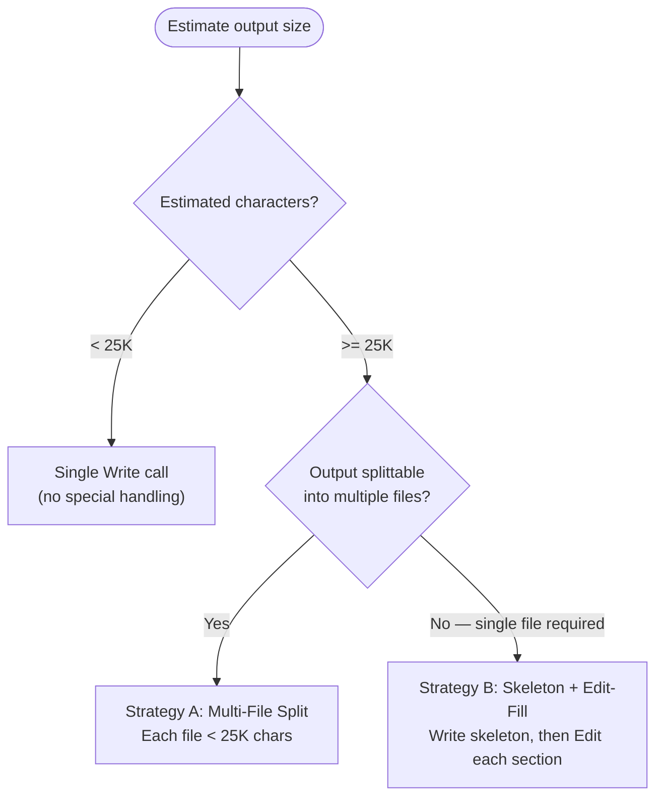

# Large File Write Strategy

## Scope

This policy applies to agents that produce documents exceeding **25,000 characters** in a single output: `swarm-task-planner`, `python-cli-design-spec`, `codebase-analyzer`, `ecosystem-researcher`, and `feature-researcher`. Any agent producing a document that may exceed 25K characters follows this strategy.

The 25K threshold reflects the practical reliability limit of a single `Write` tool call. Beyond this size, writes risk truncation, timeout, or silent data loss. The strategies below ensure all content reaches disk intact.

## Decision Flowchart



## Strategy A: Multi-File Split

Use when the output decomposes naturally into multiple files, each under 25K characters.

Create an index file that references each part. Each part is a standalone document written with a single `Write` call.

**Canonical example**: The `swarm-task-planner` agent's 500-line progressive disclosure policy already implements Strategy A. Plans under 500 lines produce a single `PLAN.md`. Plans at or above 500 lines produce a `PLAN/` directory with `index.md` and per-priority part files (e.g., `priority-1-foundation.md`, `priority-2-features.md`). Each part stays under the 25K character limit independently.

**When to choose Strategy A**:

- Output has natural split boundaries (sections, priorities, task groups, modules)
- Consumers benefit from loading parts independently
- No external constraint requires a single file path

## Strategy B: Skeleton + Edit-Fill

Use when the output must be a single file and exceeds 25K characters.

### Step 1: Plan document structure

List all sections, headers, and approximate content size per section. Confirm total exceeds 25K and no individual section exceeds 20K characters (leave margin for Edit overhead).

### Step 2: Write skeleton

Issue a single `Write` call containing:

- YAML frontmatter (if applicable)
- All section headers in final order
- Placeholder stubs marking pending content

Target the skeleton at under 5K characters. Each placeholder uses the format:

```markdown
<!-- PENDING: Brief description of section content -->
```

### Step 3: Fill each section

Issue individual `Edit` calls, each replacing one placeholder stub with the full section content. Keep each Edit call under 20K characters. If a section exceeds 20K, split it into subsections with separate placeholders in Step 2.

### Step 4: Final verification

Read the completed file. Confirm:

- Zero `<!-- PENDING:` markers remain
- All planned sections contain content
- Document structure matches the Step 1 plan

## Wrong / Right Examples

**Wrong** -- single Write call with 40K characters:

```python
# 40K character string assembled in memory
content = frontmatter + section_1 + section_2 + section_3 + section_4
# Single Write risks truncation or timeout
Write(file_path="plan/architect-auth-system.md", content=content)
```

**Right** -- Write skeleton (~2K chars), then Edit calls filling each section (3-5K chars each):

```python
# Step 2: Write skeleton under 5K chars
Write(file_path="plan/architect-auth-system.md", content="""---
title: Auth System Architecture
---

# Auth System Architecture

## Overview

<!-- PENDING: System overview and goals -->

## Data Model

<!-- PENDING: Entity definitions and relationships -->

## API Design

<!-- PENDING: Endpoint specifications -->

## Security Model

<!-- PENDING: Authentication and authorization flows -->

## Error Handling

<!-- PENDING: Error taxonomy and recovery strategies -->
""")

# Step 3: Fill each section individually
Edit(file_path="plan/architect-auth-system.md",
     old_string="<!-- PENDING: System overview and goals -->",
     new_string="The auth system provides token-based authentication...")

Edit(file_path="plan/architect-auth-system.md",
     old_string="<!-- PENDING: Entity definitions and relationships -->",
     new_string="### User\n\n| Field | Type | Constraint |...")

# ... one Edit per section ...

# Step 4: Read and verify no PENDING markers remain
Read(file_path="plan/architect-auth-system.md")
```

## Relationship to No Invented Limits

This strategy does **not** truncate content. The full document is written incrementally instead of atomically. No information is removed, shortened, or summarized to fit the threshold.

The 25K threshold governs **write mechanics** (how content reaches disk), not **content completeness** (what the document contains). Every section, every detail, every line planned in Step 1 appears in the final file after Step 4.

Consumers retain full access to the complete document. The threshold exists to prevent tool-level failures, not to limit what agents produce.
