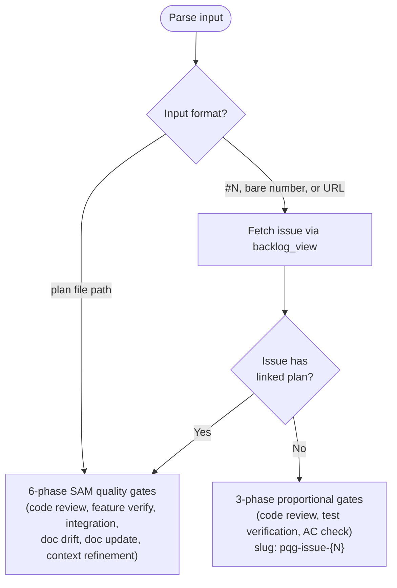

# SAM Feature Implementation Workflow

The SAM (Structured Agent-Managed) workflow converts a feature idea into executable task files, implements them via agent delegation, and validates the result through quality gates.

## Workflow Overview

```text
/add-new-feature  ──>  /implement-feature  ──>  /complete-implementation
   (planning)            (execution loop)         (quality gates)
```

> For data structure shapes at each pipeline edge, publisher-consumer relationships,
> hook trigger conditions, and the SAM task state lifecycle, see the
> [Workflow Architecture Diagram](./../docs/workflow-architecture-diagram.md).

## Skills (User-Invocable)

| Skill | Source File | Purpose |
|-------|------------|---------|
| `/add-new-feature` | [.claude/skills/add-new-feature/SKILL.md](./../skills/add-new-feature/SKILL.md) | Plan a feature: discovery, analysis, architecture, task decomposition |
| `/implement-feature` | [.claude/skills/implement-feature/SKILL.md](./../skills/implement-feature/SKILL.md) | Execute tasks from a SAM task file via agent delegation loop |
| `/start-task` | [.claude/skills/start-task/SKILL.md](./../skills/start-task/SKILL.md) | Start or complete a specific task inside a SAM task file |
| `/complete-implementation` | [.claude/skills/complete-implementation/SKILL.md](./../skills/complete-implementation/SKILL.md) | Quality gates after all tasks are COMPLETE |
| `/implementation-manager` | [.claude/skills/implementation-manager/SKILL.md](./../skills/implementation-manager/SKILL.md) | Query task status (not user-invocable, used by orchestrator) |

Plugin-level source copies exist at `plugins/development-harness/skills/` for each skill.

---

## Phase 1: Planning (`/add-new-feature`)

Converts a feature description into durable SAM artifacts.

### Artifacts Produced

| Artifact | Path | Created By | Artifact Type |
|----------|------|------------|---------------|
| Feature context | `plan/feature-context-{slug}.md` | `feature-researcher` agent | Generated |
| Codebase analysis | `plan/codebase/{FOCUS}.md` | `codebase-analyzer` agent (optional) | Generated (snapshot) |
| Architecture spec | `plan/architect-{slug}.md` | `python-cli-design-spec` agent | Generated |
| Task plan | `plan/P{NNN}-{slug}.yaml` | `swarm-task-planner` agent | Generated |

### Agent Delegation Sequence

```text
Phase 1: feature-researcher        -> plan/feature-context-{slug}.md
Phase 2: codebase-analyzer          -> plan/codebase/{FOCUS}.md (optional)
Phase 3: python-cli-design-spec     -> plan/architect-{slug}.md
Phase 4: swarm-task-planner          -> plan/P{NNN}-{slug}.yaml
Phase 5: plan-validator              -> PASS/BLOCKED gate
Phase 6: context-gathering           -> Context Manifest section in task file
```

When `acceptance-criteria-structured` is non-empty, `swarm-task-planner` also generates T0 (baseline capture) and TN (verification gate) bookend tasks. These dispatch automatically via normal readiness ordering — no special handling needed.

### Outcome

The user receives the feature slug, task file path, and is told to run `/implement-feature`.

---

## Plan Artifact Lifecycle

Plan artifacts are either **human-decision** (immutable — backlog items, grooming output, interview transcripts) or **generated** (mutable but intent-bound — feature context, architecture spec, task plan). Full taxonomy and divergence rules: [Plan Artifact Lifecycle Policy](./../docs/plan-artifact-lifecycle.md).

---

## Phase 2: Execution (`/implement-feature`)

Loops through ready tasks, delegates each to its specified agent, and relies on hooks for automatic status tracking. Full procedure is in the [implement-feature SKILL.md](./../skills/implement-feature/SKILL.md).

**Fixes #N restriction** — Only the `/complete-implementation` Final Step may include `Fixes #N`, `Closes #N`, or `Resolves #N` commit trailers. Task-level commits produced during execution must NEVER include these trailers — they trigger automatic GitHub issue closure, bypassing quality gates.

**Worktree isolation variant**: For milestone-scoped execution where each item gets its own worktree, use `/work-milestone` instead. See [work-milestone SKILL.md](./../../plugins/development-harness/skills/work-milestone/SKILL.md).

---

## Phase 3: Quality Gates (`/complete-implementation`)

Invoked automatically by `/implement-feature` when all tasks show COMPLETE, or manually with an issue number for non-SAM fixes. Full procedure is in the [complete-implementation SKILL.md](./../skills/complete-implementation/SKILL.md).

### Input Modes



### SAM Path — Phase Task Mapping

| QG Task | Phase | Agent | Dependencies |
|---------|-------|-------|-------------|
| T1 | Code Review | code-reviewer | none |
| T2 | Feature Verification | feature-verifier | T1 |
| T3 | Integration Check | integration-checker | T2 |
| T4 | Documentation Drift Audit | doc-drift-auditor | T3 |
| T5 | Documentation Update | service-docs-maintainer | T4 |
| T6 | Context Refinement | context-refinement | T5 |

### Proportional Gate Path — Phase Task Mapping

| PQG Task | Phase | Agent | Dependencies |
|----------|-------|-------|-------------|
| T1 | Code Review | code-reviewer | none |
| T2 | Test Verification | task-worker | T1 |
| T3 | Acceptance Criteria Check | task-worker | T2 |

### Gate Builders

Both paths use pure functions from `sam_schema.core.quality_gates`:

- `build_quality_gate_plan(slug, issue, impl_plan_address)` — 6-task SAM plan
- `build_proportional_quality_gate_plan(slug, issue, modified_files, acceptance_criteria)` — 3-task SAM plan

### Completion Rules

- **SAM path**: All 6 tasks must reach terminal status. Only T5 may be skipped (if no doc drift found).
- **Proportional path**: All 3 tasks must be COMPLETE. No skip whitelist.
- On success: `status:verified` label applied via `backlog_update(verified=True)`.
- Recursive follow-up: SAM path only. Proportional path does not generate follow-ups.
