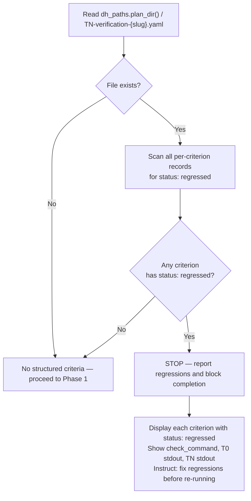
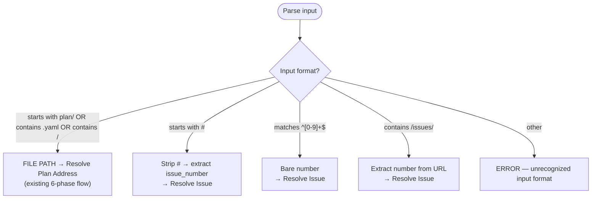
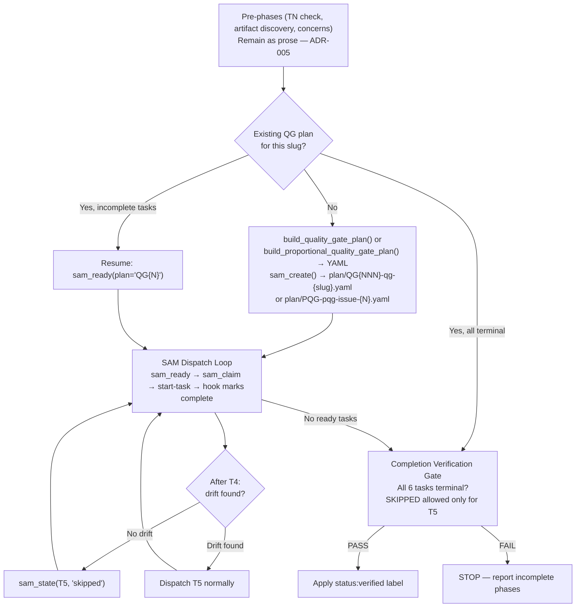
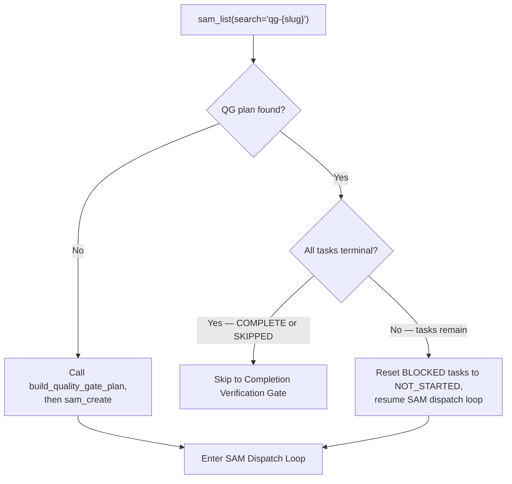
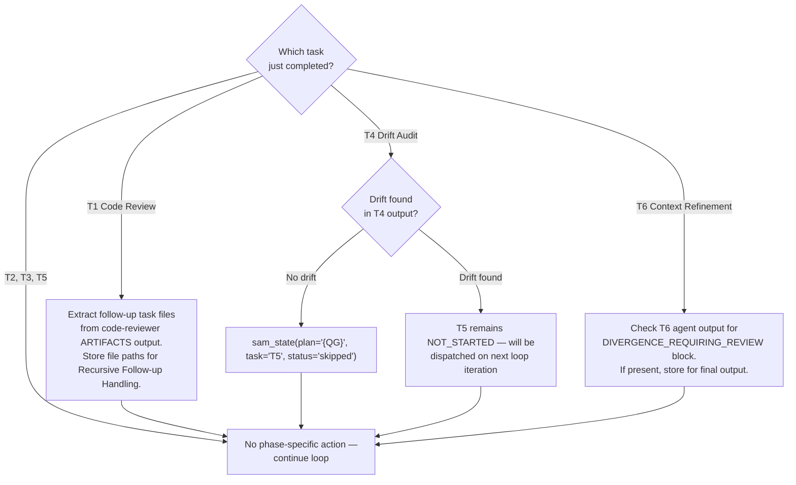
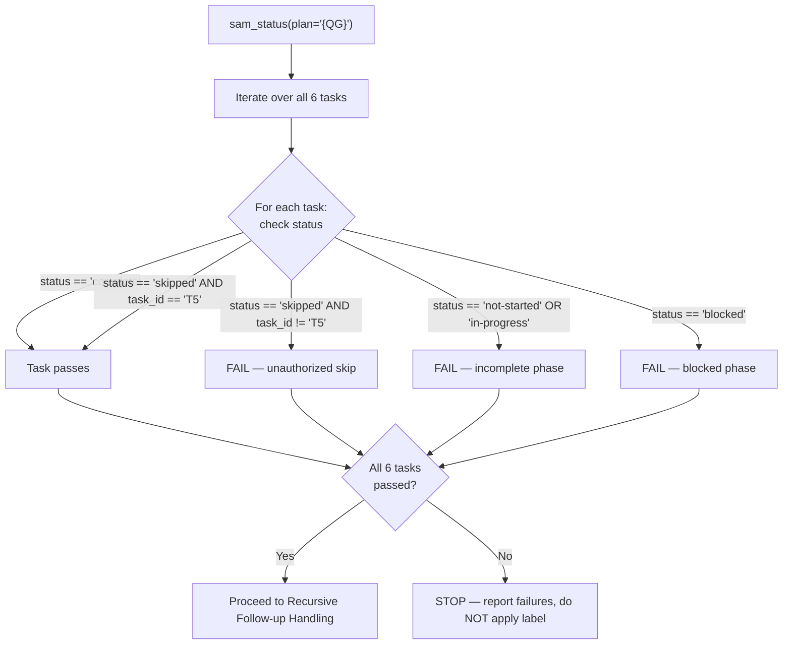

# SAM Feature Implementation Workflow

The SAM (Structured Agent-Managed) workflow converts a feature idea into executable task files, implements them via agent delegation, and validates the result through quality gates.

## Workflow Overview

```text
/add-new-feature  ──>  /implement-feature  ──>  /complete-implementation
   (planning)            (execution loop)         (quality gates)
```

## Skills (User-Invocable)

| Skill | Source File | Purpose |
|-------|------------|---------|
| `/add-new-feature` | [.claude/skills/add-new-feature/SKILL.md](./../skills/add-new-feature/SKILL.md) | Plan a feature: discovery, analysis, architecture, task decomposition |
| `/implement-feature` | [.claude/skills/implement-feature/SKILL.md](./../skills/implement-feature/SKILL.md) | Execute tasks from a SAM task file via agent delegation loop |
| `/start-task` | [.claude/skills/start-task/SKILL.md](./../skills/start-task/SKILL.md) | Start or complete a specific task inside a SAM task file |
| `/complete-implementation` | [.claude/skills/complete-implementation/SKILL.md](./../skills/complete-implementation/SKILL.md) | Quality gates after all tasks are COMPLETE |
| `/implementation-manager` | [.claude/skills/implementation-manager/SKILL.md](./../skills/implementation-manager/SKILL.md) | Query task status (not user-invocable, used by orchestrator) |

Plugin-level source copies exist at `plugins/development-harness/skills/` for each skill.

---

## Phase 1: Planning (`/add-new-feature`)

Converts a feature description into durable SAM artifacts.

### Artifacts Produced

| Artifact | Path | Created By | Artifact Type |
|----------|------|------------|---------------|
| Feature context | `plan/feature-context-{slug}.md` | `feature-researcher` agent | Generated |
| Codebase analysis | `plan/codebase/{FOCUS}.md` | `codebase-analyzer` agent (optional) | Generated (snapshot) |
| Architecture spec | `plan/architect-{slug}.md` | `python-cli-design-spec` agent | Generated |
| Task plan | `plan/tasks-{N}-{slug}.md` | `swarm-task-planner` agent | Generated |

### Agent Delegation Sequence

```text
Phase 1: feature-researcher        -> plan/feature-context-{slug}.md
Phase 2: codebase-analyzer          -> plan/codebase/{FOCUS}.md (optional)
Phase 3: python-cli-design-spec     -> plan/architect-{slug}.md
Phase 4: swarm-task-planner          -> plan/tasks-{N}-{slug}.md
Phase 5: plan-validator              -> PASS/BLOCKED gate
Phase 6: context-gathering           -> Context Manifest section in task file
```

When `acceptance-criteria-structured` is non-empty, `swarm-task-planner` also generates two bookend tasks: `T0` (baseline capture, Priority 1) and `T99`/`T{max+1}` (verification gate, Priority 5). See the "Bookend Tasks" section in Phase 2 below.

### Agent File Locations

| Agent | python3-development | development-harness |
|-------|-------------------|-------------------|
| `feature-researcher` | — | [plugins/development-harness/agents/feature-researcher.md](./../../plugins/development-harness/agents/feature-researcher.md) |
| `codebase-analyzer` | — | [plugins/development-harness/agents/codebase-analyzer.md](./../../plugins/development-harness/agents/codebase-analyzer.md) |
| `python-cli-design-spec` | [plugins/python3-development/agents/python-cli-design-spec.md](./../../plugins/python3-development/agents/python-cli-design-spec.md) | — |
| `swarm-task-planner` | — | [plugins/development-harness/agents/swarm-task-planner.md](./../../plugins/development-harness/agents/swarm-task-planner.md) |
| `plan-validator` | — | [plugins/development-harness/agents/plan-validator.md](./../../plugins/development-harness/agents/plan-validator.md) |
| `context-gathering` | — | [plugins/development-harness/agents/context-gathering.md](./../../plugins/development-harness/agents/context-gathering.md) |
| `t0-baseline-capture` | — | [plugins/development-harness/agents/t0-baseline-capture.md](./../../plugins/development-harness/agents/t0-baseline-capture.md) |
| `tn-verification-gate` | — | [plugins/development-harness/agents/tn-verification-gate.md](./../../plugins/development-harness/agents/tn-verification-gate.md) |

### Task File Format

Each task in the plan file follows the format documented in [plugins/development-harness/docs/TASK_FILE_FORMAT.md](./../docs/TASK_FILE_FORMAT.md). Key fields per task:

- `**Status**`: NOT STARTED | IN PROGRESS | COMPLETE | BLOCKED
- `**Dependencies**`: Task references (e.g., "Task 1.1, Task 1.2")
- `**Priority**`: 1-5 (1=critical)
- `**Complexity**`: Low | Medium | High
- `**Agent**`: Agent name to execute the task
- `**Skills**`: List of skill names for the sub-agent to load (e.g., `["fastmcp-python-tests", "python3-development"]`)
- `**Started**`: ISO timestamp (added by agent)
- `**Completed**`: ISO timestamp (added by hook)
- `**LastActivity**`: ISO timestamp (updated by hook)

Two formats are supported:

- **Legacy markdown**: Monolithic file with `## Task {ID}: {Name}` headers
- **YAML frontmatter**: Individual `.md` files with `---` delimited metadata per task

Two organizational structures:

- **Single file**: All tasks in one `plan/tasks-{N}-{slug}.md`
- **Directory**: One task per `.md` file in a `plan/tasks-{slug}/` directory

### Outcome

The user receives the feature slug, task file path, and is told to run `/implement-feature`.

---

## Plan Artifact Lifecycle

Plan artifacts fall into two categories based on their origin and mutability.

- **Human-decision artifacts** (backlog items, grooming output, interview transcripts) capture the human's original intent and are immutable. Agents must never modify them.
- **Generated artifacts** (feature context, architecture spec, task plan, codebase analysis) are produced by agents during planning phases. They are mutable but intent-bound: updates must stay within the intent established by the human-decision artifacts they serve.

For the full taxonomy, classification rules, divergence thresholds, and annotation format, see
[Plan Artifact Lifecycle Policy](./../docs/plan-artifact-lifecycle.md).

| Artifact Type | Mutability Rule |
|---------------|-----------------|
| Human-decision | Immutable. No agent may edit, append to, or rewrite. |
| Generated | Mutable but intent-bound. Annotations permitted; silent rewrites prohibited. |

Divergence between plan artifacts and implementation is detected during Phase 6 of `/complete-implementation`, where the `context-refinement` agent performs a plan artifact freshness check. Design refinements are auto-recorded as annotations. Intent divergences are flagged for human review via `DIVERGENCE_REQUIRING_REVIEW` in the agent's output.

---

## Phase 2: Execution (`/implement-feature`)

Loops through ready tasks, delegates each to its specified agent, and relies on hooks for status tracking.

> **Worktree isolation variant**: For milestone-scoped execution where each item gets its own worktree and its own kage-bunshin session (independent `claude -p` process with full orchestrator capabilities), use the `/work-milestone` skill instead. See [plugins/development-harness/skills/work-milestone/SKILL.md](./../../plugins/development-harness/skills/work-milestone/SKILL.md).

### Hook Configuration

Declared in `/implement-feature` SKILL.md frontmatter:

```yaml
hooks:
  SubagentStop:
  - hooks:
    - type: command
      command: python3 "${CLAUDE_SKILL_DIR}/../../implementation-manager/scripts/task_status_hook.py"
```

### Execution Loop

```text
1. Query status:
   mcp__plugin_dh_sam__sam_status(plan="P{N}")

2. Query ready tasks:
   If parent story issue number is known, prefer the backlog MCP tool:
     backlog_get_ready_sam_tasks(parent_issue_number=N)
     Output shape: {"feature": "...", "ready_tasks": [...], "count": N}
     Falls back to local cache if GitHub unavailable.
   If parent issue number is unknown, use SAM MCP:
     mcp__plugin_dh_sam__sam_ready(plan="P{N}")
   CLI fallback (when MCP unavailable):
     uv run sam ready P{N}

3. For each ready task:
   Route to the agent named in the task's **Agent** field.
   If the task's `skills` list (from ready JSON) is non-empty,
   include skill-loading instructions in the delegation prompt:
     For each skill, instruct the sub-agent to call Skill(skill="{skill-name}").
   Launch the agent with:
     Skill(skill="start-task", args="{task_file_path} --task {task_id}")

4. Repeat until no tasks remain ready.

5. When all tasks COMPLETE:
   Skill(skill="complete-implementation", args="{task_file_path}")
```

**Fixes #N restriction** — Only the `/complete-implementation` Final Step may include `Fixes #N`, `Closes #N`, or `Resolves #N` commit trailers. Task-level commits produced during steps 1–4 must NEVER include these trailers. They trigger automatic GitHub issue closure; premature closure bypasses the quality gates in Phase 3.

### Bookend Tasks

When a plan contains `acceptance-criteria-structured` entries, `swarm-task-planner` generates two bookend tasks:

- **T0** (`t0-baseline-capture`, Priority 1, `dependencies: []`): Dispatched first by natural readiness — no dependencies and highest priority. Runs each `check_command` and records exit codes, stdout, and stderr to `plan/T0-baseline-{slug}.yaml`. Non-zero exits are expected and do not fail T0.
- **T99** / **T{max+1}** (`tn-verification-gate`, Priority 5, `dependencies: [all non-bookend task IDs]`): Dispatched last after all implementation tasks complete. Reads the T0 baseline YAML, re-runs each `check_command`, and classifies each criterion using the 4-cell matrix (passed / regressed / pre-existing-fail / newly-passing). Writes `plan/TN-verification-{slug}.yaml` as a list of per-criterion `BookendVerification` records — one per criterion, each with `criterion_id`, `check_command`, `t0_exit_code`, `tn_exit_code`, `status`, and `stdout_diff_summary`. There is no top-level `verdict` field; `/complete-implementation` aggregates the verdict by scanning all records for `status: regressed` before Phase 1.

No changes to the execution loop are needed — existing `DependencyGraph.get_ready_tasks()` handles T0/TN ordering automatically.

### Readiness Logic

A task is "ready" when:

1. Status is `NOT STARTED`
2. All dependency tasks have a terminal status (`COMPLETE` or `SKIPPED`)

Readiness evaluation is performed by the SAM MCP tool `mcp__plugin_dh_sam__sam_ready(plan="P{N}")` or the backlog MCP tool `backlog_get_ready_sam_tasks`. CLI fallback: `uv run sam ready P{N}`.

---

## Phase 2a: Task Execution (`/start-task`)

Invoked per-task by `/implement-feature`. Runs inside a sub-agent delegated to the task's specified agent type.

### Hook Configuration

Declared in `/start-task` SKILL.md frontmatter:

```yaml
hooks:
  PostToolUse:
  - matcher: Write|Edit|Bash
    hooks:
    - type: command
      command: python3 "${CLAUDE_SKILL_DIR}/../../implementation-manager/scripts/task_status_hook.py"
```

### Actions

1. Read the task file and linked architecture spec.
2. Select the target task (by `--task {id}` or first ready task).
2a. Load skills from task metadata: read the `skills:` field from YAML frontmatter (or `**Skills**:` from legacy format). For each skill name, invoke `Skill(skill="{name}")`. If a skill fails to load, warn and continue with remaining skills. This is intentional redundancy with the orchestrator's skill-loading instructions, ensuring skills load even when the task is started manually or by an older orchestrator.
3. Claim the task via `mcp__plugin_dh_sam__sam_claim(plan="P{N}", task="T{M}")` (prevents duplicate dispatch). This is the ONLY permitted way to mark a task in-progress — do NOT edit status or started fields directly. If the response contains `"claimed": false`, stop (task already claimed or not found). CLI fallback: `uv run sam claim P{N} {task_id}`.
4. GitHub in-progress sync: if `parent_issue_number` is known and `github_issue` field is set in the task YAML, sync in-progress status to GitHub sub-issue (non-fatal on failure).
5. Write active-task context file:

   ```text
   ~/.dh/projects/{slug}/context/active-task-{CLAUDE_SESSION_ID}.json
   ```

   Contents: `{"task_file_path": "...", "task_id": "...", "parent_issue_number": N}` — omit `parent_issue_number` if story issue number is unknown; hook treats absence as `None` and skips GitHub sync.

6. Divergence notes: if implementation deviates from the architect spec or feature-context in a way that affects observable behavior, append a `## Divergence Notes` section to the task file. See `.claude/skills/start-task/SKILL.md` for format.
7. Implement against acceptance criteria and run verification steps.

### Completion Marking

Two paths:

- **`--complete {task-id}` argument**: Agent explicitly marks task COMPLETE
- **SubagentStop hook** (on `/implement-feature`): When the sub-agent finishes, the hook script automatically marks the task COMPLETE and adds `**Completed**: {ISO timestamp}`

---

## Hook Script: task_status_hook.py

Script: [plugins/development-harness/skills/implementation-manager/scripts/task_status_hook.py](./../../plugins/development-harness/skills/implementation-manager/scripts/task_status_hook.py)

Shared utilities: `sam_schema` package (internal — not a standalone script file).

### Event Handling

| Hook Event | Trigger Context | Action |
|------------|----------------|--------|
| `SubagentStop` | `/implement-feature` finishes a sub-agent | Parse prompt for `/start-task` invocation, extract task file path and task ID, set status to COMPLETE, add `Completed` timestamp, delete context file, then call `sync_completion_to_github()` to sync completion to GitHub sub-issue (best-effort, exit 0 on failure) |
| `PostToolUse` (Write\|Edit\|Bash) | `/start-task` during task execution | Read `~/.dh/projects/{slug}/context/active-task-{session_id}.json`, update `LastActivity` timestamp in the task section |

### Timestamp Responsibilities

| Field | Written By | When |
|-------|-----------|------|
| `**Started**` | Agent (via `/start-task` skill logic) | When agent begins work on a task |
| `**Completed**` | Hook (`SubagentStop` in `task_status_hook.py`) | When sub-agent finishes |
| `**LastActivity**` | Hook (`PostToolUse` in `task_status_hook.py`) | On each Write, Edit, or Bash call during task execution |

### Environment Variable Controls

The hook script supports runtime profile controls via two environment variables. No SKILL.md edits are required to change hook behavior.

**`CLAUDE_SKILLS_HOOK_PROFILE`** — selects a named profile that determines which handlers run. Case-sensitive lowercase. Default when unset or empty: `standard`.

- `minimal` — PostToolUse handler is skipped (no LastActivity updates). SubagentStop runs normally.
- `standard` — all handlers run (current default, backward compatible).
- `strict` — all handlers run. SubagentStop additionally emits pre-completion validation warnings to stderr (observational only, does not block completion).

Invalid values warn to stderr and fall back to `standard`.

**`CLAUDE_SKILLS_DISABLED_HOOKS`** — comma-separated hook IDs to disable. Disabled hooks exit 0 immediately after consuming stdin (Claude Code treats non-zero hook exit as error).

Hook IDs:

- `task-status:post-tool-use` — the PostToolUse handler
- `task-status:subagent-stop` — the SubagentStop handler

Disabled hooks take precedence over profile. Unknown IDs are silently ignored for forward compatibility.

---

## Phase 3: Quality Gates (`/complete-implementation`)

Invoked automatically by `/implement-feature` when all tasks show COMPLETE, or invoked manually with an issue number for non-SAM fixes. Accepts two input formats:

- **Plan file path** (`plan/P{NNN}-{slug}.yaml`) — routes to the full 6-phase SAM quality gate flow (existing behavior)
- **Issue number** (`#N`, bare number `N`, or GitHub issue URL) — routes to a proportional 3-phase quality gate flow for fixes that bypass the SAM planning pipeline

### Pre-Phase 1: TN Verification Check

Before invoking Phase 1, check for a TN verification report produced by `tn-verification-gate`. Extract `{slug}` from the task file path (`plan/P{NNN}-{slug}.yaml`). Read `dh_paths.plan_dir() / "TN-verification-{slug}.yaml"`.

The file contains a list of per-criterion `BookendVerification` records — one per `acceptance-criteria-structured` entry. There is no top-level `verdict` field. Aggregate the verdict by scanning all records: the overall result is FAIL if any record has `status: regressed`; otherwise PASS.



If any criterion has `status: regressed`, output this block and stop:

```text
COMPLETION BLOCKED — TN Verification Failed

Regressed criteria:
  {criterion-id}: {description}
    command: {check_command}
    T0 result: exit {code}, stdout: {stdout}
    TN result: exit {code}, stdout: {stdout}

Fix the regressions, then re-run /complete-implementation.
```

### Pre-Phase: Artifact Discovery

When the parent story issue number is known (from the plan's `issue` field or the backlog item), query the artifact manifest to discover all plan artifacts for this feature:

```text
mcp__plugin_dh_backlog__artifact_list(issue_number=N)
```

If the response contains artifacts, pass the manifest to quality gate agents (Phases 1-6) so they can access plan artifacts via `artifact_read` instead of filesystem paths. This is critical for worktree-isolated agents.

**Fallback**: If `artifact_list` returns an empty manifest or an error, quality gate agents use filesystem path conventions. This ensures backward compatibility with issues that predate the artifact manifest system.

### Issue Number Mode (Proportional Gates)

When the input is an issue number (`#N`, bare number, or GitHub URL) instead of a plan file path, the skill runs a proportional 3-phase quality gate flow instead of the full 6-phase SAM flow.

**Input Format Detection:**



**Resolve Issue:**

1. Fetch issue via `mcp__plugin_dh_backlog__backlog_view(selector="#{issue_number}")`
2. If the response contains a non-empty `plan` field → auto-redirect to the SAM 6-phase path using that plan file
3. If no linked plan → proceed to proportional gates

**Proportional Gate Phases:**

| PQG Task | Phase | Agent | Dependencies |
|----------|-------|-------|-------------|
| T1 | Code Review | code-reviewer | none |
| T2 | Test Verification | task-worker | T1 |
| T3 | Acceptance Criteria Check | task-worker | T2 |

**Proportional Gate Flow:**

1. Discover modified files: `git log --all --grep="#N" --format=%H` → `git diff-tree --no-commit-id --name-only -r {sha}`. Fallback: `git diff main...HEAD --name-only`
2. Extract acceptance criteria from issue body (search for `## Acceptance Criteria` header, `**Acceptance Criteria**:` marker, or `- [ ]` checkboxes). If none found, Phase 3 passes trivially.
3. Create PQG plan: call `build_proportional_quality_gate_plan()` from `sam_schema.core.quality_gates`, then `sam_create(slug="pqg-issue-{N}", ...)`
4. Dispatch through the same SAM loop (`sam_ready`/`sam_claim`/`start-task`)
5. **Completion gate**: all 3 tasks must be COMPLETE — no skip whitelist (unlike the 6-phase flow where T5 may be skipped)
6. Apply `status:verified` label via `mcp__plugin_dh_backlog__backlog_update(selector="#{N}", verified=True)`
7. **No recursive follow-up handling** — proportional gates do not generate follow-up task files

---

### Pre-Phase 1b: Process Accumulated Concerns

Check the backlog item for a `## Concerns` section accumulated during `/implement-feature`:

```text
mcp__plugin_dh_backlog__backlog_view(selector="#{issue}")
```

If the item has a `## Concerns` section with unchecked items (`- [ ]`):

1. For each concern, verify whether it is a real issue (read the referenced file or run the referenced check).
2. If verified: check it off (`- [x]`) and create a new backlog item via `mcp__plugin_dh_backlog__backlog_add` with the concern as the description, source as "Quality vigilance concern from #{issue}".
3. If not a real issue: check it off (`- [x] Not confirmed — {reason}`).
4. Update the concerns section via `mcp__plugin_dh_backlog__backlog_groom(selector="#{issue}", section="Concerns", content="{updated checklist}")`.

If no concerns section exists, proceed to Quality Gate Plan Creation.

### SAM-Enforced Quality Gate Execution

Quality gate phases are mechanically enforced via SAM tasks. The 6 phases are modeled as tasks in a separate QG plan (`QG{NNN}-qg-{slug}.yaml`), dispatched through the same `sam_ready`/`sam_claim`/`sam_state` loop used by `/implement-feature`. An agent cannot skip phases because `sam_ready` only surfaces the next phase when the previous one completes.



### Phase Task Mapping

| QG Task | Phase | Agent | Dependencies |
|---------|-------|-------|-------------|
| T1 | Code Review | code-reviewer | none |
| T2 | Feature Verification | feature-verifier | T1 |
| T3 | Integration Check | integration-checker | T2 |
| T4 | Documentation Drift Audit | doc-drift-auditor | T3 |
| T5 | Documentation Update | service-docs-maintainer | T4 |
| T6 | Context Refinement | context-refinement | T5 |

The QG plan is created at runtime by `complete-implementation` using `build_quality_gate_plan()` from `sam_schema.core.quality_gates`. Each phase is dispatched via `Skill(skill="start-task", args="plan/QG{N}-qg-{slug}.yaml --task {task_id}")`.

**Recovery (ADR-004, ADR-006)**: On re-run, already-COMPLETE phases are not re-dispatched (`sam_ready` skips them). BLOCKED tasks are reset to NOT_STARTED before re-entering the loop.

### Quality Gate Plan Creation

After the pre-phases complete, set up the SAM-enforced quality gate plan.

**Step 1 — Check for existing QG plan:**

```text
mcp__plugin_dh_sam__sam_list(search="qg-{slug}")
```



**Step 2 — Create QG plan (if not found):**

```python
tasks_yaml = build_quality_gate_plan(
    slug="{slug}",
    issue="{issue_number}",       # from plan's issue field, if known
    impl_plan_address="P{N}",     # implementation plan address
)
```

Then create the plan:

```text
mcp__plugin_dh_sam__sam_create(
    slug="qg-{slug}",
    goal="Quality gate enforcement for {slug}",
    tasks_yaml="{tasks_yaml_string}",
    issue="{issue_number}"
)
```

The response contains the QG plan address (e.g., `QG003`). Store it as `{QG}` for use throughout the dispatch loop.

**Step 3 — Reset BLOCKED tasks (on re-run):**

If the QG plan already exists and has BLOCKED tasks, reset each to NOT_STARTED before entering the dispatch loop:

```text
For each task where status == "blocked":
    mcp__plugin_dh_sam__sam_state(plan="{QG}", task="{task_id}", status="not-started")
```

### SAM Dispatch Loop Details (Phases 1-6)

The dependency chain (T1 → T2 → T3 → T4 → T5 → T6) enforces ordered execution. Repeat until `sam_ready` returns an empty list:

**1. Get next ready task:**

```text
mcp__plugin_dh_sam__sam_ready(plan="{QG}")
```

If the result is empty, exit the loop and proceed to Completion Verification Gate.

**2. Claim the task:**

```text
mcp__plugin_dh_sam__sam_claim(plan="{QG}", task="{task_id}")
```

If `"claimed": false`, stop — another agent is running this phase.

**3. Dispatch via start-task:**

```text
Skill(skill="start-task", args="plan/{QG}-qg-{slug}.yaml --task {task_id}")
```

The SubagentStop hook marks the task COMPLETE after the sub-agent finishes.

**4. Phase-specific post-dispatch actions:**

After each phase completes, run phase-specific processing before querying `sam_ready` again:



**Detecting drift in T4 output**: The doc-drift-auditor agent output contains a `## Findings` section. No drift is indicated by "No documentation drift detected" or an empty findings list. Presence of drift items (file paths, outdated sections) means drift was found.

### Completion Verification Gate

After the SAM dispatch loop exits (no ready tasks), verify all 6 phases reached terminal status before allowing label application.

```text
mcp__plugin_dh_sam__sam_status(plan="{QG}")
```

Examine each of the 6 tasks:



**Skip whitelist**: ONLY T5 (Documentation Update) may have `status: skipped`. Any other task with `status: skipped` is an unauthorized skip — treat as a failure.

**On verification failure**, output and stop:

```text
COMPLETION BLOCKED — Quality Gate Incomplete

Failed tasks:
  {task_id} ({phase_name}): status={status}
  [repeat for each failing task]

To resume: re-run /complete-implementation {task_file_path}
BLOCKED tasks will be reset to NOT_STARTED automatically.
```

**On verification success**, proceed to Recursive Follow-up Handling.

### Agent File Locations

| Agent | python3-development | development-harness |
|-------|-------------------|-------------------|
| `code-reviewer` | [plugins/python3-development/agents/code-reviewer.md](./../../plugins/python3-development/agents/code-reviewer.md) | — |
| `feature-verifier` | — | [plugins/development-harness/agents/feature-verifier.md](./../../plugins/development-harness/agents/feature-verifier.md) |
| `integration-checker` | — | [plugins/development-harness/agents/integration-checker.md](./../../plugins/development-harness/agents/integration-checker.md) |
| `doc-drift-auditor` | — | [plugins/development-harness/agents/doc-drift-auditor.md](./../../plugins/development-harness/agents/doc-drift-auditor.md) |
| `service-docs-maintainer` | — | [plugins/development-harness/agents/service-docs-maintainer.md](./../../plugins/development-harness/agents/service-docs-maintainer.md) |
| `context-refinement` | — | [plugins/development-harness/agents/context-refinement.md](./../../plugins/development-harness/agents/context-refinement.md) |
| `t0-baseline-capture` | — | [plugins/development-harness/agents/t0-baseline-capture.md](./../../plugins/development-harness/agents/t0-baseline-capture.md) |
| `tn-verification-gate` | — | [plugins/development-harness/agents/tn-verification-gate.md](./../../plugins/development-harness/agents/tn-verification-gate.md) |

### Cross-Plugin Dependency

`service-docs-maintainer` exists only in the `development-harness` plugin, not in `python3-development`. This is the only agent in the workflow with a single-plugin source.

### Recursive Follow-up

If Phase 1 (code review) creates follow-up task files (naming: `plan/tasks-{N}-{slug}-followup-{k}.md`), each follow-up is routed through a backlog-linking step before any recursion decision:

1. Follow-up files are detected from the code-reviewer's ARTIFACTS `Task files:` output. If the list is empty or absent, a confirmatory glob for `plan/tasks-*-{slug}-followup-*.md` is run as fallback.
2. For each follow-up, a search title is derived from the filename (strip prefix/suffix, convert hyphens to spaces) and searched against existing backlog items via `mcp__plugin_dh_backlog__backlog_list`.
3. If a matching backlog item is found, the follow-up is attached as its plan via `mcp__plugin_dh_backlog__backlog_update` with `plan=` parameter.
4. If no match is found, a new backlog item is created via `create-backlog-item --auto`, then the follow-up is attached via `mcp__plugin_dh_backlog__backlog_update` with `plan=` parameter.
5. Recursion proceeds only when BOTH conditions are true: the follow-up file's feature slug matches the parent task file's slug (same session scope), AND the follow-up's `## Priority` section contains `High`.
6. Otherwise, the follow-up is deferred to backlog with no recursion. The follow-up path, backlog item title, priority, and scope match result are logged.

---

## SAM Interface

The SAM MCP server (`mcp__plugin_dh_sam__*`) is the primary interface for all SAM task file operations. The `uv run sam` CLI is available as fallback when MCP is unavailable.

### MCP Tools (Primary)

| Tool | Usage | Output |
|------|-------|--------|
| `sam_list` | `mcp__plugin_dh_sam__sam_list()` | JSON: `{items: [...], count: N, total: N}` |
| `sam_status` | `mcp__plugin_dh_sam__sam_status(plan="P{N}")` | JSON: task counts, ready tasks, all tasks with details |
| `sam_ready` | `mcp__plugin_dh_sam__sam_ready(plan="P{N}")` | JSON: `{ready_tasks: [...], count: N}` |
| `sam_read` | `mcp__plugin_dh_sam__sam_read(plan="P{N}")` | JSON: full plan with task fields and context |
| `sam_claim` | `mcp__plugin_dh_sam__sam_claim(plan="P{N}", task="T{M}")` | JSON: `{claimed: true/false}` |
| `sam_state` | `mcp__plugin_dh_sam__sam_state(plan="P{N}", task="T{M}", status="complete")` | Updates task status |
| `sam_update` | `mcp__plugin_dh_sam__sam_update(plan="P{N}", context="...")` | Updates plan context field |
| `sam_create` | `mcp__plugin_dh_sam__sam_create(slug="...", goal="...", tasks_yaml="...")` | Creates a new plan |

### CLI Fallback

When MCP is unavailable, use the `uv run sam` CLI with equivalent commands:

| CLI Command | Equivalent MCP Tool |
|-------------|-------------------|
| `uv run sam list` | `sam_list()` |
| `uv run sam status P{N}` | `sam_status(plan="P{N}")` |
| `uv run sam ready P{N}` | `sam_ready(plan="P{N}")` |
| `uv run sam read P{N}` | `sam_read(plan="P{N}")` |
| `uv run sam claim P{N} {task_id}` | `sam_claim(plan="P{N}", task="T{M}")` |
| `uv run sam update P{N} --context "..."` | `sam_update(plan="P{N}", context="...")` |

---

## Artifact Manifest

Plan artifacts are registered in a structured manifest stored in the GitHub Issue body. The manifest is the discovery mechanism — consumers query it via MCP to find artifacts for an issue.

### MCP Tools (on backlog server)

| Tool | Purpose |
|------|---------|
| `artifact_register` | Register or update an artifact entry (issue_number, type, path, status, agent) |
| `artifact_list` | List all artifacts for an issue, optionally filtered by type |
| `artifact_get` | Get metadata for a specific artifact type on an issue |
| `artifact_read` | Read artifact file content from root worktree path (with path safety validation) |

### Artifact Types

| Type | Created By | Example Path |
|------|-----------|-------------|
| `feature-context` | feature-researcher | `plan/feature-context-{slug}.md` |
| `architect` | python-cli-design-spec | `plan/architect-{slug}.md` |
| `task-plan` | swarm-task-planner / sam_create | `plan/P{NNN}-{slug}.yaml` |
| `codebase-analysis` | codebase-analyzer | `plan/codebase/{FOCUS}.md` |
| `T0-baseline` | t0-baseline-capture | `plan/T0-baseline-{slug}.yaml` |
| `TN-verification` | tn-verification-gate | `plan/TN-verification-{slug}.yaml` |
| `quality-gate` | complete-implementation / sam_create | `plan/QG{NNN}-qg-{slug}.yaml` |

### Registration Flow

Producer agents register artifacts after creation via `artifact_register`. Auto-registration is built into:
- `sam_create` — registers task-plan artifact when issue field is present
- `backlog_update(plan=...)` — registers task-plan artifact when item has a GitHub issue

### Consumer Discovery Flow

Consumer agents (including worktree-isolated agents) discover artifacts via:

```text
1. artifact_list(issue_number=N) → list of artifact entries
2. artifact_read(issue_number=N, artifact_type="architect") → file content
3. Fallback: if artifact_list returns empty, use filesystem path conventions
```

### Worktree Safety

Worktree-isolated agents MUST use `artifact_read` (MCP) instead of filesystem access for plan files. Plan artifacts are in the root worktree — uncommitted files are not visible in isolated worktrees.

---

## Supporting Scripts

| Script | Path | Purpose |
|--------|------|---------|
| SAM MCP server | `mcp__plugin_dh_sam__*` | Primary interface for all task file I/O (status, ready, read, claim, update, create) |
| `sam` CLI | `uv run sam` | CLI fallback when MCP is unavailable |
| `task_status_hook.py` | [plugins/development-harness/skills/implementation-manager/scripts/task_status_hook.py](./../../plugins/development-harness/skills/implementation-manager/scripts/task_status_hook.py) | Hook script for automatic status/timestamp updates |
| `get_task_context.py` | [plugins/development-harness/skills/implementation-manager/scripts/get_task_context.py](./../../plugins/development-harness/skills/implementation-manager/scripts/get_task_context.py) | Dynamic context injection for implementation-manager skill |
| `split_task_file.py` | [plugins/python3-development/scripts/split_task_file.py](./../../plugins/python3-development/scripts/split_task_file.py) | Split monolithic task files into individual files |
| `migrate_task_format.py` | [plugins/python3-development/scripts/migrate_task_format.py](./../../plugins/python3-development/scripts/migrate_task_format.py) | Migrate legacy markdown to YAML frontmatter format |

---

## Runtime Context Files

| File | Created By | Read By | Lifetime |
|------|-----------|---------|----------|
| `~/.dh/projects/{slug}/context/active-task-{session_id}.json` | `/start-task` skill | `task_status_hook.py` (PostToolUse) | Deleted by `task_status_hook.py` (SubagentStop) |

---

## Data Flow Diagram

For detailed data structure shapes and publisher-consumer relationships, see [Workflow Architecture Diagram](./../../plugins/development-harness/docs/workflow-architecture-diagram.md).

```text
User
  │
  ▼
/add-new-feature
  │
  ├─ feature-researcher        ──> plan/feature-context-{slug}.md
  ├─ codebase-analyzer         ──> plan/codebase/{FOCUS}.md (optional)
  ├─ python-cli-design-spec    ──> plan/architect-{slug}.md
  ├─ swarm-task-planner        ──> plan/tasks-{N}-{slug}.md
  ├─ plan-validator            ──> PASS / BLOCKED
  └─ context-gathering         ──> Context Manifest in task file
  │
  ▼
/implement-feature
  │
  ├─ sam status P{N}       ──> JSON status
  ├─ sam ready P{N}  ──> JSON ready list (includes skills per task)
  │
  │  ┌── T0 runs first (Priority 1, no dependencies) ───────┐
  │  │  t0-baseline-capture                                  │
  │  │    ├─ Read acceptance-criteria-structured             │
  │  │    ├─ Run each check_command, capture results         │
  │  │    └─ Write plan/T0-baseline-{slug}.yaml              │
  │  └───────────────────────────────────────────────────────┘
  │
  │  ┌── For each implementation task (after T0 completes) ─┐
  │  │                                                      │
  │  │  Orchestrator reads task skills from ready JSON │
  │  │  If skills non-empty: adds Skill() instructions to   │
  │  │    delegation prompt ──> sub-agent loads skills       │
  │  │                                                      │
  │  │  /start-task                                         │
  │  │    ├─ Set status: IN PROGRESS                        │
  │  │    ├─ Load skills from task metadata (step 2a)       │
  │  │    ├─ Add Started timestamp                          │
  │  │    ├─ Write ~/.dh/projects/{slug}/context/active-task-{sid}.json │
  │  │    ├─ Implement acceptance criteria                  │
  │  │    └─ [PostToolUse hook updates LastActivity]        │
  │  │                                                      │
  │  │  [SubagentStop hook]                                 │
  │  │    ├─ Set status: COMPLETE                           │
  │  │    ├─ Add Completed timestamp                        │
  │  │    └─ Delete context file                            │
  │  │                                                      │
  │  └──────────────────────── Loop until no ready tasks ───┘
  │
  │  ┌── TN runs last (Priority 5, all impl. tasks done) ───┐
  │  │  tn-verification-gate                                 │
  │  │    ├─ Read plan/T0-baseline-{slug}.yaml               │
  │  │    ├─ Re-run each check_command, compare vs T0        │
  │  │    ├─ Classify each criterion (4-cell matrix)         │
  │  │    │    T0 pass + TN pass  = passed                   │
  │  │    │    T0 pass + TN fail  = regressed (blocks)       │
  │  │    │    T0 fail + TN fail  = pre-existing-fail        │
  │  │    │    T0 fail + TN pass  = newly-passing            │
  │  │    └─ Write plan/TN-verification-{slug}.yaml          │
  │  │         verdict: PASS | FAIL                          │
  │  └───────────────────────────────────────────────────────┘
  │
  ▼
/complete-implementation
  │
  ├─ [Pre-Phase 1] Read plan/TN-verification-{slug}.yaml
  │    ├─ verdict: FAIL ──> report regressed criteria, STOP
  │    └─ verdict: PASS or file absent ──> continue
  │
  ├─ code-reviewer             ──> review findings
  ├─ feature-verifier          ──> goal verification (structural)
  │                                (TN provides behavioral complement)
  ├─ integration-checker       ──> integration check
  ├─ doc-drift-auditor         ──> drift findings
  ├─ service-docs-maintainer   ──> doc updates (if drift)
  └─ context-refinement        ──> updated Context Manifest
                                ──> plan artifact annotations (if divergence found)
                                ──> DIVERGENCE_REQUIRING_REVIEW (if intent divergence)
  │
  ├─ [If follow-up task files created by code-reviewer]
  │    ├─ Route each follow-up:
  │    │    ├─ Search backlog by title keywords from filename
  │    │    ├─ Match found: backlog_update(selector=..., plan={followup_path})
  │    │    └─ No match: create-backlog-item --auto, then backlog_update(selector=..., plan=...)
  │    └─ Gate: same slug AND High priority -> Recurse: /implement-feature + /complete-implementation
  │             otherwise -> Deferred to backlog (no recursion)
  │
  ├─ [Final Step: Commit and push remaining changes]
  │    └─ Stage modified files (task file, backlog items, plan annotations)
  │       ──> single commit + push
  │
  ▼
Done
```
