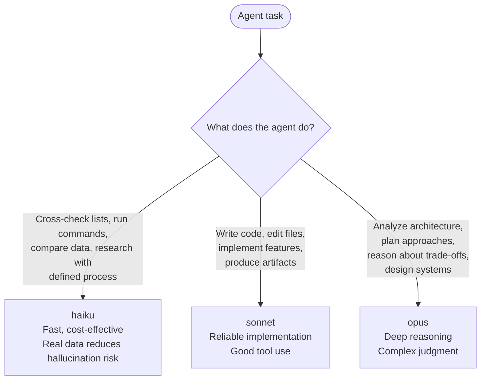

# Model Selection for Agent Delegation

Assign models based on the cognitive requirement of the task, not the agent name.

**Examples:**

| Agent | Model | Why |
|---|---|---|
| plan-validator | haiku | Cross-checks ACs vs tasks, DAG validity, Impact Radius coverage |
| t0-baseline-capture | haiku | Runs commands, records output |
| tn-verification-gate | haiku | Runs commands, compares against baseline |
| doc-drift-auditor | haiku | Cross-references docs vs code |
| codebase-analyzer | haiku | Reads files, maps patterns |
| context-gathering | haiku | Reads files, builds manifest |
| python-cli-architect | sonnet | Writes code, edits files |
| python-pytest-architect | sonnet | Writes tests |
| code-reviewer | sonnet | Reviews code (structured process) |
| context-refinement | sonnet | Updates files with discoveries |
| swarm-task-planner | opus | Designs task decomposition |
| python-cli-design-spec | opus | Designs architecture |
| feature-verifier | opus | Analyzes whether goals were met |
| feature-researcher | opus | Analyzes problem space |

**If an agent does both checking AND analysis**: split it into two agents — a haiku checker and an opus analyzer. Do not run opus on work that haiku can handle.

---

## Effort Tier Guidance

Assign `--effort` based on the cognitive requirement of the task, not the agent name. Use alongside `--model` selection — the two are orthogonal. A haiku agent doing a boilerplate task should use `low`; a sonnet agent designing a subsystem should use `high`.

| Effort | Task type |
|---|---|
| `low` | Coordination, status checks, boilerplate generation, deterministic transforms |
| `medium` | Standard implementation, file editing, test writing, documentation updates |
| `high` | Architecture decisions, root-cause analysis, complex debugging, cross-file refactors |
| `max` | Deep reasoning, planning under uncertainty, novel design problems |

**Default (omit `--effort`)**: inherits model default.

**How to pass**: `spawn.py ... spawn --effort {level}` or `dispatch_spawn(effort="{level}")`. The spawned `claude` process receives `CLAUDE_CODE_EFFORT_LEVEL={level}` in its environment.
