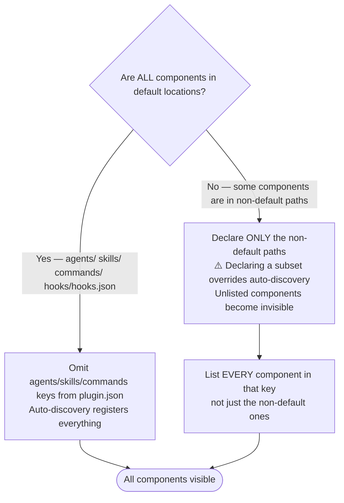

---
paths:
- plugins/**/*
- .claude-plugin/**/*
---

# Plugin Development Workflows

## Local Testing

**Session-based (no installation):**

```bash
claude --plugin-dir ./plugins/plugin-name
```

**Via local marketplace** (persists across sessions; `--scope local` keeps it gitignored):

```bash
/plugin marketplace add ./.claude-plugin/marketplace.json
/plugin install plugin-name@jamie-bitflight-skills --scope local
```

For full add/remove/update procedures, see [CONTRIBUTING.md](./CONTRIBUTING.md).

## Prerequisite Skills for Plugin Work

Before modifying any plugin file (`plugin.json`, agents, skills, hooks), load these two reference skills:

- `plugin-creator:claude-plugins-reference-2026` — current Claude Code plugin schema, frontmatter fields, and component auto-discovery rules
- `plugin-creator:claude-skills-overview-2026` — current Claude Code skills schema and conventions

**Reason**: Editing plugin files without loading these skills risks schema violations and auto-discovery breakage. Session 2026-03-17 demonstrated this — adding an `agents` key to `plugin.json` without understanding auto-discovery semantics silently dropped 17 of 19 agents.

## plugin.json Auto-Discovery Rules

Claude Code auto-discovers components from default locations within a plugin directory. The `agents`, `skills`, and `commands` keys in `plugin.json` exist ONLY for declaring components in non-default locations.

**Default auto-discovered locations:**

- `agents/` — all `.md` files
- `skills/` — all skill directories containing `SKILL.md`
- `commands/` — all `.md` files
- `hooks/hooks.json` — hooks manifest



**Incident record (2026-03-17):** `python3-development` plugin had:

```json
"agents": ["./agents/t0-baseline-capture.md", "./agents/tn-verification-gate.md"]
```

Result: only 2 of 19 agents were registered. The other 17 were invisible to Claude Code because declaring a subset in `agents` overrides auto-discovery — the declared list becomes the complete list.

**Fix**: Remove the `agents` key entirely when all agents are in `agents/`. Auto-discovery registers all of them.

## Skill Validation vs Packaging

**Validation: YES** — Validate skills to ensure quality:

- YAML frontmatter properly formatted
- Required fields present (name, description, tools, model)
- File references correct and target files exist
- Directory structure valid

**Packaging: NO** — Skills in this repository are for local use. They are already in their final location. Do not package skills into .zip files — it creates unnecessary files and serves no purpose for local development.
