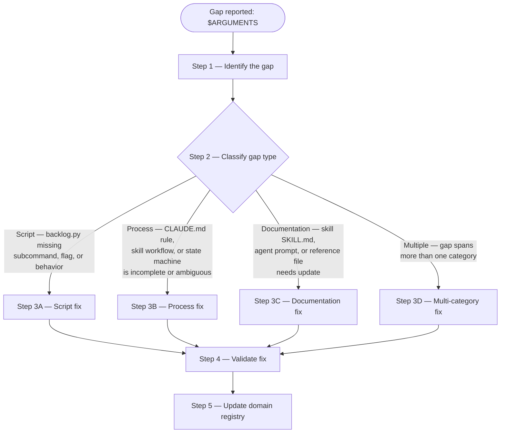
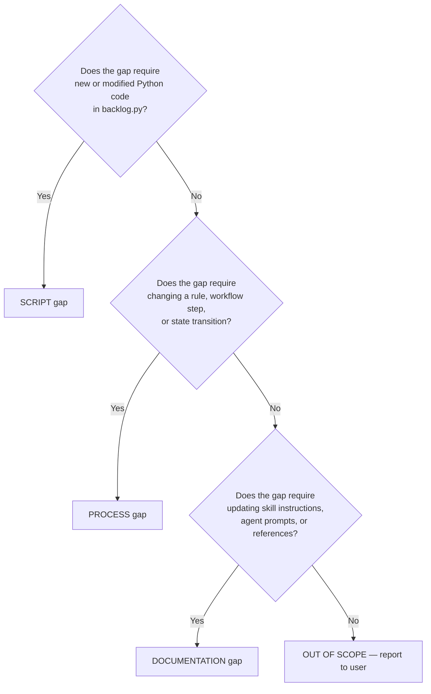

# Backlog Tools Administrator

Close capability gaps in the backlog tooling ecosystem instead of bypassing the backlog script with direct file edits or `gh` commands.

## Arguments

`$ARGUMENTS` — free-text description of the capability gap. Example: `backlog.py update has no --title or --description flag`.

## When This Skill Activates

- Agent discovers `backlog.py` lacks a subcommand or flag for a needed operation
- Agent is about to use `Write`/`Edit` on a `.claude/backlog/*.md` file directly
- Agent is about to use `gh issue edit` instead of the backlog script
- User reports a process gap or workaround in the backlog workflow
- Post-mortem on a process violation involving backlog tooling

## Domain

All files listed in [./references/domain-registry.md](./references/domain-registry.md). Changes outside this registry are out of scope for this skill.

## Workflow



### Step 1: Identify the Gap

Describe concretely:

1. **What operation was needed** — the action the agent or user tried to perform
2. **What exists today** — the closest available capability in the backlog tooling
3. **What workaround was used** (if any) — the bypass that violated process
4. **Impact** — what broke or could break due to the gap (sync drift, data loss, process violation)

Read the [domain registry](./references/domain-registry.md) to confirm the gap is within scope.

### Step 2: Classify the Gap



### Step 3A: Script Fix

For gaps requiring changes to `backlog.py` or related Python scripts.

1. Task is implementing the script fix with `subagent_type="python3-development:python-cli-architect"`
   Context to include in the prompt: `.claude/skills/backlog/scripts/backlog.py` (the script to modify), `.claude/skills/backlog/tests/test_backlog_gh_first.py` (existing tests), the gap description from Step 1, and `.claude/skills/backlog/references/item-schema.md` (frontmatter schema)
   Output: modified `backlog.py` with new capability, passing tests, linting clean

2. After the agent completes, verify the fix:

   ```bash
   uv run prek run --files .claude/skills/backlog/scripts/backlog.py
   uv run pytest .claude/skills/backlog/tests/
   ```

3. Update the `backlog` skill SKILL.md to document the new subcommand or flag — proceed to Step 3C.

### Step 3B: Process Fix

For gaps requiring changes to rules, workflow steps, or state transitions.

1. Load the `improve-processes` skill for process quality methodology:

   ```text
   Skill(skill: "improve-processes")
   ```

2. Read the affected process file(s) from the [domain registry](./references/domain-registry.md).

3. Apply the improve-processes triage protocol and excellence checklist to the modified process.

4. Write the corrected process using `Edit` on the affected file (CLAUDE.md section, skill SKILL.md, or reference file).

5. If the process change affects a skill's workflow, delegate the skill edit to Step 3C.

### Step 3C: Documentation Fix

For gaps requiring changes to skill instructions, agent prompts, or reference files.

1. Task is optimizing the affected documentation with `subagent_type="plugin-creator:contextual-ai-documentation-optimizer"`
   Context to include in the prompt: the file to modify (skill SKILL.md, agent .md, or reference .md), the gap description from Step 1, and `plugins/plugin-creator/skills/claude-skills-overview-2026/SKILL.md` and `plugins/plugin-creator/skills/claude-hooks-reference-2026/SKILL.md` as structural references when modifying skills or hooks
   Output: updated file with the gap addressed, CoVe verification passing

### Step 3D: Multi-Category Fix

When the gap spans multiple categories, execute steps in dependency order:

1. **Script first** (Step 3A) — new capabilities must exist before processes can reference them
2. **Process second** (Step 3B) — rules must be updated before documentation describes them
3. **Documentation last** (Step 3C) — skill/agent docs reflect the final state

### Step 4: Validate the Fix

Verify the gap is closed:

1. **Script changes**: run `uv run pytest .claude/skills/backlog/tests/` and `uv run prek run --files <modified-files>`
2. **Process changes**: confirm the new rule/workflow handles the original gap scenario without ambiguity
3. **Documentation changes**: confirm the updated instructions would have prevented the original workaround

Report what changed:

```text
GAP: {original gap description}
TYPE: {SCRIPT|PROCESS|DOCUMENTATION|MULTI}
FILES CHANGED:
  - {file path}: {what changed}
VALIDATION: {PASS|FAIL — with details}
```

### Step 5: Update Domain Registry

If new files were created (new reference, new test, new script), update [./references/domain-registry.md](./references/domain-registry.md) to include them.

## Completion Criteria

- Gap identified with concrete description (operation, existing capability, workaround, impact)
- Gap classified as SCRIPT, PROCESS, DOCUMENTATION, or MULTI
- Fix delegated to appropriate agent (not implemented inline)
- Script changes pass tests and linting
- Process changes satisfy improve-processes excellence checklist
- Documentation changes pass CoVe verification
- Domain registry updated if new files were created
- Report delivered showing what changed and validation status
