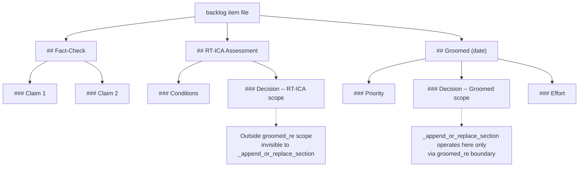

# Known Patterns — backlog.py Section Replacement

## Markdown Heading Regex Must Use `[^\n]*`

When matching a markdown heading by name prefix, the regex must absorb any trailing text on the heading line before the newline.

**Wrong:** `### SectionName\s*\n` — only matches whitespace after the name. Fails on `### Decision: BLOCKED`.

**Right:** `### SectionName[^\n]*\n` — matches any trailing text (`: BLOCKED`, `(2026-02-28)`, etc.).

This applies to both `##` and `###` level headings in `_append_or_replace_section`.

SOURCE: Session 2026-02-28 — `\s*` regex caused silent no-op when heading had `: BLOCKED` suffix. Fix validated with 6 unit tests.

## Same Heading Name at Different Structural Levels Are Independent

The backlog file has multiple structural scopes:

<!-- Converted from ASCII scope diagram: backlog file heading hierarchy with groomed_re scope boundary -->

`_append_or_replace_section` operates within `## Groomed` only (via `groomed_re`). A `### Decision` under `## RT-ICA` is invisible to it. Updating one does not update the other.

When content at both levels becomes stale, both must be updated — either by calling the script twice with different section paths, or by directly editing the RT-ICA section.

SOURCE: Session 2026-02-28 — Updated Groomed Decision to UNBLOCKED but RT-ICA Decision still showed BLOCKED because it lives outside the groomed regex scope.
