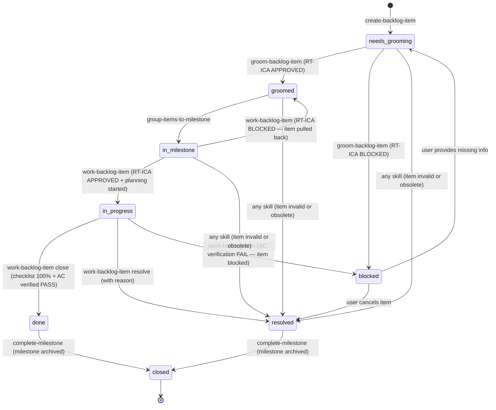

# Backlog Item State Machine

Canonical state machine for backlog items. All skills that modify item state MUST
reference this document and enforce only allowed transitions.

SOURCE: Derived from GSD STATE.md patterns and comparative analysis of claude_skills backlog management (accessed 2026-02-26).

---

## State Diagram



---

## States

| State | Description | GitHub label |
|---|---|---|
| `needs-grooming` | Item created, not yet fact-checked or groomed | `status:needs-grooming` |
| `groomed` | All 7 canonical sections present, RT-ICA APPROVED | `status:groomed` |
| `blocked` | RT-ICA BLOCKED — missing information prevents grooming or work | `status:blocked` |
| `in-milestone` | Assigned to a GitHub milestone, awaiting work | `status:in-milestone` |
| `in-progress` | Work started, plan file created, implementation underway | `status:in-progress` |
| `done` | Implementation complete, AC verified PASS, checklist 100% | `status:done` |
| `resolved` | Item closed without full implementation (obsolete, invalid, superseded) | `status:resolved` |
| `closed` | Terminal state — milestone archived, item no longer active | `status:closed` |

---

## Transitions

### `needs-grooming` → `groomed`

```
Trigger:    /groom-backlog-item completes Step 7 with all 7 sections present
Precondition: RT-ICA Decision is APPROVED; all 7 canonical sections written
Action:     backlog script sets metadata.groomed = today's date
             GitHub label: remove status:needs-grooming, add status:groomed
```

### `needs-grooming` → `blocked`

```
Trigger:    /groom-backlog-item Step 5 — RT-ICA Decision is BLOCKED
Precondition: One or more MISSING conditions that cannot be resolved without user input
Action:     RT-ICA section written to item file (Step 5b — must happen before blocker reported)
             GitHub label: remove status:needs-grooming, add status:blocked
             Report BLOCKED items in Step 8 status table
```

### `blocked` → `needs-grooming`

```
Trigger:    User provides the missing information; operator re-queues item for grooming
Precondition: User has addressed the MISSING conditions listed in the RT-ICA section
Action:     GitHub label: remove status:blocked, add status:needs-grooming
             User then re-runs /groom-backlog-item
```

### `groomed` → `in-milestone`

```
Trigger:    /group-items-to-milestone assigns item to a milestone
Precondition: Item has metadata.groomed set; GitHub issue exists for P0/P1
Action:     metadata.milestone set to milestone number
             GitHub milestone field updated on issue
             GitHub label: remove status:groomed, add status:in-milestone
```

### `in-milestone` → `in-progress`

```
Trigger:    /work-backlog-item — RT-ICA gate APPROVED and SAM plan file created
Precondition: RT-ICA Decision APPROVED (re-assessed if item state has changed since grooming)
              plan file written to plan/ directory
Action:     metadata.plan set to plan file path
             metadata.status = in-progress
             GitHub label: remove status:in-milestone, add status:in-progress
             NOTE: status:in-progress label MUST NOT be set before this point
                   (not at "starting to groom", not at "checking RT-ICA")
```

### `in-progress` → `done`

```
Trigger:    /work-backlog-item close
Precondition: Plan checklist is 100% complete
              Acceptance criteria verified PASS (per-criterion, not overall guess)
              --checklist-pass flag passed to backlog script
Action:     metadata.status = done
             GitHub label: remove status:in-progress, add status:done
             GitHub issue closed
             BACKLOG.md entry moved to Completed section
```

### `in-progress` → `resolved`

```
Trigger:    /work-backlog-item resolve --reason "{reason}"
Precondition: Explicit reason provided
Action:     metadata.status = resolved
             GitHub label: remove status:in-progress, add status:resolved
             GitHub issue closed with resolution comment
             BACKLOG.md entry moved to Completed section
```

### Any state → `resolved`

```
Trigger:    Any skill detects item is invalid, obsolete, or superseded
Precondition: Clear reason for resolution
Action:     backlog resolve "{title}" --reason "{reason}"
             GitHub label: current label removed, add status:resolved
             GitHub issue closed if it exists
```

### `done` | `resolved` → `closed`

```
Trigger:    /complete-milestone archives the milestone
Precondition: Item status is done or resolved; milestone is being archived
Action:     metadata.status = closed
             GitHub label: current label removed, add status:closed
             Item moved to Completed section in BACKLOG.md if not already there
             Completion archive written to .claude/milestones/v{N}-completion.md
```

This is the only transition into `closed`. No other skill sets this status.

---

## GitHub Label Taxonomy

Labels correspond to states 1:1. The backlog script manages label transitions — do not set labels with `gh label` directly.

```
status:needs-grooming   — item created, awaiting grooming
status:groomed          — grooming complete, RT-ICA APPROVED
status:blocked          — RT-ICA BLOCKED or AC verification FAIL
status:in-milestone     — assigned to active milestone
status:in-progress      — implementation started
status:done             — implementation complete, AC verified
status:resolved         — closed without full implementation
status:closed           — terminal: milestone archived by complete-milestone
```

Priority labels (orthogonal to status):

```
priority:P0
priority:P1
priority:P2
priority:Ideas
```

---

## Critical State Constraints

**`status:in-progress` timing**: The in-progress label MUST be set only after the RT-ICA gate returns APPROVED and the SAM plan file is created. Setting it during "checking RT-ICA" or "starting grooming" is incorrect and produces misleading state.

**`metadata.groomed` timing**: Only set when ALL 7 canonical sections are present in the item file (see [./item-schema.md](./item-schema.md)). Partial grooming is not groomed.

**`blocked` and `in-progress` are exclusive**: An item cannot be both blocked and in-progress. If AC verification fails during close, revert to `blocked`, do not close.

SOURCE: claude_skills_backlog_management_systematic_improvements_list.md, Cross-Cutting Improvement 1 and work-backlog-item improvement 3 (2026-02-26).
