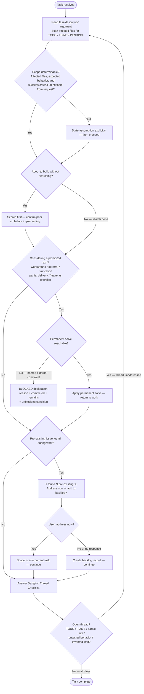

# Standard of Excellence — Boil the Ocean

**Outcome:** A task is complete only when all output is delivered (no prohibited exits taken, no workarounds), the Dangling Thread Checklist has no open items, and no PENDING threads remain.

Full source extracts: [./references/standard-of-excellence.md](./references/standard-of-excellence.md)
Invented limit patterns: [./references/invented-limit-patterns.md](./references/invented-limit-patterns.md)
BLOCKED declaration contract: [./references/blocked-declaration-contract.md](./references/blocked-declaration-contract.md)

## Workflow



## Preparation

Before applying any task, inspect the input:

1. Read the `[task-description]` argument if provided.
2. Identify whether prior partial work exists — check for TODO, FIXME, or PENDING markers in affected files.
3. Confirm the task scope is understood: what files, what behavior, what "complete" looks like.
4. If affected files, expected behavior, or success criteria cannot be determined from the request and context, state the assumption explicitly before proceeding.

This inspection takes under 60 seconds and prevents the most common failure mode: starting
in the middle of something already broken.

## The Standard

The marginal cost of completeness is near zero. Complete the whole thing.

- **Search before building.** Check whether the solution already exists before implementing.
- **Test before shipping.** Verify observable behavior, not just syntax correctness.
- **Ship the complete thing.** The answer is the finished product, not a plan to build it.

Time, fatigue, and complexity are not valid reasons to stop short.

## Prohibited Exits

NEVER use the following exits when the permanent solve is reachable:

| Prohibited form | Why it fails | Required action |
|---|---|---|
| "We could table this for later" | Defers solvable work | If reachable now, solve it now |
| "As a workaround you could..." | Leaves root cause intact | Find and apply the real fix |
| "Here's a partial implementation" | Delivers incomplete value | Complete it, or declare BLOCKED (see below) |
| `content[:500]`, `MAX_LEN = 1024` | Silent data loss | Output full content; let caller control the window |
| "I'll leave the rest as an exercise" | Delegates responsibility back | Do it |

## The One Legitimate Exit — BLOCKED Declaration

When the permanent solve is genuinely unreachable due to an external constraint, use this form.
Copy [./assets/blocked-declaration-template.md](./assets/blocked-declaration-template.md) verbatim into your response and fill in the four fields.
Full contract: [./references/blocked-declaration-contract.md](./references/blocked-declaration-contract.md)

```text
# WRONG — workaround instead of BLOCKED
The build fails because the dependency is missing. As a workaround,
comment out the import for now.

# RIGHT — specific constraint with actionable path
BLOCKED: fastmcp[tasks] is not in pyproject.toml and the file is read-only in CI.
- What was completed: identified failing import at src/runner.py:14
- What remains: add fastmcp[tasks] to pyproject.toml; run uv lock; re-run pytest tests/ -x
- Unblocking condition: pyproject.toml is writable and fastmcp[tasks] is in dependencies
```

## No Invented Limits

NEVER introduce hard-coded truncation or length limits. Full taxonomy: [./references/invented-limit-patterns.md](./references/invented-limit-patterns.md)

Rules:
- Output full content by default.
- When pagination is genuinely needed, provide `--offset` / `--limit` parameters.
- If content is shortened: (1) state it is truncated, (2) report chars/lines remaining, (3) provide access to the rest.

## Dangling Thread Protocol

Template: [./assets/dangling-thread-checklist.md](./assets/dangling-thread-checklist.md) — copy into your response as a structured self-review block, or work through it mentally before marking complete.

Before marking any task complete, answer each question:

1. Is there an open thread — a TODO, FIXME, PENDING marker, partial implementation, or untested behavior?
2. Is the current solution a workaround when the real fix exists?
3. Was search performed before building anything new?
4. Were tests run — or is there an explicit reason they cannot be?
5. Does any output contain a hard-coded truncation or length limit?

If any question is answered yes and the thread is unaddressed, return to Preparation: scope the fix, apply it, then re-check before marking complete.

**Task is complete when:** all 5 checklist items answer "no" AND any BLOCKED declaration includes all four required fields AND any pre-existing issue is either resolved or logged as a backlog item.

## Pre-Existing Issue Rule

When a pre-existing issue is found during a task, "pre-existing issue not related to my changes" is a trigger to act, not a dismissal.

Required response:

> I found [N] pre-existing [issue type]. Want to address them now? If not, I will add them to the backlog.

"Plan" means concrete steps — files, fixes, scope estimate — not a vague intention.
"Backlog" means a trackable record that prevents loss.

If the user responds "yes, address them now" → scope the fix into the current task and continue.
If the user says no or does not respond → create the backlog record before proceeding.

## Anti-Patterns

```text
# WRONG — workaround presented as solution
The issue is that the config file is malformed. As a workaround, you can set
the ENV variable directly to bypass the config loader.

# RIGHT — root cause fixed
The config loader fails on empty string values (config.py:47).
Fixed: added a guard that converts empty strings to None before validation.
Tests pass. No ENV variable workaround needed.
```

```text
# WRONG — invented limit silently truncates
return content[:500]  # keep it brief

# RIGHT — full content, caller controls window
return content  # caller applies display limit if needed
```

```text
# WRONG — deferred completion
I've implemented the core logic. The edge cases and tests can be added later.

# RIGHT — complete delivery
Core logic implemented. Edge cases handled: [list]. Tests written and passing.
```

## Sources

SOURCE: [./references/standard-of-excellence.md](./references/standard-of-excellence.md) — verbatim extracts from `.claude/CLAUDE.md` §Standard of Excellence, §No Invented Limits, §Pre-Existing Issue Accountability. Extracted 2026-05-22.
