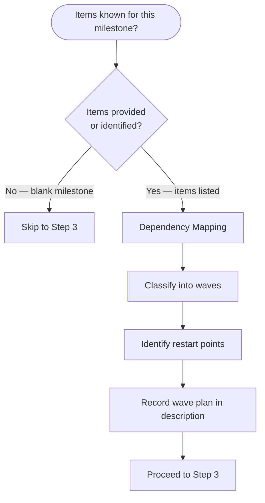

# Create Milestone

Create a GitHub milestone on the current repository and return its number for downstream use.

Backlog MCP reference: use `backlog_list_milestones` and `backlog_create_milestone` for milestone operations.

## Arguments

- **Empty** — guided intake via `AskUserQuestion`
- **`quick {title}`** — use remainder as title, ask only for description

## Workflow

### Step 1: Collect Fields

**Guided mode** (no args) — ask in sequence:

```text
Q1: Milestone title?  (e.g. "v1.1 — Milestone Workflow", "2026-Q1 Grooming")
Q2: Description? (one sentence, or skip)
```

**Quick mode** (`quick {title}`) — ask only Q2 (description).

Title is required. Description is optional. Due date is never prompted — only set if the user explicitly provides it in arguments (e.g., `quick {title} --due 2026-04-30`).

### Step 2: Duplicate Check

Call `backlog_list_milestones(state="open")` and scan the returned list for any entry where `title` matches the requested title (case-insensitive).

If an open milestone with the same title already exists, report it and ask: "Use existing or create new?" via `AskUserQuestion`.

If user chooses existing: print its number and stop.

### Step 2.5: Wave Ordering (when items are known)

When a milestone is being created alongside a set of known backlog items (not just a blank milestone), plan the execution order before creating the milestone. Use `mcp__sequential_thinking__sequentialthinking` to structure the analysis.



**Dependency Mapping** — for each item, answer:
1. What does this item need to exist before it can be built?
2. What does this item enable once it exists?

**Classify into waves** — group items by dependency tier:
- Wave 0: Items with no dependencies on other milestone items (foundation)
- Wave N+1: Items whose dependencies are all satisfied by Waves 0–N
- Items within the same wave must be independent (no shared file writes, no mutual dependencies) — they run in parallel

**Identify restart points** — a restart is needed between waves when:
- A wave produces tooling that subsequent waves should use (e.g., verification infrastructure, discovery store, feedback routing)
- Skipping the restart means the next wave doesn't benefit from the previous wave's output
- Not every wave boundary needs a restart — only where new capabilities must be active

**Record in description** — append the wave plan to the milestone description so `/group-items-to-milestone` and `/groom-milestone` can reference it:

```text
Wave 0 (Foundation): #N1, #N2
  🔄 RESTART — [what becomes active]
Wave 1 (Category): #N3, #N4, #N5
  🔄 RESTART — [what becomes active]
Wave 2 (Category): #N6, #N7
...
```

### Step 3: Create Milestone

Use the Python script (preferred — returns structured output):

```bash
uv run .claude/skills/gh/scripts/github_project_setup.py milestone create \
  --title "{title}" \
  --description "{description}" \
  --due "{YYYY-MM-DD}"
```

Omit `--due` if not provided. Omit `--description` if not provided.

Capture the milestone number from the output line `Created milestone #{number}: …`.

### Step 4: Confirm

```text
Milestone created.

  Title:   {title}
  Number:  #{number}
  Due:     {due date or "not set"}
  URL:     {html_url from script output}

Next steps:
  Assign items:  /group-items-to-milestone {number}
  Groom for execution: /dh:groom-milestone {number}
  Start work:    /start-milestone {number}
```

## Error Handling

- `GITHUB_TOKEN` missing: report and stop.
- Duplicate found and user picks existing: print existing milestone number and next-step commands, stop.
- API error: print full response and stop.
