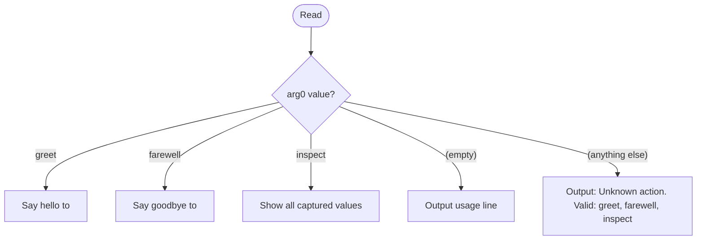

# Argument Substitution Pattern — Example Skill

## How to Use This Skill

This skill is a **living test harness** for argument substitution behavior. Read it, run it, observe what happened, and extend it.

**Step 1 — Read this file.** Do this before running. Note what you expect to see in each section.

**Step 2 — Run with 0 arguments:** `/example-argument-substitution`

**Step 3 — Run with 10 arguments:** `/example-argument-substitution CANARY_A CANARY_B CANARY_C CANARY_D CANARY_E CANARY_F CANARY_G CANARY_H CANARY_I CANARY_J`

**Step 4 — Compare.** Each section states what it expects. Check whether output matches.

---

## How to Add a New Test

When you have a hypothesis about substitution behavior — test it here before applying it anywhere else.

1. **State your hypothesis** — write exactly what you expect to appear in the output
2. **Add the pattern** — put it in a new section below with an `**Expected with 10 args:**` and `**Expected with 0 args:**` annotation
3. **Run with 0 args** — `/example-argument-substitution`
4. **Run with 10 CANARY args** — `/example-argument-substitution CANARY_A CANARY_B ...`
5. **Observe** — does the rendered output match your hypothesis exactly?
6. **Record the finding** — if the hypothesis was wrong, correct it. If it involves literal `$N` syntax, record the verified fact in `./references/argument-substitution-reference.md` (reference files are not substituted)
7. **Only then** apply the pattern to other skills

**Do not document any pattern as safe without completing all 7 steps.**

---

Compare each section below between the two runs. Some sections are *intentional* substitution — they should show values. Others are *unintentional* — they show what corruption looks like.

---

## Capture Block (intentional substitution — should show values)

All positional args captured into named XML tags. Everything else references these tags.

<arg0>$0</arg0>
<arg1>$1</arg1>
<arg2>$2</arg2>
<arg3>$3</arg3>
<arg4>$4</arg4>
<arg5>$5</arg5>
<arg6>$6</arg6>
<arg7>$7</arg7>
<arg8>$8</arg8>
<arg9>$9</arg9>
<all_args>$ARGUMENTS</all_args>
<arg_by_index_0>$ARGUMENTS[0]</arg_by_index_0>
<arg_by_index_1>$ARGUMENTS[1]</arg_by_index_1>
<arg_by_index_2>$ARGUMENTS[2]</arg_by_index_2>

**Expected with 10 args:** each tag holds its CANARY value.
**Expected with 0 args:** all tags empty.

---

## Intentional Substitution in Prose (should show values)

These are correct uses of substitution — injecting argument values directly into skill output.

The skill was invoked with first argument: <arg0>
The target is: <arg1>
All arguments received: <all_args>

A skill instruction that uses the value directly:

> Process the file <arg1> using mode <arg0>.

**Expected with 10 args:** prose shows CANARY_A, CANARY_B, full CANARY string.
**Expected with 0 args:** blanks where the values would be — still correct for a 0-arg invocation.

---

## Intentional Substitution Combined with Command Substitution

Command substitution runs at load time; argument substitution also runs at load time.
Both happen before Claude reads the skill. This line combines both:

!`echo "Loaded at $(date '+%Y-%m-%dT%H:%M:%S') — first arg is: $0"`

**Expected with 10 args:** timestamp + `CANARY_A` on the same line.
**Expected with 0 args:** timestamp + empty string after `first arg is:`.

---

## Unintentional Substitution — Code Examples (shows corruption)

This section intentionally demonstrates what corruption looks like when you write
shell code examples in SKILL.md body. The variables below are consumed at load time.

A bash function you might want to document:

```bash
check_file() {
    local path=$1
    local mode=$2
    [[ -f $1 ]] && chmod $2 $1
}
```

**Expected with 10 args:** `$1` → CANARY_A, `$2` → CANARY_B — code is corrupted.
**Expected with 0 args:** `$1` → empty, `$2` → empty — also corrupted, differently.

Brace form is equally substituted:

```bash
process() {
    echo "arg: ${1}, mode: ${2}"
}
```

**Expected with 10 args:** `${1}` → CANARY_A, `${2}` → CANARY_B — brace form is NOT safe.
**Expected with 0 args:** both render empty — still corrupted.

Awk field references in single quotes are also substituted:

```bash
awk '{print $5, $1}' file.txt
```

**Expected with 10 args:** `$5` → CANARY_F, `$1` → CANARY_A — awk example is broken.
**Expected with 0 args:** both disappear — single quotes provide no protection.

---

## The Correct Pattern — Pre-Declaration + Reference File

**For prose and output strings:** use substitution directly (as shown in the Intentional sections above).

**For code examples containing shell variables:** move them to a reference file.
Reference files are NOT subject to substitution and can show literal `$1`, `${1}`, `$ARGUMENTS` syntax safely.

The pre-declaration pattern for routing skills:

1. Capture args into XML tags at the very top of SKILL.md (as in the Capture Block above)
2. Use `<tagname>` throughout the rest of SKILL.md — never bare `$N` after the capture block
3. Put all code examples with `$N` in `references/*.md`

---

## Routing (uses `<arg0>` as action — correct pattern)



---

## Actions

### greet

**Trigger:** `<arg0>` is `greet`

Output:

```text
Hello, <arg1>!
(invoked as: <all_args>)
```

If `<arg1>` is empty, substitute `world`.

### farewell

**Trigger:** `<arg0>` is `farewell`

Output:

```text
Goodbye, <arg1>. It was a pleasure.
(invoked as: <all_args>)
```

If `<arg1>` is empty, substitute `friend`.

### inspect

**Trigger:** `<arg0>` is `inspect`

Output all captured values:

```text
arg0              = <arg0>
arg1              = <arg1>
arg2              = <arg2>
arg3              = <arg3>
arg4              = <arg4>
arg5              = <arg5>
arg6              = <arg6>
arg7              = <arg7>
arg8              = <arg8>
arg9              = <arg9>
all_args          = <all_args>
arg_by_index_0    = <arg_by_index_0>
arg_by_index_1    = <arg_by_index_1>
arg_by_index_2    = <arg_by_index_2>
```

---

## Full Reference

All substitution variables, pitfall table, and verified escape evidence:

[./references/argument-substitution-reference.md](./references/argument-substitution-reference.md)


<input>
!`node /home/ubuntulinuxqa2/repos/claude_skills/plugins/development-harness/skills/work-backlog-item/scripts/parser/parse.mjs "$ARGUMENTS"`
</input>
<user_text/>
