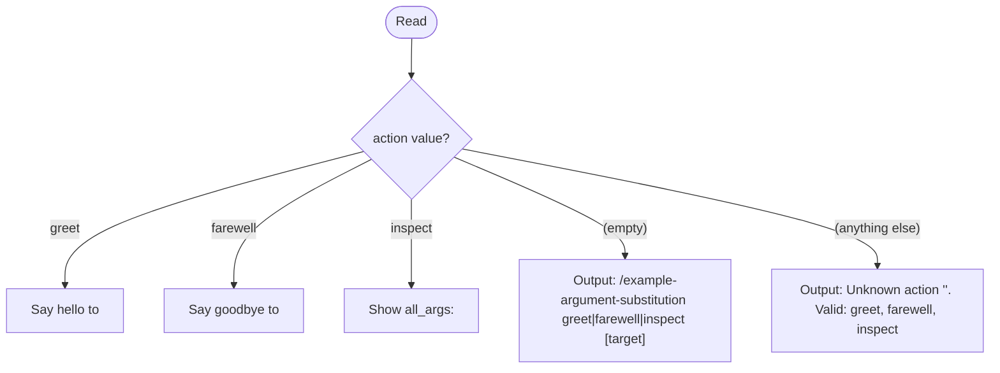

# Argument Substitution Pattern — Example Skill

Arguments are captured once at the top into named tags. All routing and logic below references the tags, not the raw `$` variables.

<action>$0</action>
<target>$1</target>
<all_args>$ARGUMENTS</all_args>

---

## How This Works

When this skill is invoked as `/example-argument-substitution greet world --loud`:

- `$0` → `greet` → captured as `<action>greet</action>`
- `$1` → `world` → captured as `<target>world</target>`
- `$ARGUMENTS` → `greet world --loud` → captured as `<all_args>greet world --loud</all_args>`

Everything below uses `<action>`, `<target>`, and `<all_args>` — never `$0` or `$1` again.

---

## Routing

Dispatch based on `<action>`:



---

## Actions

### greet

**Trigger:** `<action>` is `greet`

Output:

```text
Hello, <target>!
(invoked as: <all_args>)
```

If `<target>` is empty, substitute `world`.

### farewell

**Trigger:** `<action>` is `farewell`

Output:

```text
Goodbye, <target>. It was a pleasure.
(invoked as: <all_args>)
```

If `<target>` is empty, substitute `friend`.

### inspect

**Trigger:** `<action>` is `inspect`

Show all substituted values:

```text
action   = <action>
target   = <target>
all_args = <all_args>
```

Useful for debugging — run `/example-argument-substitution inspect` to see what the skill received.

---

## Example Invocations

| Command | `<action>` | `<target>` | `<all_args>` |
|---------|-----------|-----------|-------------|
| `/example-argument-substitution greet Alice` | `greet` | `Alice` | `greet Alice` |
| `/example-argument-substitution farewell Bob` | `farewell` | `Bob` | `farewell Bob` |
| `/example-argument-substitution inspect` | `inspect` | _(empty)_ | `inspect` |
| `/example-argument-substitution` | _(empty)_ | _(empty)_ | _(empty)_ |

## Argument Substitution Documentation

For full documentation of the substitution syntax (`$ARGUMENTS`, `$0`, `$1`, etc.) and the
pre-declaration pattern — including why reference files can document these literals safely —
see [./references/argument-substitution-reference.md](./references/argument-substitution-reference.md).

That file is loaded separately and is NOT subject to substitution at skill-load time, making
it the correct place to explain the syntax to other skill authors.
