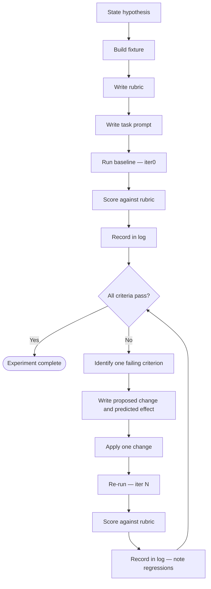

# Experiment Protocol

Design and run controlled experiments that produce verifiable evidence of behavioural improvement in agent instructions, skill prompts, and CLAUDE.md files.

## Core Problem

Uncontrolled testing contaminates results. The most common failure mode: embedding success criteria inside the fixture file the agent reads. This measures the agent's ability to follow in-fixture instructions — not the quality of its own instructions.

## Key Concepts

**Fixture** — the raw, neutral input given to the agent under test. Contains no criteria, no hints, no model answers. Frozen for the entire experiment.

**Rubric** — the scoring criteria. Written before the baseline run. Never shown to the agent under test. Each criterion is an observable pass/fail, not a subjective judgement.

**Task prompt** — minimal instruction given to the agent. States the task only, nothing about quality or expected output. Frozen after baseline.

**Baseline** — the first run, before any changes. Required control condition. Without it, you have no evidence of improvement.

**Blinding** — the agent under test reads only the fixture and task prompt. The rubric lives in a separate file the agent never receives.

**One change per iteration** — never change multiple things between runs. If two things change simultaneously, you cannot attribute the result to either.

**Iteration log** — the experiment record. One entry per run: what changed, what was predicted, what was observed.

## File Locations

```text
.claude/agents/tests/{experiment-name}-fixture.md      # agent experiments
.claude/agents/tests/{experiment-name}-rubric.md
.claude/agents/tests/{experiment-name}-log.md
.claude/agents/tests/{experiment-name}-output-iter{N}.md

.claude/skills/tests/{experiment-name}-fixture.md      # skill experiments
.claude/skills/tests/{experiment-name}-rubric.md
.claude/skills/tests/{experiment-name}-log.md
.claude/skills/tests/{experiment-name}-output-iter{N}.md
```

## Workflow



### Step 1 — State the Hypothesis

Write the hypothesis before touching any files. Format:

```text
HYPOTHESIS: When [specific condition], the agent will [specific observable behaviour].
CURRENT BEHAVIOUR: [what it does now, with file:line evidence if available]
SUCCESS CRITERION: [single observable pass/fail test]
```

Reject vague hypotheses ("better output", "more helpful"). Require a specific observable behaviour that can be scored pass or fail.

### Step 2 — Build the Fixture

Write the fixture to `{experiment-name}-fixture.md`. Apply these constraints:

- Include only the raw input the agent would receive in production
- Include no criteria, no expected outcomes, no hints, no model answers
- Include no phrases like "good output includes..." or "the agent should..."
- Freeze the file — do not edit it after the baseline run

<eg>

**Correct fixture — neutral input only:**

```markdown
# Support Ticket #4471

Customer reports that `uv run myapp.py` exits with code 1 after upgrading
from version 0.3.1 to 0.4.0. No error message is printed. The script
previously worked without modification.

Environment: macOS 14.3, Python 3.12, uv 0.5.2
```

**Wrong fixture — criteria embedded:**

```markdown
# Support Ticket #4471

Customer reports that `uv run myapp.py` exits with code 1 after upgrading
from version 0.3.1 to 0.4.0.

A good response will: ask for the full traceback, check for breaking changes
in 0.4.0, and avoid speculating about causes without evidence.
```

</eg>

### Step 3 — Write the Rubric

Write the rubric to `{experiment-name}-rubric.md` before running the baseline. Each criterion must be observable and binary.

Rubric criterion format:

```markdown
## Criterion {N}: {short name}

OBSERVABLE: {exact thing to look for in the output — a string, an action, a file}
PASS: {what pass looks like}
FAIL: {what fail looks like}
```

<eg>

```markdown
## Criterion 1: Requests evidence before diagnosing

OBSERVABLE: Agent asks for traceback, log output, or reproduction steps before proposing a fix
PASS: Output contains a question requesting additional information before any diagnosis
FAIL: Output contains a diagnosis or proposed fix without first requesting evidence
```

```markdown
## Criterion 2: No speculative causation

OBSERVABLE: Output does not contain "probably", "likely", "might be", or equivalent
PASS: All causal claims are grounded in stated evidence
FAIL: Output contains speculative language linking cause to effect without evidence
```

</eg>

### Step 4 — Write the Task Prompt

Write a minimal task prompt — one or two sentences stating the task. Include nothing about quality, expected output, or success criteria.

```text
You are a support agent. Respond to the support ticket in the fixture.
```

Freeze the task prompt. Changing it between runs declares a new experiment.

### Step 5 — Run the Baseline

Send the agent: task prompt + fixture. Do not include the rubric.

Save output to `{experiment-name}-output-iter0.md`.

Score every criterion in the rubric. Record in the log.

### Step 6 — Record in the Iteration Log

Append one entry per run to `{experiment-name}-log.md`.

Log entry format:

```markdown
## Iter {N} — {YYYY-MM-DD}

**Agent version / file changed:** {path to agent file or "baseline — no change"}
**Change made:** {exact diff description, or "none" for baseline}
**Predicted effect:** {which criterion should improve and why}
**Output file:** {experiment-name}-output-iter{N}.md

### Scores

| Criterion | Score | Notes |
|-----------|-------|-------|
| 1: Requests evidence | PASS | Asked for traceback before diagnosing |
| 2: No speculative causation | FAIL | Used "probably" in line 4 |

**Regressions:** {list any criteria that passed in iter N-1 but fail in iter N}
**Net change:** {+N criteria passing, -N criteria passing}
```

### Step 7 — Iterate

For each failing criterion:

1. Write the proposed change in plain text before applying it
2. State the predicted effect: which criterion it addresses and why
3. Apply one change only
4. Re-run, score, record
5. Note regressions explicitly — do not suppress them

Repeat until all criteria pass or changes are exhausted.

## Anti-Patterns

These are prohibited. Each produces invalid results.

**Embedding criteria in the fixture** — writing "the agent should..." or "a good response includes..." inside the file the agent reads. This tests instruction-following, not instruction quality. The rubric and fixture are separate files for this reason.

**Changing multiple things between runs** — if two things change simultaneously, you cannot attribute the result. Change one thing, record the result, then change the next.

**Writing rubric criteria after seeing output** — post-hoc criteria are shaped by what the agent produced. Write criteria before the baseline run. The rubric is frozen after that.

**Reporting only passing runs** — every run is recorded in the log, including runs that fail or regress. Cherry-picking passes invalidates the experiment.

**Changing the task prompt between runs** — the task prompt is part of the experimental condition. Changing it starts a new experiment. If you must change it, create a new experiment directory.

**Eyeballing output** — subjective assessment of whether output "looks good" is not scoring. Every criterion is binary. Score every criterion for every run using the rubric definition.

**In-fixture model answers** — including an example of good output inside the fixture teaches the agent what you want, rather than testing whether its instructions produce it.

## Verification Before Declaring Complete

Before closing an experiment, verify:

- [ ] Rubric was written before the baseline run (check log timestamps)
- [ ] Fixture contains no embedded criteria or model answers
- [ ] Every run has a log entry with per-criterion scores
- [ ] Every regression is recorded, not suppressed
- [ ] Each iteration changed exactly one thing
- [ ] Task prompt was frozen after baseline (or a new experiment was declared)
- [ ] All criteria pass in the final iteration
