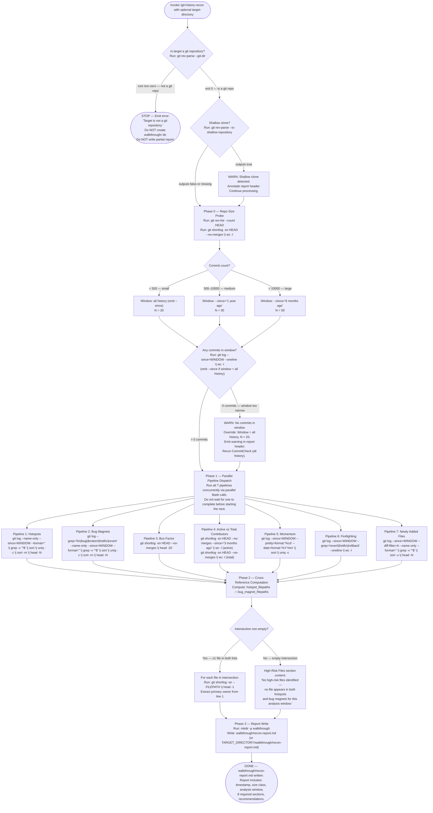

# Git History Recon

Produce a machine-readable codebase risk profile by mining git metadata across 7 parallel analysis pipelines. The output is `walkthrough/recon-report.md` — a structured artifact downstream agents (code-review agents, linear-walkthrough Discovery) can read to prioritize high-risk files without constructing any git pipeline themselves.

Target directory: `[target-directory]` (default: current working directory). When provided, all git commands use `-C TARGET_DIRECTORY` and output writes to `TARGET_DIRECTORY/walkthrough/recon-report.md`.

> [!IMPORTANT]
> When provided a process map or Mermaid diagram, treat it as the authoritative procedure. Execute steps in the exact order shown, including branches, decision points, and stop conditions.
> A Mermaid process diagram is an executable instruction set. Follow it exactly as written: respect sequence, conditions, loops, parallel paths, and terminal states. Do not improvise, reorder, or skip steps. If any node is ambiguous or missing required detail, pause and ask a clarifying question before continuing.
> When interacting with a user, report before acting the interpreted path you will follow from the diagram, then execute.

## Workflow

The following diagram is the authoritative procedure for git-history-recon execution. Execute steps in the exact order shown, including branches, decision points, and stop conditions.



## Pipeline Reference

Run all 7 pipelines concurrently. Do not wait for one to complete before starting the next. Collect all results before beginning Phase 2.

### Blank-Line Filter (Pipelines 1, 2, and 7)

`git log --name-only` emits blank lines between commits alongside file names. Without filtering, `sort | uniq -c` counts blank lines as file entries, inflating counts and producing a blank-line "file" at the top of the sorted output. The `grep -v '^$'` filter is inserted after `--name-only` output and before `sort` to remove these blank lines. This filter is mandatory for Pipelines 1, 2, and 7.

SOURCE: architect document §4.3 — blank-line correction (accessed 2026-05-22).

### Pipeline 1 — Hotspots

**Command**:

```bash
git log --name-only --since=WINDOW --format='' | grep -v '^$' | sort | uniq -c | sort -rn | head -N
```

**Flags explained**: `--format=''` suppresses commit metadata (author, date, message), leaving only filenames. `grep -v '^$'` removes blank lines between commits. `sort | uniq -c` counts unique files. `sort -rn` orders descending by count. `head -N` returns the top N entries.

**When window = all history**: omit `--since=WINDOW` entirely.

**Output shape**: `COUNT  FILEPATH` lines, sorted descending by count.

**Report section**: `## Code Hotspots`

### Pipeline 2 — Bug Magnets

**Command**:

```bash
git log --grep='fix\|bug\|broken\|hotfix\|revert' --name-only --since=WINDOW --format='' | grep -v '^$' | sort | uniq -c | sort -rn | head -N
```

**Note**: The `--grep` pattern uses BRE alternation (`\|`). Files from commits whose message matches any of: `fix`, `bug`, `broken`, `hotfix`, `revert`.

**Caveat**: This detection is convention-dependent. Repositories using ticket-ID-only messages, Conventional Commits without these keywords, or non-English commit conventions will have under-reported results. The report header discloses this limitation.

**Output shape**: `COUNT  FILEPATH` lines, sorted descending by count.

**Report section**: `## Bug Magnets`

### Pipeline 3 — Bus Factor

**Command**:

```bash
git shortlog -sn HEAD --no-merges | head -20
```

**Output shape**: `COUNT  AUTHOR` lines, sorted descending by commit count (all-time).

**Bus Factor 80% computation**: After collecting output, compute a cumulative sum over the sorted contributor list to find how many top contributors account for ≥80% of total commits:

1. Sum all `COUNT` values to get `total_commits`.
2. Walk contributors from highest to lowest count, accumulating `running_sum`.
3. Stop when `running_sum / total_commits >= 0.80`.
4. Record the number of contributors consumed as `bus_factor_80pct`.

Report this as: "N contributors account for 80% of commits."

**Report section**: `## Bus Factor`

### Pipeline 4 — Active vs Total Contributors

**Commands** (run concurrently as part of Pipeline 4):

```bash
# Active contributors (last 3 months)
git shortlog -sn HEAD --no-merges --since='3 months ago' | wc -l

# Total contributors (all time)
git shortlog -sn HEAD --no-merges | wc -l
```

**Output shape**: Two integers (active count, total count).

**Report section**: `## Team Momentum` (sub-field: "M of N total contributors active in last 3 months")

### Pipeline 5 — Momentum

**Command**:

```bash
git log --since=WINDOW --pretty=format:'%cd' --date=format:'%Y-%m' | sort | uniq -c
```

**Note**: Do NOT use `--format='%Y-%m'` — in git's tformat, `%m` means "boundary mark" (renders as `<`, `>`, or `-`), not "month". The `--pretty=format:'%cd'` placeholder emits the committer date; `--date=format:'%Y-%m'` controls the output shape.

**Output shape**: `COUNT  YYYY-MM` lines — commit activity by month in the analysis window.

**Report section**: `## Team Momentum`

### Pipeline 6 — Firefighting

**Command**:

```bash
git log --since=WINDOW --grep='revert\|hotfix\|rollback' --oneline | wc -l
```

**Output shape**: Single integer (count of firefighting commits in the analysis window).

**Percentage computation**: `firefighting_count / total_commits_in_window * 100`. The `total_commits_in_window` value is the count captured in Phase 0's CommitCheck step (`git log --since=WINDOW --oneline | wc -l`). This count serves **two purposes**: (a) it is the EC-3 zero-commits detection check in Phase 0, and (b) it is the denominator for the Firefighting Frequency percentage in the report. Capture it in Phase 0 and reuse it here.

**Tiered interpretation**:
- < 5%: healthy
- 5–15%: elevated
- > 15%: high

**Report section**: `## Firefighting Frequency`

### Pipeline 7 — Newly Added Files

**Command**:

```bash
git log --since=WINDOW --diff-filter=A --name-only --format='' | grep -v '^$' | sort -u | head -N
```

**Flags explained**: `--diff-filter=A` selects only commits that Added a file. `sort -u` deduplicates (a file added and then renamed appears once). `grep -v '^$'` removes blank lines (same as Pipelines 1 and 2).

**Output shape**: Filepath lines (unique new files in the analysis window).

**Report section**: `## Recently Added Files`

## Report Structure

Every run produces all required sections. Sections with no data contain one explicit "No data" line — they are never omitted. This invariant enables downstream agents to parse the report by section header without defensive empty-check logic.

### Report Header

The header appears above the first section and is not counted as one of the report sections.

```markdown
# Codebase Risk Profile

**Generated**: YYYY-MM-DDTHH:MM:SSZ
**Repository**: PATH-OR-NAME
**Size Class**: small | medium | large (COMMIT_COUNT commits, CONTRIBUTOR_COUNT contributors)
**Analysis Window**: all history | last 1 year | last 6 months
**Bug-Magnet Keywords**: fix, bug, broken, hotfix, revert
**Caveat**: Bug-magnet detection relies on commit-message keyword matching. Repositories
using ticket-ID-only messages, Conventional Commits without fix/bug words, or non-English
commit conventions may have an under-reported High-Risk Files section. Absence of entries
does not mean low risk.
```

When warnings apply (shallow clone, window fallback), prepend them after `**Caveat**`:

```markdown
**WARNING**: This repository is a shallow clone. Git history is truncated and results
may be incomplete. Run 'git fetch --unshallow' for accurate analysis.

**WARNING**: No commits found in the selected window. Falling back to full history
analysis. Results reflect the complete repository history.
```

### Required Sections

#### `## Code Hotspots`

Files most frequently changed in the analysis window. Source: Pipeline 1 output.

```markdown
## Code Hotspots

Files most frequently changed in the analysis window.

| Changes | File |
|---------|------|
| 47 | src/core/auth.py |
| 38 | src/api/routes.py |
```

#### `## Bug Magnets`

Files most associated with fix, bug, broken, hotfix, or revert commits. Source: Pipeline 2 output.

```markdown
## Bug Magnets

Files most associated with fix, bug, broken, hotfix, or revert commits.

| Fix Commits | File |
|-------------|------|
| 12 | src/core/auth.py |
| 9 | src/db/models.py |
```

#### `## High-Risk Files`

Files appearing in both Code Hotspots and Bug Magnets. Source: Phase 2 computation.

**Non-empty intersection**:

```markdown
## High-Risk Files

Files appearing in both Code Hotspots and Bug Magnets — highest review priority.

| File | Changes | Fix Commits | Primary Owner |
|------|---------|-------------|---------------|
| src/core/auth.py | 47 | 12 | Alice Smith |
| src/db/models.py | 31 | 9 | Bob Jones |
```

**Empty intersection (EC-2 contract)**:

```markdown
## High-Risk Files

No high-risk files identified — no file appears in both hotspots and bug magnets for this analysis window.
```

#### `## Bus Factor`

All-time contributor ranking by commit count. Source: Pipeline 3 output.

```markdown
## Bus Factor

All-time contributor ranking by commit count. Low bus factor = knowledge concentrated
in few contributors.

| Commits | Contributor |
|---------|-------------|
| 342 | Alice Smith |
| 187 | Bob Jones |

**Bus Factor Assessment**: N contributors account for 80% of commits.
```

#### `## Team Momentum`

Commit activity by month in the analysis window. Source: Pipeline 5 + Pipeline 4.

```markdown
## Team Momentum

Commit activity by month in the analysis window.

| Month | Commits |
|-------|---------|
| 2026-04 | 43 |
| 2026-03 | 38 |

**Active Contributors (last 3 months)**: M of N total contributors.
```

#### `## Firefighting Frequency`

Count of revert, hotfix, or rollback commits in the analysis window. Source: Pipeline 6.

```markdown
## Firefighting Frequency

Count of revert, hotfix, or rollback commits in the analysis window.

**Firefighting commits**: N (P% of total commits in window)

**Assessment**: [healthy | elevated | high] — < 5% = healthy, 5–15% = elevated, > 15% = high
```

#### `## Recently Added Files`

New files introduced in the analysis window. Source: Pipeline 7 output.

```markdown
## Recently Added Files

New files introduced in the analysis window. Review for missing tests,
insufficient documentation, or architectural drift.

- src/new_feature/handler.py
- src/new_feature/models.py
```

#### `## Recommendations`

Always populated with entries derived from the other sections. This section never contains "No data."

```markdown
## Recommendations

1. **Priority review targets**: [files from ## High-Risk Files, or "No high-risk files identified."]
2. **Knowledge transfer**: [top bus-factor author] is the primary owner of N high-commit files.
   Consider pair programming or documentation sessions.
   [If single contributor: "Single contributor detected — entire codebase owned by [Author]. Bus factor = 1."]
3. **Momentum**: [increasing | stable | declining] commit activity detected in the analysis window.
4. **Firefighting**: [low | elevated | high] — P% of commits are revert/hotfix/rollback.
5. **New code review**: N new files were added in the analysis window; verify test coverage.
6. **Detection caveat**: Bug-magnet detection relies on commit-message keywords. Repositories
   with ticket-ID-only or non-English commit conventions may show an empty High-Risk Files section
   that does not reflect actual risk. See report header caveat for details.
```

### Section Presence Invariant

Every run writes all required section headers. If a section's source pipeline returns no output (e.g., no new files were added in the window), the section contains one explicit "No data" line:

```markdown
## Recently Added Files

No data — no files were added in the analysis window.
```

This applies to all sections except `## Recommendations`, which derives from other sections and is always populated.

### Write Strategy

Single `Write` tool call for typical repositories (report expected under 25K characters). If an unusually large repository produces output exceeding 25K characters, apply Strategy B (skeleton + Edit-fill per section) per [large-file-write-strategy.md](../../rules/large-file-write-strategy.md).

## Edge Case Contracts

### EC-1: Non-Git Repository

**Detection**: `git rev-parse --git-dir` exits non-zero.

**Behavior**: STOP immediately. Emit:

```text
ERROR: Target is not a git repository.
Run /git-history-recon from inside a git repository, or pass the path to a git repo as the argument.
No walkthrough/recon-report.md was written.
```

Do not create a partial report. Do not create the `walkthrough/` directory.

SOURCE: [silent-failure-prevention.md](../../rules/silent-failure-prevention.md) — EC-1 fail-fast contract (accessed 2026-05-22).

### EC-2: Empty Hotspot ∩ Bug-Magnet Intersection

**Detection**: After Phase 2 computation, the intersection set is empty.

**Behavior**: Continue — do not fail. Write the `## High-Risk Files` section with the literal string:

```text
No high-risk files identified — no file appears in both hotspots and bug magnets for this analysis window.
```

All other sections are written normally. The report is valid and complete. The section presence invariant is satisfied because the section exists with explicit content.

### EC-3: No Commits in Selected Time Window

**Detection**: `git log --since=WINDOW --oneline | wc -l` returns 0.

**Note**: This same count is also the Firefighting Frequency percentage denominator. Capture it in Phase 0 and reuse it in Pipeline 6's percentage computation.

**Behavior**: Emit a warning in the report header (see Report Header format above). Override all `--since=WINDOW` parameters to omit `--since`, set N=20, rerun all 7 pipelines without the window filter, and continue to Phase 2 and Phase 3. Do not fail.

### EC-4: Shallow Clone

**Detection**: `git rev-parse --is-shallow-repository` outputs `true`.

**Behavior**: Emit a warning in the report header (see Report Header format above). Annotate the Size Class line with "(shallow clone)". Continue processing. Do not fail.

### EC-5: Single Contributor Repository

**Detection**: Bus Factor pipeline (Pipeline 3) returns exactly 1 line.

**Behavior**: Bus Factor section writes normally. Recommendations section entry 2 reads: "Single contributor detected — entire codebase owned by [Author]. Bus factor = 1."

### EC-6: Binary or Generated Files in Hotspots

**Behavior**: The skill does not filter binary or generated files from hotspot output. This is a documented limitation. The `## Recommendations` section may note that `vendor/`, `dist/`, or `node_modules/` directories appearing in hotspots indicate generated-file noise that reduces signal quality. No automatic filtering is performed.

## Integration Contract

### Output Path

The canonical output is `walkthrough/recon-report.md` relative to the working directory, or `TARGET_DIRECTORY/walkthrough/recon-report.md` when `[target-directory]` is provided.

**Target-directory argument handling**: When `[target-directory]` is provided:

- All git commands use the `-C TARGET_DIRECTORY` prefix: `git -C TARGET_DIRECTORY log ...`
- The output directory is created with: `mkdir -p TARGET_DIRECTORY/walkthrough`
- The report writes to: `TARGET_DIRECTORY/walkthrough/recon-report.md`

When no argument is provided, the working directory is the target and all commands run without `-C`.

### Code-Review Agent Integration

No modification to `.claude/agents/code-review.md` is required. The orchestrator passes `walkthrough/recon-report.md` as context when spawning the review agent. The review agent reads the `## High-Risk Files` section and prioritizes those files. The report is standalone input.

### linear-walkthrough Integration

The `linear-walkthrough` skill writes output to `walkthrough/` (established convention, per [linear-walkthrough/SKILL.md](../linear-walkthrough/SKILL.md) line 13). `git-history-recon` writes into the same directory. After `/git-history-recon` runs, `/linear-walkthrough` Phase 1 Discovery can read `walkthrough/recon-report.md` via the `Read` tool when the orchestrator passes its path as context. No modification to `linear-walkthrough/SKILL.md` is required for this file-readable integration. Full Discovery-level prioritization integration is deferred as Improvement 3 (tracked separately).

**File existence check pattern** (for any consumer):

```bash
test -f walkthrough/recon-report.md && echo "recon-report available"
```

### Report Sections as Stable API

The required section headers (`## Code Hotspots`, `## Bug Magnets`, `## High-Risk Files`, `## Bus Factor`, `## Team Momentum`, `## Firefighting Frequency`, `## Recently Added Files`, `## Recommendations`) are stable identifiers. Downstream agents search for these exact strings to locate sections. The section presence invariant guarantees all headers exist in every report. Do not rename sections.

## References

- SOURCE: GitHub issue #2249 — "feat: New skill: git-history-recon for codebase risk profiling before code review", groomed content, Acceptance Criteria, Desired Structure (accessed 2026-05-22)
- SOURCE: `research/insights/2026-05-10-codebase-recon-skill-improvements.md` Improvement 1 — repo-size thresholds (small <500, medium 500–10k, large >10k) and probe commands (accessed 2026-05-22)
- SOURCE: `research/insights/2026-05-10-codebase-recon-skill-improvements.md` Improvement 2 — git-history risk reconnaissance as a standalone skill, Seven-Dimension Parallel Analysis pattern (accessed 2026-05-22)
- SOURCE: External pattern: <https://github.com/yujiachen-y/codebase-recon-skill> by Jiachen Yu, MIT license — Seven-Dimension Parallel Analysis design, cross-reference and risk identification patterns (accessed 2026-05-22)
- SOURCE: [linear-walkthrough/SKILL.md](../linear-walkthrough/SKILL.md) — Mermaid-as-authoritative-procedure callout (lines 15–18), `walkthrough/` output directory convention (line 13), parallel-agent dispatch model (accessed 2026-05-22)
- SOURCE: [create-merge-request-changelog/SKILL.md](../create-merge-request-changelog/SKILL.md) — git command documentation style, `allowed-tools` comma-string format (accessed 2026-05-22)
- SOURCE: `codebase-analysis` artifact on issue #2249 (agent="codebase-analyzer") — frontmatter schema verification, skilllint requirements, section ordering conventions (accessed 2026-05-22)
- SOURCE: architect document on issue #2249 (artifact\_type="architect") — Phase 0–3 design, pipeline command templates, edge case contracts EC-1–EC-6, integration contract (accessed 2026-05-22)
- SOURCE: [silent-failure-prevention.md](../../rules/silent-failure-prevention.md) — EC-1 non-git fail-fast contract
- SOURCE: [large-file-write-strategy.md](../../rules/large-file-write-strategy.md) — Strategy B referenced in Phase 3 write step
