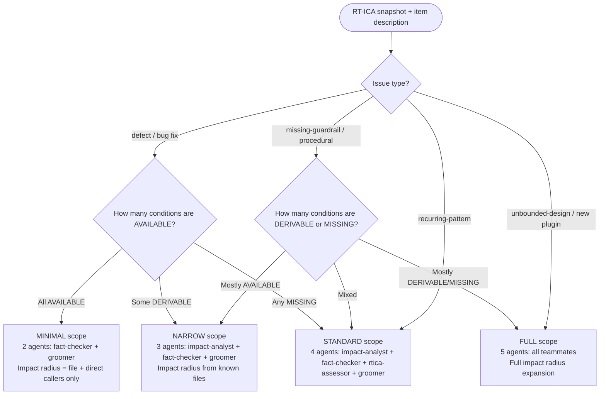
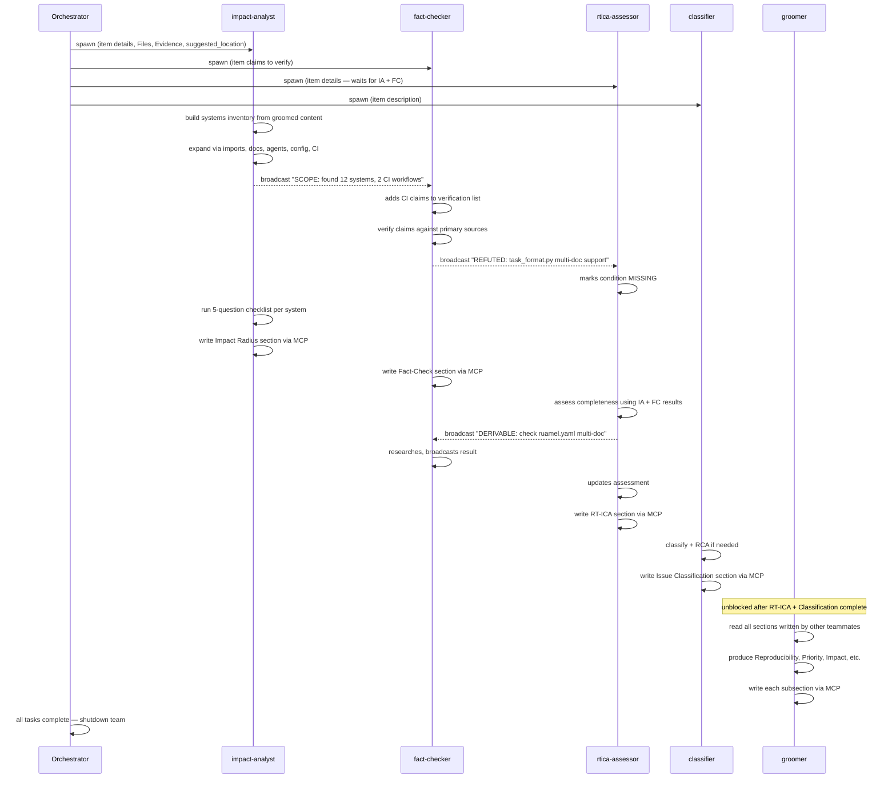

<groom_scope>$ARGUMENTS</groom_scope>

# Groom Backlog Item

Orchestrate autonomous backlog refinement: verify claims, clarify scope, estimate effort, map resources and dependencies, and clean stale items — making each item ready for the planning phase.

**Scope boundary**: Grooming answers "what needs to be done, is the problem clear, and what do we have to work with?" It does NOT answer "how should it be built." Architecture, task decomposition, and implementation design happen in the SAM planning phase (`/work-backlog-item` Step 6). Grooming produces a DEEP item (Detailed appropriately, Estimated, Emergent, Prioritized) — not a plan. The human provides direction and priorities; the agent does the research, fact-checking, and resource mapping autonomously.

## Arguments

`<groom_scope/>` accepts:

- **Title substring** — e.g., `Error Recovery` — grooms matching item (case-insensitive)
- **Section** — `P0`, `P1`, `P2`, or `Ideas` — grooms all items in that section
- **`all`** — grooms all items across P0, P1, P2, Ideas (parallel agents)

## Workflow

### Step 1: Parse Arguments and Load Backlog

Call `mcp__backlog__backlog_list()` and filter the returned dict's `items` list by argument type above.

### Step 2: Validity Check (Pre-Groom Gate)

Before fact-checking or grooming, verify each item is still valid work:

1. **Is the job still valid?** — Scope, priority, or context may have changed. Ask or infer: does this item still belong in the backlog?
2. **Is the work already done?** — Search for evidence that the feature was already implemented or the bug was already fixed, even if the issue is still open. Run the **Already Implemented Discovery** procedure:

   a. **Search for commits matching the item's topic** (use keywords from the title):

      ```bash
      git log --oneline --all -30 --grep="{keyword from title}"
      ```

   b. **Search for merged PRs matching the topic**:

      ```bash
      gh pr list -R Jamie-BitFlight/claude_skills --search "{keyword}" --state merged --json number,title,url,mergedAt --limit 5
      ```

   c. **Check if the described feature/fix exists in the codebase** — read the files at the suggested location and verify whether the described behavior is already present.

   If evidence shows the work is done:

   - **Comment evidence on the GitHub issue** (if one exists):

     ```bash
     gh issue comment N -R Jamie-BitFlight/claude_skills --body "This work was already completed via PR #{pr} / commit {sha}. Closing."
     ```

   - **Close the GitHub issue**:

     ```bash
     gh issue close N -R Jamie-BitFlight/claude_skills --reason completed
     ```

   - **Close the local backlog item**:

     Call `mcp__backlog__backlog_resolve(selector="{title}", summary="Already implemented via PR #{pr} / commit {sha}")`.

   - Report to the user and skip grooming for that item.

   If no evidence is found, proceed — the work is still needed.
3. **Is this local file stale?** — If the item has a GitHub issue (`metadata.issue` or index link `#N`), call `mcp__backlog__backlog_view(selector="#{N}")` and check the `state` field in the returned dict. If the issue is **closed**, the local file is a stale remnant of work already done. Do **not** groom. Instead, run the **Completed Issue Discovery** procedure:

   a. **Search for commits referencing the issue**:

      ```bash
      git log --oneline --all -20 --grep="#N"
      ```

   b. **Search for merged PRs referencing the issue**:

      ```bash
      gh pr list -R Jamie-BitFlight/claude_skills --search "#N" --state merged --json number,title,url,mergedAt --limit 5
      ```

   c. **Comment evidence on the issue** (if not already present):

      ```bash
      gh issue comment N -R Jamie-BitFlight/claude_skills --body "Completed via PR #M / commit {sha}"
      ```

   d. **Close the local backlog item with evidence**:

      Call `mcp__backlog__backlog_resolve(selector="{title}", summary="Completed via PR #{pr} / commit {sha}")`.

   If no commits or PRs reference the issue, report: "Issue #{N} is closed but no commit/PR evidence found. Recommend manual review." and skip grooming.
   Skip grooming for that item; move to the next.

4. **Is this item already groomed today?** — Check the item file's `groomed` frontmatter field. If it matches today's date AND the item has all required sections (Fact-Check, RT-ICA, groomed subsections), skip Steps 4–8 entirely. Go directly to Step 9 and apply only the specific change requested by the user — do not re-derive, re-fact-check, or re-groom. Re-running the full pipeline on an already-groomed item produces duplicate content and wastes tokens.

If any of checks 1–3 fail, skip grooming for that item and report. For items that pass checks 1–3, proceed to Step 3. For items that pass checks 1–3 but match check 4 (already groomed today), skip directly to Step 9.

### Step 3: Extract Item Details

For each target item, extract: title, description, research-first questions (if present), source, suggested location.

### Step 3.5: RT-ICA Initial Snapshot

Before spawning any agents, the orchestrator runs a quick RT-ICA pass using only the information available from Steps 2-3 (item fields, description, suggested_location). This is a baseline — not the final assessment.

```text
RT-ICA Snapshot: {item title}
Goal: {one sentence}
Conditions:
1. {condition} | Status: {AVAILABLE|DERIVABLE|MISSING}
...
AVAILABLE count: {N}
DERIVABLE count: {N}
MISSING count: {N}
```

Write this snapshot to the item via `mcp__backlog__backlog_groom(selector="{title}", section="RT-ICA", content="{snapshot}")`.

This snapshot serves two purposes:
- It feeds the scope-sizing decision in Step 3.6
- It gives the swarm agents a starting picture of what's known and what needs research

### Step 3.6: Scope Sizing

The orchestrator determines how many agents to spawn based on the RT-ICA snapshot and the item's nature. This is a decision the orchestrator makes — not a delegation.



| Scope | Agents | When | Impact Radius depth |
|-------|--------|------|-------------------|
| MINIMAL | 2 (fact-checker, groomer) | Bug fix, all conditions known, existing system | File + direct callers |
| NARROW | 3 (impact-analyst, fact-checker, groomer) | Known system, some unknowns to derive | Known files + one level of expansion |
| STANDARD | 4 (impact-analyst, fact-checker, rtica-assessor, groomer) | Mixed knowns/unknowns, existing system being modified | Full expansion from known starting points |
| FULL | 5 (all teammates including classifier) | New system, many unknowns, unbounded design | Deep expansion, classify issue type, full RCA |

**Escalation rule:** If any agent discovers scope beyond what the current sizing anticipated (e.g., impact-analyst in NARROW scope finds 15+ affected systems), the orchestrator escalates to the next scope level by spawning additional agents. In team mode, new teammates join the existing team. In no-team mode, the orchestrator spawns new agents in the next wave.

### Steps 4-8: Parallel Grooming Swarm

Steps 4-8 run as a parallel swarm sized by Step 3.6. Each concern gets its own agent. All agents write to the same backlog item via MCP `backlog_groom` (each writes to a different section — no clobbering). Agents broadcast findings to the team so others can react.

#### Team mode (preferred — when TeamCreate is available)

```text
TeamCreate(team_name: "groom-{item-slug}")
```

Create tasks and spawn teammates for each concern:

**Teammates to spawn** (all run in parallel, all write via MCP):

1. **impact-analyst** — Build the affected systems inventory (Phase 1), then run the 5-question impact checklist on each system (Phase 2). Write results to `section="Impact Radius"`. Broadcast scope-expanding findings to the team.
2. **fact-checker** — Verify item claims against primary sources. Write results to `section="Fact-Check"`. Broadcast REFUTED claims (these become MISSING conditions for rtica-assessor).
3. **rtica-assessor** — Assess information completeness. Write results to `section="RT-ICA"`. When fact-checker broadcasts a REFUTED claim, mark that condition MISSING. When impact-analyst broadcasts new scope, add new conditions. Broadcast DERIVABLE conditions (fact-checker or impact-analyst may be able to resolve them).
4. **classifier** — Classify issue type and run root-cause analysis if `defect` or `recurring-pattern`. Write to `section="Issue Classification"` and `section="Root-Cause Analysis"`.
5. **groomer** — Produce groomed subsections (Reproducibility, Priority, Impact, Benefits, Expected Behavior, Acceptance Criteria, Files, Resources, Dependencies, Effort). Waits for impact-analyst, fact-checker, and rtica-assessor to complete first (task dependency). Write each subsection via `section="{name}"`.

**Task dependencies:**

```text
TaskCreate(subject: "Impact Radius")           # no deps
TaskCreate(subject: "Fact-Check")              # no deps
TaskCreate(subject: "RT-ICA")                  # blocked by Impact Radius + Fact-Check
TaskCreate(subject: "Issue Classification")    # no deps
TaskCreate(subject: "Groomer")                 # blocked by RT-ICA + Issue Classification
```

**Teammate interaction flow:**



**Scope expansion handling:** When impact-analyst discovers systems not in the original groomed content, it broadcasts the finding. Other teammates adjust:
- fact-checker adds new claims to verify
- rtica-assessor adds new conditions
- groomer incorporates new systems into its sections

After all teammates complete, the orchestrator shuts down the team and proceeds to Step 9.

#### No-team fallback (when TeamCreate is not available)

Spawn agents sequentially, re-spawning when new information arrives:

**Wave 1** (parallel — no dependencies between them):
- Agent: impact-analyst — writes `section="Impact Radius"`
- Agent: fact-checker — writes `section="Fact-Check"`
- Agent: classifier — writes `section="Issue Classification"` and `section="Root-Cause Analysis"`

**After Wave 1 completes**, read the Impact Radius and Fact-Check sections from the item. If impact-analyst found systems that change the scope of the fact-check, spawn a second fact-checker agent with the expanded scope.

**Wave 2** (depends on Wave 1 results):
- Agent: rtica-assessor — receives Impact Radius + Fact-Check results, writes `section="RT-ICA"`

If RT-ICA returns BLOCKED, stop and present missing inputs to user. Do not proceed to Wave 3.

**Wave 3** (depends on Wave 2):
- Agent: groomer — receives all prior sections, writes groomed subsections

**Re-spawn rule:** After each wave, read what was written to the item via MCP. If new scope was discovered (impact-analyst found systems not in the original description), check whether the existing sections need updating. If yes, spawn targeted agents to update specific sections before proceeding to the next wave.

#### Impact Radius — what to find and why

The impact-analyst teammate (or agent in no-team mode) performs two phases:

**Phase 1: Build the Affected Systems Inventory**

Starting from the files and functions in the groomed content (Files, Evidence, Description, suggested_location sections), identify all systems that interact with the thing this item changes. A "system" is any file that produces, consumes, documents, configures, tests, or instructs the use of the affected interface.

Create a TodoItem for each system. Each TodoItem includes: file path, role (producer / consumer / documentation / configuration / CI / agent-instruction), and connection (why this file is affected).

Start with the known systems from the groomed content:
- Files listed in the **Files** section
- Functions cited in the **Output / Evidence** section
- Path from **suggested_location**

Then expand by searching for:
- Files that import from or call into the known systems
- Documentation that describes the current behavior of these systems
- Agent or skill files that instruct the AI to use these systems
- Configuration files that reference these modules
- CI workflows that test these modules
- Test files that exercise these systems

Exclude archived and generated content: `plan/` artifacts, `docs/plans/`, `.claude/archive/`, `.claude/grooming-sessions/`, test fixtures. Backlog item files (`.claude/backlog/*.md`) are informational — they describe the problem, not the system.

**Phase 2: Impact Checklist (per system)**

For each TodoItem, answer these five questions:

1. **Will this file break when the item ships?** — Does it depend on an interface, format, or behavior that the item changes? If yes: what specifically breaks.
2. **Will this file become stale?** — Does it describe, document, or reference the current behavior? If yes: what section or claim becomes inaccurate.
3. **Does this file need a code change?** — Import update, API migration, format change, dependency update. If yes: what change.
4. **Does this file need a content update?** — Documentation rewrite, instruction update, example refresh. If yes: what section.
5. **Is there a test that covers this file's interaction with the changed interface?** — If no: flag as needing a new test.

Mark each TodoItem complete after answering. Any system with at least one "yes" answer goes into the Impact Radius output.

**Impact Radius output format:**

```markdown
## Impact Radius

### Code — Producers (write the changed interface)
- `{path}::{function_name}` — {what it produces, what change is needed}

### Code — Consumers (read the changed interface)
- `{path}::{function_name}` — {what it consumes, what migration is needed}

### Code — Other References
- `{path}` — {import/constant/type reference, what change is needed}

### Documentation (will become stale)
- `{path}` — {what section becomes inaccurate}

### Configuration / CI
- `{path}` — {what change is needed}

### Agent Instructions (instruct AI to use current interface)
- `{path}` — {what instruction needs updating}

### Systems Inventory
{full list of TodoItems with roles and connections, for planner completeness verification}

### Ecosystem Completeness Checklist
- [ ] Every code producer updated or verified compatible
- [ ] Every code consumer migrated to new interface
- [ ] Every stale document updated
- [ ] Every agent instruction updated
- [ ] Old interface deprecated or removed (if replacing)
- [ ] CI/config files updated and validated
```

If a category has no affected files, write `None identified.` — do not omit the category.

#### Fact-Check — evidence rules

The fact-checker teammate (or agent) verifies item claims against primary sources. Training data recall is NOT evidence. Valid evidence: WebFetch output, WebSearch results, command output, repository source code, MCP tool output.

Output: `Fact-Check Summary` with claims checked, VERIFIED/REFUTED/INCONCLUSIVE counts, and citations.

REFUTED claims become MISSING conditions in RT-ICA. INCONCLUSIVE claims become DERIVABLE.

#### RT-ICA — information completeness

The rtica-assessor produces:

```text
RT-ICA: {item title}
Goal: {one sentence}
Conditions:
1. {condition} | Status: {AVAILABLE|DERIVABLE|MISSING} | Info needed: {what}
Decision: {APPROVED|BLOCKED}
```

**ARL human-probing integration:** When RT-ICA returns BLOCKED or MISSING conditions, optionally include `invisible_knowledge_prompts` — questions to ask the human before planning. See [.claude/docs/sdlc-layers/arl-human-probing-design.md](../../docs/sdlc-layers/arl-human-probing-design.md).

#### Issue Classification

Classify the issue type. See flowchart and write template in [issue-classification.md](./references/issue-classification.md).

| Type | Analysis Method |
|------|----------------|
| `procedural` | none |
| `recurring-pattern` | 6-sigma |
| `defect` | 5-whys |
| `missing-guardrail` | none |
| `unbounded-design` | design-framing |

Root-cause analysis runs only for `defect` or `recurring-pattern`. Full procedures: [issue-classification.md](./references/issue-classification.md).

#### Groomer — subsection production

The groomer teammate (or agent) produces: Reproducibility, Priority, Impact, Benefits, Expected Behavior, Acceptance Criteria, Files, Resources, Dependencies, Effort. Prompt templates: [groomer-agent.md](./references/groomer-agent.md).

The groomer reads all sections written by prior teammates (Impact Radius, Fact-Check, RT-ICA, Issue Classification) from the item via MCP before producing its sections. This ensures the groomed content reflects the full findings.

### Step 8.5: RT-ICA Final Pass

After all swarm agents complete, the orchestrator re-runs RT-ICA using the full information now available. Read all sections written to the item (Impact Radius, Fact-Check, Issue Classification, groomed subsections) and re-assess every condition from the Step 3.5 snapshot.

Compare the final assessment against the initial snapshot:

```text
RT-ICA Final: {item title}
Goal: {same as snapshot}
Conditions:
1. {condition} | Snapshot: {AVAILABLE|DERIVABLE|MISSING} → Final: {AVAILABLE|DERIVABLE|MISSING}
...
Changes from snapshot:
- {condition X}: DERIVABLE → AVAILABLE (resolved by fact-checker)
- {condition Y}: AVAILABLE → MISSING (refuted by fact-checker)
- {condition Z}: (new) MISSING (discovered by impact-analyst)
Decision: {APPROVED|BLOCKED}
```

Write the final RT-ICA to the item via `mcp__backlog__backlog_groom(selector="{title}", section="RT-ICA", content="{final RT-ICA}")`, replacing the snapshot.

If the final decision is BLOCKED (conditions that were DERIVABLE in the snapshot turned out to be MISSING, or new MISSING conditions were discovered by the swarm), stop and present missing inputs to the user. Do not proceed to Step 9.

If APPROVED, the item is fully groomed with verified information. Proceed to Step 9.

### Step 9: Write Groomed Content to Item Files

For each item, write groomed content into the per-item file via the backlog MCP tools.

**MCP tool parameters are schema-enforced.** Unlike CLI subcommands, MCP tools reject invalid parameters
with a structured error. There is no need to verify signatures before calling. If unsure which tool to
use, check the tool name and parameters:

- `mcp__backlog__backlog_update` — updates an existing item (selector required)
- `mcp__backlog__backlog_groom` — writes groomed content (selector required)
- `mcp__backlog__backlog_sync` — creates GitHub issues for items missing them and pushes groomed content (no selector — operates on entire backlog)

Prefer incremental updates so sections (Fact-Check, RT-ICA, groomed subsections) are written as they become available. GitHub is canonical: when the item has an issue, the MCP tool syncs groomed content to the GitHub issue body.

**Preferred: incremental section updates**

After each step, call `mcp__backlog__backlog_groom` with `section` and `content`:

```text
# After Step 4 (fact-check)
mcp__backlog__backlog_groom(selector="{item title}", section="Fact-Check", content="{fact-check summary}")

# After Step 5 (RT-ICA)
mcp__backlog__backlog_groom(selector="{item title}", section="RT-ICA", content="{rt-ica summary}")

# After Step 8 (groomer output) — subsection or full groomed body
mcp__backlog__backlog_groom(selector="{item title}", section="Reproducibility", content="{reproducibility section}")
# ... or for full groomed body:
mcp__backlog__backlog_groom(selector="{item title}", groomed_content="{full groomed body}")
```

**Alternative: full content**

```text
mcp__backlog__backlog_groom(selector="{item title}", groomed_content="{full groomed body}")
```

Note — `--groomed-file {path}` and stdin pipe (`< {file}`) patterns have no MCP equivalent.
Provide groomed content inline via the `groomed_content` parameter.

**Valid section names** — top-level: `Fact-Check`, `RT-ICA`, `Impact Radius`. Groomed subsections: `Reproducibility`, `Priority`, `Impact`, `Scope`, `Output / Evidence`, `Dependencies`, `Research`, `Skills`, `Agents`, `Prior Work`, `Files`, `Decision`, `Issue Classification`, `Root-Cause Analysis`.

The backlog script updates `.claude/backlog/{priority}-{slug}.md` with merged sections, sets `groomed` in frontmatter, and syncs to the GitHub issue when the item has one.

**Bulk grooming (multiple items)** — when grooming 2+ items, optionally persist a session summary to `.claude/grooming-sessions/{YYYY-MM-DD}.md`:

```markdown
# Grooming Session {YYYY-MM-DD}

**Items groomed**: {count}
**Arguments**: {original arguments}

## Summary

| Item | Fact-Check | RT-ICA | Written |
|------|------------|--------|---------|
| {title} | {V}/{R}/{I} | {APPROVED/BLOCKED} | ✓ |

## Cross-Item Findings

### Shared Dependencies
- {items multiple backlog items depend on}

### Suggested Groupings
- {items that could be worked together}

### Research Gaps
- {topics needing research}
```

Per-item groomed content lives in each item file; this session file holds only metadata and cross-item findings.

## Example Invocations

```text
/groom-backlog-item Error Recovery
/groom-backlog-item P1
/groom-backlog-item all
```

## Completion Criteria

- Validity check (job still valid, problem reproducible, local file not stale) before grooming
- RT-ICA initial snapshot run before swarm (Step 3.5) — baselines what is AVAILABLE / DERIVABLE / MISSING
- Scope sized from RT-ICA snapshot + issue type (Step 3.6) — MINIMAL / NARROW / STANDARD / FULL
- Agent count matches scope sizing — not all 5 agents for every item
- All grooming concerns run as parallel swarm (team mode) or iterative waves (no-team fallback)
- Impact Radius: systems inventory built from groomed content, 5-question checklist run per system, section written via MCP
- Fact-Check: claims verified against primary sources (training data not used as evidence), section written via MCP
- Issue Classification: assigned with RCA for `defect`/`recurring-pattern` types, section written via MCP
- Groomer: subsections produced after all prior sections are available, each written via MCP
- Scope expansion handled: when new systems or refuted claims change scope, orchestrator escalates to next scope level
- RT-ICA final pass run after swarm completes (Step 8.5) — re-assesses all conditions with full information, replaces snapshot
- RT-ICA final shows changes from snapshot (which conditions moved, which are new)
- If RT-ICA final is BLOCKED, stop and present missing inputs — do not proceed to Step 9
- When item has GitHub issue, all sections synced to issue body
- Team shut down after all teammates complete (team mode) or all waves finish (fallback mode)
- Bulk session summary optionally saved to `.claude/grooming-sessions/{date}.md` when grooming multiple items
