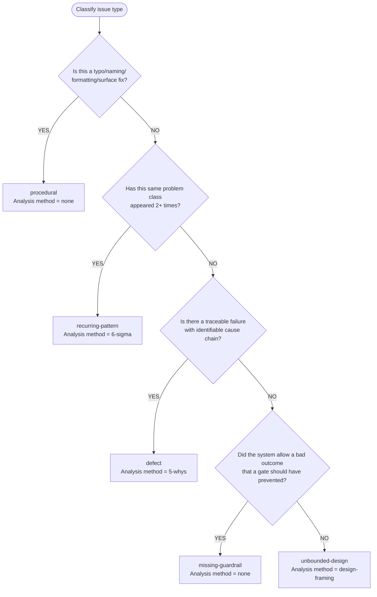

# Issue Classification and Root-Cause Analysis

## Table of Contents

- [Classification Flowchart](#classification-flowchart)
- [Classification Types](#classification-types)
- [Writing Classification to Backlog Item](#writing-classification-to-backlog-item)
- [Root-Cause Analysis](#root-cause-analysis)
  - [defect — 5-whys](#defect--5-whys)
  - [recurring-pattern — 6-sigma](#recurring-pattern--6-sigma)

---

## Classification Flowchart



## Classification Types

| Type | Analysis Method | When |
|------|----------------|------|
| `procedural` | none | Typo, naming, formatting, surface fix |
| `recurring-pattern` | 6-sigma | Same problem class appeared 2+ times |
| `defect` | 5-whys | Traceable failure with identifiable cause chain |
| `missing-guardrail` | none | System allowed bad outcome that a gate should have prevented |
| `unbounded-design` | design-framing | None of the above |

## Writing Classification to Backlog Item

```text
mcp__backlog__backlog_groom(selector="{title}", section="Issue Classification", content="**Type**: {classification}
**Rationale**: {1-2 sentence explanation}
**Analysis Method**: {method}
**Scenario Target**: {what scenario exposed this} -> {what should improve}")
```

`scenario-target` captures the specific scenario that exposed the problem and what should improve after the fix.

---

## Root-Cause Analysis

**Only runs for `defect` or `recurring-pattern` classifications.** Skip entirely for `procedural`, `missing-guardrail`, and `unbounded-design`.

### defect — 5-whys

Invoke `/find-cause` to build an evidence chain from symptom to root cause:

```text
Skill(skill="find-cause", args="{description of the defect}")
```

Write the evidence chain:

```text
mcp__backlog__backlog_groom(selector="{title}", section="Root-Cause Analysis", content="**Method**: 5-whys
**Classification**: defect

#### Evidence Chain

{evidence chain from /find-cause}

**Root Cause**: {single actionable statement}
**Scenario Target**: {what scenario exposed this} -> {what should improve}")
```

### recurring-pattern — 6-sigma

Call `mcp__backlog__backlog_list(status="resolved")`, filter by keywords related to this defect class, count matches, and write the measurement section:

```text
mcp__backlog__backlog_groom(selector="{title}", section="Root-Cause Analysis", content="**Method**: 6-sigma
**Classification**: recurring-pattern

#### Measurement

- **Frequency**: {N occurrences in {time period or batch}}
- **Common factors**: {what the occurrences share}
- **Affected scope**: {what parts of the system are impacted}

#### Analysis

- **Root cause pattern**: {why this class of defect recurs}
- **Missing guardrail**: {what gate or instruction should prevent this}

#### Improvement

- **Proposed guardrail**: {specific instruction, gate, or check to add}
- **Verification**: {how to confirm the guardrail works}")
```

**Note**: If the human has already identified the recurrence pattern, skip the search and use the human's assessment.
