# Linear Walkthrough

Produce a navigable, fact-checked explanation of how a codebase works — from entry points through major execution paths — by orchestrating parallel subagents across four phases.

Target directory: `<target-directory>` (default: current working directory).

Output directory: `<target-directory>/walkthrough/` (created if it does not exist).

> [!IMPORTANT]
> When provided a process map or Mermaid diagram, treat it as the authoritative procedure. Execute steps in the exact order shown, including branches, decision points, and stop conditions.
> A Mermaid process diagram is an executable instruction set. Follow it exactly as written: respect sequence, conditions, loops, parallel paths, and terminal states. Do not improvise, reorder, or skip steps. If any node is ambiguous or missing required detail, pause and ask a clarifying question before continuing.
> When interacting with a user, report before acting the interpreted path you will follow from the diagram, then execute.

## Workflow

The following diagram is the authoritative procedure for linear-walkthrough execution. Execute steps in the exact order shown, including branches, decision points, and stop conditions.

```mermaid
flowchart TD
    %% Entry point
    Invoke(["Invoke /linear-walkthrough with target-directory"]) --> ValidateDir

    %% Input validation gate
    ValidateDir{"Does target directory exist<br>and contain source files?"}
    ValidateDir -->|"No — directory missing or empty"| StopInvalid(["STOP — report: target directory does not exist or is empty"])
    ValidateDir -->|"Yes — directory valid"| SpawnDiscovery

    subgraph Phase1["Phase 1 — Discovery and Planning"]
        %% Spawn discovery agent
        SpawnDiscovery["Spawn one general-purpose agent<br>Pass: target directory path,<br>agent-instructions.md (section Discovery Agent Instructions),<br>output-format.md (sections Coverage Plan Format + Entry Point Index Format)"]
        SpawnDiscovery --> P1Wait["Wait for discovery agent to complete"]
        P1Wait --> P1Done["Agent produces:<br>walkthrough/coverage-plan.md<br>walkthrough/entry-points.md"]
    end

    %% Orchestrator reads plan and verifies budgets
    P1Done --> ReadPlan["Read walkthrough/coverage-plan.md<br>Extract agent assignments (ID, scope, files, entry points, token budget)"]
    ReadPlan --> CheckBudget

    CheckBudget{"Does any assignment<br>exceed 50k token read budget?"}
    CheckBudget -->|"Yes — budget exceeded"| SpawnSplit["Spawn general-purpose agent<br>to split the over-budget assignment<br>Pass: coverage-plan.md, offending assignment ID"]
    SpawnSplit --> ReadPlanAgain["Re-read walkthrough/coverage-plan.md<br>Extract updated assignment list"]
    ReadPlanAgain --> CheckBudget
    CheckBudget -->|"No — all assignments within budget"| SpawnTracers

    subgraph Phase2["Phase 2 — Generation (N parallel agents)"]
        %% Spawn N tracing agents — one per assignment
        SpawnTracers["Spawn N parallel general-purpose agents<br>(one per assignment from coverage plan)<br>Each agent receives: its own assignment text (ID, scope, files, entry points),<br>target directory path,<br>agent-instructions.md (section Tracing Agent Instructions),<br>output-format.md (section Walkthrough Section Format),<br>constraint: read at most 50k tokens of source files"]
        SpawnTracers --> P2Wait["Wait for all N tracing agents to complete"]
        P2Wait --> P2Done["Each agent produces:<br>walkthrough/sections/walkthrough-section-{id}.md"]
    end

    %% Verify all section files were produced
    P2Done --> CheckSections

    CheckSections{"Do all expected section files<br>exist in walkthrough/sections/?"}
    CheckSections -->|"Yes — all sections present"| SpawnValidators
    CheckSections -->|"No — one or more agents failed to produce output"| MarkGap["Record missing section IDs as gaps<br>Mark gaps for the validation phase"]
    MarkGap --> SpawnValidators

    subgraph Phase3["Phase 3 — Validation (M parallel agents)"]
        %% Cross-assignment rotation: validator i checks sections from agent i+1 (wrapping)
        SpawnValidators["Spawn M parallel general-purpose agents<br>Apply cross-assignment rotation:<br>validator 1 checks sections from agent 2,<br>validator 2 checks sections from agent 3 (wrap around)<br>If M less than N: each validator checks multiple sections<br>If N = 1: single validator checks all sections<br>Each agent receives: paths to assigned walkthrough section files,<br>target directory path,<br>agent-instructions.md (section Validation Agent Instructions),<br>output-format.md (section Validation Report Format),<br>constraint: read at most 50k tokens total"]
        SpawnValidators --> P3Wait["Wait for all M validation agents to complete"]
        P3Wait --> P3Done["Each agent produces:<br>walkthrough/validation/validation-report-{id}.md"]
    end

    %% Check validation reports for critical issues
    P3Done --> ReadReports["Read all validation reports<br>from walkthrough/validation/"]
    ReadReports --> CheckCritical

    CheckCritical{"Do any validation reports contain<br>critical corrections?<br>(incorrect sequencing, invented behavior,<br>broken references)"}
    CheckCritical -->|"Yes — critical corrections exist"| SpawnCorrections["Spawn one general-purpose agent per affected section file<br>Each agent receives: validation report for that section,<br>path to the section file to correct<br>Agent edits the section file in place"]
    SpawnCorrections --> P4Gate["Corrections applied — proceed to Phase 4"]
    CheckCritical -->|"No — no critical corrections"| P4Gate

    subgraph Phase4["Phase 4 — Synthesis"]
        %% Synthesis agent merges all validated sections
        P4Gate --> SpawnSynthesis["Spawn one general-purpose agent<br>Pass: walkthrough/sections/ directory path,<br>walkthrough/validation/ directory path,<br>walkthrough/entry-points.md,<br>agent-instructions.md (section Synthesis Agent Instructions),<br>output-format.md (section Unified Walkthrough Format)"]
        SpawnSynthesis --> P4Wait["Wait for synthesis agent to complete"]
        P4Wait --> P4Done["Agent produces:<br>walkthrough/unified-walkthrough.md<br>walkthrough/open-questions.md"]
    end

    %% Large output handling — apply large-file-write-strategy
    P4Done --> CheckSize

    CheckSize{"Does unified-walkthrough.md<br>exceed 25k characters?"}
    CheckSize -->|"No — single file acceptable"| Complete(["COMPLETE — walkthrough/unified-walkthrough.md<br>is the authoritative output"])
    CheckSize -->|"Yes — output too large for single file"| SplitOutput["Use Strategy A — multi-file split<br>Create walkthrough/unified/index.md<br>Create per-section files under walkthrough/unified/<br>Each file must be under 25k characters"]
    SplitOutput --> CheckSingleRequired

    CheckSingleRequired{"Is a single-file output<br>explicitly required by the caller?"}
    CheckSingleRequired -->|"No — split acceptable"| CompleteSplit(["COMPLETE — walkthrough/unified/index.md<br>is the authoritative output"])
    CheckSingleRequired -->|"Yes — single file required"| SkeletonFill["Use Strategy B — skeleton + edit-fill<br>Write skeleton under 5k chars,<br>then Edit each section individually<br>Verify no PENDING markers remain"]
    SkeletonFill --> CompleteSingle(["COMPLETE — walkthrough/unified-walkthrough.md<br>is the authoritative output"])
```

## Operational Rules

- Start broad (directory structure, configs, READMEs), then narrow (source files, implementation details).
- Read architecture docs and configs early when available.
- Prefer primary sources in this order: code, config, tests, scripts, CI/CD, docs.
- Use tests and deployment config as evidence for intended behavior.
- Track partial coverage and uncovered areas explicitly in open-questions.md.
- If the repo is too large for full coverage, prioritize the most operationally important paths first and mark the rest as partial.
- Agents must not overlap file coverage unless overlap is necessary for shared infrastructure, framework bootstrapping, or cross-cutting concerns.
- The coverage plan must explicitly track which files are assigned to which agent and why.

## Quality Standards

- Prefer concrete file paths, symbols, commands, configs, and interfaces over vague summaries.
- Do not fabricate intent or architecture not supported by the repo.
- Mark unsupported claims as `[INFERENCE]`.
- Distinguish clearly between verified facts from code/config, reasonable inferences, and unresolved uncertainty.
- Optimize for onboarding a strong engineer who needs real understanding, not a marketing summary.

## Resources

- [Agent instructions](./references/agent-instructions.md) — detailed prompts for each agent type (discovery, tracing, validation, synthesis)
- [Output format](./references/output-format.md) — required structure and templates for all artifacts
