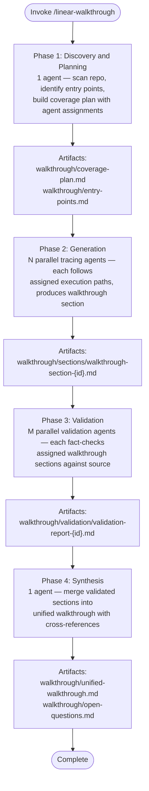

# Linear Walkthrough

Produce a navigable, fact-checked explanation of how a codebase works — from entry points through major execution paths — by orchestrating parallel subagents across four phases.

Target directory: `<target-directory>` (default: current working directory).

Output directory: `<target-directory>/walkthrough/` (created if it does not exist).

## Workflow

## Input Validation

Before starting Phase 1, verify the target directory exists and contains source files. If the target directory does not exist or is empty, stop and report the error.

## Phase 1: Discovery and Planning

Spawn one `general-purpose` agent to scan the repository and produce a coverage plan.

### Agent prompt context

Include these in the agent prompt (pass file paths — do not transcribe file contents):

- Target directory path
- File path: [agent-instructions.md](./references/agent-instructions.md) — agent reads section "Discovery Agent Instructions"
- File path: [output-format.md](./references/output-format.md) — agent reads sections "Coverage Plan Format" and "Entry Point Index Format"

### Agent deliverables

| Artifact | Path | Contents |
|----------|------|----------|
| Coverage plan | `walkthrough/coverage-plan.md` | Agent assignments, file partitions, token budget estimates, rationale |
| Entry points | `walkthrough/entry-points.md` | All identified entry points with type, file, purpose, owning subsystem |

### Orchestrator actions after Phase 1

1. Read `walkthrough/coverage-plan.md`.
2. Extract agent assignments — each assignment defines: agent ID, scope description, assigned files/directories, entry points to trace, estimated token budget.
3. Verify no assignment exceeds 50k token read budget. If any does, instruct a follow-up agent to split it.
4. Proceed to Phase 2 with the assignment list.

## Phase 2: Generation

Spawn N parallel `general-purpose` agents — one per assignment from the coverage plan.

### Agent prompt context (per agent)

Include these in the agent prompt (pass file paths — do not transcribe file contents):

- Assignment scope from coverage-plan.md (agent ID, assigned files, entry points) — this is the one exception: include the assignment text directly since each agent gets only its own assignment
- Target directory path
- File path: [agent-instructions.md](./references/agent-instructions.md) — agent reads section "Tracing Agent Instructions"
- File path: [output-format.md](./references/output-format.md) — agent reads section "Walkthrough Section Format"
- Constraint: read at most 50k tokens of source files

### Agent deliverables (per agent)

| Artifact | Path | Contents |
|----------|------|----------|
| Walkthrough section | `walkthrough/sections/walkthrough-section-{id}.md` | Linear trace of assigned execution paths |

Each section follows the format defined in [output-format.md](./references/output-format.md), including: section ID, title, owning files, upstream/downstream sections, step-by-step flow, key interfaces, confidence markings.

### Orchestrator actions after Phase 2

1. Verify all expected section files exist in `walkthrough/sections/`.
2. If any agent failed to produce output, note the gap and proceed — mark missing sections in the validation phase.
3. Proceed to Phase 3.

## Phase 3: Validation

Spawn M parallel `general-purpose` agents. Each validator checks one or more walkthrough sections produced in Phase 2.

Validator cross-assignment: rotate section assignments so validator 1 checks sections from agent 2, validator 2 checks sections from agent 3, and so on (wrapping around). If there are fewer validators than tracing agents, each validator checks multiple agents' sections. If there is only one tracing agent, the single validator checks all sections (self-validation is acceptable when no alternative exists).

### Agent prompt context (per validator)

Include these in the agent prompt (pass file paths — do not transcribe file contents):

- Paths to assigned walkthrough section files
- Target directory path (for source file access)
- File path: [agent-instructions.md](./references/agent-instructions.md) — agent reads section "Validation Agent Instructions"
- File path: [output-format.md](./references/output-format.md) — agent reads section "Validation Report Format"
- Constraint: read at most 50k tokens of explanation files plus relevant source context

### Agent deliverables (per validator)

| Artifact | Path | Contents |
|----------|------|----------|
| Validation report | `walkthrough/validation/validation-report-{id}.md` | Corrections, confidence levels, contradictions, unresolved issues |

### Orchestrator actions after Phase 3

1. Read all validation reports from `walkthrough/validation/`.
2. Check for blocking issues (incorrect sequencing, invented behavior, broken references).
3. If critical corrections exist (incorrect sequencing, invented behavior, broken references), spawn a new `general-purpose` agent per affected section to apply the corrections. Pass the agent the validation report and the walkthrough section file path. The agent edits the section file in place.
4. Proceed to Phase 4.

## Phase 4: Synthesis

Spawn one `general-purpose` agent to merge all validated walkthrough sections into a unified document.

### Agent prompt context

Include these in the agent prompt (pass file paths — do not transcribe file contents):

- Directory path: `walkthrough/sections/` — agent reads all walkthrough section files
- Directory path: `walkthrough/validation/` — agent reads all validation reports
- File path: `walkthrough/entry-points.md`
- File path: [agent-instructions.md](./references/agent-instructions.md) — agent reads section "Synthesis Agent Instructions"
- File path: [output-format.md](./references/output-format.md) — agent reads section "Unified Walkthrough Format"

### Agent deliverables

| Artifact | Path | Contents |
|----------|------|----------|
| Unified walkthrough | `walkthrough/unified-walkthrough.md` | Complete codebase walkthrough with all sections connected |
| Open questions | `walkthrough/open-questions.md` | Standalone file of unresolved uncertainties, partial coverage areas, follow-up suggestions. The unified walkthrough's Validation Appendix references this file rather than duplicating it. |

### Large output handling

The unified walkthrough may exceed 25k characters. Apply the [large file write strategy](../../rules/large-file-write-strategy.md):

- If content exceeds 25k characters, use Strategy A (multi-file split): create `walkthrough/unified/index.md` with references to per-section files under `walkthrough/unified/`.
- If a single-file output is required, use Strategy B (skeleton + edit-fill).

## Operational Rules

- Start broad (directory structure, configs, READMEs), then narrow (source files, implementation details).
- Read architecture docs and configs early when available.
- Prefer primary sources in this order: code, config, tests, scripts, CI/CD, docs.
- Use tests and deployment config as evidence for intended behavior.
- Track partial coverage and uncovered areas explicitly in open-questions.md.
- If the repo is too large for full coverage, prioritize the most operationally important paths first and mark the rest as partial.
- Agents must not overlap file coverage unless overlap is necessary for shared infrastructure, framework bootstrapping, or cross-cutting concerns.
- The coverage plan must explicitly track which files are assigned to which agent and why.

## Quality Standards

- Prefer concrete file paths, symbols, commands, configs, and interfaces over vague summaries.
- Do not fabricate intent or architecture not supported by the repo.
- Mark unsupported claims as `[INFERENCE]`.
- Distinguish clearly between verified facts from code/config, reasonable inferences, and unresolved uncertainty.
- Optimize for onboarding a strong engineer who needs real understanding, not a marketing summary.

## Resources

- [Agent instructions](./references/agent-instructions.md) — detailed prompts for each agent type (discovery, tracing, validation, synthesis)
- [Output format](./references/output-format.md) — required structure and templates for all artifacts
