# Mermaid.js Cookbook — Practical Examples

**Purpose**: Real-world patterns and copy-paste examples for common use cases.

**Source**: Official Mermaid.js documentation + practical patterns
**Last Updated**: 2026-03-07

---

## Table of Contents

1. [API & System Design](#api--system-design)
2. [Project Management](#project-management)
3. [Data & Analytics](#data--analytics)
4. [Software Architecture](#software-architecture)
5. [User Workflows](#user-workflows)
6. [Testing & QA](#testing--qa)
7. [Database Design](#database-design)
8. [Decision Trees](#decision-trees)
9. [Performance Analysis](#performance-analysis)
10. [Compliance & Requirements](#compliance--requirements)

---

## API & System Design

### REST API Flow

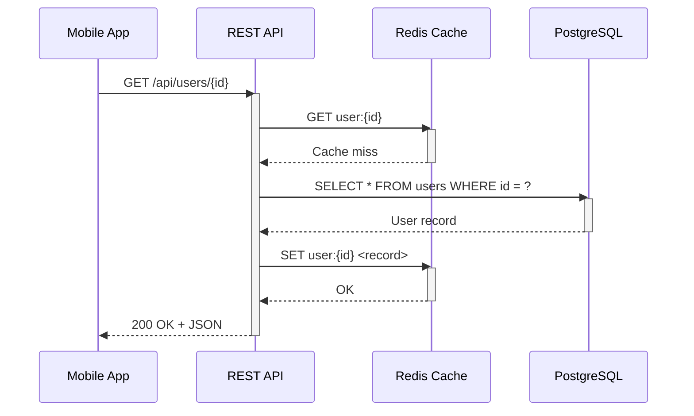

### GraphQL Query Resolution

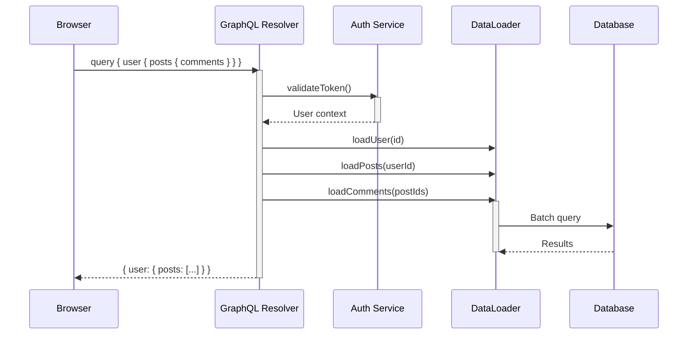

### Microservice Communication


---

## Project Management

### Agile Sprint Timeline

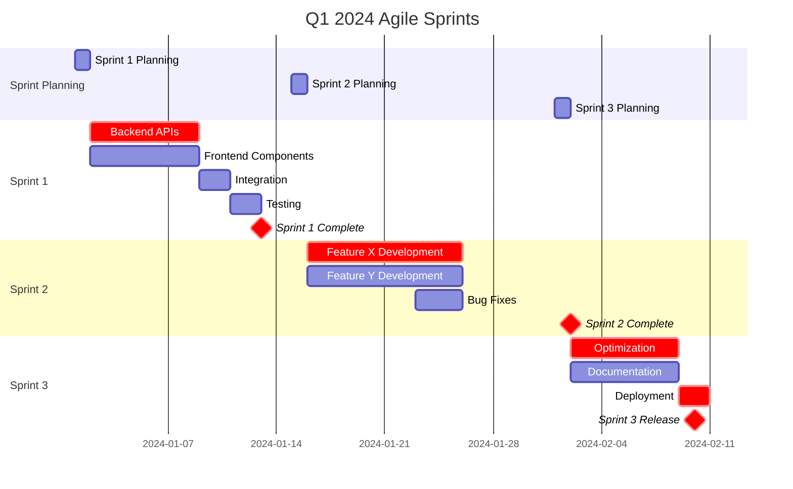

### Feature Prioritization Matrix

```mermaid
quadrantChart
    title Feature Prioritization
    x-axis Effort --> Development Cost
    y-axis Impact --> Business Value

    quadrant-1 Do First (High Impact, High Effort)
    quadrant-2 Expand (High Impact, Low Effort)
    quadrant-3 Low Priority (Low Impact, Low Effort)
    quadrant-4 Reconsider (Low Impact, High Effort)

    OAuth Integration: [0.8, 0.9]
    Dark Mode Theme: [0.3, 0.7]
    Bug Fixes: [0.2, 0.4]
    Performance Tuning: [0.7, 0.8]
    UI Polish: [0.4, 0.5]
    Mobile App: [0.9, 0.95]
    Analytics Dashboard: [0.6, 0.8]
    Email Notifications: [0.4, 0.7]
    Legacy Code Refactor: [0.9, 0.3]
    Experimental Feature: [0.5, 0.3]
```

### Release Roadmap

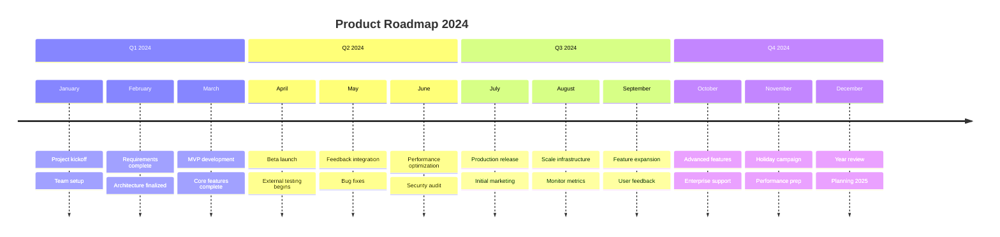

### Dependency Tracking

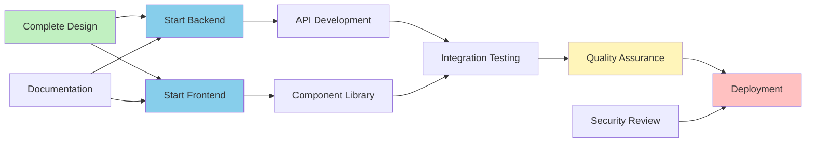

---

## Data & Analytics

### Sales Funnel Analysis

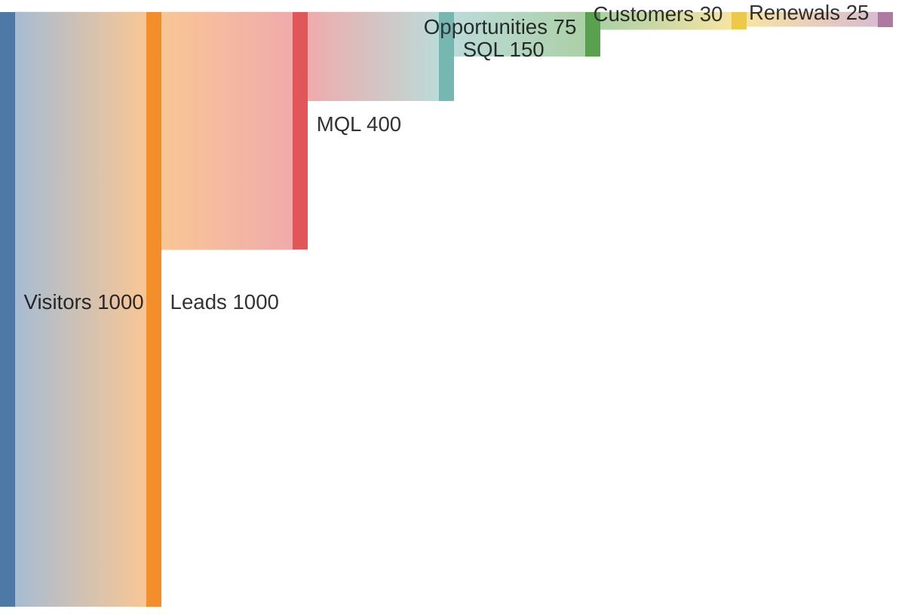

### Market Share Comparison

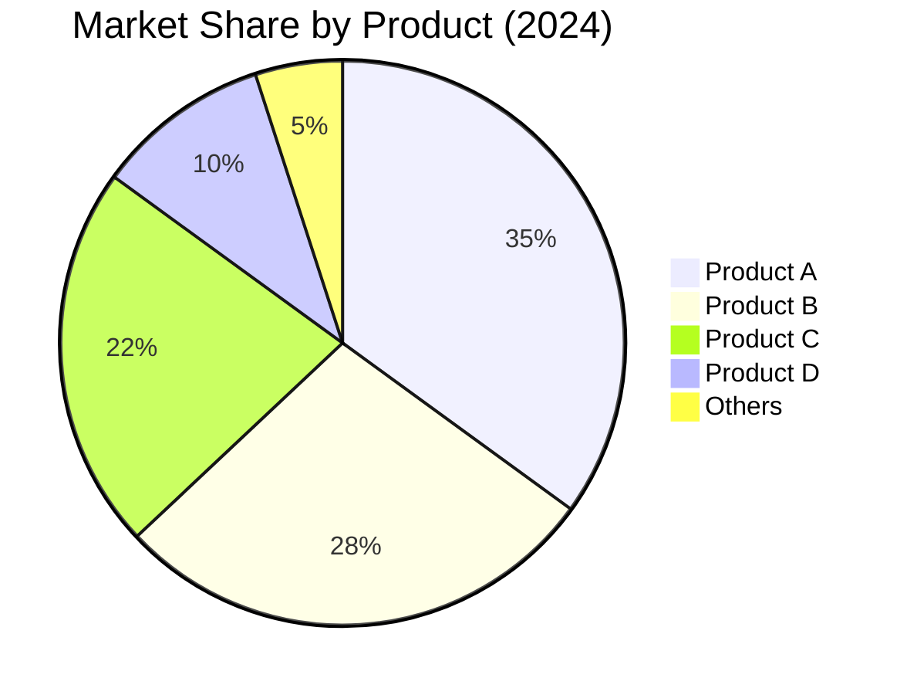

### Performance Metrics Dashboard


### Revenue Trend Analysis

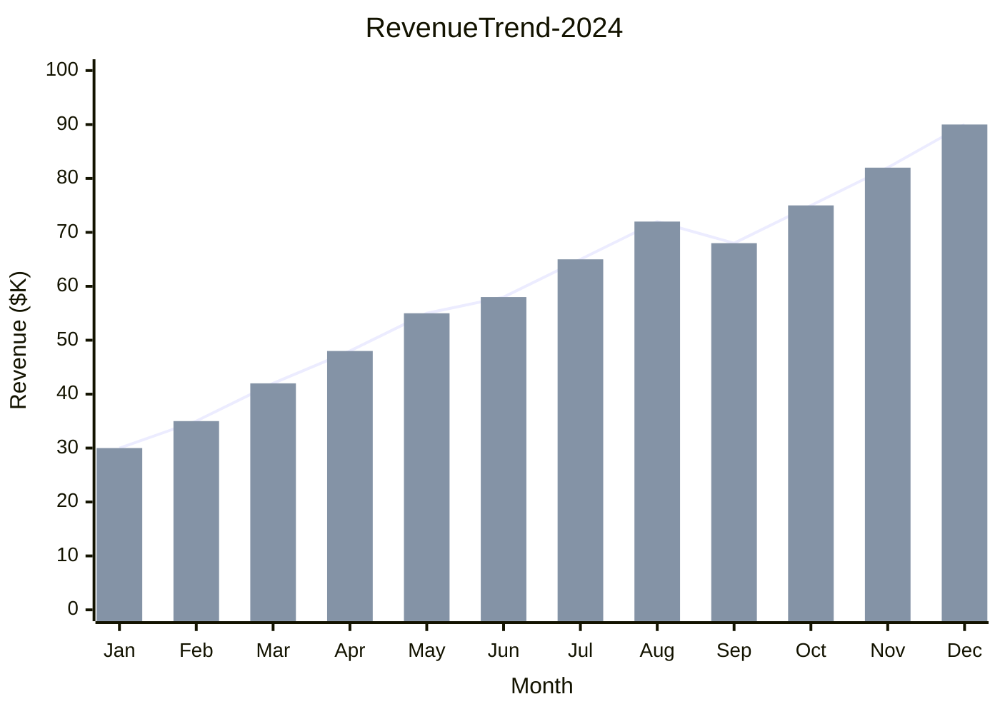

### Customer Segmentation

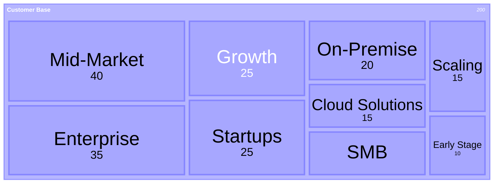

---

## Software Architecture

### Three-Tier Architecture


### Service Dependencies

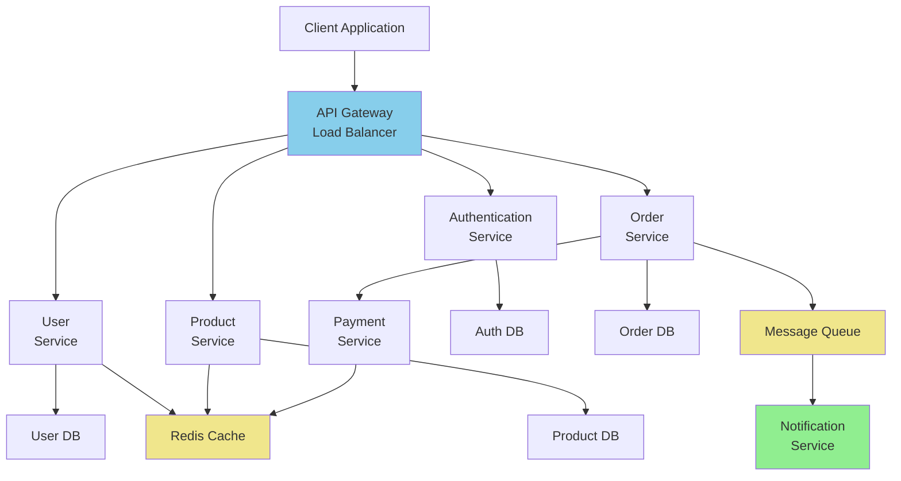

### Deployment Pipeline

```mermaid
flowchart LR
    Dev["Developer<br/>Commit"]

    Git["GitHub<br/>Repo"]

    CI["CI Pipeline<br/>GitHub Actions"]

    Test["Automated<br/>Tests"]

    Build["Build<br/>Docker Image"]

    Registry["Container<br/>Registry"]

    Staging["Staging<br/>Deployment"]

    SmokeTest["Smoke<br/>Tests"]

    Approval["Manual<br/>Approval"]

    Prod["Production<br/>Deployment"]

    Monitor["Monitoring<br/>& Alerts"]

    Dev --> Git --> CI
    CI --> Test
    Test --> Build
    Build --> Registry
    Registry --> Staging
    Staging --> SmokeTest
    SmokeTest --> Approval
    Approval --> Prod
    Prod --> Monitor

    style Dev fill:#90ee90
    style Approval fill:#ffc1c1
    style Prod fill:#ffc1c1
    style Monitor fill:#87ceeb
```

---

## User Workflows

### E-Commerce Purchase Journey

```mermaid
userJourney
    title Customer Purchase Experience

    section Discovery
        Browse catalog: 5: Customer, System
        Search products: 4: Customer, System
        View details: 4: Customer

    section Consideration
        Read reviews: 5: Customer
        Check price: 4: Customer
        Compare options: 3: Customer

    section Decision
        Add to cart: 5: Customer
        Review cart items: 4: Customer
        Apply discount: 4: Customer

    section Checkout
        Shipping info: 2: Customer, Form
        Shipping method: 2: Customer
        Payment info: 1: Customer, Security
        Order review: 4: Customer
        Confirm order: 5: Customer, System

    section Post-Purchase
        Order confirmation: 5: Customer, Email
        Shipping notification: 4: Customer, Email
        Delivery: 5: Customer, Courier
        Review product: 4: Customer
        Leave feedback: 3: Customer
```

### User Registration Flow

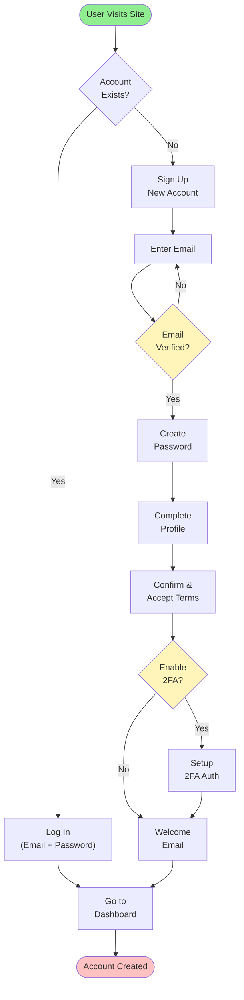

### Support Ticket Workflow

```mermaid
stateDiagram-v2
    [*] --> Open: User submits

    Open --> Assigned: Staff assigns
    Open --> Closed: Self-resolved

    Assigned --> InProgress: Staff starts work

    InProgress --> PendingInfo: Need customer info
    PendingInfo --> InProgress: Info received

    InProgress --> PendingApproval: Review needed
    PendingApproval --> Resolved: Approved

    Resolved --> Closed: Customer confirms

    Open --> Closed: Duplicate/Invalid
    Assigned --> Closed: Duplicate/Invalid

    note right of InProgress
        Most time spent here
    end

    note right of Resolved
        Waiting for customer
    end
```

---

## Testing & QA

### Test Coverage Matrix

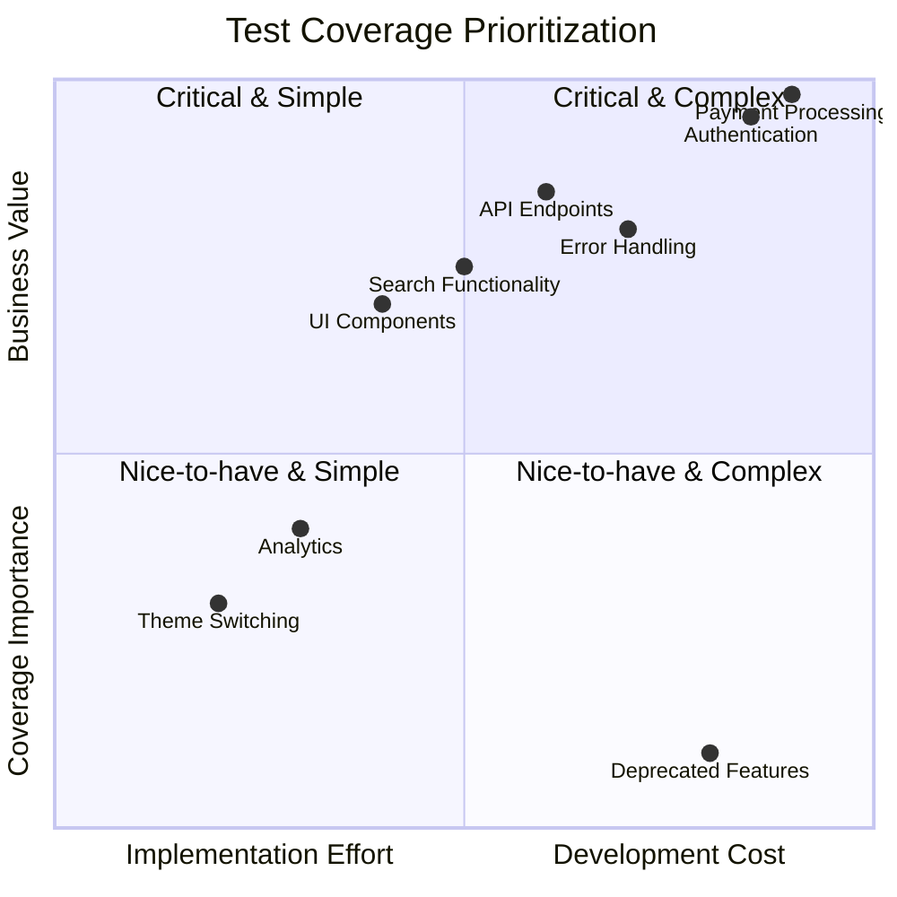

### Test Execution Pipeline

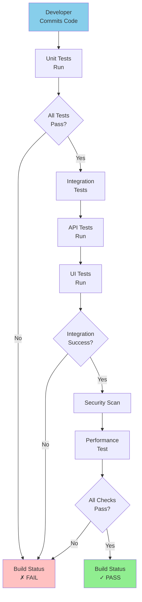

---

## Database Design

### E-Commerce Database Schema

```mermaid
erDiagram
    CUSTOMER ||--o{ ORDER : places
    CUSTOMER ||--o{ ADDRESS : has
    CUSTOMER ||--o{ PAYMENT_METHOD : has
    CUSTOMER ||--o{ REVIEW : writes

    ORDER ||--|{ ORDER_ITEM : contains
    PRODUCT ||--o{ ORDER_ITEM : "is ordered"
    PRODUCT ||--o{ CATEGORY : "belongs to"
    PRODUCT ||--o{ REVIEW : "reviewed in"
    PRODUCT ||--o{ INVENTORY : tracks

    REVIEW ||--o{ REVIEW_IMAGE : has

    CUSTOMER {
        int id PK
        string email UK
        string password_hash
        string first_name
        string last_name
        datetime created_at
        datetime updated_at
    }

    ORDER {
        int id PK
        int customer_id FK
        int billing_address_id FK
        int shipping_address_id FK
        decimal total_amount
        string status
        datetime created_at
    }

    ORDER_ITEM {
        int id PK
        int order_id FK
        int product_id FK
        int quantity
        decimal unit_price
        decimal discount_amount
    }

    PRODUCT {
        int id PK
        string sku UK
        string name
        string description
        decimal price
        int category_id FK
        int stock_quantity
        datetime created_at
    }

    CATEGORY {
        int id PK
        string name
        string slug UK
        int parent_category_id FK
    }

    INVENTORY {
        int id PK
        int product_id FK
        int warehouse_id FK
        int quantity
        datetime last_updated
    }

    CUSTOMER_ADDRESS {
        int id PK
        int customer_id FK
        string street
        string city
        string country
        string postal_code
    }

    PAYMENT_METHOD {
        int id PK
        int customer_id FK
        string type
        string last_four
        datetime created_at
    }

    REVIEW {
        int id PK
        int product_id FK
        int customer_id FK
        int rating
        string title
        string body
        datetime created_at
    }
```

### User Management Database

```mermaid
erDiagram
    USERS ||--o{ USER_ROLES : has
    ROLES ||--o{ USER_ROLES : assigned
    ROLES ||--o{ PERMISSIONS : has
    USERS ||--o{ USER_SESSIONS : creates
    USERS ||--o{ USER_AUDIT_LOG : generates

    USERS {
        int id PK
        string email UK
        string username UK
        string password_hash
        string first_name
        string last_name
        boolean is_active
        datetime last_login
        datetime created_at
    }

    ROLES {
        int id PK
        string name UK
        string description
        datetime created_at
    }

    PERMISSIONS {
        int id PK
        int role_id FK
        string resource
        string action
        datetime created_at
    }

    USER_SESSIONS {
        int id PK
        int user_id FK
        string token
        string ip_address
        string user_agent
        datetime expires_at
        datetime created_at
    }

    USER_AUDIT_LOG {
        int id PK
        int user_id FK
        string action
        string resource
        string old_value
        string new_value
        datetime created_at
    }
```

---

## Decision Trees

### Software Architecture Decision

```mermaid
flowchart TD
    Start["Choose Architecture"]

    Q1{Small Team?<br/>Low Complexity?}

    Q2{High<br/>Scalability<br/>Required?}

    Q3{Many Domains<br/>Different Tech?}

    Q4{Real-time<br/>Data<br/>Critical?}

    Monolith["Monolithic<br/>Architecture"]
    Micro["Microservices"]
    Modular["Modular<br/>Monolith"]
    Event["Event-driven<br/>Architecture"]

    Start --> Q1

    Q1 -->|Yes| Monolith
    Q1 -->|No| Q2

    Q2 -->|No| Modular
    Q2 -->|Yes| Q3

    Q3 -->|No| Event
    Q3 -->|Yes| Q4

    Q4 -->|Yes| Micro
    Q4 -->|No| Micro

    style Monolith fill:#c1f0c1
    style Modular fill:#fff5ba
    style Micro fill:#ffc1c1
    style Event fill:#87ceeb
```

### Technology Selection Flow

```mermaid
flowchart TD
    A["Select Technology"]
    B{"Web<br/>Framework?"}
    C{"API<br/>Type?"}
    D{"Database?"}
    E{"Frontend?"}

    React["React"]
    Vue["Vue.js"]
    Svelte["Svelte"]

    REST["REST API<br/>Express/FastAPI"]
    GraphQL["GraphQL<br/>Apollo/Strawberry"]
    gRPC["gRPC<br/>Protocol Buffers"]

    SQL["SQL<br/>PostgreSQL/MySQL"]
    NoSQL["NoSQL<br/>MongoDB/Firebase"]
    Cache["Cache-first<br/>Redis"]

    A --> B
    B -->|Web App| E
    B -->|Backend API| C

    C -->|Stateless| REST
    C -->|Connected Graph| GraphQL
    C -->|High-performance| gRPC

    E -->|Interactive| React
    E -->|Lightweight| Vue
    E -->|Minimal| Svelte

    REST --> D
    GraphQL --> D
    gRPC --> D

    D -->|Structured Data| SQL
    D -->|Flexible Schema| NoSQL
    D -->|High Speed| Cache

    style React fill:#87ceeb
    style Vue fill:#87ceeb
    style REST fill:#90ee90
```

---

## Performance Analysis

### Request Latency Breakdown

```mermaid
xychart
    title API Response Time Distribution
    x-axis "Response Time (ms)" [<100, 100-200, 200-300, 300-500, 500-1000, >1000]
    y-axis "Number of Requests" 0 --> 5000

    bar [4500, 2800, 1200, 600, 300, 50]
```

### Server Performance Comparison

```mermaid
radar-beta
    title Web Server Comparison
    axis Throughput, Latency, Memory Usage, CPU Efficiency, Concurrent Connections, Stability

    curve Nginx {5, 5, 5, 5, 4, 5}
    curve Apache {3, 3, 2, 3, 3, 4}
    curve Node.js {4, 4, 3, 3, 4, 4}
```

### Capacity Planning Timeline

```mermaid
gantt
    title Infrastructure Scaling Plan
    dateFormat YYYY-MM-DD

    section Q1 2024
    Current Capacity      :done, q1_current, 2024-01-01, 90d
    Monitor Load Growth   :active, q1_monitor, 2024-01-01, 90d

    section Q2 2024
    Plan Upgrade          :q2_plan, 2024-04-01, 15d
    Procure Hardware      :crit, q2_hw, 2024-04-16, 30d
    Setup New Servers     :q2_setup, 2024-05-16, 20d
    Test Migration        :crit, q2_test, 2024-06-05, 10d

    section Q3 2024
    Execute Migration     :crit, q3_migrate, 2024-07-01, 5d
    Validate Performance  :q3_validate, 2024-07-06, 5d
    Full Rollover        :q3_done, 2024-07-11, 1d
    Monitor New Setup     :q3_monitor, 2024-07-12, 80d
```

---

## Compliance & Requirements

### GDPR Compliance Checklist

```mermaid
requirementDiagram
    requirement gdpr_consent {
        id: GDPR-001
        text: System must request explicit user consent for data collection
        risk: High
        verifymethod: Test
    }

    requirement data_deletion {
        id: GDPR-002
        text: Users can request complete data deletion within 30 days
        risk: High
        verifymethod: Test
    }

    requirement data_export {
        id: GDPR-003
        text: Users can export their data in machine-readable format
        risk: High
        verifymethod: Test
    }

    requirement privacy_policy {
        id: GDPR-004
        text: Clear privacy policy must be available before signup
        risk: Medium
        verifymethod: Inspection
    }

    requirement data_breach {
        id: GDPR-005
        text: Data breaches must be reported within 72 hours
        risk: High
        verifymethod: Analysis
    }

    element consent_ui {
        type: Software
        docref: docs/ui-requirements
    }

    element deletion_api {
        type: Software
        docref: docs/api-spec
    }

    element export_feature {
        type: Software
        docref: docs/feature-spec
    }

    gdpr_consent - satisfies -> consent_ui
    data_deletion - satisfies -> deletion_api
    data_export - satisfies -> export_feature
    gdpr_consent - contains -> privacy_policy
```

### Security Requirements Mapping

```mermaid
flowchart TD
    SEC["Security<br/>Requirements"]

    AUTH["Authentication"]
    AUTHZ["Authorization"]
    ENCRYPT["Encryption"]
    AUDIT["Audit Logging"]
    SECURE_CODE["Secure Coding"]

    MFA["Multi-factor<br/>Authentication"]
    PASSWORD["Password<br/>Policy"]

    RBAC["Role-based<br/>Access Control"]
    ENDPOINT["Endpoint<br/>Authorization"]

    TLS["TLS 1.3"]
    DATA_ENCRYPT["Data at Rest<br/>Encryption"]

    LOG_ACCESS["Log Access<br/>Events"]
    LOG_CHANGES["Log System<br/>Changes"]

    INPUT_VAL["Input<br/>Validation"]
    SQL_INJ["SQL Injection<br/>Prevention"]
    XSS["XSS<br/>Prevention"]

    SEC --> AUTH
    SEC --> AUTHZ
    SEC --> ENCRYPT
    SEC --> AUDIT
    SEC --> SECURE_CODE

    AUTH --> MFA
    AUTH --> PASSWORD

    AUTHZ --> RBAC
    AUTHZ --> ENDPOINT

    ENCRYPT --> TLS
    ENCRYPT --> DATA_ENCRYPT

    AUDIT --> LOG_ACCESS
    AUDIT --> LOG_CHANGES

    SECURE_CODE --> INPUT_VAL
    SECURE_CODE --> SQL_INJ
    SECURE_CODE --> XSS

    style SEC fill:#f0e68c
    style AUTH fill:#87ceeb
    style AUTHZ fill:#87ceeb
    style ENCRYPT fill:#90ee90
    style AUDIT fill:#ffc1c1
    style SECURE_CODE fill:#ffc1c1
```

---

## Integration Patterns

### Event-Driven Architecture

```mermaid
flowchart TD
    UserService["User Service<br/>Publishes Events"]
    ProductService["Product Service<br/>Subscribes"]
    OrderService["Order Service<br/>Subscribes"]
    EventBus["Event Bus<br/>Kafka/RabbitMQ"]
    NotificationService["Notification Service<br/>Subscribes"]

    Events["Events:<br/>UserCreated<br/>UserUpdated<br/>UserDeleted"]

    UserService -->|Publish| EventBus
    EventBus -->|Subscribe| ProductService
    EventBus -->|Subscribe| OrderService
    EventBus -->|Subscribe| NotificationService

    UserService -.->|Types| Events

    ProductService -->|Send Email| NotificationService
    OrderService -->|Send SMS| NotificationService

    style EventBus fill:#f0e68c
    style UserService fill:#87ceeb
    style ProductService fill:#87ceeb
    style OrderService fill:#87ceeb
```

### CQRS Pattern

```mermaid
flowchart TD
    Client["Client Application"]

    WriteCmd["Write Command<br/>Handler"]
    ReadQuery["Read Query<br/>Handler"]

    CommandDB["Command<br/>Database<br/>PostgreSQL"]
    ReadDB["Read<br/>Database<br/>MongoDB"]

    EventStore["Event Store<br/>Event Log"]
    Sync["Async Sync<br/>Service"]

    Client -->|Create/Update| WriteCmd
    Client -->|Query Data| ReadQuery

    WriteCmd -->|Save Event| EventStore
    WriteCmd -->|Update| CommandDB

    EventStore -->|Async| Sync
    Sync -->|Update| ReadDB

    ReadQuery -->|Read| ReadDB

    style WriteCmd fill:#87ceeb
    style ReadQuery fill:#90ee90
    style EventStore fill:#f0e68c
    style Sync fill:#ffc1c1
```

---

## Document Metadata

**Created**: 2026-03-07
**Source**: Mermaid.js official documentation
**Purpose**: Practical, copy-paste examples for common use cases
**Diagram Types**: 15+ with complete, working examples
**Total Examples**: 40+ real-world scenarios

For detailed syntax reference, see `mermaid-diagram-reference.md`.
For quick lookup, see `DIAGRAM_INDEX.md`.
