# Mermaid.js Diagram Types — Quick Index

**Comprehensive Reference**: See `mermaid-diagram-reference.md` for complete syntax, examples, and configuration details.

**Source**: Official Mermaid.js documentation (<https://mermaid.js.org>)
**Last Updated**: 2026-03-07

---

## Diagram Type Selection Guide

### By Purpose

#### Process & Flow Visualization
- **Flowchart** — Decision trees, algorithms, workflows
- **Block Diagram** — System architecture with manual positioning
- **Architecture Diagram** — Cloud infrastructure and service relationships
- **Sankey Diagram** — Flow of resources between entities

#### Interaction & Sequence
- **Sequence Diagram** — Message flows between actors/systems
- **ZenUML Diagram** — Alternative sequence notation with control flow

#### Structure & Relationships
- **Class Diagram** — Object-oriented design, UML classes
- **Entity Relationship Diagram** — Database schema design
- **State Diagram** — State machines and transitions
- **Git Graph** — Git branching and commit history

#### Organization & Hierarchy
- **Mindmap** — Knowledge organization, concept mapping
- **Treemap Diagram** — Hierarchical data with proportional sizing
- **Requirement Diagram** — Requirements and traceability

#### Timeline & Scheduling
- **Gantt Chart** — Project schedules and timelines
- **Timeline** — Chronological events and periods

#### Data Visualization
- **Pie Chart** — Proportional data distribution
- **Radar Chart** — Multi-dimensional performance metrics
- **XY Chart** — Line and bar charts with axes
- **Quadrant Chart** — Two-dimensional data positioning
- **Venn Diagram** — Set relationships and intersections

#### User & Journey
- **User Journey** — Task flows and user satisfaction
- **Kanban Diagram** — Workflow stages and task cards

#### Technical Detail
- **Packet Diagram** — Network packet structure
- **C4 Diagram** — Software architecture (experimental)

---

## Quick Syntax Reference

### Minimal Valid Examples

**Flowchart**


**Sequence Diagram**
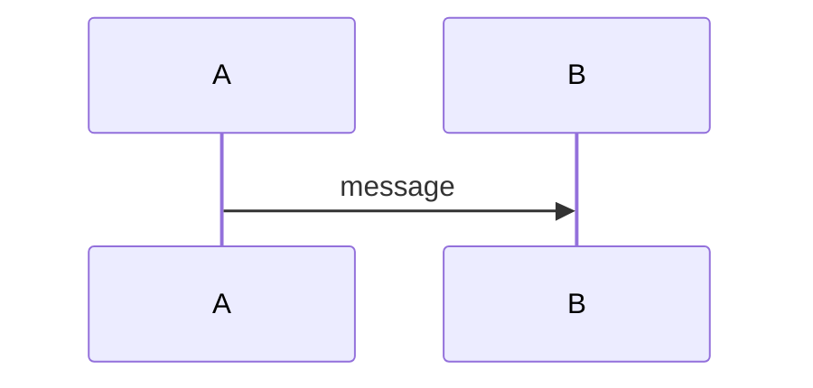

**Class Diagram**
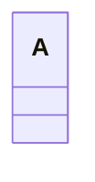

**State Diagram**
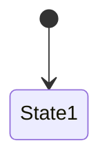

**Entity Relationship**
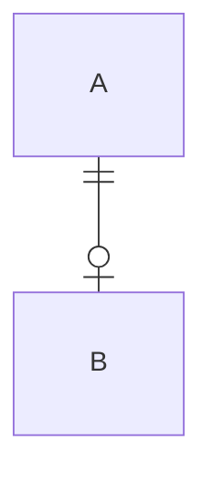

**Gantt Chart**
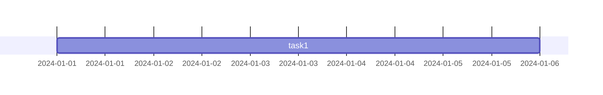

**Pie Chart**
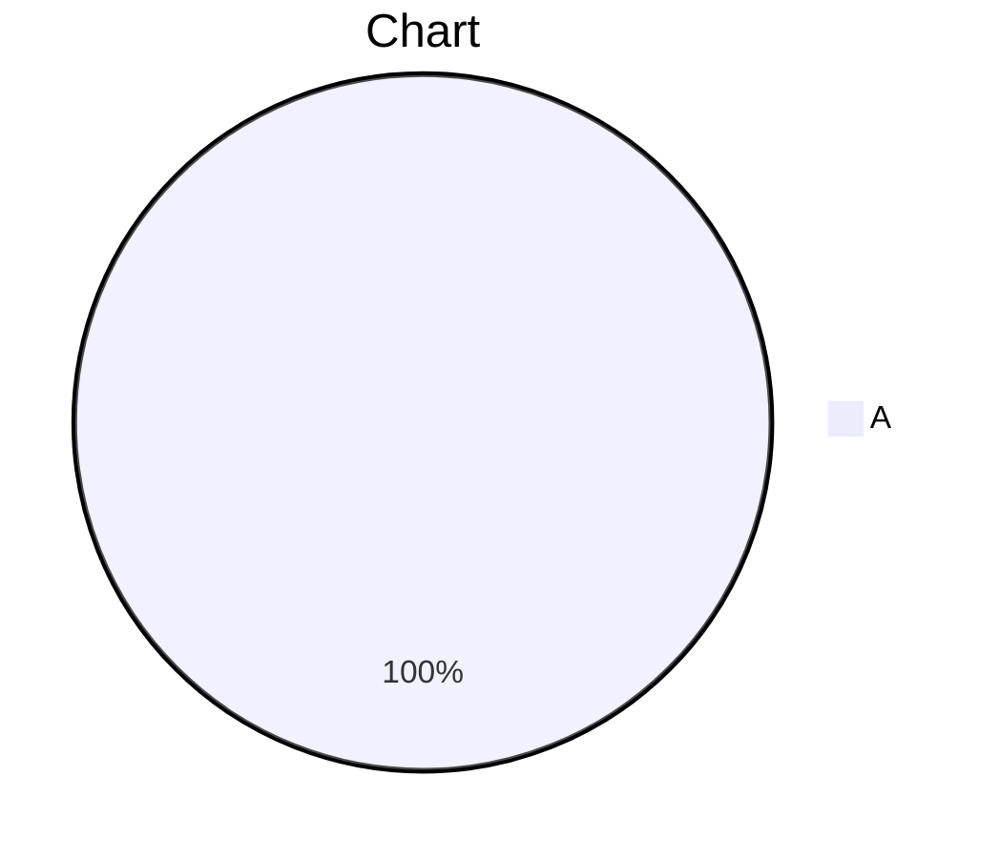

**Git Graph**
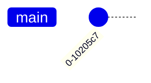

**User Journey**
```mermaid
userJourney
    section S
        Task : 5 : Actor
```

**Mindmap**


**Timeline**
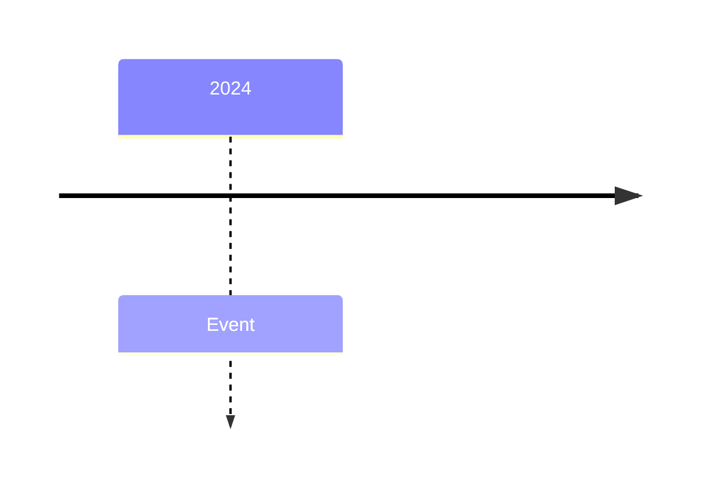

**Quadrant Chart**
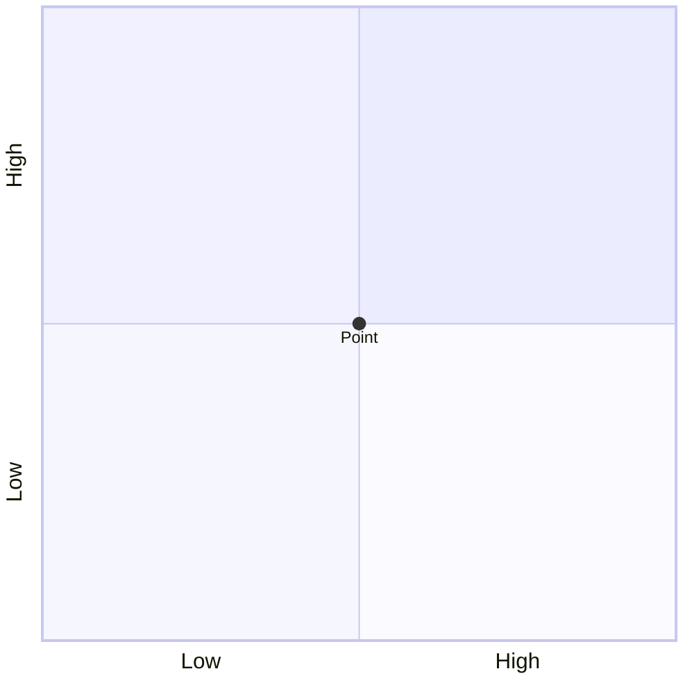

**XY Chart**
```mermaid
xychart
    line [1, 2, 3]
```

**Block Diagram**
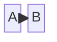

**Sankey Diagram**
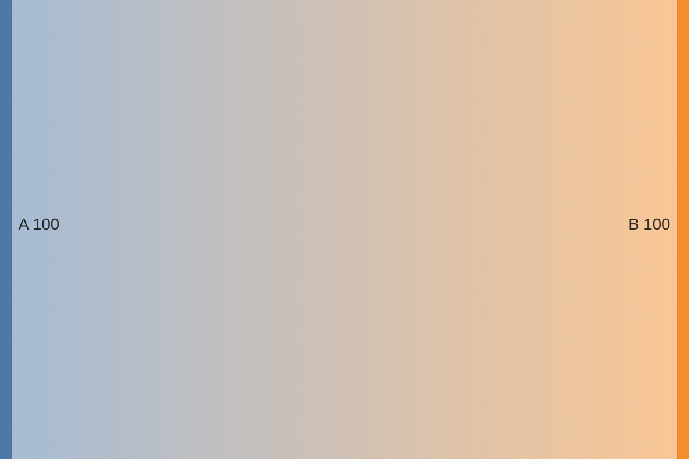

**Packet Diagram**
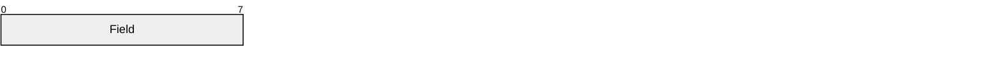

**Requirement Diagram**
```mermaid
requirementDiagram
    requirement R1 {
        id: R1
        text: requirement
    }
```

**C4 Diagram**
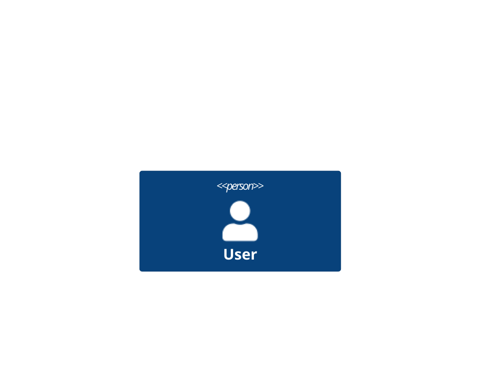

**Kanban Diagram**
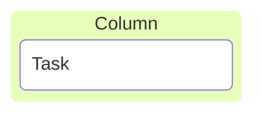

**Architecture Diagram**


**Radar Chart**
```mermaid
radar-beta
    axis X, Y
    curve C {1, 2}
```

**Treemap Diagram**
```mermaid
treemap-beta
    "Root" : 100
```

**Venn Diagram**
```mermaid
venn-beta
    set A
```

**ZenUML Diagram**
```mermaid
zenuml
    participant A
    A -> B: message
```

---

## Feature Comparison Matrix

| Diagram | Hierarchy | Time-based | Actors | Relationships | Styling | Complexity |
|---------|:---------:|:----------:|:------:|:-------------:|:-------:|:----------:|
| Flowchart | ✓ | ✗ | ✗ | Edges | Full | Medium |
| Sequence | Implicit | ✓ | ✓ | Messages | Limited | High |
| Class | ✓ | ✗ | ✗ | Full UML | Full | Very High |
| State | ✓ | ✗ | ✗ | Transitions | Classes | Medium |
| ER | ✗ | ✗ | ✗ | Cardinality | Limited | Medium |
| Gantt | ✓ | ✓ | ✗ | Dependencies | Sections | High |
| Pie | ✗ | ✗ | ✗ | ✗ | Limited | Low |
| Git | ✓ | ✓ | ✗ | Merges | Config | Medium |
| User Journey | ✓ | ✗ | ✓ | Tasks | Classes | Low |
| Mindmap | ✓ | ✗ | ✗ | Parent/Child | Icons | Low |
| Timeline | ✓ | ✓ | ✗ | Sequence | Sections | Low |
| Quadrant | ✗ | ✗ | ✗ | Position | Points | Low |
| XY Chart | ✗ | ✗ | ✗ | Data series | Theme | Low |
| Block | ✗ | ✗ | ✗ | Connections | Full | Medium |
| Sankey | ✗ | ✗ | ✗ | Flows | Links | Low |
| Packet | ✗ | ✗ | ✗ | Bit fields | Config | Medium |
| Requirement | ✓ | ✗ | ✓ | Relations | Classes | High |
| C4 | ✓ | ✗ | ✗ | Connections | Limited | Very High |
| Kanban | ✓ | ✗ | ✓ | Columns | Cards | Medium |
| Architecture | ✓ | ✗ | ✗ | Services | Limited | Medium |
| Radar | ✗ | ✗ | ✗ | Axes | Theme | Low |
| Treemap | ✓ | ✗ | ✗ | Size | Classes | Low |
| Venn | ✗ | ✗ | ✗ | Intersections | Full | Low |
| ZenUML | Implicit | ✓ | ✓ | Messages | Limited | High |

---

## Version Status

### Latest Features (v11.12.3+)
- Venn Diagrams — Set relationships
- Half-arrows in Sequence — Directional message variations
- Central connections in Sequence — Central hub messaging
- Enhanced Packet Diagram — Simplified `+N` bits syntax

### Recent Features (v11.6.0+)
- Radar Charts — Multi-dimensional metrics
- Treemap Diagrams — Hierarchical visualization

### Current Features (v11.1.0+)
- Architecture Diagrams — Infrastructure visualization
- Kanban Diagrams — Task board workflow

### Stable Features (v10.3.0+)
- Sankey Diagrams (experimental) — Flow visualization
- Packet Diagrams — Network structures

### Core Features (v9.4.0+)
- Mindmaps — Default inclusion

---

## Diagram Lifecycle

### Planning & Analysis Phase
- **User Journey** — Understand user workflows
- **Mindmap** — Brainstorm requirements
- **Quadrant Chart** — Prioritize features

### Design Phase
- **Flowchart** — Algorithm and logic design
- **Class Diagram** — Object model design
- **ER Diagram** — Database schema design
- **State Diagram** — State machine design
- **Sequence Diagram** — Interaction flows

### Implementation Phase
- **Git Graph** — Track branches and commits
- **Gantt Chart** — Project scheduling
- **Block Diagram** — System architecture

### Documentation Phase
- **Architecture Diagram** — Infrastructure visualization
- **C4 Diagram** — Software architecture levels
- **Requirement Diagram** — Traceability matrix

### Monitoring & Analysis Phase
- **Kanban Diagram** — Task tracking
- **Radar Chart** — Performance metrics
- **XY Chart** — Trend analysis

---

## Common Integration Patterns

### In Documentation
```markdown
# API Design

## Flow Diagram

\`\`\`mermaid
sequenceDiagram
    Client ->> API: Request
    API ->> Database: Query
    Database -->> API: Result
    API -->> Client: Response
\`\`\`

## Data Model

\`\`\`mermaid
erDiagram
    CUSTOMER ||--o{ ORDER : places
\`\`\`
```

### In Project Plans
```markdown
## Project Timeline

\`\`\`mermaid
gantt
    section Planning
    Phase 1 : 5d
    section Development
    Phase 2 : 10d
\`\`\`

## Feature Priorities

\`\`\`mermaid
quadrantChart
    Feature A : [0.7, 0.8]
    Feature B : [0.3, 0.6]
\`\`\`
```

### In Presentations
```markdown
## Architecture Overview

\`\`\`mermaid
architecture-beta
    service web(server)[Web]
    service api(server)[API]
    service db(database)[DB]
    web:R --> L:api
    api:R --> L:db
\`\`\`

## Market Analysis

\`\`\`mermaid
radar-beta
    axis Sales, Market, Growth, Quality, Support
    curve Company {4, 5, 3, 4, 5}
\`\`\`
```

---

## Performance Considerations

### Rendering Time (Fastest to Slowest)
1. Pie Chart, Quadrant Chart (data-only)
2. Timeline, Venn, Radar (simple positioning)
3. Mindmap, Treemap (hierarchical)
4. Gantt, XY Chart (complex calculation)
5. Flowchart, Block Diagram (graph layout)
6. Sequence, ZenUML (interaction simulation)
7. Class Diagram (full UML resolution)
8. C4 Diagram (architecture layers)

### Diagram Size Recommendations
- Keep flowcharts under 30 nodes
- Limit class diagrams to 15-20 classes
- Sequence diagrams: 5-10 participants max
- Gantt charts: 20-30 tasks typical
- Large hierarchies: use Treemap over Mindmap

---

## Browser Compatibility

All diagram types render in modern browsers supporting:
- Canvas (pie, radar, XY)
- SVG (most diagrams)
- WebGL (optional acceleration)

### Known Limitations
- C4 diagrams: experimental, syntax may change
- Sankey diagrams: experimental (v10.3.0+)
- Venn diagrams: new feature (v11.12.3+), limited styling

---

## Accessibility Notes

### Best Practices
- Use title attributes on diagrams
- Provide alternative text descriptions
- Use high-contrast colors
- Label all axes on charts
- Include legends where applicable

### Tools for Testing
- Built-in accessibility config: `accessibility: true`
- Theme contrast checker
- ARIA label support in all text elements

---

## Common Customizations

### Theme Selection
```javascript
mermaid.initialize({
    theme: 'default'  // options: default, forest, dark, neutral, base
});
```

### Font Configuration
```javascript
mermaid.initialize({
    fontFamily: '"Courier New", monospace'
});
```

### Custom Colors
```mermaid
classDef myStyle fill:#f9f,stroke:#333,stroke-width:2px
class NodeName myStyle
```

### Diagram Padding
```javascript
mermaid.initialize({
    flowchart: { padding: 15 },
    sequenceDiagram: { actorMargin: 50 }
});
```

---

## Troubleshooting Reference

| Issue | Diagram Types | Solution |
|-------|---------------|----------|
| Text not showing | All | Use proper quote syntax: `["text"]` |
| Rendering fails | All | Check browser console for syntax errors |
| Direction ignored | Flowchart, ER, State | Ensure direction is first statement |
| Subgraph not working | Flowchart | Use `subgraph name [label]` syntax |
| Performance slow | Large diagrams | Split into multiple diagrams or simplify |
| Colors not applying | All | Use valid hex codes or theme colors |
| Unicode not displaying | All | Wrap in quotes with proper escaping |
| Legend missing | Radar, XY | Check `showLegend: true` config |

---

## Further Learning

**Official Resources**
- Main documentation: <https://mermaid.js.org>
- GitHub issues: <https://github.com/mermaid-js/mermaid/issues>
- Examples gallery: <https://mermaid.js.org/ecosystem/integrations>

**Community**
- Stack Overflow tag: `mermaid-js`
- Discussions: GitHub mermaid-js discussions
- Live editor: <https://mermaid.live> (full interactive editor)

**Integration Guides**
- Markdown support (GitHub, Notion, etc.)
- Documentation tools (Docusaurus, MkDocs, Sphinx)
- Presentation frameworks (reveal.js, etc.)

---

## Document Metadata

**Verified Against**: <https://mermaid.js.org> official docs
**Access Date**: 2026-03-07
**Mermaid Version**: v11.12.3+
**Document Status**: Complete reference
**Diagram Types Covered**: 24 types
**Example Diagrams**: 24 minimal examples + 24 complete examples

For detailed syntax and advanced configuration, see `mermaid-diagram-reference.md`.
