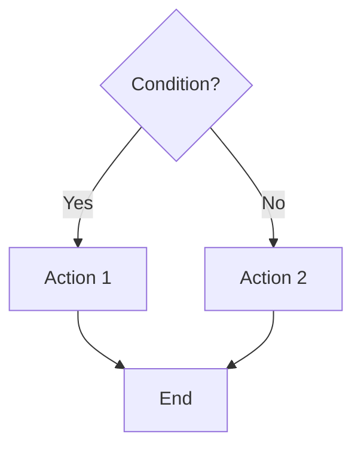
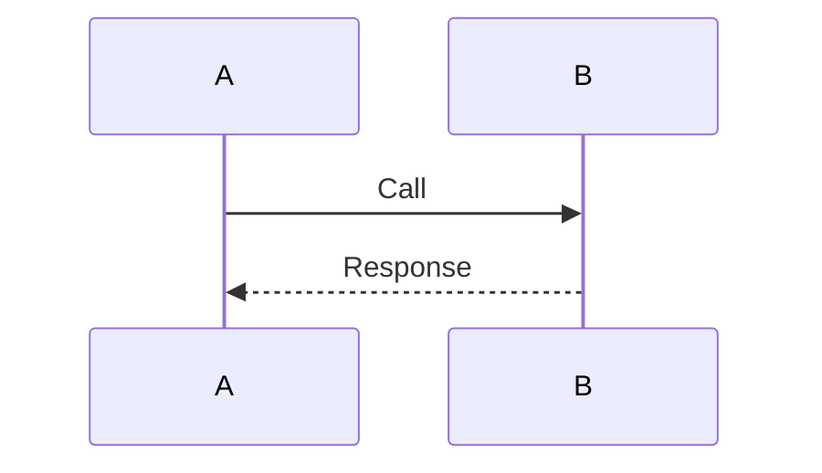
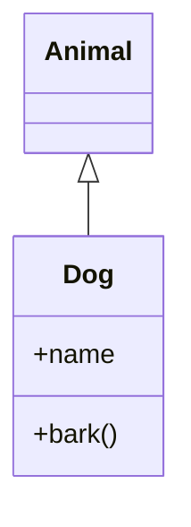
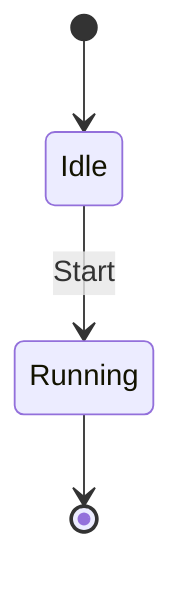
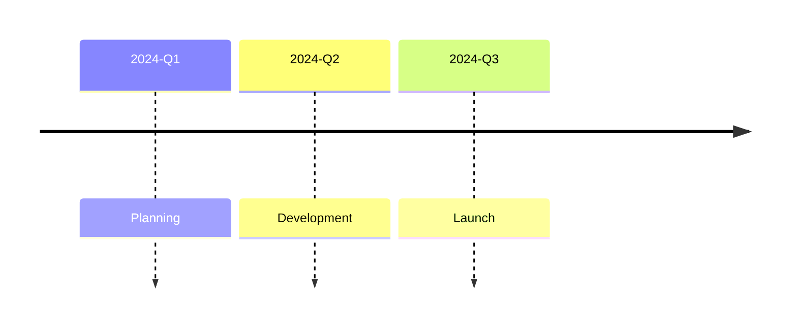

# Mermaid.js — One-Page Quick Reference

**Print this page for desk reference** | See full docs in `mermaid-diagram-reference.md`

---

## Declaration Syntax

```
flowchart [TD|LR|BT|RL]          Flowchart
sequenceDiagram                 Sequence
classDiagram                    Class (UML)
stateDiagram-v2                 State machine
erDiagram                       Entity-Relationship
gantt                           Gantt chart
pie title [name]                Pie chart
gitGraph [LR|TB|BT]             Git graph
userJourney                     User journey
mindmap                         Mind map
timeline                        Timeline
quadrantChart                   Quadrant chart
xychart [horizontal]            XY chart (bar/line)
block                           Block diagram
sankey                          Sankey diagram
packet                          Packet structure
requirementDiagram              Requirements
C4Context|C4Container|...       C4 architecture
kanban                          Kanban board
architecture-beta               Architecture diagram
radar-beta                      Radar chart
treemap-beta                    Treemap
venn-beta                       Venn diagram
zenuml                          ZenUML sequence
```

---

## Flowchart Shapes & Edges

| Shape | Syntax | Use Case |
|-------|--------|----------|
| Rectangle | `A[text]` | Default node |
| Rounded | `A(text)` | Process |
| Circle | `A((text))` | Endpoint |
| Diamond | `A{text}` | Decision |
| Cylinder | `A[(text)]` | Database |
| Parallelogram | `A[/text/]` | Input/Output |

| Edge | Syntax | Type |
|------|--------|------|
| Arrow | `A --> B` | Solid arrow |
| Open | `A --- B` | No arrow |
| Dotted | `A -.-> B` | Dashed arrow |
| Thick | `A ==> B` | Bold arrow |
| Labeled | A -->\|text\| B | With text |

---

## Node Visibility (Class Diagrams)

```
+  Public         -  Private
#  Protected      ~  Package
*  Abstract       $  Static
```

**Relationships**: `<|--` (inherit), `*--` (compose), `o--` (aggregate), `-->` (assoc), `..|>` (realize)

---

## Sequence Diagram Messages

```
A ->> B         Solid arrowhead (sync)
A -->> B        Dashed arrowhead (async)
A -x B          Solid cross
A -) B          Open/async
A -| B          Half arrow (v11.12.3+)
```

**Control**: `loop`, `alt/else`, `opt`, `par`, `critical`, `break`, `rect`
**Activation**: `activate A`, `deactivate A`

---

## State Diagram Keywords

```
[*] --> State1          Start → State 1
State1 --> State2       Transition
state Parent { ... }    Composite state
<<choice>>              Choice/decision
<<fork>>                Fork
<<join>>                Join
```

---

## Gantt Task Syntax

```
TaskID : [tag,] start_date, duration
Tags: active, done, crit, milestone
Duration: 5d, after taskID, after taskID 5d
```

---

## ER Diagram Cardinality

| Notation | Meaning |
|----------|---------|
| `\|o` | Zero or one |
| `\|\|` | Exactly one |
| `}o` | Zero or more |
| `}\|` | One or more |

**Lines**: `--` (identifying), `..` (non-identifying)

---

## Class Diagram Multiplicity

```
"1"          Exactly one
"0..1"       Zero or one
"*"          Zero or more
"1..*"       One or more
"n"          n instances
```

---

## Common Configuration

```javascript
mermaid.initialize({
    theme: 'default|forest|dark|neutral|base',
    fontFamily: '"Courier New", monospace',
    logLevel: 'debug|info|warn|error',
    flowchart: { padding: 15, useMaxWidth: true },
    sequenceDiagram: { actorMargin: 50 },
    classDiagram: { arrowMarkerAbsolute: true }
});
```

---

## Styling

```mermaid
classDef myStyle fill:#f9f,stroke:#333,stroke-width:2px
class NodeA myStyle

style NodeB fill:#f00,color:white
NodeC:::myStyle          %% Inline styling
```

---

## Markdown in Labels

```
**Bold text**
*Italic text*
~~Strikethrough~~
<br>            Line break
```

---

## Quick Examples

### Decision Flow


### Simple Sequence


### Class Hierarchy


### State Machine


### Timeline


### Database
```mermaid
erDiagram
    USER ||--o{ POST : writes
    USER: int id PK
    POST: int id PK
    POST: int user_id FK
```

---

## Version Features

| Version | Features |
|---------|----------|
| v11.12.3+ | Venn diagrams, Half-arrows, Central connections |
| v11.6.0+ | Radar charts, Treemaps |
| v11.1.0+ | Architecture diagrams, Kanban |
| v10.3.0+ | Sankey (experimental), Packet diagrams |
| v9.4.0+ | Mindmaps (default) |

---

## Common Troubleshooting

| Issue | Fix |
|-------|-----|
| Text not showing | Use quotes: `["text"]` |
| Direction ignored | Place `flowchart LR` first |
| Subgraph not working | Use `subgraph name [label]` |
| Unicode failing | Wrap in quotes: `["café"]` |
| Layout poor | Reduce nodes or split diagram |
| Colors not applying | Use hex: `#ff0000` or theme colors |

---

## Diagram Selection (One per category)

| Category | Best Choice | Why |
|----------|-------------|-----|
| **Flow** | Flowchart | Simple, visual, flexible |
| **Interaction** | Sequence | Time-based message flows |
| **Structure** | Class | Full UML, complex relationships |
| **States** | State | State machines, transitions |
| **Data** | ER | Database schema design |
| **Time** | Gantt | Project schedules |
| **Distribution** | Pie | Proportion visualization |
| **Commits** | Git | Branch and merge tracking |
| **Tasks** | User Journey | Workflow and satisfaction |
| **Ideas** | Mindmap | Concept mapping |
| **Events** | Timeline | Chronology |
| **2D Data** | Quadrant | Position matrix |
| **Series** | XY Chart | Trends and patterns |
| **Manual Layout** | Block | Full control positioning |
| **Flows** | Sankey | Resource movement |
| **Packets** | Packet | Bit-level structure |
| **Metrics** | Radar | Multi-axis comparison |
| **Hierarchy** | Treemap | Proportional space |
| **Sets** | Venn | Intersections |

---

## Theme Variables (For Advanced Styling)

### Colors
```
primaryColor, primaryBorderColor, primaryTextColor
primaryColor, primaryBorderColor, primaryTextColor
secondBkgColor, secondBorderColor, secondTextColor
```

### Fonts
```
primaryFont: (main font)
secondFont: (secondary font)
fontSize: (default size)
fontFamily: (system fonts)
```

### Diagram-Specific
```
flowchart: { nodeSpacing, rankSpacing, htmlLabels }
sequenceDiagram: { actorMargin, actorFontSize }
gantt: { fontSize, numberSectionStyles }
```

---

## Tools & Resources

| Tool | URL |
|------|-----|
| Live Editor | <https://mermaid.live> |
| Official Docs | <https://mermaid.js.org> |
| GitHub Repo | <https://github.com/mermaid-js/mermaid> |
| VS Code Extension | Mermaid Editor (official) |
| Draw.io Support | Mermaid plugin available |

---

## Tips

1. **Start simple** — Use minimal syntax, add features incrementally
2. **Test incrementally** — Preview after each major change
3. **Use subgraphs** — Break large flowcharts into logical groups
4. **Style consistently** — Define `classDef` once, reuse many times
5. **Validate syntax** — Use browser console to catch errors
6. **Accessibility** — Always include titles and labels
7. **Performance** — Keep diagrams under 100 nodes when possible
8. **Responsive** — Set width/height via CSS, not inline

---

## Mermaid.js Version: v11.12.3+ | Last Updated: 2026-03-07
