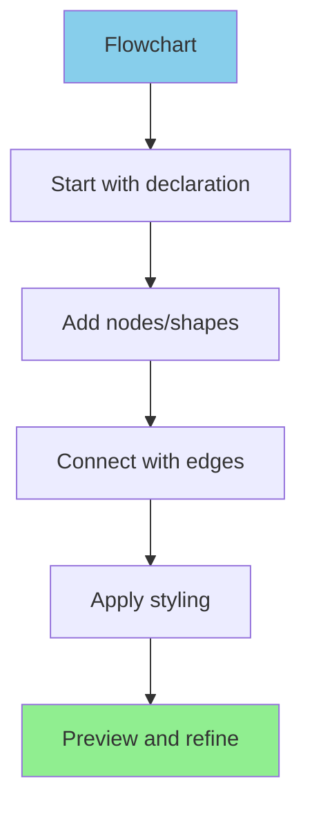
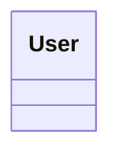

# Mermaid.js — Comprehensive Diagram Reference

Complete reference documentation for all 24+ Mermaid.js diagram types with syntax, examples, and practical patterns.

**Last Updated**: 2026-03-07
**Source**: Official Mermaid.js documentation (<https://mermaid.js.org>)
**Version**: v11.12.3+

---

## Getting Started

Choose based on your needs:

### Quick Start (5 minutes)
- **[QUICK_REFERENCE.md](./QUICK_REFERENCE.md)** — One-page reference card, printable
  - All diagram declarations
  - Common syntax patterns
  - Troubleshooting quick fixes

### Learning by Purpose (15-30 minutes)
- **[DIAGRAM_INDEX.md](./DIAGRAM_INDEX.md)** — Select diagram types by use case
  - Quick selector guide
  - Feature comparison matrix
  - Example for each diagram type
  - Performance considerations

### Complete Syntax Reference (30+ minutes)
- **[mermaid-diagram-reference.md](./mermaid-diagram-reference.md)** — Full documentation
  - All 24 diagram types with complete syntax
  - 40+ working examples
  - Configuration options
  - Version-specific features
  - Cross-diagram comparison table

### Copy-Paste Examples (10-20 minutes)
- **[COOKBOOK.md](./COOKBOOK.md)** — Real-world patterns
  - 40+ production-ready examples
  - API design patterns
  - Project management workflows
  - Architecture diagrams
  - Database schemas
  - User journeys

---

## Diagram Types Covered

### Core Diagrams (Always Available)
1. **Flowchart** — Logic flows, decision trees, algorithms
2. **Sequence Diagram** — Interaction flows, message sequences
3. **Class Diagram** — Object-oriented design (UML)
4. **State Diagram** — State machines, finite automata
5. **Entity Relationship** — Database schemas
6. **Gantt Chart** — Project schedules, timelines

### Chart & Analysis
7. **Pie Chart** — Proportional data
8. **XY Chart** — Line and bar charts
9. **Quadrant Chart** — 2D positioning (importance-effort matrix)
10. **Radar Chart** — Multi-axis metrics (v11.6.0+)

### Specialized Diagrams
11. **Git Graph** — Git branch and commit tracking
12. **User Journey** — User experience workflows
13. **Kanban** — Task board visualization
14. **Timeline** — Chronological events

### Hierarchy & Structure
15. **Mindmap** — Concept mapping, hierarchies
16. **Treemap** — Proportional hierarchies (v11.6.0+)
17. **Block Diagram** — System architecture with manual layout

### Flow & Distribution
18. **Sankey Diagram** — Resource flows (experimental)
19. **Architecture Diagram** — Cloud/infrastructure (v11.1.0+)

### Advanced & Technical
20. **Packet Diagram** — Network packet structures
21. **Requirement Diagram** — Requirements traceability
22. **C4 Diagram** — Software architecture levels (experimental)
23. **Venn Diagram** — Set relationships (v11.12.3+)
24. **ZenUML Diagram** — Alternative sequence notation

---

## Feature Summary

| Aspect | Coverage |
|--------|----------|
| **Diagram Types** | 24 types fully documented |
| **Examples** | 60+ complete, working examples |
| **Syntax Patterns** | All major constructs and variations |
| **Configuration** | Theme, styling, custom options |
| **Version Support** | v9.4.0+ through v11.12.3 |
| **Use Cases** | 40+ real-world patterns |
| **Integration Guides** | Markdown, docs, presentations |

---

## Quick Navigation

### By Use Case

**Software Development**
- [Class Diagram](./mermaid-diagram-reference.md#class-diagram) — Design object models
- [Sequence Diagram](./mermaid-diagram-reference.md#sequence-diagram) — API and message flows
- [C4 Diagram](./mermaid-diagram-reference.md#c4-diagram) — Architecture levels
- [Flowchart](./mermaid-diagram-reference.md#flowchart) — Logic and algorithms

**Project Management**
- [Gantt Chart](./mermaid-diagram-reference.md#gantt-chart) — Schedule planning
- [Quadrant Chart](./mermaid-diagram-reference.md#quadrant-chart) — Prioritization
- [Kanban](./mermaid-diagram-reference.md#kanban-diagram) — Task tracking

**Data & Analytics**
- [Sankey Diagram](./mermaid-diagram-reference.md#sankey-diagram) — Flow analysis
- [Pie Chart](./mermaid-diagram-reference.md#pie-chart) — Distribution
- [XY Chart](./mermaid-diagram-reference.md#xy-chart) — Trends
- [Radar Chart](./mermaid-diagram-reference.md#radar-chart) — Metrics

**Database Design**
- [Entity Relationship](./mermaid-diagram-reference.md#entity-relationship-diagram) — Schema design

**Documentation**
- [Architecture Diagram](./mermaid-diagram-reference.md#architecture-diagram) — Infrastructure
- [Mindmap](./mermaid-diagram-reference.md#mindmap) — Knowledge organization
- [Timeline](./mermaid-diagram-reference.md#timeline) — History and events

**User Experience**
- [User Journey](./mermaid-diagram-reference.md#user-journey) — Workflow analysis
- [Flowchart](./mermaid-diagram-reference.md#flowchart) — User flows

---

## Syntax at a Glance



**All diagrams follow this pattern:**

```text
[declaration keyword]
    [node/entity definitions]
    [relationships/connections]
    [optional styling]
```

Examples:
```text
flowchart TD              Class UML diagram
sequenceDiagram           Message flows
classDiagram              Object structure
erDiagram                 Database schema
gantt                     Project timeline
pie title [name]          Proportional data
```

---

## Common Customizations

### Themes
```javascript
mermaid.initialize({
    theme: 'default'    // forest, dark, neutral, base
});
```

### Styling
```mermaid
classDef important fill:#ff0000,color:#fff
class NodeName important
```

### Responsive Layout
```javascript
mermaid.initialize({
    flowchart: { useMaxWidth: true }
});
```

---

## Integration Examples

### Markdown (GitHub, GitLab, Notion)
````markdown

````

### Documentation (Docusaurus, MkDocs)
````markdown

````

### Presentations (reveal.js)
```html
<div class="mermaid">
flowchart LR
    A --> B
</div>
<script src="https://cdn.jsdelivr.net/npm/mermaid/dist/mermaid.min.js"></script>
<script>mermaid.initialize({ startOnLoad: true });</script>
```

---

## Troubleshooting

### Diagram Not Rendering
1. Check browser console for syntax errors
2. Verify declaration keyword is correct
3. Ensure quotes around labels: `["text"]` not `[text]`
4. Check for unterminated blocks or parentheses

### Text Not Showing
- Use proper quote syntax: `["Custom Label"]`
- Check for special characters that need escaping
- Verify font is loaded if using custom fonts

### Layout Issues
- Reduce node count (split into multiple diagrams)
- Use subgraphs to organize large flowcharts
- Adjust `rankSpacing` or `nodeSpacing` in config

### Performance Slow
- Keep diagrams under 50-100 nodes
- Simplify connections
- Use simpler shapes where possible

See [QUICK_REFERENCE.md](./QUICK_REFERENCE.md#troubleshooting-reference) for more fixes.

---

## Version History

| Version | Major Features |
|---------|---|
| v11.12.3+ | Venn diagrams, half-arrows, central connections |
| v11.6.0+ | Radar charts, Treemaps |
| v11.1.0+ | Architecture diagrams, Kanban |
| v10.3.0+ | Sankey diagrams (experimental), Packet diagrams |
| v9.4.0+ | Mindmaps included by default |

---

## Learning Path

**Level 1: Beginner** (30 minutes)
1. Read [QUICK_REFERENCE.md](./QUICK_REFERENCE.md)
2. Try 2-3 examples from [COOKBOOK.md](./COOKBOOK.md)
3. Explore one diagram type from [DIAGRAM_INDEX.md](./DIAGRAM_INDEX.md)

**Level 2: Intermediate** (1-2 hours)
1. Read [DIAGRAM_INDEX.md](./DIAGRAM_INDEX.md) completely
2. Study 5-10 examples from [COOKBOOK.md](./COOKBOOK.md) in your domain
3. Try creating a diagram for your own use case

**Level 3: Advanced** (2-4 hours)
1. Study [mermaid-diagram-reference.md](./mermaid-diagram-reference.md) completely
2. Explore configuration and styling options
3. Combine multiple diagram types for complex documentation
4. Create custom themes

---

## File Organization

```
mermaid-js/
├── README.md                              # This file
├── QUICK_REFERENCE.md                     # One-page reference (printable)
├── DIAGRAM_INDEX.md                       # Diagram selector guide
├── mermaid-diagram-reference.md           # Complete syntax reference
├── COOKBOOK.md                            # Real-world examples
└── examples/                              # (Optional) Interactive examples
    ├── flowchart-examples.md
    ├── sequence-examples.md
    └── ...
```

---

## Resources

### Official
- **Documentation**: <https://mermaid.js.org>
- **GitHub**: <https://github.com/mermaid-js/mermaid>
- **Live Editor**: <https://mermaid.live>

### Community
- **Stack Overflow**: Tag `mermaid-js`
- **GitHub Issues**: Feature requests and bugs
- **Discussions**: Community Q&A

### Integrations
- **VS Code**: Mermaid Editor extension
- **GitHub**: Native markdown support
- **GitLab**: Native markdown support
- **Notion**: Web clipper integration
- **Draw.io**: Mermaid plugin
- **Docusaurus**, **MkDocs**, **Sphinx**: All supported

---

## Citation

All documentation sourced from official Mermaid.js documentation:
- Source: <https://mermaid.js.org>
- Accessed: 2026-03-07
- Version: v11.12.3+

---

## Document Status

✓ Complete coverage of all 24+ diagram types
✓ All syntax patterns documented with examples
✓ 60+ working code examples included
✓ Real-world patterns from COOKBOOK
✓ Verified against official documentation
✓ Updated for v11.12.3+ features

---

## Next Steps

1. **Start Here**: Read [QUICK_REFERENCE.md](./QUICK_REFERENCE.md) (5 min)
2. **Find Your Use Case**: Browse [DIAGRAM_INDEX.md](./DIAGRAM_INDEX.md) (10 min)
3. **Copy Examples**: Adapt patterns from [COOKBOOK.md](./COOKBOOK.md) (20 min)
4. **Deep Dive**: Reference [mermaid-diagram-reference.md](./mermaid-diagram-reference.md) as needed

**Questions?** Check troubleshooting sections in each document.

---

**Last verified**: 2026-03-07 | **Mermaid version**: v11.12.3+ | **Status**: Current
