# Mermaid.js Diagram Types — Comprehensive Reference

**Source**: Official Mermaid.js documentation (<https://mermaid.js.org>)
**Last Verified**: 2026-03-07
**Mermaid Version**: v11.12.3+

---

## Table of Contents

1. [Flowchart](#flowchart)
2. [Sequence Diagram](#sequence-diagram)
3. [Class Diagram](#class-diagram)
4. [State Diagram](#state-diagram)
5. [Entity Relationship Diagram](#entity-relationship-diagram)
6. [Gantt Chart](#gantt-chart)
7. [Pie Chart](#pie-chart)
8. [Git Graph](#git-graph)
9. [User Journey](#user-journey)
10. [Mindmap](#mindmap)
11. [Timeline](#timeline)
12. [Quadrant Chart](#quadrant-chart)
13. [XY Chart](#xy-chart)
14. [Block Diagram](#block-diagram)
15. [Sankey Diagram](#sankey-diagram)
16. [Packet Diagram](#packet-diagram)
17. [Requirement Diagram](#requirement-diagram)
18. [C4 Diagram](#c4-diagram)
19. [Kanban Diagram](#kanban-diagram)
20. [Architecture Diagram](#architecture-diagram)
21. [Radar Chart](#radar-chart)
22. [Treemap Diagram](#treemap-diagram)
23. [Venn Diagram](#venn-diagram)
24. [ZenUML Diagram](#zenuml-diagram)

---

## Flowchart

**Declaration**: `flowchart <DIRECTION>`
**Directions**: `TB` (top-to-bottom), `TD` (top-down), `BT` (bottom-to-top), `LR` (left-to-right), `RL` (right-to-left)

### Node Syntax

```
A                           # Node with ID as label
A["Custom Label"]           # Node with custom text
A("Rounded")                # Rounded rectangle
A("Rounded text")           # Rounded rectangle
A((Circle))                 # Circle
A{Diamond}                  # Diamond (decision)
A[(Cylinder)]               # Cylinder (database)
A[[Subroutine]]             # Subroutine box
A[/Parallelogram/]          # Parallelogram
A[\Trapezoid\]              # Trapezoid
A(([Stadium]))              # Stadium shape
A>Asymmetric]               # Asymmetric
A{{Hexagon}}                # Hexagon
A@{ shape: rect, label: "text" }  # New shape syntax (v11.3.0+)
```

### Edge Syntax

```
A --> B                     # Arrow
A --> B                     # Solid arrow with arrowhead
A --- B                     # No arrow (open)
A -.-> B                    # Dotted arrow
A ==> B                     # Thick arrow
A -->|label| B              # Arrow with text label
A -- label --> B            # Alternative label syntax
A o--o B                    # Circle endpoints
A x--x B                    # Cross endpoints
```

### Advanced Features

```
subgraph SG["Name"]
  A --> B
end

SG --> C                    # Subgraph can connect to external nodes
```

**Markdown strings**: Bold (`**text**`), italics (`*text*`), auto-wrapping
**Icons**: `A["<i class='fa fa-user'></i> User"]` or use `fa:#icon-name#`
**Styling**: Class-based or direct styles on nodes
**Interactions**: Click handlers, URL links

### Complete Example

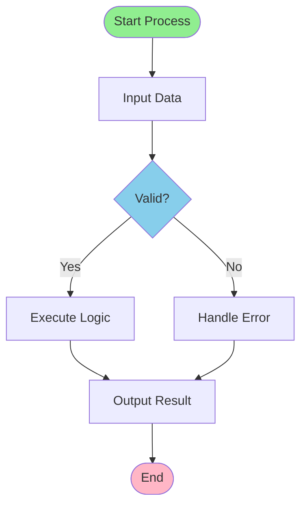

---

## Sequence Diagram

**Declaration**: `sequenceDiagram`

### Participants

```
sequenceDiagram
    participant A
    participant B
    actor User
    participant Database as DB
    boundary System
    control Controller
    entity Entity
    queue MessageQueue
    collections Items
```

### Message Types

```
A ->> B                    # Solid arrowhead (synchronous)
A -->> B                   # Dashed arrowhead (asynchronous)
A -x B                     # Solid line with cross
A --x B                    # Dashed line with cross
A -) B                     # Open/async solid
A --) B                    # Open/async dashed
A -| B                     # Half arrow (v11.12.3+)
A (- B                     # Open back arrow
```

### Notes

```
Note right of A: Text
Note left of B: Text
Note over A,B: Spans actors
rect rgb(200, 150, 255)
  Note describing action
end
```

### Control Flow

```
loop Count or text
  A ->> B: Message
end

alt Condition
  A ->> B: If branch
else
  A ->> B: Else branch
end

opt Optional fragment
  A ->> B: Message
end

par Parallel
  A ->> B: Message 1
  C ->> D: Message 2
end

break Break condition
  A ->> B: Message
end

critical Critical fragment
  A ->> B: Message
option On failure
  A ->> B: Fallback
end
```

### Activations

```
A ->> B: Message
activate B
B ->> A: Response
deactivate B
```

### Sequence Numbering

```
autonumber
A ->> B: First message
B ->> A: Second message
autonumber 5 1
A ->> B: Message #5.1
```

### Aliases & Actors

```
participant A as Actor A
actor User
```

### Complete Example

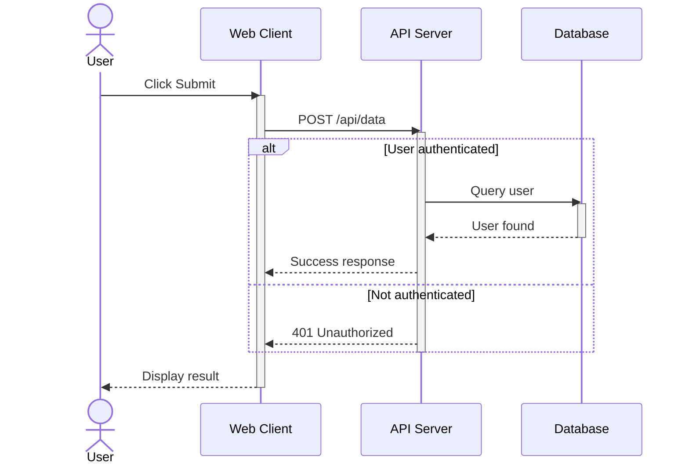

---

## Class Diagram

**Declaration**: `classDiagram`

### Class Definition

```
class ClassName
class ClassName {
    +publicAttribute
    -privateAttribute
    #protectedAttribute
    ~packageAttribute
    +publicMethod()
    -privateMethod()
    #protectedMethod()
}

class Name {
    +name: string
    +age: int
    +getName() string
    +getAge() int
}
```

### Visibility Modifiers

```
+  Public
-  Private
#  Protected
~  Package/Internal
*  Abstract (method)
$  Static (method/attribute)
```

### Relationships

```
Animal <|-- Dog           # Inheritance
Vehicle *-- Engine        # Composition
Company o-- Employee      # Aggregation
Student --> School        # Association
Car --> Wheel             # Dependency (dashed)
House --|> Floor          # Realization
Student .. School         # Link (dashed)
```

### Cardinality

```
Vehicle "1" -- "1..*" Wheel        # One to many
Customer "1" -- "*" Order          # One to zero or more
Person "1" -- "0..1" Passport      # Optional relationship
```

### Advanced Features

```
class Animal {
    <<Interface>>
    ~sound()
}

class Dog {
    <<Abstract>>
    *bark()
}

namespace N {
    class A
}

generic_list~T~                     # Generic types

N.A <|-- B                          # Cross-namespace relationship
```

### Annotations

```
<<Interface>>
<<Abstract>>
<<Service>>
<<Enumeration>>
<<Entity>>
```

### Complete Example

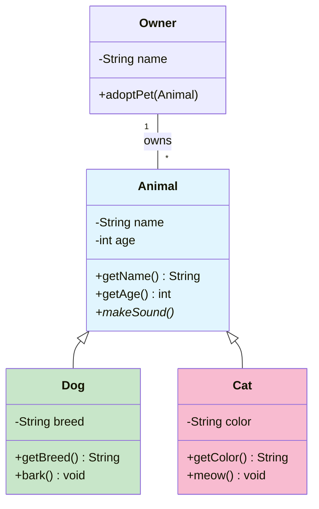

---

## State Diagram

**Declaration**: `stateDiagram-v2`

### Basic States

```
stateDiagram-v2
    [*] --> Active
    Active --> [*]

    State1 --> State2
    State2 --> State1: Transition label
```

### Composite States

```
state Parent {
    Child1
    Child2
    [*] --> Child1
    Child1 --> Child2
    Child2 --> [*]
}
```

### Special States

```
<<choice>>           # Choice node
<<fork>>             # Fork parallel execution
<<join>>             # Join parallel paths
```

### Concurrency

```
state Parallel {
    a
    --
    b
}
```

### Notes

```
note right of State1
    Description text
end
```

### Styling

```
classDef myStyle fill:#f00,color:white
class State1 myStyle

State1:::myStyle      # Inline styling
```

### Complete Example

```mermaid
stateDiagram-v2
    direction LR

    [*] --> Idle

    Idle --> Working: Start
    Working --> Paused: Pause
    Paused --> Working: Resume
    Working --> Completed: Finish

    Paused --> Idle: Cancel
    Working --> Error: Exception
    Error --> Idle: Reset

    Completed --> [*]
    Idle --> [*]: Exit

    note right of Working
        Processing task
    end
```

---

## Entity Relationship Diagram

**Declaration**: `erDiagram`

### Syntax

```
ENTITY ||--o| OTHER_ENTITY : "relationship description"
```

### Cardinality Notation

```
|o      Zero or one
||      Exactly one
}o      Zero or more
}|      One or more
```

### Relationship Types

```
--      Identifying (solid line)
..      Non-identifying (dashed line)
```

### Entity Definition with Attributes

```
CUSTOMER ||--o{ ORDER : places
CUSTOMER {
    int id PK
    string name
    string email UK
}

ORDER {
    int id PK
    int customer_id FK
    date order_date
    decimal total
}
```

### Attribute Modifiers

```
PK      Primary Key
FK      Foreign Key
UK      Unique Key
```

### Configuration

```
erDiagram
    direction TB
    # ... entity definitions
```

### Complete Example

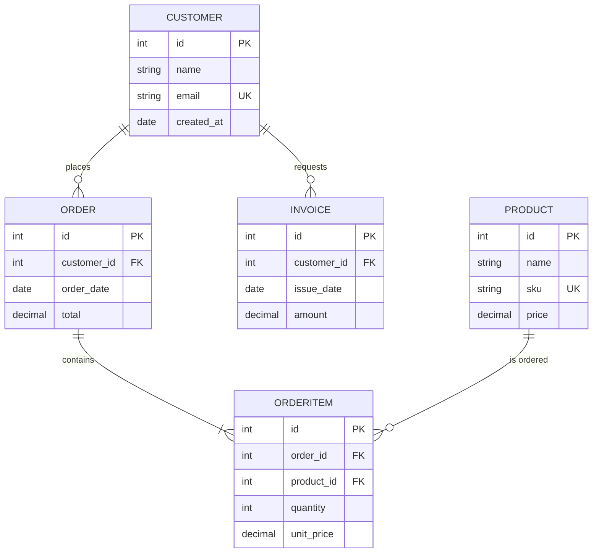

---

## Gantt Chart

**Declaration**: `gantt`

### Task Syntax

```
gantt
    title Project Schedule
    dateFormat YYYY-MM-DD

    section Phase 1
    Task 1           :a1, 2024-01-01, 5d
    Task 2           :after a1, 3d
    Task 3           :crit, active, a3, 2024-01-10, 2d
    Milestone        :crit, milestone, m1, 2024-01-15, 0d

    section Phase 2
    Task 4           :done, a4, 2024-01-16, 4d
    Task 5           :a5, after a4, 5d
```

### Task Tags

```
active          Currently being worked on
done            Completed
crit            Critical path (highlighted)
milestone       Milestone marker (0 duration)
```

### Date Specifications

```
2024-01-01          Explicit date
5d                  5 days duration
after taskID        Starts after previous task
after taskID, 3d    Starts after task, specific duration
```

### Configuration

```
dateFormat YYYY-MM-DD       Input date format
axisFormat %Y-%m-%d         Output display format
tickInterval 1week          Time intervals
```

### Special Directives

```
excludes 2024-01-07,2024-01-08    Exclude dates
excludes weekends                  Exclude weekends
```

### Complete Example

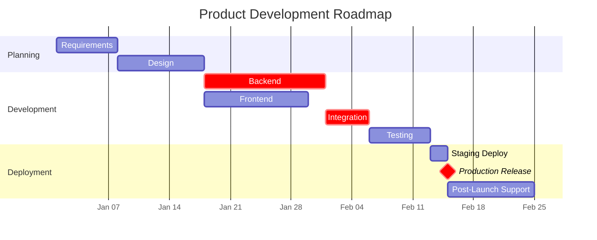

---

## Pie Chart

**Declaration**: `pie title <TITLE>`

### Data Format

```
pie title Chart Title
    "Label 1" : 30
    "Label 2" : 25
    "Label 3" : 45
```

### Options

```
pie showData
    title Chart Title
    "Label 1" : 30
    "Label 2" : 25
```

### Configuration

```
textPosition: 0.75    # Position from center (0.0-1.0)
```

### Complete Example

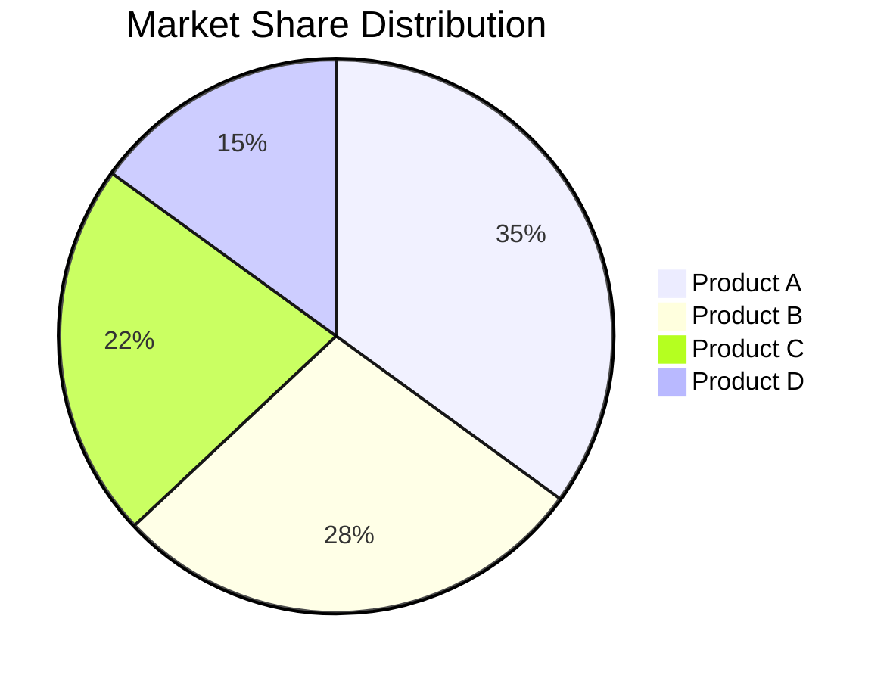

---

## Git Graph

**Declaration**: `gitGraph <ORIENTATION>:`

**Orientations**: `LR` (left-to-right, default), `TB` (top-to-bottom), `BT` (bottom-to-top)

### Core Operations

```
gitGraph LR:
    commit id: "Initial"
    branch develop
    commit id: "Feature start"
    checkout main
    commit id: "Hotfix"
    merge develop
    checkout develop
    commit id: "Feature complete"
    checkout main
    merge develop tag: "v1.0.0"
    cherry-pick id: "Feature commit"
```

### Commit Options

```
commit id: "id_text"           Custom ID
commit id: "id_text" tag: "v1"  With version tag
commit type: NORMAL             Default (circle)
commit type: REVERSE            Crossed circle
commit type: HIGHLIGHT          Filled rectangle
```

### Configuration Options

```
showBranches: true              Show branch names
showCommitLabel: true           Show commit labels
mainBranchName: main            Default branch name
mainBranchOrder: 0              Position of main branch
parallelCommits: false          Show concurrent commits
```

### Complete Example

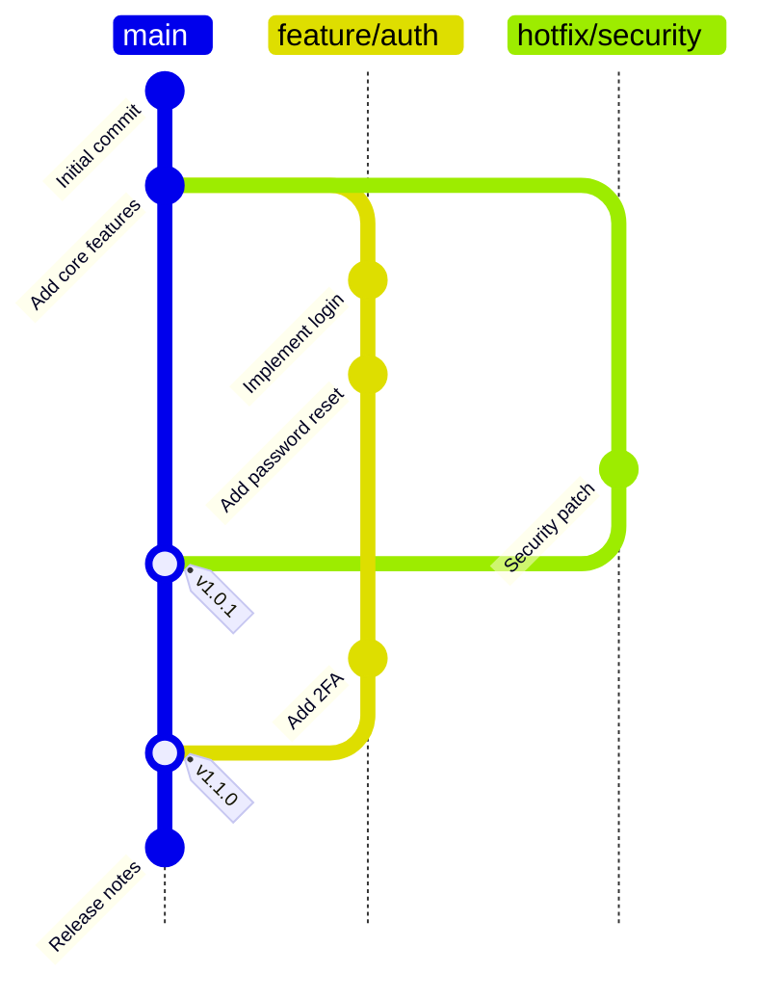

---

## User Journey

**Declaration**: `userJourney`

### Task Syntax

```
userJourney
    title User Registration Journey
    section Registration
        Start process: 5: User, Admin
        Enter email: 4: User
        Verify email: 3: System
        Create account: 5: User, Admin
    section Onboarding
        Complete profile: 4: User
        Accept terms: 5: User, Admin
        Get started: 5: User
```

### Task Format

```
Task Name: <score>: <actor1>, <actor2>, ...
```

**Score Range**: 1-5 (1=low satisfaction, 5=high)

### Complete Example

```mermaid
userJourney
    title E-Commerce Checkout Journey

    section Discovery
        Browse products: 4: Customer
        Search filters: 5: Customer, System
        View product details: 4: Customer, System

    section Cart
        Add to cart: 5: Customer
        Review cart: 4: Customer
        Update quantities: 3: Customer

    section Checkout
        Enter shipping: 2: Customer
        Select method: 2: Customer
        Enter payment: 1: Customer, Security
        Confirm order: 5: Customer, System

    section Post-Order
        Receive confirmation: 5: Customer, Email
        Track shipment: 4: Customer, System
        Delivery received: 5: Customer
```

---

## Mindmap

**Declaration**: `mindmap`

### Syntax

```
mindmap
    Root concept
        Child 1
            Grandchild 1.1
            Grandchild 1.2
        Child 2
            Grandchild 2.1
```

### Node Shapes

```
Root                Root (default ellipse)
[Node]              Square
(Node)              Rounded rectangle
((Node))            Circle
!(Node)!            Bang
{{Node}}            Hexagon (or cloud for some)
```

### Icons and Styling

```
Root::icon(material-home)          Add icon
Node:::customClass                 Apply CSS class
**Bold text**                       Bold
*Italic text*                       Italic
```

### Complete Example

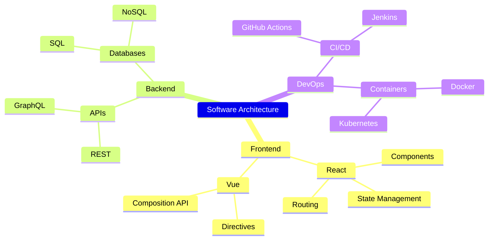

---

## Timeline

**Declaration**: `timeline`

### Basic Syntax

```
timeline
    title Project Timeline
    2024-Q1 : Planning : Requirements Gathering
    2024-Q2 : Development : Core Features : Testing
    2024-Q3 : Deployment : Beta Release
    2024-Q4 : Launch : Marketing : Support
```

### With Sections

```
timeline
    section 2024
        Q1 : Event 1 : Event 2
    section 2025
        Q1 : Event 3
```

### Line Breaks

```
Long event name : Forced<br>line break
```

### Complete Example

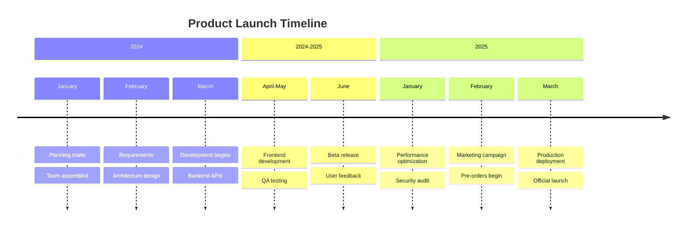

---

## Quadrant Chart

**Declaration**: `quadrantChart`

### Structure

```
quadrantChart
    title Quadrant Analysis
    x-axis Low --> High
    y-axis Low --> High

    quadrant-1 Top Right
    quadrant-2 Top Left
    quadrant-3 Bottom Left
    quadrant-4 Bottom Right

    Item 1: [0.3, 0.7]
    Item 2: [0.8, 0.6]
    Item 3: [0.2, 0.2]
    Item 4: [0.7, 0.3]
```

### Syntax

```
title <text>                        Chart title
x-axis <label> --> <label>         X-axis labels
y-axis <label> --> <label>         Y-axis labels
quadrant-1 through quadrant-4       Quadrant labels
Point Name: [x, y]                  Data point (0.0-1.0 range)
```

### Configuration

```
chartWidth: 500
chartHeight: 500
pointRadius: 5
titleFontSize: 20
xAxisPosition: 'top'
yAxisPosition: 'left'
```

### Complete Example

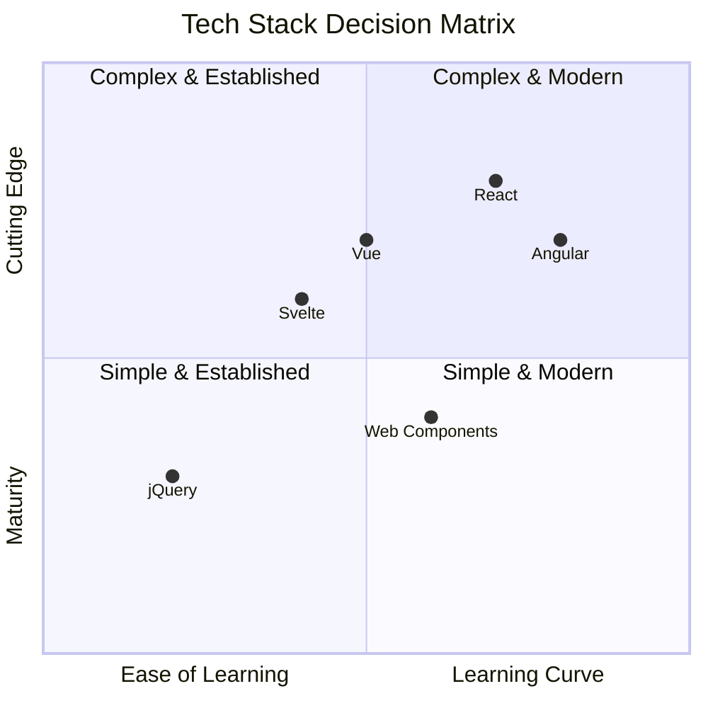

---

## XY Chart

**Declaration**: `xychart`

**Orientation**: Vertical (default) or `xychart horizontal`

### Axes Configuration

```
xychart
    title Chart Title
    x-axis [cat1, cat2, cat3]       Categorical x-axis
    x-axis "X Label" 0 --> 100      Numeric x-axis
    y-axis "Y Label" 0 --> 50       Y-axis (always numeric)

    line [2.3, 45, .98, -3.4]
    bar [1.2, 3.4, 2.1, 5.0]
```

### Chart Types

```
line [val1, val2, val3]             Line chart
bar [val1, val2, val3]              Bar chart
```

### Configuration Options

```
Width: 700 (default)
Height: 500 (default)
Title font size: 20
Show title: true
Data labels: false
Plot reserved space: 50%
```

### Complete Example

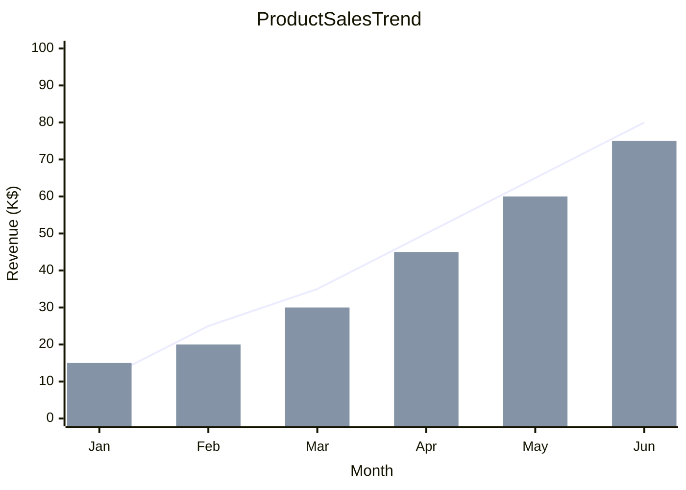

---

## Block Diagram

**Declaration**: `block`

### Structure

```
block
    columns 3
    Block1
    Block2
    Block3
    Block4[2]               Block spans 2 columns
    space: 1                Space block
    Block5
```

### Node Shapes

```
A                           Rectangle (default)
A(text)                     Rounded rectangle
A([text])                   Stadium shape
A[[text]]                   Subroutine box
A[(text)]                   Cylinder (database)
A((text)))                  Circle
A>text]                     Asymmetric
A{text}                     Rhombus
A{{text}}                   Hexagon
A[/text/]                   Parallelogram
A[\text\]                   Trapezoid
A(((text)))                 Double circle
```

### Connections

```
A --> B                     Arrow
A --> |label| B             Labeled arrow
A --- B                     Line (no arrow)
A -. B                      Dotted line
```

### Nested Blocks

```
block
    Outer[
        Inner1
        Inner2
    ]
```

### Styling

```
style A fill:#f9f,stroke:#333
classDef myStyle fill:#0f0,stroke:#00f
class A,B myStyle
```

### Complete Example

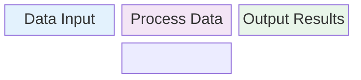

---

## Sankey Diagram

**Declaration**: `sankey`

### CSV Data Format

```
sankey
source,target,value
Node1,Node2,100
Node2,Node3,75
Node2,Node4,25
Node3,Final,50
Node4,Final,25
```

### Configuration Options

```
linkColor: source           Inherit source color
linkColor: target           Inherit target color
linkColor: gradient         Smooth gradient
linkColor: #a1a1a1         Custom hex color

nodeAlignment: justify      Node positioning
nodeAlignment: center
nodeAlignment: left
nodeAlignment: right
```

### Data Requirements

- **3 columns**: source, target, value
- **Value**: Positive number
- **Commas in values**: Wrap in quotes

### Complete Example

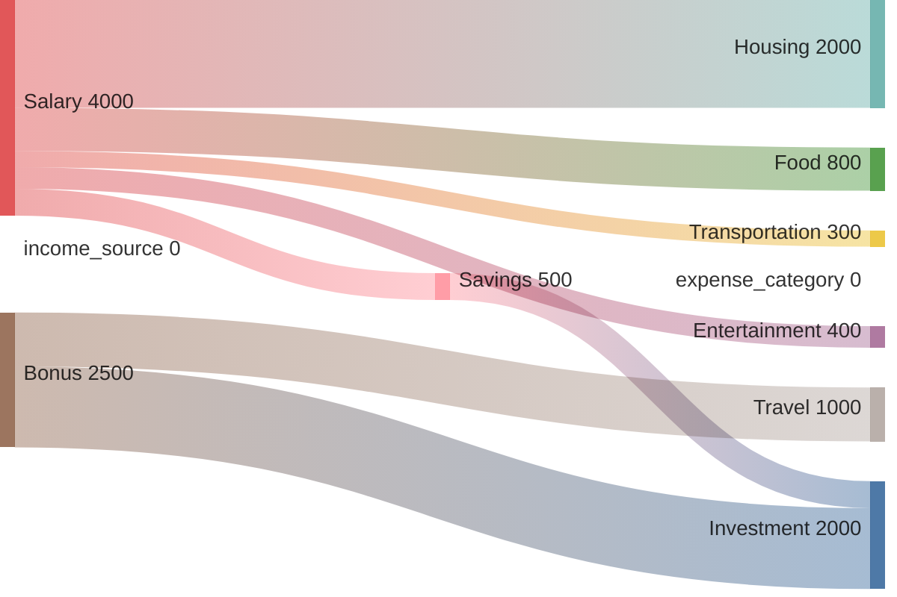

---

## Packet Diagram

**Declaration**: `packet`

### Syntax (Traditional)

```
packet
    0-7: "Byte 1"
    8-15: "Byte 2"
    16-23: "Byte 3"
    24-31: "Byte 4"
```

### Bits Syntax (v11.7.0+)

```
packet
    +1: "Flag"
    +3: "Reserved"
    +4: "Type"
    +8: "Length"
    +16: "Data"
```

### Configuration Options

```
bitsperrow: 32              Bits per row
bitwidth: 5                 Width of each bit
rowheight: 20               Row height
showbits: true              Show bit numbers
paddingx: 2                 Horizontal padding
paddingy: 2                 Vertical padding
```

### Complete Example

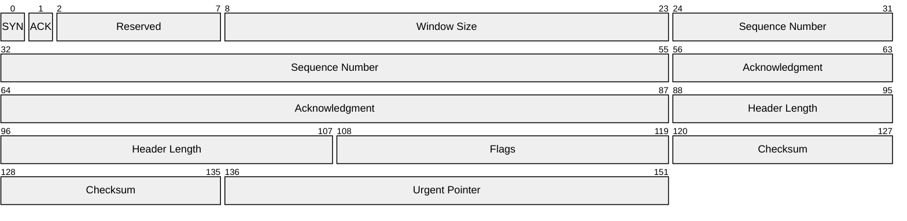

---

## Requirement Diagram

**Declaration**: `requirementDiagram`

### Components

```
requirementDiagram
    requirement user_requirement {
        id: USER_REQ_001
        text: System shall authenticate users
        risk: High
        verifymethod: Test
    }

    element user_interface {
        type: Software
        docref: docs/ui-spec
    }

    user_requirement - satisfies -> user_interface
```

### Requirement Types

```
requirement
functionalRequirement
interfaceRequirement
performanceRequirement
physicalRequirement
designConstraint
```

### Risk Levels

```
Low
Medium
High
```

### Verification Methods

```
Analysis
Inspection
Test
Demonstration
```

### Relationship Types

```
contains
copies
derives
satisfies
verifies
refines
traces
```

### Complete Example

```mermaid
requirementDiagram
    requirement authentication {
        id: AUTH-001
        text: System shall support user authentication
        risk: High
        verifymethod: Test
    }

    requirement password_strength {
        id: AUTH-002
        text: Passwords must be at least 8 characters
        risk: Medium
        verifymethod: Analysis
    }

    functionalRequirement api_security {
        id: SEC-001
        text: API endpoints must use HTTPS
        risk: High
        verifymethod: Inspection
    }

    element login_service {
        type: Software
        docref: docs/auth-service
    }

    element database {
        type: Database
        docref: docs/db-schema
    }

    authentication - contains -> password_strength
    authentication - satisfies -> login_service
    api_security - satisfies -> login_service
    login_service - uses -> database
```

---

## C4 Diagram

**Declaration**: `C4Context`, `C4Container`, `C4Component`, `C4Dynamic`, `C4Deployment`

**Status**: Experimental (syntax may change)

### C4 Diagram Types

```
C4Context       System context view
C4Container     Container breakdown
C4Component     Component details
C4Dynamic       Interaction sequences
C4Deployment    Infrastructure deployment
```

### Basic Syntax

```
C4Context
    title System Context
    Person(customer, "Customer", "A user")
    System(system, "System", "Core system")
    System_Ext(external, "External", "Third party")
    Rel(customer, system, "Uses")
```

### Configuration

```
UpdateElementStyle("element_id", color, text_color)
UpdateRelStyle(from_id, to_id, color, text)
UpdateLayoutConfig(params)
```

### Complete Example

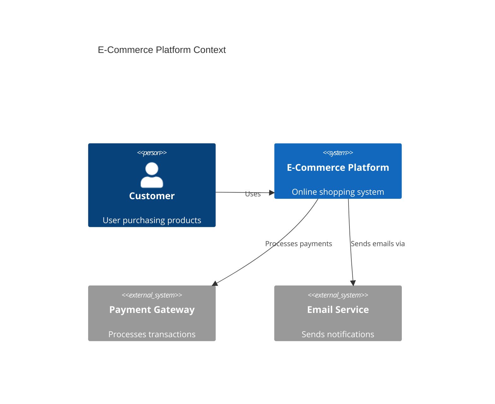

---

## Kanban Diagram

**Declaration**: `kanban`

### Structure

```
kanban
    columnId[Column Title]
        taskId[Task Description]
        taskId2[Another Task]

    columnId2[Backlog]
        taskId3[Task with metadata]
```

### Task Metadata

```
taskId[Task Name]@{
    assigned: User Name
    ticket: PROJ-123
    priority: Very High
}
```

### Priority Values

```
Very High
High
Medium
Low
Very Low
```

### Configuration

```
---
config:
  kanban:
    ticketBaseUrl: 'https://project.atlassian.net/browse/#TICKET#'
---
```

### Complete Example

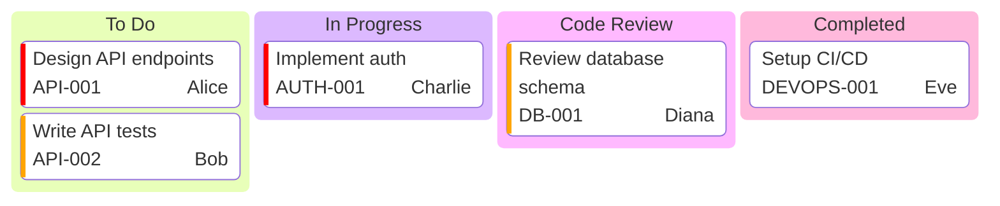

---

## Architecture Diagram

**Declaration**: `architecture-beta`

**Introduced**: v11.1.0+

### Core Components

```
architecture-beta
    group public_api(cloud)[Public API]
        service web_app(server)[Web App]
        service mobile_app(internet)[Mobile App]

    group backend(server)[Backend]
        service api(server)[API Server]
        service db(database)[Database]
        junction main_junction

    group integration(cloud)[External Services]
        service cache(disk)[Redis Cache]

    web_app:R --> L:api
    api:R --> L:db
    api:L --> R:cache
```

### Icon Support

**Built-in icons**: cloud, database, disk, internet, server

**Extended icons**: Use `name:icon-name` format from iconify.design (200,000+ icons available)

### Edge Syntax

```
serviceA:T --> B:serviceB      Top to Bottom connection
serviceA:R --> L:serviceB      Right to Left connection
serviceA:B --> T:serviceB      Bottom to Top connection
serviceA:L --> R:serviceB      Left to Right connection

--                              No arrow
-->                             Right arrow
<--                             Left arrow
<-->                            Bidirectional
```

### Junctions

```
junction connection_point
serviceA:R --> L:connection_point
connection_point --> R:serviceB
```

### Complete Example


---

## Radar Chart

**Declaration**: `radar-beta`

**Introduced**: v11.6.0+

### Syntax

```
radar-beta
    title Performance Metrics
    axis A, B, C, D, E, F
    curve Team A {1, 2, 3, 4, 5, 2}
    curve Team B {5, 4, 3, 2, 1, 4}
```

### Configuration Options

```
showLegend: true              Show/hide legend
max: 5                        Maximum scale value
min: 0                        Minimum scale value
graticule: circle             Background style (circle|polygon)
ticks: 5                      Number of concentric elements
```

### Complete Example

```mermaid
radar-beta
    title Tech Skills Assessment

    axis JavaScript, TypeScript, React, Vue, Node.js, Python

    curve Alice {4, 5, 5, 3, 4, 3}
    curve Bob {3, 2, 3, 4, 5, 4}
    curve Charlie {5, 4, 4, 4, 3, 5}
```

---

## Treemap Diagram

**Declaration**: `treemap-beta`

### Structure

```
treemap-beta
    "Company Budget"
        "Engineering" : 500000
            "Frontend" : 150000
            "Backend" : 200000
            "DevOps" : 150000
        "Sales" : 300000
        "Marketing" : 200000
```

### Syntax Rules

```
"Parent Section"                Parent node (no value)
"Leaf Node" : 1000             Leaf node with numeric value
Indentation                     Hierarchy levels
```

### Configuration Options

```
useMaxWidth: true              Use 100% width
padding: 10                    Internal spacing
diagramPadding: 8              Outer padding
showValues: true               Display numeric values
valueFormat: ','               Number format (D3 specifiers)
```

### Complete Example

```mermaid
treemap-beta
    "Annual Expenses"
        "Operations" : 250000
            "Rent" : 100000
            "Utilities" : 50000
            "Maintenance" : 100000
        "Personnel" : 500000
            "Engineering" : 300000
            "Management" : 150000
            "Support" : 50000
        "Marketing" : 150000
        "Equipment" : 100000
```

---

## Venn Diagram

**Declaration**: `venn-beta`

**Introduced**: v11.12.3+

### Syntax

```
venn-beta
    set A["Set A"]
    set B["Set B"]
    set C["Set C"]

    union AB["A ∩ B"]
    union BC["B ∩ C"]
    union ABC["A ∩ B ∩ C"]
```

### Set Sizing

```
set A: 5                Size modifier
set B: 3
```

### Text Nodes

```
text A: "Text in A"
text AB: "Intersection"
```

### Styling

```
fill: #ff0000
color: white
stroke: black
stroke-width: 2
fill-opacity: 0.5
```

### Complete Example

```mermaid
venn-beta
    title Programming Language Skills

    set Python["Python"]
    set JavaScript["JavaScript"]
    set Go["Go"]

    text Python: "Data Science<br/>ML"
    text JavaScript: "Web<br/>Frontend"
    text Go: "DevOps<br/>Performance"

    text PythonJavaScript: "Scripting<br/>Backends"
    text JavaScriptGo: "Cloud<br/>Services"
    text PythonGo: "Automation"

    text PythonJavaScriptGo: "Full Stack"
```

---

## ZenUML Diagram

**Declaration**: `zenuml`

### Participants

```
zenuml
    actor User
    participant Client
    participant Server
    participant Database
```

### Message Types

```
User -> Client: Sync message (blocking)
Client => Server: Async message (fire and forget)
Client <- Server: Reply message
new Database: Create object
```

### Control Flow

```
loop "Repeat condition"
    messages
end

if "Condition"
    messages
else
    messages
end

opt "Optional"
    messages
end

par "Parallel"
    messages
par
    messages
end

try
    messages
catch
    messages
finally
    messages
end
```

### Comments

```
// Comment
// **Bold** and *italic* supported
```

### Complete Example

```mermaid
zenuml
    actor User
    participant Client as Web Client
    participant Server as API Server
    participant DB as Database

    User -> Client: Click button
    Client => Server: POST /api/data

    par
        Server -> DB: Save data
    par
        Server -> Server: Process
    end

    Server <- DB: Confirm
    Client <- Server: Success
    User <- Client: Show result

    opt On error
        Server -> Server: Log error
    end
```

---

## Version-Specific Features

### v11.12.3+ Features

- **Half-arrows in Sequence Diagrams**: `-|\`, `-|/`, `/|-` directional variations
- **Central connections in Sequence**: `()` syntax for signals to central points
- **Venn Diagrams**: Full support for set intersections and styling
- **Enhanced Packet Diagram**: `+N` bits syntax simplification

### v11.6.0+ Features

- **Radar Charts**: Spider/polar diagram support
- **Treemap Diagrams**: Hierarchical rectangle visualization

### v11.1.0+ Features

- **Architecture Diagrams**: Cloud/infrastructure visualization with junctions
- **Kanban Diagrams**: Task board visualization

### v10.3.0+ Features

- **Sankey Diagrams** (experimental): Flow visualization
- **Packet Diagrams**: Network packet structure visualization

### v9.4.0+ Features

- **Mindmaps**: Included by default with lazy loading

---

## Common Configuration Patterns

### Setting Theme

```javascript
mermaid.initialize({
    theme: 'default',
    // Options: 'default', 'forest', 'dark', 'neutral', 'base'
});
```

### Custom Styling

```mermaid
classDef myStyle fill:#f9f,stroke:#333,stroke-width:2px
class NodeA myStyle
```

### Markdown in Labels

```
**Bold text**
*Italic text*
~~Strikethrough~~
Line breaks via <br>
```

### Suppress Auto-sizing

```javascript
mermaid.initialize({
    flowchart: { useMaxWidth: false }
});
```

---

## Troubleshooting Common Issues

### Node Labels Not Displaying

Ensure proper quote syntax:
- ✓ `A["Custom Label"]`
- ✗ `A[Custom Label]` (without quotes)

### Subgraph Not Recognized

Use `subgraph` keyword with proper nesting:
```mermaid
subgraph SG ["Name"]
  A --> B
end
```

### Direction Mismatch

Set direction explicitly:
```mermaid
flowchart LR
    A --> B
```

### Unicode/Special Characters

Wrap in quotes and use double backslashes:
```
A["text with special chars: @#$%"]
```

### Performance with Large Diagrams

- Split into multiple smaller diagrams
- Use simplified shapes in block diagrams
- Avoid deeply nested subgraphs
- Check browser console for warnings

---

## Cross-Diagram Comparison Table

| Feature | Flowchart | Sequence | Class | State | ER | Gantt | Pie | Git |
|---------|-----------|----------|-------|-------|----|----|----|----|
| Hierarchy | Subgraph | Implicit | Class tree | States | Entities | Sections | N/A | Branches |
| Time-based | No | Optional | No | No | No | Yes | No | Sequential |
| Relationships | Edges | Messages | Associations | Transitions | Relations | Dependencies | N/A | Merges |
| Actors/Roles | No | Yes | Classes | Yes | No | Yes | No | Branches |
| Styling | Classes | Limited | Full UML | Classes | Limited | Sections | Limited | Config |
| Complexity Support | Medium | High | Very High | Medium | Medium | High | Low | Medium |

---

## Source Documentation

All syntax and features documented above are sourced from the official Mermaid.js documentation:
- Main site: <https://mermaid.js.org/intro/>
- GitHub repository: <https://github.com/mermaid-js/mermaid>

**Accessed**: 2026-03-07
**Mermaid Version**: v11.12.3+
**Status**: Current as of March 2026
