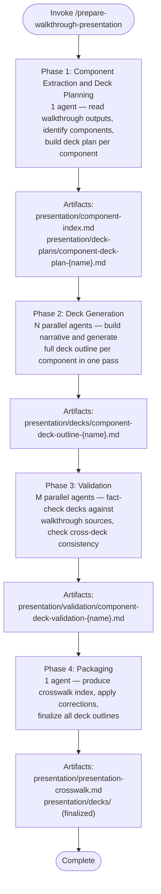

# Prepare Walkthrough Presentation

Transform validated `/linear-walkthrough` output into one presentation-ready deck outline per major codebase component. Each deck explains what the component is, how it works, how it connects to the system, how it is developed and operated, and what risks remain.

Walkthrough directory: `<walkthrough-directory>` (default: `./walkthrough/` in the current directory).

Output directory: `<walkthrough-directory>/presentation/` (created if it does not exist).

## Workflow

## Inputs

Read these artifacts from the walkthrough directory (all paths below are relative to that directory):

| Artifact | Path | Required |
|----------|------|----------|
| Unified walkthrough | `unified-walkthrough.md` or `unified/index.md` | Yes |
| Walkthrough sections | `sections/walkthrough-section-*.md` | Yes |
| Validation reports | `validation/validation-report-*.md` | Yes |
| Coverage plan | `coverage-plan.md` | Yes |
| Entry points | `entry-points.md` | Yes |
| Open questions | `open-questions.md` | Yes |

## Input Validation

Before starting Phase 1, verify all required walkthrough artifacts exist. Check for `unified-walkthrough.md` (or `unified/index.md`), at least one file matching `sections/walkthrough-section-*.md`, `coverage-plan.md`, `entry-points.md`, and `open-questions.md`. If any required artifact is missing, stop and report which files are absent.

## Phase 1: Component Extraction and Deck Planning

Spawn one `general-purpose` agent to read walkthrough outputs and produce a component index and per-component deck plans.

### Agent prompt context

Include these in the agent prompt (pass file paths — do not transcribe file contents):

- Walkthrough directory path
- File path: [agent-instructions.md](./references/agent-instructions.md) — agent reads section "Planning Agent Instructions"
- File path: [output-format.md](./references/output-format.md) — agent reads sections "Component Index Format" and "Deck Plan Format"

### Agent deliverables

| Artifact | Path |
|----------|------|
| Component index | `presentation/component-index.md` |
| Deck plans | `presentation/deck-plans/component-deck-plan-{name}.md` (one per component) |

### Orchestrator actions after Phase 1

1. Read `presentation/component-index.md` to get the component list and deck-to-component mapping.
2. Proceed to Phase 2 with one agent per component. Each agent reads its own deck plan.

## Phase 2: Deck Generation

Spawn N parallel `general-purpose` agents — one per component from the deck plan. Each agent constructs the presentation narrative and generates the full deck outline in a single pass, eliminating the intermediate narrative artifact.

### Agent prompt context (per agent)

Include these in the agent prompt (pass file paths — do not transcribe file contents):

- Component deck plan file path
- Walkthrough directory path (for reading source sections and evidence references)
- File path: [agent-instructions.md](./references/agent-instructions.md) — agent reads section "Deck Generation Agent Instructions"
- File path: [output-format.md](./references/output-format.md) — agent reads sections "Deck Outline Format" and "Slide Format"

### Agent deliverables (per agent)

| Artifact | Path |
|----------|------|
| Deck outline | `presentation/decks/component-deck-outline-{name}.md` |

### Orchestrator actions after Phase 2

1. Verify all expected deck outline files exist.
2. Proceed to Phase 3.

## Phase 3: Validation

Spawn M parallel `general-purpose` agents. Each validator checks one or more deck outlines against the source walkthrough.

Validator cross-assignment: rotate deck assignments so validator 1 checks decks from generation agent 2, validator 2 checks decks from generation agent 3, and so on (wrapping around). If there are fewer validators than generation agents, each validator checks multiple decks. If there is only one deck, the single validator checks it (self-validation is acceptable when no alternative exists).

### Agent prompt context (per validator)

Include these in the agent prompt (pass file paths — do not transcribe file contents):

- Assigned deck outline file paths
- Walkthrough directory path
- Other deck outline file paths (for cross-deck consistency checks)
- File path: [agent-instructions.md](./references/agent-instructions.md) — agent reads section "Deck Validation Agent Instructions"
- File path: [output-format.md](./references/output-format.md) — agent reads section "Deck Validation Report Format"

### Agent deliverables (per validator)

| Artifact | Path |
|----------|------|
| Validation report | `presentation/validation/component-deck-validation-{name}.md` |

### Orchestrator actions after Phase 3

1. Read all validation reports.
2. If critical corrections exist (unsupported claims, invented architecture, incorrect sequencing), spawn a new `general-purpose` agent per affected deck to apply the corrections. Pass the agent the validation report and deck outline file path. The agent edits the deck file in place.
3. Proceed to Phase 4.

## Phase 4: Packaging

Spawn one `general-purpose` agent to finalize all deck outlines and produce the crosswalk index.

### Agent prompt context

Include these in the agent prompt (pass file paths — do not transcribe file contents):

- Directory path: `presentation/decks/` — agent reads all deck outline files
- Directory path: `presentation/validation/` — agent reads all validation reports
- File path: `presentation/component-index.md`
- File path: [agent-instructions.md](./references/agent-instructions.md) — agent reads section "Packaging Agent Instructions"
- File path: [output-format.md](./references/output-format.md) — agent reads section "Presentation Crosswalk Format"

### Agent deliverables

| Artifact | Path |
|----------|------|
| Presentation crosswalk | `presentation/presentation-crosswalk.md` |
| Finalized deck outlines | `presentation/decks/` (corrections applied) |

### Large output handling

If the crosswalk or any deck outline exceeds 25k characters, apply the [large file write strategy](../../rules/large-file-write-strategy.md) using Strategy A (multi-file split).

## Deck Planning Heuristics

- One deck per major component by default.
- Merge when two components are too small or too tightly coupled to explain separately.
- Split when one component is too broad to explain coherently in one deck.
- A component may be an app, service, package, library, worker, pipeline, platform layer, or other meaningful architectural unit.

## Default Audience

Technical audience: engineers, tech leads, platform owners, SRE/DevOps engineers, and engineering managers.

## Presentation Style

- Optimize for technical clarity, not executive fluff.
- Use concise, high-signal slide text — avoid dense paragraphs.
- Put detailed explanation in speaker notes.
- Make each deck readable standalone but consistent with other decks.
- Use consistent naming, terms, and structural patterns across all decks.

## Evidence Handling

- Every substantive slide references the walkthrough sections, validation reports, or source artifacts that support it.
- Distinguish verified facts from inferred connections.
- Preserve unresolved uncertainty from the walkthrough — do not smooth it away.

## Resources

- [Agent instructions](./references/agent-instructions.md) — detailed prompts for each agent type (planning, deck generation, validation, packaging)
- [Output format](./references/output-format.md) — required structure and templates for all artifacts
