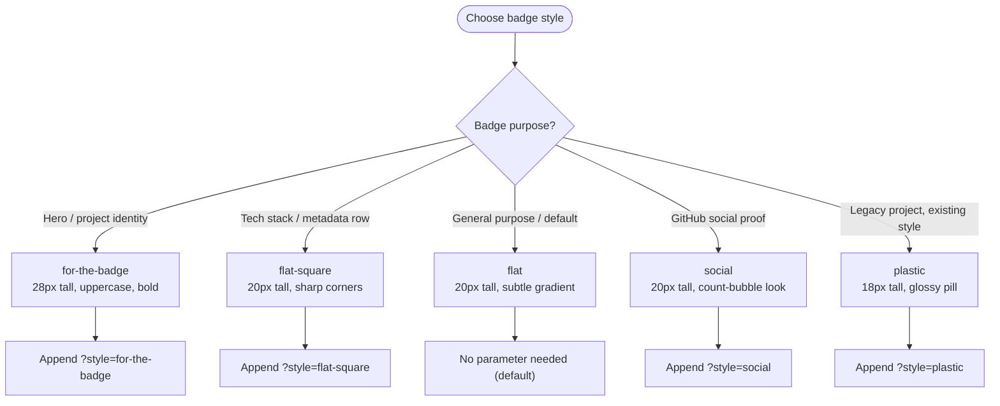
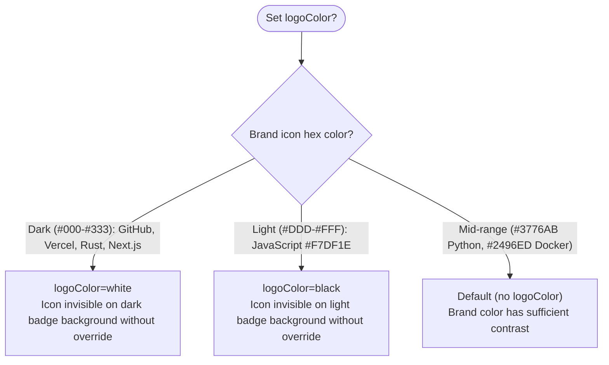
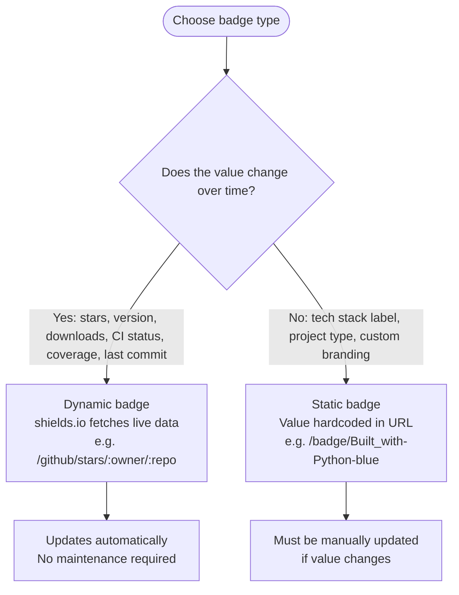

# readme-badger

Badge design and selection knowledge base for AI documentation agents. This skill provides
the decision logic, URL patterns, icon slugs, layout templates, and project-type recommendations
needed to choose the right badges for the right context. It is not a badge insertion tool -- it
is the knowledge an agent needs to produce correct, well-designed badge markup on the first pass.

SOURCE: Research synthesized from [shields.io](https://shields.io/), [Simple Icons](https://simpleicons.org/),
and conventions observed in major open-source repositories (accessed 2026-03-03).

## Badge URL Pattern

All shields.io static badges follow this URL structure:

```text
https://img.shields.io/badge/{LABEL}-{MESSAGE}-{COLOR}
```

Three encoding rules apply within the path segment:

| Input | Output |
|-------|--------|
| `_` (single underscore) | Space |
| `__` (double underscore) | Literal underscore `_` |
| `--` (double dash) | Literal dash `-` |

### Building a Badge Step by Step

Goal: a badge reading "Claude Code | compatible" in Anthropic orange with a Claude logo.

1. Label: `Claude Code` -- encode spaces as underscores: `Claude_Code`
2. Message: `compatible`
3. Color: Anthropic brand orange `D97757`
4. Assemble path: `Claude_Code-compatible-D97757`
5. Add logo: `?logo=claude&logoColor=white`
6. Full URL:

```text
https://img.shields.io/badge/Claude_Code-compatible-D97757?logo=claude&logoColor=white
```

7. Wrap in Markdown with link:

```markdown
[](https://claude.ai/code)
```

For the complete query parameter reference (style, logo, logoColor, logoSize, label, labelColor,
color, cacheSeconds, link), see [Shields.io API Reference](./references/shields-io-api.md).

## Style Selection



**Rules:**

- Use one style per badge row. Mixing styles in the same row produces mismatched heights.
- `for-the-badge` is the only style appropriate for hero/identity badges at the top of a README.
- `flat` is the safe default when no other style is specified.
- `plastic` should only be used to match an existing project convention. Do not introduce it.
- `social` is only for GitHub star/fork/follower counts where the count-bubble appearance matches the GitHub UI.

SOURCE: [shields.io styles](https://shields.io/#styles) (accessed 2026-03-03)

## Badge Selection by Project Type

### Python Library / CLI

```markdown
[](https://github.com/{owner}/{repo}/actions)
[](https://pypi.org/project/{package}/)
[](https://pypi.org/project/{package}/)
[](https://pepy.tech/project/{package})
[](https://github.com/{owner}/{repo}/blob/main/LICENSE)
[](https://codecov.io/gh/{owner}/{repo})
```

SOURCE: Observed in Pydantic, FastAPI, Ruff, uv, Black READMEs (accessed 2026-03-03)

### JavaScript / TypeScript Package

```markdown
[](https://www.npmjs.com/package/{package})
[](https://www.npmjs.com/package/{package})
[](https://www.npmjs.com/package/{package})
[](https://bundlephobia.com/package/{package})
[](./LICENSE)
[](https://github.com/{owner}/{repo}/actions)
```

SOURCE: Vue 2, Vue 3, React READMEs (accessed 2026-03-03)

### Claude Code Plugin

Use `flat` or `flat-square` style. `for-the-badge` is too large for skill documentation contexts.

```markdown
[](https://claude.ai/code)
[](https://modelcontextprotocol.io)
[](./SKILL.md)
[](./agents/)
[](./SKILL.md)
[](./LICENSE)
```

The Claude logo slug is `claude` with brand color `D97757`. No official MCP icon exists in
Simple Icons as of 2026-03-03; use `claude` as a proxy.

SOURCE: [Simple Icons v16.10.0](https://github.com/simple-icons/simple-icons) (accessed 2026-03-03);
[Anthropic MCP announcement](https://www.anthropic.com/news/model-context-protocol) (accessed 2026-03-03)

### Rust Crate

Rust community convention uses reference-style links:

```markdown
[![Crates.io][crates-badge]][crates-url]
[![docs.rs][docs-badge]][docs-url]
[![MIT licensed][mit-badge]][mit-url]
[![Build Status][actions-badge]][actions-url]

[crates-badge]: https://img.shields.io/crates/v/{crate}.svg
[crates-url]: https://crates.io/crates/{crate}
[docs-badge]: https://docs.rs/{crate}/badge.svg
[docs-url]: https://docs.rs/{crate}
[mit-badge]: https://img.shields.io/badge/license-MIT-blue.svg
[mit-url]: ./LICENSE
[actions-badge]: https://github.com/{owner}/{repo}/workflows/CI/badge.svg
[actions-url]: https://github.com/{owner}/{repo}/actions
```

SOURCE: Tokio README (accessed 2026-03-03)

### General Open-Source Project

```markdown
[](https://github.com/{owner}/{repo}/stargazers)
[](https://github.com/{owner}/{repo}/commits)
[](https://github.com/{owner}/{repo}/blob/main/LICENSE)
[](https://github.com/{owner}/{repo}/graphs/contributors)
[](https://github.com/{owner}/{repo}/issues)
```

## Layout Patterns

### Pattern A: Two-Tier (Hero + Metadata)

First row uses `for-the-badge` for project identity. Second row uses `flat-square` for metadata.

```html
<p align="center">
  <!-- Row 1: Identity -->
  <a href="https://example.com">
    
  </a>
  <br>
  <!-- Row 2: Metadata -->
  <a href="https://pypi.org/project/pkg/">
    
  </a>
  <a href="./LICENSE">
    
  </a>
  <a href="https://github.com/owner/repo/actions">
    
  </a>
</p>
```

When to use: Projects with a strong brand identity (Astral projects uv, Ruff use this pattern).

### Pattern B: Inline Left-Aligned

Single row of `flat` badges immediately after the `# Title` heading. No HTML required.

```markdown
# Project Name [](https://github.com/owner/repo/actions) [](https://pypi.org/project/pkg/) [](./LICENSE)
```

When to use: Developer-facing READMEs with 2-4 badges. Used by React and Vue 3.

### Pattern C: Centered Single Row

All badges in a `<p align="center">` block using `flat` or `flat-square` style.

```html
<p align="center">
  <a href="https://github.com/owner/repo/actions">
    
  </a>
  <a href="https://pypi.org/project/pkg/">
    
  </a>
  <a href="./LICENSE">
    
  </a>
</p>
```

When to use: Polished, professional READMEs with 3-8 badges. Used by Vue 2 and FastAPI.

For additional patterns (stacked, reference-style, per-section tables, div-based), see
[Layout Patterns](./references/layout-patterns.md).

## Logo Usage

Add logos via the `logo=` query parameter using Simple Icons slugs:

```text
?logo=python
?logo=github&logoColor=white
?logo=rust&logoColor=white
```

### Non-Obvious Slugs

Slugs are derived from brand names by lowercasing, removing whitespace, and replacing special
characters. Common mistakes:

| Brand | Wrong slug | Correct slug |
|-------|-----------|-------------|
| Bash | `bash` | `gnubash` |
| Vue.js | `vue` | `vuedotjs` |
| Next.js | `nextjs` | `nextdotjs` |
| C++ | `c++` | `cplusplus` |
| Java | `java` | `openjdk` |
| Node.js | `nodejs` | `nodedotjs` |

SOURCE: [Simple Icons slugs.md](https://github.com/simple-icons/simple-icons/blob/master/slugs.md) (accessed 2026-03-03)

### When to Use `logoColor=white`



### Forbidden Brands

These brands are excluded from Simple Icons and have no slug. Use custom SVG via
`logo=data:image/svg+xml;base64,...` or a related icon as proxy:

AWS, Azure, Windows, VS Code, Playwright, PowerShell, OpenAI, Heroku.

For the full catalog of available icons by category, see
[Simple Icons Catalog](./references/simple-icons-catalog.md).

## Color Reference

### Named Colors

| Name | Hex | Semantic use |
|------|-----|-------------|
| `brightgreen` | `#4c1` | Passing, success, 100% coverage |
| `green` | `#97ca00` | Good, healthy |
| `yellowgreen` | `#a4a61d` | Mostly good |
| `yellow` | `#dfb317` | Warning, moderate |
| `orange` | `#fe7d37` | Caution |
| `red` | `#e05d44` | Failing, error, critical |
| `blue` | `#007ec6` | Informational, version |
| `grey` | `#555` | Default label background |
| `lightgrey` | `#9f9f9f` | Inactive |

### Semantic Aliases

| Alias | Resolves to |
|-------|------------|
| `success` | `brightgreen` |
| `important` | `orange` |
| `critical` | `red` |
| `informational` | `blue` |
| `inactive` | `lightgrey` |

Custom hex values are supported: `?color=9cf`, `?color=007fff`. The `#` character must be
percent-encoded as `%23` in URLs.

SOURCE: [shields.io badge-maker](https://github.com/badges/shields/blob/master/badge-maker/README.md) (accessed 2026-03-03)

## Dynamic vs Static Badges



Dynamic badge endpoints for common use cases:

| Data | Endpoint |
|------|----------|
| GitHub stars | `/github/stars/:owner/:repo` |
| GitHub last commit | `/github/last-commit/:owner/:repo` |
| GitHub license | `/github/license/:owner/:repo` |
| GitHub Actions CI | `/github/actions/workflow/status/:owner/:repo/:workflow` |
| PyPI version | `/pypi/v/:package` |
| npm version | `/npm/v/:package` |
| Codecov coverage | `/codecov/c/:vcs/:owner/:repo` |
| Crates.io version | `/crates/v/:crate` |

For the full endpoint reference, see [Shields.io API Reference](./references/shields-io-api.md).
For alternative badge services (Badgen, For the Badge, pepy.tech), see
[Badge Services](./references/badge-services.md).

## Common Mistakes

**Badge overload (more than 12 badges).** If removing a badge loses no actionable information,
remove it. Multiple badges conveying the same fact (e.g., "Built with Python" next to a PyPI
version badge) add visual noise.

**Mismatched styles in the same row.** Each style has a different height (`for-the-badge` is
28px, `flat`/`flat-square` are 20px, `plastic` is 18px). Mixing produces uneven rows.

**Missing alt text.** Every badge `` or Markdown image must have descriptive alt text.
Shields.io SVGs include `aria-label` and `<title>`, but the wrapping `` alt attribute
is what screen readers prioritize.

**Broken slugs.** Using `bash` instead of `gnubash`, `vue` instead of `vuedotjs`, or
`java` instead of `openjdk` produces badges with missing icons. Verify slugs against
[Simple Icons](https://simpleicons.org/) before use.

**Unlinked badges.** A badge without a wrapping `<a>` or `[](link)` provides
information but no navigation. Always link badges to their data source (PyPI page, CI run,
license file).

**Using badges that add no information.** "Open Source" (implied by being on GitHub),
"Maintained" (goes stale), "Awesome" (self-awarded) -- these badges consume space without
communicating verifiable facts.

SOURCE: Anti-patterns observed across [Layout Patterns](./references/layout-patterns.md)

## References

- [Shields.io API Reference](./references/shields-io-api.md) -- URL patterns, query parameters, styles, dynamic endpoints, color system, endpoint badge API
- [Simple Icons Catalog](./references/simple-icons-catalog.md) -- Icon slugs by category, hex colors, logoColor guidance, forbidden brands
- [Layout Patterns](./references/layout-patterns.md) -- Badge arrangement conventions from popular repos, grouping order, anti-patterns, HTML vs Markdown syntax
- [Badge Services](./references/badge-services.md) -- Badgen, For the Badge, GitHub native badges, custom endpoints, trending badge types, accessibility
- [Markup Format Syntax](./references/format-support.md) -- Per-format badge syntax for Markdown, RST, AsciiDoc, Textile, RDoc, Org-mode, MediaWiki, Pod
