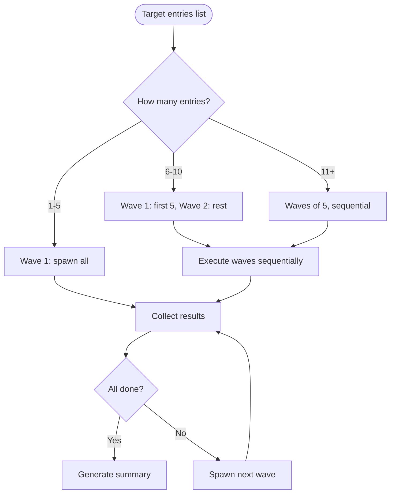
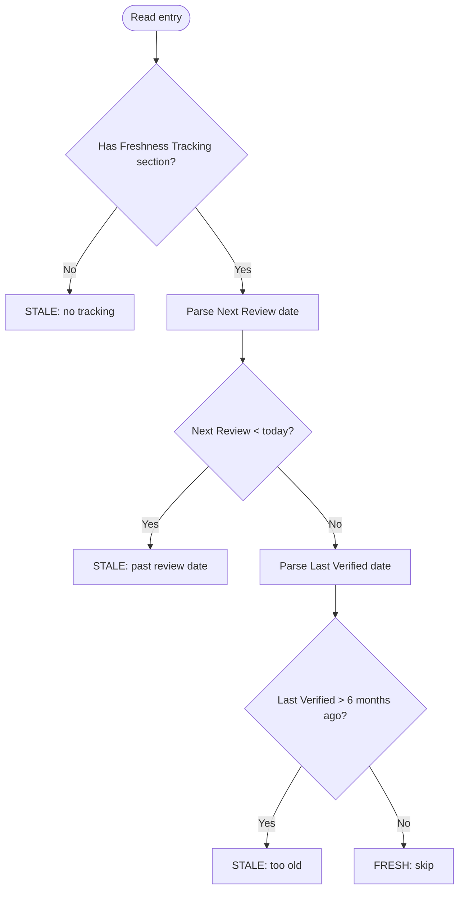

# Refresh Research

Orchestrate parallel research-curator agents to refresh existing research entries in `./research/`. Designed to run repeatedly — detects staleness, skips fresh entries, and updates only what needs updating.

## Arguments

`$ARGUMENTS` controls scope and mode:

- **`--all`**: Refresh every entry regardless of staleness
- **`--stale`** (default if no args): Refresh only entries past their review date
- **`--category <name>`**: Refresh all entries in a specific category (e.g., `--category agent-frameworks`)
- **`--dry-run`**: Report what would be refreshed without spawning agents

## Workflow

### Step 1: Inventory Research Entries

Scan `./research/` for all entry files:

```text
Glob: ./research/**/*.md (excluding README.md)
```

For each entry, extract from the Freshness Tracking section:

- **Last Verified**: date of last research
- **Next Review Recommended**: date when refresh is due
- **Version at Verification**: version last recorded

Build an inventory table:

```text
| File | Category | Last Verified | Next Review | Stale? |
```

An entry is **stale** if:

- `Next Review Recommended` is before today's date, OR
- No Freshness Tracking section exists, OR
- `Last Verified` is more than 6 months ago

### Step 2: Apply Scope Filter

Based on `$ARGUMENTS`:

- **`--all`**: Target all entries from inventory
- **`--stale`**: Target only stale entries
- **`--category <name>`**: Target entries where category matches
- **`--dry-run`**: Display the target list and stop

If zero entries match the filter, report and stop.

### Step 3: RT-ICA Checkpoint

Before spawning agents, perform a lightweight RT-ICA:

```text
RT-ICA: Research Refresh
Goal: Refresh {N} research entries with current data from primary sources
Conditions:
1. MCP tools available | Requires: mcp__Ref, mcp__exa in session | Why: Primary data gathering
2. gh CLI available | Requires: gh authenticated | Why: GitHub repo metadata
3. Network access | Requires: outbound HTTP | Why: Fetch fresh data
4. Research directory writable | Requires: write access to ./research/ | Why: Update entry files
5. Entry files parseable | Requires: valid markdown with Freshness section | Why: Determine what changed
Decision: {APPROVED|BLOCKED}
```

**If BLOCKED**: Report which tools/access are missing. Suggest workarounds or stop.

**If APPROVED**: Proceed to spawning.

### Step 4: Spawn Research-Curator Agents in Waves

Split target entries into waves of 5:

```text
Wave 1: entries[0..4]  → spawn 5 agents in parallel
Wait for Wave 1 to complete
Wave 2: entries[5..9]  → spawn 5 agents in parallel
Wait for Wave 2 to complete
...continue until all entries processed
```

For each entry, spawn via Task tool:

```text
Task(
  subagent_type: "research-curator",
  prompt: "--rerun ./research/{category}/{name}.md",
  model: "sonnet"
)
```

### Step 5: Collect Results Per Wave

After each wave completes, collect results:

```text
Wave {N} complete: {M}/{total} succeeded
  updated  -- ./research/agent-frameworks/agno.md (v0.3→v0.5, +2k stars)
  unchanged -- ./research/mcp-ecosystem/narsil-mcp.md (no changes detected)
  failed   -- ./research/developer-tools/orbstack.md -- error: [reason]
```

Track three outcome categories:

- **Updated**: Entry content changed (new version, stats, features)
- **Unchanged**: Entry re-verified but no material changes
- **Failed**: Agent could not complete (network, missing source, etc.)

### Step 6: Update README

After all waves complete, update `./research/README.md`:

- Update freshness dates for all updated/unchanged entries
- Add any new categories if agents created them
- Regenerate category counts

### Step 7: Produce Summary Report

```markdown
# Research Refresh Report

**Date**: {YYYY-MM-DD}
**Scope**: {--all | --stale | --category X}
**Total entries scanned**: {N}
**Entries targeted**: {M} (matched filter)

## Results

| Outcome | Count |
|---------|-------|
| Updated | {N} |
| Unchanged | {N} |
| Failed | {N} |
| Skipped (fresh) | {N} |

## Updates

| Entry | Category | Change Summary |
|-------|----------|----------------|
| {name} | {category} | {what changed: version bump, stat update, etc.} |

## Failures

| Entry | Error |
|-------|-------|
| {name} | {reason} |

## Next Actions

- Entries due for review in next 30 days: {list}
- Categories with no recent updates: {list}
- Failed entries to retry: {list}
```

### Step 8: Post-Actions

1. **Lint**: `uv run prek run --files` on all modified files
2. **Commit**: `git add ./research/ && git commit -m "docs(research): refresh {N} entries ({date})"`
3. **Push**: `git push -u origin HEAD`

## Wave Spawning Detail



## Staleness Detection



## Example Usage

```text
# Refresh only stale entries (default)
/refresh-research

# Refresh everything regardless of staleness
/refresh-research --all

# See what would be refreshed without doing it
/refresh-research --dry-run

# Refresh a specific category
/refresh-research --category mcp-ecosystem

# Refresh stale entries (explicit)
/refresh-research --stale
```

## Error Handling

- **No entries match filter**: Report "All entries are fresh. Nothing to refresh." and stop
- **Agent failures**: Continue with remaining waves. Report failures in summary
- **Network issues mid-wave**: Complete current wave, report partial results, suggest retry
- **README update conflicts**: Re-read README and retry update once

## Related

- `/research-curator` -- single-entry and batch research operations
- `/research-curator --rerun` -- lower-level rerun mode (this skill wraps it with staleness detection and RT-ICA)
- `@research-curator` agent at `.claude/agents/research-curator.md`
