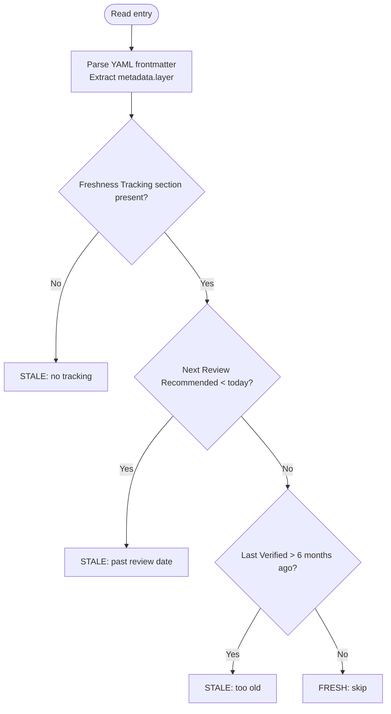

# Refresh Research

Orchestrate parallel research-curator agents to bulk-refresh research entries in `./research/`. Detects staleness, skips fresh entries, updates only what qualifies. Safe to run repeatedly.

## Arguments

`$ARGUMENTS` controls scope:

- `--all` — Refresh every entry regardless of staleness
- `--stale` (default) — Refresh entries past their review date
- `--category <name>` — Refresh all entries in one category (e.g., `--category agent-frameworks`)
- `--layer <0|1|2>` — Refresh entries with matching SDLC layer metadata (0=process, 1=language, 2=stack). See [.claude/docs/sdlc-layers/](../../docs/sdlc-layers/).
- `--dry-run` — Report what would be refreshed; do not spawn agents

## Workflow

### Step 1: Inventory and Staleness Detection

Glob `./research/**/*.md` (exclude README.md). For each entry, parse:

1. **YAML frontmatter** — extract `metadata.layer` value (string `"0"`, `"1"`, or `"2"`; `null` if absent).
2. **Freshness Tracking section** — extract Last Verified and Next Review dates.



Build inventory table: `| File | Category | Layer | Last Verified | Next Review | Stale? |`

The `Layer` column holds the `metadata.layer` value or `—` if absent.

### Step 2: Apply Scope Filter

Apply filters sequentially. Filters combine with AND logic — each filter narrows the set from the previous step.

1. **Base set**: Start with all inventoried entries.
2. **Staleness filter** (default unless `--all`):
   - `--all` — keep all entries (no staleness filter)
   - `--stale` (default) — keep only entries marked STALE in Step 1
3. **Category filter** (optional): `--category <name>` — keep only entries whose category directory matches `<name>`.
4. **Layer filter** (optional): `--layer <0|1|2>` — keep only entries where `metadata.layer` equals the requested value. Entries without `layer` metadata (`—` in inventory) are excluded.
5. **Dry-run check**: `--dry-run` — display the filtered target list and stop without spawning agents.

If zero entries remain after all filters: report "No entries match the applied filters." and stop. When `--layer` was specified and zero entries match, additionally report: "No entries found for layer {N}. Entries need `metadata.layer` in their YAML frontmatter to be targeted by `--layer`."

### Step 3: RT-ICA Pre-Flight

```text
RT-ICA: Research Refresh
Goal: Refresh {N} research entries with current data from primary sources
Conditions:
1. mcp__Ref and mcp__exa available in session  (primary data gathering)
2. gh CLI authenticated                         (GitHub repo metadata)
3. Outbound network access                      (fetch fresh data)
4. ./research/ writable                         (update entry files)
5. Entry files parseable markdown               (determine what changed)
Decision: {APPROVED | BLOCKED}
```

If BLOCKED: report missing tools/access, suggest workarounds, stop.

### Step 4: Spawn Agents in Waves

Split target entries into sequential waves of 5. Within each wave spawn agents in parallel; wait for wave completion before starting the next.

For each entry:

```text
Task(subagent_type: "research-curator", prompt: "--rerun ./research/{category}/{name}.md", model: "sonnet")
```

After each wave, collect and log results:

```text
Wave {N} complete: {M}/{total} succeeded
  updated   -- ./research/agent-frameworks/agno.md (v0.3→v0.5, +2k stars)
  unchanged -- ./research/mcp-ecosystem/narsil-mcp.md (no changes detected)
  failed    -- ./research/developer-tools/orbstack.md -- error: [reason]
```

Outcome categories: **Updated** (content changed), **Unchanged** (re-verified, no changes), **Failed** (agent could not complete).

### Step 5: Update README

After all waves complete, update `./research/README.md`:

- Refresh freshness dates for updated and unchanged entries
- Add new categories if agents created them
- Regenerate category counts

### Step 6: Summary Report

```markdown
# Research Refresh Report

**Date**: {YYYY-MM-DD}
**Scope**: {--all | --stale | --category X | --layer N}
**Total scanned**: {N} | **Targeted**: {M} | **Skipped (fresh)**: {K}

## Results

| Outcome | Count |
|---------|-------|
| Updated | {N} |
| Unchanged | {N} |
| Failed | {N} |

## Updates

| Entry | Category | Change Summary |
|-------|----------|----------------|
| {name} | {category} | {version bump, stat update, etc.} |

## Failures

| Entry | Error |
|-------|-------|
| {name} | {reason} |

## Next Actions

- Due for review in 30 days: {list}
- Categories with no recent updates: {list}
- Failed entries to retry: {list}
```

### Step 7: Post-Actions

Lint modified files before committing to prevent malformed entries reaching git history:

```bash
uv run prek run --files ./research/
```

Commit with a format that identifies the refresh scope for audit purposes:

```bash
git add ./research/ && git commit -m "docs(research): refresh {N} entries ({date})"
git push -u origin HEAD
```

## Error Handling

- **No entries match filter** — report "All entries are fresh. Nothing to refresh." and stop
- **No entries match `--layer` filter** — report "No entries found for layer {N}. Entries need `metadata.layer` in their YAML frontmatter to be targeted by `--layer`." and stop
- **Agent failures** — continue remaining waves; include in summary Failures table
- **Network issues mid-wave** — complete current wave, report partial results, suggest retry with `--stale`
- **README update conflict** — re-read README and retry update once

## Related

- `/research-curator` — single-entry and batch research operations; this skill wraps it with staleness detection and RT-ICA
- `@research-curator` agent — `.claude/agents/research-curator.md` — executes individual entry reruns
