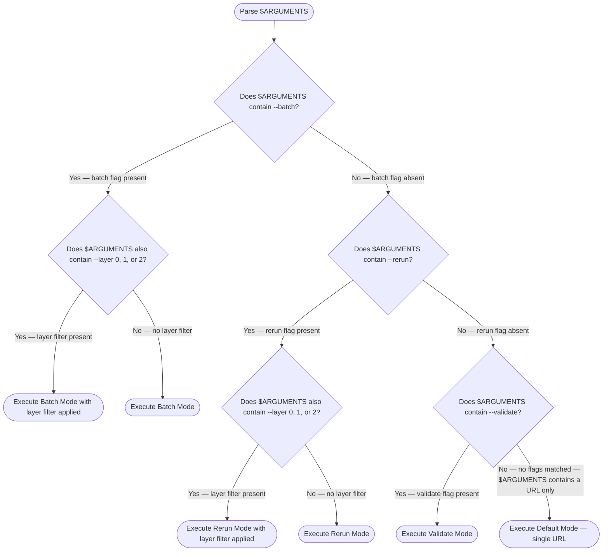
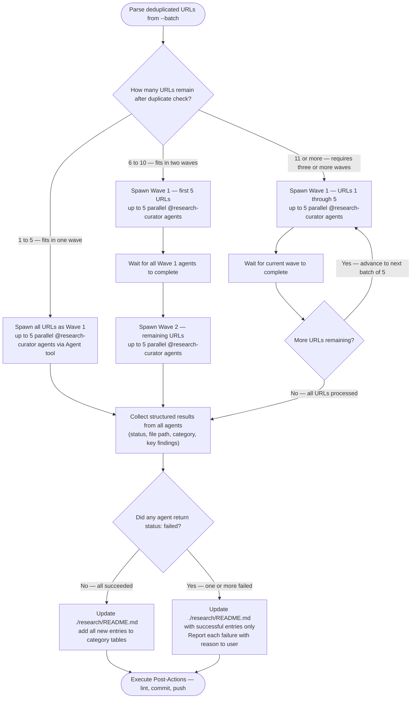
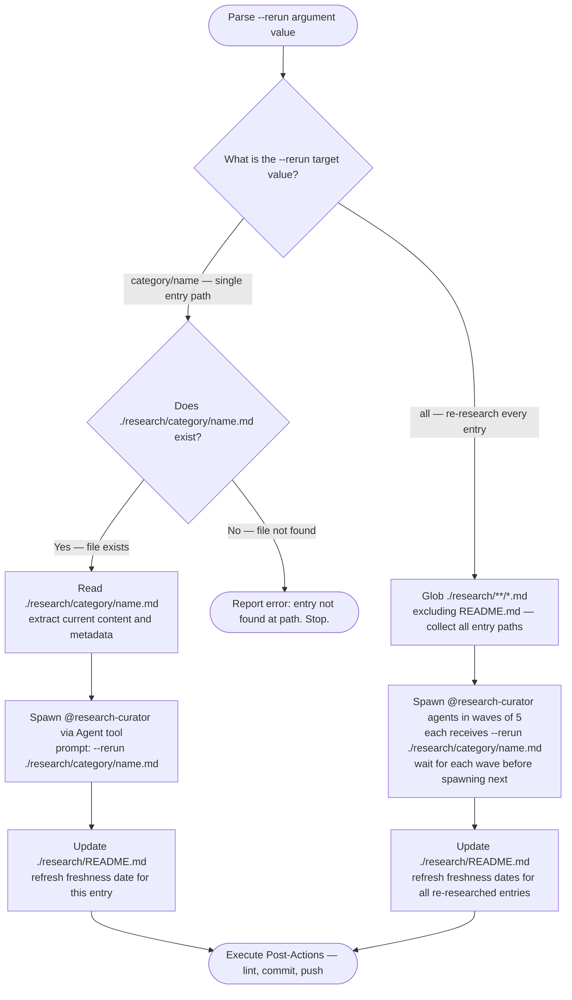
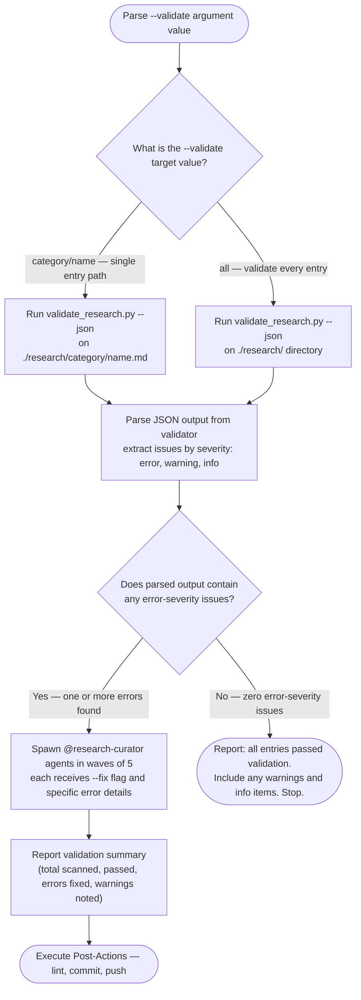

> [!IMPORTANT]
> When provided a process map or Mermaid diagram, treat it as the authoritative procedure. Execute steps in the exact order shown, including branches, decision points, and stop conditions.
> A Mermaid process diagram is an executable instruction set. Follow it exactly as written: respect sequence, conditions, loops, parallel paths, and terminal states. Do not improvise, reorder, or skip steps. If any node is ambiguous or missing required detail, pause and ask a clarifying question before continuing.
> When interacting with a user, report before acting the interpreted path you will follow from the diagram, then execute.

# Research Curator -- Multi-Mode Orchestrator

Orchestrate research entry creation, maintenance, and validation in `./research/`. Spawns `@research-curator` agents for content work; handles coordination, README updates, and post-actions.

---

## Mode Routing

Parse `$ARGUMENTS` to select operating mode. Optional `--layer 0|1|2` filters discovery by SDLC layer when used with knowledge-explorer or refresh-research.

The following diagram is the authoritative procedure for mode routing. Execute steps in the exact order shown, including branches, decision points, and stop conditions.



---

## Research Directory

Single source of truth: `./research/` (repo-root relative).

Structure:

```text
./research/
  README.md              # Category tables with all entries
  {category}/            # One directory per category
    {resource-name}.md   # Individual research entries
```

Category selection follows the flowchart in [Entry Template](./references/entry-template.md). Create directories as needed.

---

<default_mode>

## Default Mode -- Single URL

Trigger: `$ARGUMENTS` contains a URL with no flags.

### Workflow

1. **Parse** -- extract the URL from `$ARGUMENTS`
2. **Spawn agent** -- invoke `@research-curator` via Agent tool with the URL

   ```text
   Agent tool parameters:
     agent: .claude/agents/research-curator.md
     prompt: "Research and create an entry for: {URL}"
   ```

3. **Wait** for structured result (status, file path, category, key findings)
4. **Update README** -- add new entry to the appropriate category table in `./research/README.md`
5. **Post-actions** -- lint, commit, push (see [Post-Actions](#post-actions))

### Error Handling

- If agent returns `status: failed`, report the failure reason to user and stop
- Do not create partial entries or update README on failure

</default_mode>

---

<batch_mode>

## Batch Mode

Trigger: `$ARGUMENTS` contains `--batch`.

Full workflow defined in [Batch Mode reference](./references/batch-mode.md). Summary below.

### URL Parsing

Extract all tokens after `--batch` matching `https?://` as target URLs. Non-URL tokens ignored with warning.

### Wave Spawning

The following diagram is the authoritative procedure for batch wave spawning. Execute steps in the exact order shown, including branches, decision points, and stop conditions.



Each wave: spawn up to 5 `@research-curator` agents in parallel via Agent tool. Wait for all agents in the current wave before spawning the next.

### Duplicate Detection

Before spawning, check if `./research/` already contains an entry for the URL's resource. If found, skip with info message suggesting `--rerun` instead.

### Progress Reporting

After each wave:

```text
Wave N complete: M/N succeeded
  created -- category/resource-name.md
  created -- category/resource-name.md
  failed  -- https://url.com -- error: [reason]
```

After all waves:

```text
Batch complete: X/Y total succeeded
Files created: [list]
README updated: Yes
```

</batch_mode>

---

<rerun_mode>

## Rerun Mode

Trigger: `$ARGUMENTS` contains `--rerun`.

Re-research existing entries to refresh stale data.

### Target Parsing

The following diagram is the authoritative procedure for rerun mode. Execute steps in the exact order shown, including branches, decision points, and stop conditions.



### Single Entry Rerun

1. Verify `./research/{category}/{name}.md` exists
2. Spawn `@research-curator` via Agent tool:

   ```text
   prompt: "--rerun ./research/{category}/{name}.md"
   ```

3. Agent reads existing entry, re-gathers fresh data, updates content and freshness tracking
4. Update README with refreshed date

### All Entries Rerun

1. Glob `./research/**/*.md` excluding `README.md`
2. Spawn agents in waves of 5 (same pattern as Batch Mode)
3. Each agent receives `--rerun ./research/{category}/{name}.md`
4. Update README once after all waves complete

</rerun_mode>

---

<validate_mode>

## Validate Mode

Trigger: `$ARGUMENTS` contains `--validate`.

Run structural validation and fix error-severity issues.

### Validation Workflow

The following diagram is the authoritative procedure for validate mode. Execute steps in the exact order shown, including branches, decision points, and stop conditions.



### Script Invocation

```bash
./scripts/validate_research.py --json ./research/{target}
```

The script is located at `.claude/skills/research-curator/scripts/validate_research.py` relative to the repo root. Invoke from the skill directory or use the full relative path.

### Issue Handling

Severity handling per [Validation Rules](./references/validation-rules.md):

- **error** -- spawn `@research-curator` with `--fix` flag and specific issues to fix
- **warning** -- include in report to user; do not auto-fix
- **info** -- include in report; no action needed

For error-severity fixes, spawn agents in waves of 5 (same pattern as Batch Mode).

### Summary Report

```text
Validation complete:
  Total scanned: N
  Passed: N
  Errors found: N (M auto-fixed)
  Warnings noted: N
```

</validate_mode>

---

<post_actions>

## Post-Actions

Shared by all modes. Execute after any mode completes successfully.

1. **README Update** -- add or update entries in `./research/README.md` category tables
2. **Lint** -- run formatting checks on all modified files:

   ```bash
   uv run prek run --files ./research/README.md [new-or-modified-files]
   ```

3. **Commit** -- stage and commit all research changes:

   ```bash
   git add ./research/
   git commit -m "docs(research): [action] [resource names]"
   ```

4. **Push** -- push to current branch:

   ```bash
   git push -u origin HEAD
   ```

Commit message actions by mode:

- Default -- `add {resource-name} research entry`
- Batch -- `add {N} research entries`
- Rerun -- `refresh {resource-name|N entries}`
- Validate -- `fix validation issues in {resource-name|N entries}`

</post_actions>

---

<output_format>

## Output Format

Report to user after any mode completes.

### Default Mode Output

```text
## Research Entry Created

**Resource**: {name}
**Category**: {category}
**File**: ./research/{category}/{filename}.md
**README Updated**: Yes

### Key Findings
- Finding 1
- Finding 2
- Finding 3

### Next Review
YYYY-MM-DD
```

### Batch Mode Output

```text
## Batch Research Complete

**Total**: X URLs processed
**Succeeded**: Y entries created
**Failed**: Z (with reasons)

### Entries Created
- ./research/{category}/{name}.md
- ./research/{category}/{name}.md

### Failures
- {URL} -- {reason}
```

### Rerun Mode Output

```text
## Research Entries Refreshed

**Refreshed**: N entries
**Changes Detected**: M entries had updated data

### Updated Entries
- ./research/{category}/{name}.md -- {what changed}
```

### Validate Mode Output

```text
## Validation Results

**Scanned**: N entries
**Passed**: N
**Errors Fixed**: N
**Warnings**: N

### Fixes Applied
- ./research/{category}/{name}.md -- {issue fixed}

### Warnings (manual review recommended)
- ./research/{category}/{name}.md -- {warning description}
```

</output_format>

---

## Reference Links

- [Entry Template](./references/entry-template.md) -- standard format for all research entries
- [Validation Rules](./references/validation-rules.md) -- checks and severity mapping for `--validate` mode
- [Batch Mode](./references/batch-mode.md) -- wave spawning workflow for `--batch` mode
- Agent: `@research-curator` at `.claude/agents/research-curator.md` -- single-entry research executor
