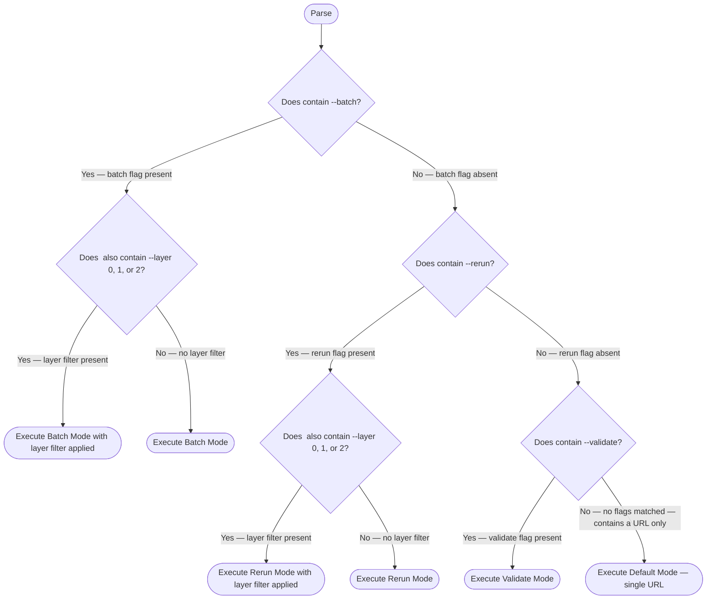
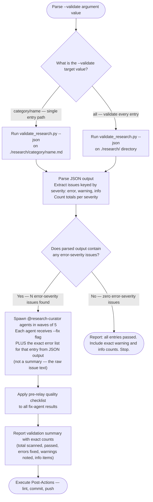

<mode_args>$ARGUMENTS</mode_args>

> [!IMPORTANT]
> When provided a process map or Mermaid diagram, treat it as the authoritative procedure. Execute steps in the exact order shown, including branches, decision points, and stop conditions.
> A Mermaid process diagram is an executable instruction set. Follow it exactly as written: respect sequence, conditions, loops, parallel paths, and terminal states. Do not improvise, reorder, or skip steps. If any node is ambiguous or missing required detail, pause and ask a clarifying question before continuing.
> When interacting with a user, report before acting the interpreted path you will follow from the diagram, then execute.

# Research Curator -- Multi-Mode Orchestrator

Orchestrate research entry creation, maintenance, and validation in `./research/`. Spawns `@research-curator` agents for content work; handles coordination, README updates, and post-actions.

---

## Mode Routing

Parse `<mode_args/>` to select operating mode. Optional `--layer 0|1|2` filters discovery by SDLC layer when used with knowledge-explorer or refresh-research.

The following diagram is the authoritative procedure for mode routing. Execute steps in the exact order shown, including branches, decision points, and stop conditions.



---

## Research Directory

Single source of truth: `./research/` (repo-root relative).

Structure:

```text
./research/
  README.md              # Category tables with all entries
  {category}/            # One directory per category
    {resource-name}.md   # Individual research entries
```

Category selection follows the flowchart in [Entry Template](./references/entry-template.md). Create directories as needed.

---

## Agent Result Relay Rules

These rules apply whenever this orchestrator receives results from any `@research-curator` agent. Violating them corrupts information before it reaches the user.

**Rule 1 — Preserve exact counts.** When an agent reports numbers, relay those exact numbers.

| Agent says | Relay as | Never relay as |
|---|---|---|
| "7 of 10 found" | "7 of 10 found" | "most found" |
| "3 errors, 2 warnings" | "3 errors, 2 warnings" | "several issues" |
| "0 results" | "0 results" | "nothing relevant" |

**Rule 2 — Preserve failure reasons.** Relay the specific reason; do not generalize.

| Agent says | Relay as | Never relay as |
|---|---|---|
| "HTTP 403 Forbidden" | "access denied (HTTP 403)" | "not available" |
| "Connection timeout" | "connection timed out" | "doesn't exist" |
| "File not found at path X" | "file not found at X" | "no such file" |
| "Rate limited" | "rate limited" | "unavailable" |

**Rule 3 — Reference files instead of re-summarizing.** When an agent wrote a file, include its path in the relay.

**Rule 4 — Relay structure, not interpretation.** When an agent returns a STATUS/ARTIFACTS/WARNINGS block, preserve that structure. Do not flatten it into a single sentence.

**Rule 5 — Distinguish observations from conclusions.** "Config has no timeout field" (observation) is different from "timeout defaults to 30s" (agent's conclusion). Keep them distinct.

### Pre-Relay Quality Checklist

Before reporting results to the user after any mode completes, verify:

- [ ] All numbers from agent output are preserved in relay
- [ ] All failure reasons are preserved verbatim (not generalized)
- [ ] File paths are included if agent wrote output files
- [ ] "Not found" has not been upgraded to "doesn't exist"
- [ ] "Inaccessible" has not been upgraded to "unavailable" or "nonexistent"
- [ ] Structured sections (STATUS, ARTIFACTS, WARNINGS) are preserved
- [ ] Agent observations are distinguished from agent conclusions

---

<default_mode>

## Default Mode -- Single URL

Trigger: `<mode_args/>` contains a URL with no flags.

### Workflow

1. **Parse** -- extract the URL from `<mode_args/>`
2. **Spawn agent** -- invoke `@research-curator` via Agent tool with the URL

   ```text
   Agent tool parameters:
     agent: .claude/agents/research-curator.md
     prompt: "Research and create an entry for: {URL}"
   ```

3. **Wait** for structured result (status, file path, category, key findings)
4. **Apply relay rules** -- verify pre-relay checklist before proceeding
5. **Spawn four tasks concurrently** -- if research status is not `failed`:

   ```text
   a. Agent tool parameters:
        agent: .claude/agents/research-insight-extractor.md
        prompt: "Extract improvements from {file-path-from-agent-result}"

   b. Agent tool parameters:
        agent: .claude/agents/research-utilization-assessor.md
        prompt: "Assess utilization opportunities from {file-path-from-agent-result}"

   c. Agent tool parameters:
        agent: .claude/agents/research-cross-referencer.md
        prompt: "Add cross-references to {file-path-from-agent-result}"

   d. Update ./research/README.md -- add new entry to category table
   ```

6. **Wait for all four tasks and surface results** -- collect structured return blocks from all three agents and confirm README updated:

   - **Insight**: if the result contains `IMMEDIATE_ATTENTION:`, report each item with `#{issue} {title}` and the one-sentence reason. If no `IMMEDIATE_ATTENTION` section: report "N improvements added to backlog from {resource-name}."
   - **Utilization**: relay `PROPOSALS_WRITTEN` count and `FILE` path. If `STATUS: no_utilization_surface`, report "No direct utilization surface found."
   - **Cross-references**: relay `CROSS_REFERENCES_ADDED` count.

7. **Spawn backlink-detector** -- if cross-referencer returned `STATUS: complete`, spawn a sequential backlink pass (skip this step if cross-referencer returned `STATUS: failed`; failures of insight-extractor or utilization-assessor do not block this step):

   ```text
   Agent tool parameters:
     agent: .claude/agents/research-backlink-detector.md
     prompt: "Add backlinks for {file-path-from-agent-result}"
   ```

8. **Wait for backlink-detector and relay result**:

   - **Backlinks**: relay `BACKLINKS_ADDED` count and `ENTRIES_MODIFIED` paths. If `BACKLINKS_ADDED: 0`, report "No backlink rows added."
   - **Skipped**: if `SKIPPED` is non-empty, relay each `(path, reason)` pair verbatim so dangling links and conflicting descriptions are visible to the user.

9. **Post-actions** -- lint, commit, push (see [Post-Actions](#post-actions))

### Error Handling

- If agent returns `status: failed`, relay the exact failure reason to user and stop
- Do not create partial entries or update README on failure

</default_mode>

---

<batch_mode>

## Batch Mode

Trigger: `<mode_args/>` contains `--batch`.

Full workflow defined in [Batch Mode reference](./references/batch-mode.md). Summary below.

### URL Parsing

Extract all tokens after `--batch` matching `https?://` as target URLs. Non-URL tokens ignored with warning.

### Wave Spawning

Spawn up to 5 `@research-curator` agents per wave via Agent tool. Wait for all agents in the current wave before spawning the next. After all waves complete, for each successful entry spawn three concurrent agents: `@research-insight-extractor`, `@research-utilization-assessor`, and `@research-cross-referencer` (up to 5 entries processed concurrently — 3 agents each), followed by a sequential `@research-backlink-detector` pass for each entry after cross-referencer completes. See [Batch Mode reference](./references/batch-mode.md) for the complete wave spawning diagram.

### Duplicate Detection

Before spawning, check if `./research/` already contains an entry for the URL's resource.
If found:

1. Read the entry's Freshness Tracking section.
2. Compute days since Last Verified (integer: today minus Last Verified date).
3. Emit: `Entry is N days old (last verified: YYYY-MM-DD, vX.Y.Z). Proceeding with refresh.`
4. Pass `--rerun ./research/{category}/{name}.md` to the agent instead of skipping.

If the Freshness Tracking section is absent or Last Verified is unreadable, emit:
`Entry exists but freshness data unavailable. Proceeding with refresh.`
and pass `--rerun ./research/{category}/{name}.md` to the agent.

### Progress Reporting

After each wave, relay exact counts and exact failure reasons from agent output:

```text
Wave N complete: M/N succeeded
  created    -- category/resource-name.md
  refreshed  -- category/resource-name.md (was N days old)
  failed     -- https://url.com -- {exact reason from agent}
```

After all waves:

```text
Batch complete: X/Y total succeeded
Files created: [list]
README updated: Yes
```

</batch_mode>

---

<rerun_mode>

## Rerun Mode

Trigger: `<mode_args/>` contains `--rerun`.

Re-research existing entries to refresh stale data.

### Target Parsing

The following diagram is the authoritative procedure for rerun mode. Execute steps in the exact order shown, including branches, decision points, and stop conditions.

```mermaid
flowchart TD
    Start(["Parse --rerun argument value"]) --> Q{"What is the --rerun target value?"}
    Q -->|"category/name — single entry path"| VerifyFile{"Does ./research/category/name.md exist?"}
    Q -->|"all — re-research every entry"| FindAll["Glob ./research/**/*.md<br>excluding README.md — collect all entry paths"]
    VerifyFile -->|"No — file not found"| Missing(["Report error: entry not found at path. Stop."])
    VerifyFile -->|"Yes — file exists"| ReadFile["Read ./research/category/name.md<br>extract current content and metadata"]
    ReadFile --> Spawn1["Spawn @research-curator via Agent tool<br>prompt: --rerun ./research/category/name.md"]
    Spawn1 --> RelayCheck1["Apply pre-relay quality checklist"]
    RelayCheck1 --> UpdateDate["Update ./research/README.md<br>refresh freshness date for this entry"]
    FindAll --> WaveSpawn["Spawn @research-curator agents in waves of 5<br>each receives --rerun ./research/category/name.md<br>wait for each wave before spawning next"]
    WaveSpawn --> RelayCheck2["Apply pre-relay quality checklist<br>to all wave results"]
    RelayCheck2 --> UpdateDates["Update ./research/README.md<br>refresh freshness dates for all re-researched entries"]
    UpdateDate --> SpawnAnalysis1["Concurrently spawn 3 agents:<br>@research-insight-extractor 'Extract improvements from ./research/category/name.md'<br>@research-utilization-assessor 'Assess utilization opportunities from ./research/category/name.md'<br>@research-cross-referencer 'Add cross-references to ./research/category/name.md'"]
    SpawnAnalysis1 --> WaitAnalysis1["Wait for all 3 agents<br>Surface IMMEDIATE_ATTENTION items from insight result<br>Report utilization proposal count<br>Report cross-references added count"]
    WaitAnalysis1 --> SpawnBacklinks1["Spawn @research-backlink-detector<br>'Add backlinks for ./research/category/name.md'"]
    SpawnBacklinks1 --> WaitBacklinks1["Wait for backlink-detector<br>Relay BACKLINKS_ADDED count and ENTRIES_MODIFIED paths"]
    WaitBacklinks1 --> RelayBacklinks1["Relay BACKLINKS_ADDED count<br>Relay non-empty SKIPPED list verbatim"]
    RelayBacklinks1 --> PostActions(["Execute Post-Actions — lint, commit, push"])
    UpdateDates --> SpawnAnalysisN["For each updated entry (concurrent, up to 5 entries)<br>spawn 3 agents per entry:<br>@research-insight-extractor<br>@research-utilization-assessor<br>@research-cross-referencer"]
    SpawnAnalysisN --> WaitAnalysisN["Wait for all analysis agents<br>Collect IMMEDIATE_ATTENTION items<br>Report total utilization proposals and cross-references added"]
    WaitAnalysisN --> SpawnBacklinksN["For each updated entry in sequence (one at a time):<br>spawn @research-backlink-detector<br>'Add backlinks for ./research/category/name.md'<br>wait for completion before spawning next<br>(sequential to prevent write races on shared cited entries)"]
    SpawnBacklinksN --> WaitBacklinksN["After all backlink passes complete:<br>Report total BACKLINKS_ADDED count<br>Relay non-empty SKIPPED lists verbatim"]
    WaitBacklinksN --> PostActions
```



### Single Entry Rerun

1. Verify `./research/{category}/{name}.md` exists
2. Spawn `@research-curator` via Agent tool:

   ```text
   prompt: "--rerun ./research/{category}/{name}.md"
   ```

3. Agent reads existing entry, re-gathers fresh data, updates content and freshness tracking
4. Apply pre-relay quality checklist to agent result
5. Update README with refreshed date
6. Concurrently spawn three analysis agents:

   ```text
   - @research-insight-extractor — "Extract improvements from ./research/{category}/{name}.md"
   - @research-utilization-assessor — "Assess utilization opportunities from ./research/{category}/{name}.md"
   - @research-cross-referencer — "Add cross-references to ./research/{category}/{name}.md"
   ```

7. Wait for all three; surface `IMMEDIATE_ATTENTION` items from insight result; report utilization proposal count; report cross-references added count

8. Spawn backlink-detector after cross-referencer completes:

   ```text
   @research-backlink-detector — "Add backlinks for ./research/{category}/{name}.md"
   ```

9. Wait for backlink-detector; relay `BACKLINKS_ADDED` count and `ENTRIES_MODIFIED` paths. If `BACKLINKS_ADDED: 0`, report "No backlink rows added." If `SKIPPED` is non-empty, relay each `(path, reason)` pair verbatim.

### All Entries Rerun

1. Glob `./research/**/*.md` excluding `README.md`
2. Spawn agents in waves of 5 (same pattern as Batch Mode)
3. Each agent receives `--rerun ./research/{category}/{name}.md`
4. Apply pre-relay quality checklist after each wave
5. Update README once after all waves complete

</rerun_mode>

---

<validate_mode>

## Validate Mode

Trigger: `<mode_args/>` contains `--validate`.

Run structural validation and fix error-severity issues.

### What Gets Checked

The validator script (`validate_research.py`) checks each entry file against the rules in [Validation Rules](./references/validation-rules.md). It emits JSON with three severity levels:

- **error** -- structural violations that make entries unusable (missing required fields, broken links, malformed frontmatter). Auto-fixed by spawning `@research-curator` with `--fix` and the specific issue list.
- **warning** -- quality issues that don't break entries (stale dates, thin summaries). Reported to user; not auto-fixed.
- **info** -- informational observations (entry age, word count). Reported to user; no action.

### Validation Workflow

The following diagram is the authoritative procedure for validate mode. Execute steps in the exact order shown, including branches, decision points, and stop conditions.



### Script Invocation

```bash
uv run .claude/skills/research-curator/scripts/validate_research.py --json ./research/{target}
```

### Fix Agent Delegation

When spawning a fix agent, pass the exact error text from the JSON output — not a paraphrase. The agent receives:

```text
prompt: "--fix ./research/{category}/{name}.md
Issues to fix (from validator JSON):
  - {exact issue text from JSON}
  - {exact issue text from JSON}"
```

### Issue Handling

Severity handling per [Validation Rules](./references/validation-rules.md):

- **error** -- spawn `@research-curator` with `--fix` flag and the exact issue list extracted from JSON
- **warning** -- include exact warning text in report to user; do not auto-fix
- **info** -- include exact info text in report; no action needed

For error-severity fixes, spawn agents in waves of 5 (same pattern as Batch Mode).

### Summary Report

Report exact counts from the validator JSON output — do not paraphrase:

```text
Validation complete:
  Total scanned: N
  Passed: N
  Errors found: N (M auto-fixed)
  Warnings noted: N
  Info items: N
```

</validate_mode>

---

<post_actions>

## Post-Actions

Shared by all modes. Execute after any mode completes successfully.

1. **README Update** -- add or update entries in `./research/README.md` category tables
2. **Lint** -- run formatting checks on all modified files:

   ```bash
   uv run prek run --files ./research/README.md [new-or-modified-files]
   ```

3. **Commit** -- stage and commit all research and insight changes:

   ```bash
   git add ./research/
   git commit -m "docs(research): [action] [resource names]"
   ```

4. **Push** -- push to current branch:

   ```bash
   git push -u origin HEAD
   ```

Commit message actions by mode:

- Default -- `add {resource-name} research entry`
- Batch -- `add {N} research entries`
- Rerun -- `refresh {resource-name|N entries}`
- Validate -- `fix validation issues in {resource-name|N entries}`

</post_actions>

---

<output_format>

## Output Format

Report to user after any mode completes. All counts and failure reasons MUST be relayed exactly as received from agents — apply the pre-relay quality checklist before writing this output.

### Default Mode Output

```text
## Research Entry Created

**Resource**: {name}
**Category**: {category}
**File**: ./research/{category}/{filename}.md
**README Updated**: Yes
**Cross-References Added**: N
**Utilization Proposals**: N (file: ./research/insights/YYYY-MM-DD-{name}-utilization.md)

### Key Findings
- Finding 1
- Finding 2
- Finding 3

### Next Review
YYYY-MM-DD
```

### Batch Mode Output

```text
## Batch Research Complete

**Total**: X URLs processed
**Created**: Y new entries
**Refreshed**: Z existing entries
**Failed**: W

### Entries Created
- ./research/{category}/{name}.md

### Entries Refreshed
- ./research/{category}/{name}.md (was N days old, last: YYYY-MM-DD, vX.Y.Z)

### Failures
- {URL} -- {exact reason from agent output}
```

### Rerun Mode Output

```text
## Research Entries Refreshed

**Refreshed**: N entries
**Changes Detected**: M entries had updated data

### Updated Entries
- ./research/{category}/{name}.md -- {what changed}
```

### Validate Mode Output

```text
## Validation Results

**Scanned**: N entries
**Passed**: N
**Errors Fixed**: N
**Warnings**: N
**Info**: N

### Fixes Applied
- ./research/{category}/{name}.md -- {exact issue fixed, from validator JSON}

### Warnings (manual review recommended)
- ./research/{category}/{name}.md -- {exact warning text}
```

</output_format>

---

## Reference Links

- [Entry Template](./references/entry-template.md) -- standard format for all research entries
- [Validation Rules](./references/validation-rules.md) -- checks and severity mapping for `--validate` mode
- [Batch Mode](./references/batch-mode.md) -- wave spawning workflow for `--batch` mode
- Agent: `@research-curator` at `.claude/agents/research-curator.md` -- single-entry research executor
- Agent: `@research-insight-extractor` at `.claude/agents/research-insight-extractor.md` -- extracts backlog improvements from research entries
- Agent: `@research-utilization-assessor` at `.claude/agents/research-utilization-assessor.md` -- assesses direct API/service utilization opportunities
- Agent: `@research-cross-referencer` at `.claude/agents/research-cross-referencer.md` -- appends Cross-References section to research entries
- Agent: `@research-backlink-detector` at `.claude/agents/research-backlink-detector.md` -- appends reciprocal backlink rows to all entries cited by the target entry; runs as a sequential post-pass after `@research-cross-referencer`

SOURCE: Agent result relay rules and pre-relay checklist adapted from `plugins/summarizer/skills/agent-result-relay/SKILL.md` (accessed 2026-03-06).
