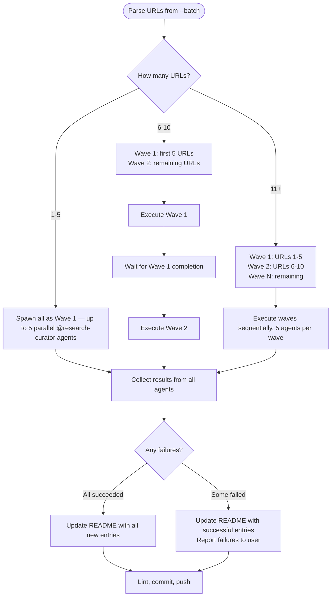

# Batch Mode Workflow

Processing multiple URLs in parallel via `--batch`.

---

## URL Parsing

Extract URLs from the `--batch` argument. Input format:

```text
/research-curator --batch https://url1.com https://url2.com https://url3.com
```

Parse all tokens after `--batch` that match `https?://` as target URLs. Non-URL tokens are ignored with a warning.

---

## Wave Spawning



**Wave size**: Maximum 5 concurrent @research-curator agents per wave.

**Sequential waves**: Wait for all agents in current wave to complete before spawning next wave. This prevents overwhelming MCP tool rate limits.

---

## Error Handling

- **Individual failure**: Log the error, continue with remaining URLs. Do not abort the batch.
- **Agent timeout**: If an agent does not return within reasonable time, mark as failed and continue.
- **Duplicate detection**: Before spawning, check if `./research/` already contains an entry for the URL's resource. If found, skip with info message suggesting `--rerun` instead.

---

## Progress Reporting

After each wave completes, report:

```text
Wave N complete: M/N succeeded
  ✓ category/resource-name.md — created
  ✓ category/resource-name.md — created
  ✗ https://failed-url.com — error: [reason]
```

After all waves:

```text
Batch complete: X/Y total succeeded
Files created: [list]
README updated: Yes
```

---

## Post-Batch Actions

These happen ONCE after all waves complete (not per-entry):

1. Update `./research/README.md` with all new entries
2. Run `uv run prek run --files` on README and all new entry files
3. Commit all changes in a single commit
4. Push to current branch
