# Research Entry Template

Standard format for all research entries in `./research/`.

---

## Category Selection

```mermaid
flowchart TD
    Start([Classify resource]) --> Q1{Primary function?}
    Q1 -->|Multi-agent orchestration| RAP[research-agent-patterns/]
    Q1 -->|Creates AI skills/prompts| SGT[skill-generation-tools/]
    Q1 -->|Prompt optimization/testing| PE[prompt-engineering/]
    Q1 -->|Memory, RAG, context window| CM[context-management/]
    Q1 -->|MCP server or integration| MCP[mcp-ecosystem/]
    Q1 -->|Agent SDK or framework| AF[agent-frameworks/]
    Q1 -->|Agent evaluation/benchmarking| ET[evaluation-testing/]
    Q1 -->|Developer productivity tool| DT[developer-tools/]
    Q1 -->|Async/concurrency library| AL[async-libraries/]
    Q1 -->|Infrastructure for agents at scale| AI[agent-infrastructure/]
    Q1 -->|API/web framework| APF[api-frameworks/]
    Q1 -->|LLM observability/debugging| AO[ai-observability/]
    Q1 -->|Code security/auditing| CA[code-auditing/]
    Q1 -->|Autonomous coding agent| COD[coding-agents/]
    Q1 -->|Real-time data platform| DI[data-infrastructure/]
    Q1 -->|ML compute/model serving| ML[ml-infrastructure/]
    Q1 -->|Alternative Python runtime| PR[python-runtimes/]
    Q1 -->|Rust-Python bindings| RPB[rust-python-bindings/]
    Q1 -->|Task management for dev| TM[task-management/]
    Q1 -->|Documentation tooling| DOC[documentation-tools/]
    Q1 -->|LLM infra/serving| LLM[llm-infrastructure/]
    Q1 -->|Low-code/no-code platform| LC[low-code-platforms/]
    Q1 -->|AI design tools| ADT[ai-design-tools/]
    Q1 -->|AI research tools| ART[ai-research-tools/]
    Q1 -->|AI writing tools| AWT[ai-writing-tools/]
    Q1 -->|None fit| NEW[Create new category directory]
```



Create the category directory if it does not exist.

---

## Required Information

<information_requirements>

**Identity**:

- Official name and current version
- Primary URL, GitHub repository, package registry
- License type

**Substance**:

- Core purpose and value proposition
- Problem it solves (table format with Problem | Solution columns)
- Key features (categorized, detailed)
- Technical architecture or workflow
- Installation/usage patterns
- Statistics (stars, downloads, contributors) with date gathered

**Relevance**:

- How it applies to Claude Code development
- Patterns worth adopting
- Integration opportunities

</information_requirements>

---

## Entry File Template

File location: `./research/{category}/{resource-name}.md`

````markdown
# {Resource Name}

**Research Date**: YYYY-MM-DD
**Source URL**: <https://...>
**GitHub Repository**: <https://github.com/...> (if applicable)
**Version at Research**: vX.Y.Z
**License**: {License type}

---

## Overview

2-3 sentence description of the resource, its purpose, and primary value proposition.

---

## Problem Addressed

| Problem | Solution |
|---------|----------|
| {Problem 1} | {How this resource solves it} |
| {Problem 2} | {How this resource solves it} |

---

## Key Statistics

| Metric | Value | Date Gathered |
|--------|-------|---------------|
| GitHub Stars | N | YYYY-MM-DD |
| Downloads/month | N | YYYY-MM-DD |
| Contributors | N | YYYY-MM-DD |
| Latest Release | vX.Y.Z | YYYY-MM-DD |

---

## Key Features

### {Feature Category 1}

- Feature detail with technical specifics
- Feature detail with technical specifics

### {Feature Category 2}

- Feature detail with technical specifics

---

## Technical Architecture

How the resource works internally. Include diagrams if helpful.

---

## Installation & Usage

```bash
# Installation command
```

```python
# Usage example
```

---

## Relevance to Claude Code Development

### Applications

- How this applies to our work

### Patterns Worth Adopting

- Patterns from this resource we could use

### Integration Opportunities

- How we could integrate this with Claude Code

---

## References

- [{Source Name}]({URL}) (accessed YYYY-MM-DD)
- [{Source Name}]({URL}) (accessed YYYY-MM-DD)

---

## Cross-References

| Entry | Category | Relationship |
|-------|----------|--------------|
| [Resource Name](../category/filename.md) | category-name | {one-phrase relationship} |

---

## Freshness Tracking

| Field | Value |
|-------|-------|
| Last Verified | YYYY-MM-DD |
| Version at Verification | vX.Y.Z |
| Next Review Recommended | YYYY-MM-DD |
````

> **Note**: The `## Cross-References` section is populated automatically by
> `@research-cross-referencer` after entry creation. For manually created entries, add it
> after the fact. This section is optional for entries created before 2026-03-12; the
> validator emits a warning (not error) if absent on newer entries.

> **Note**: "Next Review Recommended" is a suggestion, not a gate. When a user or
> orchestrator explicitly requests re-research for this entry — via `--rerun`, via
> `--batch` URL resubmission, or via `--all` — the refresh proceeds regardless of this
> date. This field provides context ("how stale is this?") and informs scheduling
> decisions. It does not block operations.

---

## Freshness Schedule

- **Next Review**: Set to 3 months from research date. This is a conservative baseline
  appropriate for stable or slow-moving projects. High-activity repositories — those with
  frequent major or minor releases, rapidly growing star or fork counts, or active breaking
  API changes — benefit from shorter intervals (4–6 weeks). The agent setting this date
  should calibrate to the observed activity level of the resource at time of research.
- **Stale threshold**: 6 months without verification
- **Review required**: Version change, significant star/fork growth, breaking API changes
